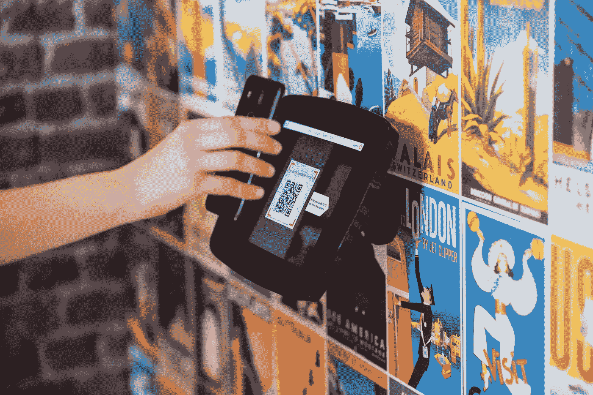
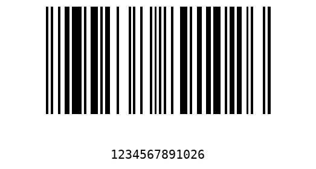
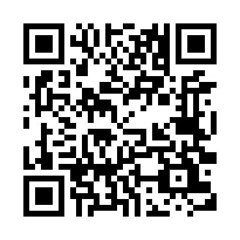

# Python 中的条形码和 QR 码解码器

> 原文：<https://towardsdatascience.com/barcodes-and-qr-codes-decoder-in-python-59615c5f2b23?source=collection_archive---------5----------------------->

## 利用 pyzbar 解码一维条形码和 QR 码



[procylink 访客管理系统](https://unsplash.com/@proxyclick?utm_source=unsplash&utm_medium=referral&utm_content=creditCopyText)在 [Unsplash](https://unsplash.com/?utm_source=unsplash&utm_medium=referral&utm_content=creditCopyText) 上拍摄的照片

通过阅读本文，您将了解生成不同格式的一维条形码以及快速响应码(QR 码)生成的技巧和诀窍。此外，本教程将概述使用相同的 Python 库解码条形码和 QR 码的方法。之前，我已经介绍过一个关于如何用 Python 生成和解码二维码的教程，Python 使用 OpenCV 解码二维码。在本教程中，我将使用另一个名为`pyzbar`的模块进行解码。基于[官方文件](https://github.com/NaturalHistoryMuseum/pyzbar)，`pyzbar`是

> “…一个使用 [zbar](http://zbar.sourceforge.net/) 库读取一维条形码和 QR 码的纯 Python 库，zbar 库是一个开源软件套件，用于从各种来源读取条形码，如视频流、图像文件和原始强度传感器。它支持许多流行的*符号*(条形码类型)，包括 EAN-13/UPC-A、UPC-E、EAN-8、Code 128、Code 39、Interleaved 2 of 5 和 QR 码。”

根据我所做的实验，在解码二维码的准确性方面，`pyzbar`比`python-opencv`表现更好。最重要的是，`pyzbar`还能够解码条形码。

让我们继续下一部分，开始安装必要的模块。

# 1.设置

强烈建议您在继续安装之前设置一个虚拟环境。您可以通过`pip install`轻松安装所有模块。

## python-条形码

我们的第一个模块是 python-barcode 包，它有助于根据我们指定的格式生成一维条形码。运行以下命令来安装它

```
pip install python-barcode
```

默认情况下，结果将被导出为 SVG。您需要安装额外的依赖项，如`Pillow`。您可以选择独立安装依赖项，或者与`python-barcode`一起安装，如下所示:

```
pip install python-barcode[images]
```

## 二维码

您可以通过以下命令单独安装`qrcode`包

```
pip install qrcode
```

可选地，您也可以在标准安装中包含`Pillow`依赖项

```
pip install qrcode[pil]
```

## 皮兹巴尔

`pyzbar`的安装有点复杂，取决于您机器的操作系统。对于 Windows 用户，`zbar` DLL 与 Windows Python 轮子一起提供。

对于 Mac OS X，您可以通过以下命令安装`zbar`共享库

```
brew install zbar
```

如果您使用的是 Linux，应该使用下面的命令。

```
sudo apt-get install libzbar0
```

完成后，运行下面的命令来安装`pyzbar` Python 包。

```
pip install pyzbar
```

事实上，它还支持命令行功能，允许您直接在命令行中运行它。为此，您应该按如下方式安装它:

```
pip install pyzbar[scripts]
```

# 2.条形码生成

在本节中，我们将使用`python-barcode`包生成条形码。

## 支持的格式

在撰写本文时，这个包支持以下格式:

*   EAN-8
*   EAN-13
*   EAN-14
*   刚果爱国者联盟
*   一月
*   ISBN-10
*   ISBN-13
*   国际标准系列出版物编号
*   代码 39
*   代码 128
*   PZN

我将使用 EAN13 格式生成一个新的条形码。结果将是 PNG 格式。

## 导入

让我们添加下面的导入语句。如果将结果保存为图像，则需要`ImageWriter`。否则，它将被默认为 SVG。

```
from barcode import EAN13
from barcode.writer import ImageWriter
```

## 创建条形码并保存为图像

继续在它下面追加下面的代码。因为我们正在编写一个图像，所以您需要将 filemode 指定为`wb`。供您参考，EAN13 接受包含 12 位而不是 13 位的字符串。最后一位是校验和，将自动生成。如果您输入的是一个 13 位的字符串，最后一位将被忽略。

```
with open('barcode.png', 'wb') as f:
    EAN13('123456789102', writer=ImageWriter()).write(f)
```

完整的代码片段如下:

当您运行 Python 文件时，它应该会生成以下图像。



作者图片

# 3.二维码生成

与条形码相比，QR 码的生成稍微复杂一些，因为 QR 码是二维的。

## 导入

添加以下导入语句

```
import qrcode
from PIL import Image
```

用以下参数创建一个`QRCode`对象的实例

```
qr = qrcode.QRCode(
    version=1,
    error_correction=qrcode.constants.ERROR_CORRECT_H,
    box_size=10,
    border=4,
)
```

*   `version` —控制二维码的大小。它接受 1 到 40 之间的整数。版本 1 由 21×21 矩阵组成。
*   `error_correction` —控制用于二维码的纠错。
*   `box_size` —控制二维码每个方框的像素数。
*   `border` —控制边框的框厚度。缺省值为 4，这也是规范中的最小值。

有 4 个常量可用于`error_correction`。可以纠正的错误越多越好。

*   `ERROR_CORRECT_L` —大约 7%或更少的错误可以被纠正。
*   `ERROR_CORRECT_M` —大约 15%或更少的错误可以被纠正。这是默认值。
*   `ERROR_CORRECT_Q` —大约 25%或更少的错误可以被纠正。
*   `ERROR_CORRECT_H` —大约 30%或更少的错误可以被纠正。

继续在它下面追加下面的代码片段。根据您自己的使用案例替换`add_data`的输入参数。

```
qr.add_data("https://medium.com/@ngwaifoong92")
qr.make(fit=True)img = qr.make_image(fill_color="black", back_color="white")
img.save("qrcode.png")
```

你可以在下面的[要点](https://gist.github.com/wfng92/6dcb09608cca87a1f767b5da4b164bce)中找到完整的代码。

你应该得到一个二维码一旦你运行代码。我的情况是这样的。



作者图片

一旦你完成了，继续下一部分，开始实现我们的解码器。

# 4.用 pyzbar 解码

`pyzbar`的一个主要特点是直接使用同一个函数进行解码。此外，它支持解码单个图像中的多个条形码或 QR 码。从模块导入`decode()`函数，如下所示:

```
from pyzbar.pyzbar import decode
```

你可以传递一个`PIL.Image`的实例或者一个`numpy.ndarray`的实例。您可以使用`OpenCV`轻松地将图像加载到`numpy.ndarry`中。用`PIL`加载时，使用以下代码

```
from PIL import Imageimg = Image.open('qrcode.png')
```

下面是一个如何使用`OpenCV`加载图像的例子。

```
import cv2img = cv2.imread('qrcode.png')
```

在它下面附加以下代码。它将以字符串形式打印出结果。

```
result = decode(img)
```

`decode()`函数返回一个名为`Decoded`的`namedtuple`列表。其中每个都包含以下字段:

*   `data` —以字节为单位的解码后的字符串。你需要用 utf8 解码得到一个字符串。
*   `type` —仅对条形码有用，因为它概括了条形码格式。
*   `rect`—`Rect`对象，表示捕获的定位区域。
*   `polygon` —代表条形码或 QR 码的`Point`实例列表。

如果您要打印出整个返回结果，您应该得到以下输出

```
[Decoded(data=b'[https://medium.com/@ngwaifoong92'](https://medium.com/@ngwaifoong92'), type='QRCODE', rect=Rect(left=40, top=40, width=330, height=330), polygon=[Point(x=40, y=40), Point(x=40, y=369), Point(x=370, y=370), Point(x=369, y=40)])]
```

使用以下代码循环遍历每个元素，并打印出解码后的字符串

```
for i in result:
    print(i.data.decode("utf-8"))
```

完整的代码可以在下面的[要点](https://gist.github.com/wfng92/a5e089d78df23d92c0c5e1201379489e)中找到。

# 5.结论

让我们回顾一下今天所学的内容。

我们从解释`python-barcode`、`qrcode`和`pyzbar`背后的基本概念开始。

之后，我们继续安装必要的模块。使用`pip install`安装非常简单。

完成后，我们使用我们选择的配置参数实现了条形码和 QR 码的生成。

最后，我们利用`pyzbar`模块对之前生成的图像进行解码。

感谢你阅读这篇文章。希望在下一篇文章中再见到你！

# 参考

1.  [python-barcode Github](https://github.com/WhyNotHugo/python-barcode)
2.  [二维码 Github](https://github.com/lincolnloop/python-qrcode)
3.  [pyzbar Github](https://github.com/NaturalHistoryMuseum/pyzbar/)