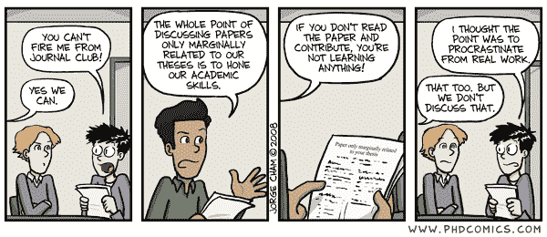

# Bardvja 推荐系统:同行评议文章的个人图书馆员

> 原文：<https://towardsdatascience.com/bardvja-recommender-system-a-personal-librarian-for-peer-reviewed-articles-5cd590ef001a?source=collection_archive---------25----------------------->

Bardvja 将为你的下一次期刊俱乐部或小组会议提供合适的论文，以减轻拖延症！

推荐系统在我们的生活中变得无处不在——激发和引导我们的兴趣。这些系统主要利用*协作*或*基于内容的*过滤来提出符合个人兴趣的建议。在这篇博客中，我们讨论了一个基于内容的推荐系统，推荐来自康奈尔大学 arXiv 的开源出版物。

> *arXiv 是一项免费分发服务，是一个开放的学术文章档案库，涵盖物理、数学、计算机科学、定量生物学、定量金融学、统计学、电气工程和系统科学以及经济学等领域。arXiv 由康奈尔大学***维护和运营，是由 Paul Ginsparg 于 1991 年创建的一个合作资助、社区支持的资源。这是学术文章的极好来源，通常是提交给同行评审期刊的文章的预印本。**

*研究人员和研究生中用于类似任务的流行工具是 [Mendeley](https://www.mendeley.com/newsfeed) ，这是一个具有多种服务的优秀工具。它的一个功能是根据用户的同行评审出版物库进行推荐。**本项目的目标绝不是模仿或替代门德利的目的或用途。***

*创建 Bardvja 的动机源于我本地机器上以 PDF 文件形式存在的大量学术文章。这些不一定是期刊文章，它们可以是报告、提案、海报、论文、学位论文、小册子等。任何具有有用科学信息的文章都可能是有价值的，包含可能直接影响一个人的研究或为未来的提议提供新想法的信息。不管是有意还是无意，研究都是人类的努力和团队的努力。有时，一种方法或途径可能与相邻的研究领域、学科或过去十年大量研究的主题相关。如果能构想出一种工具，在过滤了数万篇论文之后，能够解释一个人的兴趣，并提出跨学科或跨领域的推荐，那将是极其方便的。*

*Bardvja 有望成为这个无所不知的工具，成为每个研究者的助手。Bardvja 这个名字的灵感来自于围绕着 Bharadwaja 的古印度神话，Bharadwaja 是一个决心获取宇宙中所有知识的圣人。剧透:他失败了，事实证明，他有幸在学习的道路上继续的几世证明是不够的和无关紧要的。虽然 Bharadwaja 的故事可能看起来令人沮丧，但不像他和神，我们有机器学习！*

**

*在机器学习出现之前，Bharadwaja 正在思考和摆弄他的头发。图片来自[维基百科](https://en.wikipedia.org/wiki/Bharadwaja#/media/File:Bharadwaja.jpg)。*

*Bardvja 的目标是将自然语言处理和 web 抓取结合起来，以提供来自康奈尔大学 arXiv 的推荐。arXiv 有一个优秀的 API，可以用来获取大量元数据。对于那些有兴趣了解 [arXiv API](https://arxiv.org/help/api) 及其在这项工作中的应用的人，请考虑阅读 arXiv 手册，并在这里使用[托管的 Jupyter 笔记本](https://github.com/ukm5/BardvjaRecommendationSystem)。*

***接近***

*Bardvja 推荐系统有三个阶段:*

*   *使用关键字作为 API 请求中的搜索查询来创建 arXiv 元数据的数据库。可以在 API 请求中调整不同的变量。*
*   *使用 PyPDF2 解析位于本地目录中的 PDF 文件，以训练机器学习模型并提取主题词汇。*
*   *开发一个推荐引擎来识别与当地报纸最匹配的 arXiv 文章。*

*这三个步骤的每一个都在下面描述。*

**a)使用 PyPDF2 进行解析**

*尽管 PDF 文件具有漂亮的渲染和可移植的特性，但从其中提取信息却是丑陋的二进制文件。 [PyPDF2](https://pypi.org/project/PyPDF2/) 是一款流行的工具，易于实施并提供最佳结果，但是存在以下挑战:*

*   *并非所有的 PDF 文件都可以被解析，有些给出了错误，有些不包含可解析的信息*。**
*   *解析的大多数文件包含不带空格的文本。*thisprovedparticularlychalingtoextractanyusefulinformation from*。学术文章中出现的大量数学符号和乳胶符号使这变得更加复杂。*

*虽然有些文件可能无法解析或读取(这些文件通常是扫描文件或旧的 PDF 文件)，但是使用 PyPDF2 可以处理大量的文章。在本研究分析的 25 篇文章中，只有 2 篇是不可分析的。*

*第二个挑战更有趣也更令人沮丧。幸运的是， [StackOverflow 讨论](https://stackoverflow.com/questions/8870261/how-to-split-text-without-spaces-into-list-of-words)解决了这个问题，并导致了 Python 库的创建。 [WordNinja](https://github.com/keredson/wordninja) 是一个 Python 库，它将不带空格的句子解析成单词列表！使用 WordNinja 和 RegularExpression，PDF 文件在输入到 CountVectorizer 之前被转换成句子。GitHub 资源库中提供了模型的细节和这些工具的使用顺序。*

***arXiv***

*在这一步中，创建了一个包含 arXiv 开源文章的摘要、标题、PDF 链接和其他元数据的库。例如，我使用的当地论文广泛来自粒子和流体动力学领域。因此，用于创建 arXiv 数据库的搜索查询是单词*物理、流体、*和*粒子。*请注意，这些关键字是使用先前的主题专业知识选择的。然而，Bardvja 的未来版本可能会包含完整的 arXiv 元数据，在这种情况下，主题专业知识是不必要的。对于这项工作，在几分钟内总共获得了大约 72，000 篇论文。*

*一旦使用早期的机器学习模型刮出标题和摘要，每篇论文都被矢量化。*使用在本地文件上训练的模型转换 arXiv 数据，确保 arXiv 矢量表示使用相似的词汇。**

***Bardvja 推荐系统***

*最后，推荐系统寻找 arXiv 向量与本地向量的相似性。在这项工作中，我们使用余弦相似度进行推荐。然后，arXiv 论文按相似性降序排列，并导出到包含所有 arXiv 论文的标题和链接的 csv 文件中。*

*如前所述，这项工作的灵感来自我自己在研究生院发现论文的经历，尤其是跨领域和学科的论文。在学术界任职期间，我研究了各种流动中流体与粒子相互作用的理论和计算。然而，作为一名工程师，我的研究领域主要涉及工业流、燃烧和环境现象。因此，令人惊喜的是，Bardvja 推荐的前 10 篇论文中有两篇来自天体物理学，题目如下:*

**粒子吸积到带有流体动力湍流的圆盘中的行星上**

**垂直剪切不稳定性产生湍流时圆盘中的粒子动力学**

*在我的 Macbook 上，整个系统的执行花费了不到半个小时的真实时间和大约 12 分钟的 CPU 时间。*

***结论***

*开发了一个推荐系统来利用本地 PDF 文件并推荐来自 arXiv 的开源论文。Bardvja 系统仅使用论文的标题和摘要，因此其识别大量细节的能力有限。目标是广泛搜索跨学科和跨领域的论文，并提出研究者可能感兴趣的建议。Bardvja 只是作为个人图书馆员或研究生院同事集思广益，它仍然希望专家阅读和推断论文。然而，这是一个从大量同行评议的论文中筛选并获得新灵感的宝贵工具。*

*最后，请考虑使用 Bardvja 并提供可能有助于推进该项目的反馈。GitHub 提供了使用它的代码和步骤，你可以在这里派生和克隆它[。请随时联系我的](https://github.com/ukm5/BardvjaRecommendationSystem) [Github](https://github.com/ukm5) 或 [LinkedIn](https://www.linkedin.com/in/udayshankarmenon/) 个人资料了解详情或提出问题。*