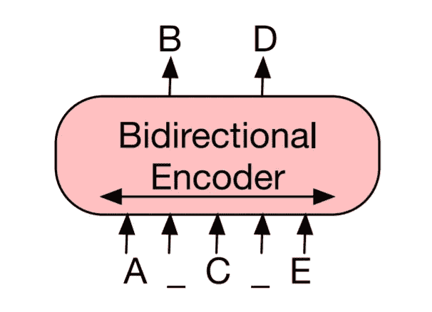
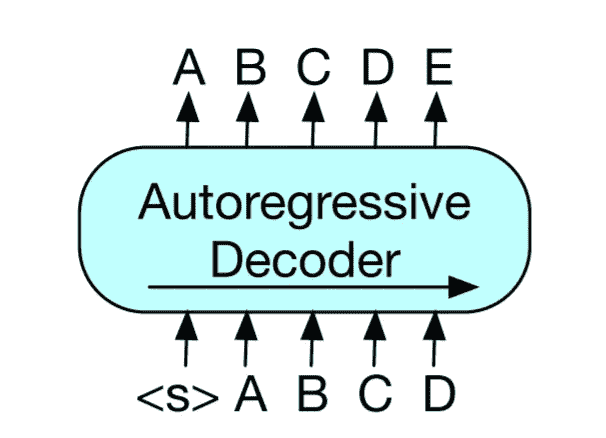

# BART 用于解释简单的变压器

> 原文：<https://towardsdatascience.com/bart-for-paraphrasing-with-simple-transformers-7c9ea3dfdd8c?source=collection_archive---------5----------------------->

## 释义是用不同的词表达某事，同时保留原来的意思的行为。让我们看看如何利用 BART(一种序列间变压器模型)实现这一点。


[亚历山德拉](https://unsplash.com/@alex_tsl?utm_source=medium&utm_medium=referral)在 [Unsplash](https://unsplash.com?utm_source=medium&utm_medium=referral) 上的照片

# 介绍

> BART 是一个去噪自动编码器，用于预处理序列到序列模型。通过(1)用任意噪声函数破坏文本，以及(2)学习模型以重建原始文本来训练 BART。
> 
> - [BART:用于自然语言生成、翻译和理解的去噪序列间预训练](https://arxiv.org/pdf/1910.13461.pdf)

如果这听起来有点复杂，不要担心；我们将对其进行分解，看看这一切意味着什么。在我们深入 BART 之前，添加一点背景知识，现在是时候用自我监督的模型来进行迁移学习了。在过去的几年里，人们已经说过很多次了，但是变形金刚确实在各种各样的自然语言处理(NLP)任务中取得了令人难以置信的成功。

BART 使用标准的转换器架构(编码器-解码器),就像最初用于神经机器翻译的[转换器模型](https://arxiv.org/pdf/1706.03762.pdf),但也结合了来自 BERT(仅使用编码器)和 GPT(仅使用解码器)的一些变化。更多细节可以参考 [BART 论文](https://arxiv.org/pdf/1910.13461.pdf)的 *2.1 架构*部分。

# 培训前 BART

通过最小化解码器输出和原始序列之间的交叉熵损失来预训练 BART。

## 掩蔽语言建模(MLM)

诸如 BERT 之类的 MLM 模型被预先训练来预测屏蔽令牌。这个过程可以分解如下:

1.  用一个*掩码标记[MASK]替换输入的随机子集。*(添加噪音/损坏)
2.  该模型预测每个[掩码] 记号的原始记号。(去噪)

重要的是，当试图预测原始标记时，BERT 模型可以“看到”完整的输入序列(一些标记被替换为[MASK])。这使得 BERT 成为双向模型，即它可以“看到”屏蔽令牌之前和之后的令牌。



BART [论文](https://arxiv.org/pdf/1910.13461.pdf)中的图 1 ( a)

这适用于分类等任务，在这些任务中，您可以使用全序列中的信息来执行预测。但是，它不太适合于文本生成任务，在这种任务中，预测只依赖于前面的单词。

## 自回归模型

用于文本生成的模型(如 GPT2)被预先训练，以在给定前一个记号序列的情况下预测下一个记号。这种预先训练的目标导致模型非常适合文本生成，但不适合分类之类的任务。



来自 BART [论文](https://arxiv.org/pdf/1910.13461.pdf)的图 1 ( b)

## BART 序列到序列

巴特既有编码器(像伯特)又有解码器(像 GPT)，基本上是两全其美。

编码器使用类似于 BERT 的*去噪*目标，而解码器试图使用先前的(未损坏的)令牌和编码器的输出，逐个令牌地再现原始序列*(自动编码器)*。


BART [论文](https://arxiv.org/pdf/1910.13461.pdf)中的图 1 ( c)

这种设置的一个显著优点是选择讹误方案的无限灵活性；包括改变原始输入的长度。或者，用更花哨的术语来说，文本可能被任意噪声函数*破坏。*

本文中使用的腐败方案总结如下。

1.  令牌屏蔽—输入的随机子集被替换为[屏蔽]令牌，就像在 BERT 中一样。
2.  令牌删除-从输入中删除随机令牌。模型必须决定丢失了哪些位置(因为标记只是被删除了，而没有被其他任何东西替换)。
3.  文本填充—许多文本跨度(长度可变)都被替换为单个[MASK]标记。
4.  句子置换—输入基于句点(.)，而且句子都是混排的。
5.  文档旋转—随机选择一个令牌，并旋转序列，使其从所选令牌开始。

作者指出，用*文本填充*来训练 BART，可以在许多任务中产生最稳定的表现。

对于我们感兴趣的任务，即**转述**，预训练的 BART 模型可以直接使用输入序列(原始短语)和目标序列(转述句子)作为序列到序列模型进行微调。

这也适用于总结和抽象问题回答。

# 设置

我们将使用[简单变形金刚](https://github.com/ThilinaRajapakse/simpletransformers)库，基于抱脸[变形金刚](https://github.com/huggingface/transformers)库来训练模型。

1.从[这里](https://www.anaconda.com/distribution)安装 Anaconda 或者 Miniconda 包管理器。

2.创建新的虚拟环境并安装软件包。

```
conda create -n st python pandas tqdmconda activate st
```

3.如果使用 CUDA:

```
conda install pytorch>=1.6 cudatoolkit=10.2 -c pytorch
```

否则:

```
conda install pytorch cpuonly -c pytorch
```

4.安装简单变压器。

```
pip install simpletransformers
```

# 数据准备

我们将组合三个数据集，作为 BART 释义模型的训练数据。

1.  [Google PAWS-Wiki 标注(最终版)](https://github.com/google-research-datasets/paws#paws-wiki)
2.  [Quora 问题对数据集](https://www.quora.com/q/quoradata/First-Quora-Dataset-Release-Question-Pairs)
3.  [微软研究院释义语料库](https://msropendata.com/datasets/e235323f-f23c-4246-b2e6-27d7a654d6cc) (MSRP)

下面的 bash 脚本可以用来轻松下载和准备前两个数据集，但是 MSRP 数据集必须从链接中手动下载。(微软没有提供直接链接😞)

*确保将文件放在同一个目录(* `*data*` *)中，以避免示例代码中文件路径的麻烦。*

我们还有几个助手函数，一个用于加载数据，一个用于清理训练数据中不必要的空间。这两个功能都在`utils.py`中定义。

有些数据的标点符号前有空格，我们需要删除。 `*clean_unnecessary_spaces()*` *功能就是用于这个目的。*

# 向 BART 解释

一旦准备好数据，训练模型就相当简单了。

*注意，你可以在* [*这里*](https://github.com/ThilinaRajapakse/simpletransformers/tree/master/examples/seq2seq/paraphrasing) *找到简单变形金刚例子中的所有代码。*

首先，我们导入所有必要的东西并设置日志记录。

接下来，我们加载数据集。

然后，我们设置模型和超参数值。请注意，我们正在使用预训练的`facebook/bart-large`模型，并在我们自己的数据集上对其进行微调。

最后，我们将为测试数据中的每个句子生成释义。

*这将把预测写到* `*predictions*` *目录中。*

## 超参数

超参数值被设置为常规、合理的值，而不进行超参数优化。对于这个任务，*基本事实*并不代表唯一可能的正确答案(也不一定是*最佳*答案)。因此，调整超参数以使生成的文本尽可能接近*基本事实*没有多大意义。

我们的目标是生成好的释义序列，而不是从数据集中产生精确的释义序列。

*如果你对简单变压器的超参数优化感兴趣(对分类等其他模型/任务特别有用)，请点击这里查看我的指南。*

[](/hyperparameter-optimization-for-optimum-transformer-models-b95a32b70949) [## 最佳变压器模型的超参数优化

### 如何使用简单的转换器调整超参数，以实现更好的自然语言处理。

towardsdatascience.com](/hyperparameter-optimization-for-optimum-transformer-models-b95a32b70949) 

所使用的解码算法(和相关的超参数)对生成的文本的质量和性质有相当大的影响。我选择的值(如下所示)通常适合生成“自然”文本。

*更多信息请参考优秀抱脸指南* [*这里*](https://huggingface.co/blog/how-to-generate) *。*

## 用你自己的句子试一下这个模式

你可以使用下面的脚本在任何句子上测试这个模型。

# 结果

让我们来看看模型为测试数据生成的一些转述序列。对于每个输入序列，该模型将生成三个(`num_return_sequences`)释义序列。

1.

```
Orignal:A recording of folk songs done for the Columbia society in 1942 was largely arranged by Pjetër Dungu.Truth:A recording of folk songs made for the Columbia society in 1942 was largely arranged by Pjetër Dungu.Prediction:A recording of folk songs made in 1942 for the Columbia Society was largely arranged by Pjetr Dungu.A recording of folk songs for the Columbia society in 1942 was largely arranged by Pjetr Dungu.A recording of folk songs done for the Columbia Society in 1942 was largely arranged by Pjetr Dungu.
```

2.

```
Original:In mathematical astronomy, his fame is due to the introduction of the astronomical globe, and his early contributions to understanding the movement of the planets.Truth:His fame is due in mathematical astronomy to the introduction of the astronomical globe and to his early contributions to the understanding of the movement of the planets.Prediction:His fame in mathematical astronomy is due to the introduction of the astronomical globe and his early contributions to understanding the movement of the planets.In mathematical astronomy, his fame is due to the introduction of the astronomical globe and his early contributions to understanding the motion of the planets.In mathematical astronomy his fame is due to the introduction of the astronomical globe and his early contributions to understanding the movement of the planets.
```

3.

```
Original:Why are people obsessed with Cara Delevingne?Truth:Why are people so obsessed with Cara Delevingne?Prediction:Why do people fall in love with Cara Delevingne?Why is everyone obsessed with Cara Delevingne?Why do people like Cara Delevingne?
```

4.

```
Original:Earl St Vincent was a British ship that was captured in 1803 and became a French trade man.Truth:Earl St Vincent was a British ship that was captured and became a French merchantman in 1803.Prediction:Earl St Vincent was a British ship captured in 1803 and became a French trader.Earl St Vincent was a British ship captured in 1803 and became a French trade man.Earl St Vincent was a British ship that was captured in 1803 and became a French trade man.
```

5.

```
Original:Worcester is a town and county city of Worcestershire in England.Truth:Worcester is a city and county town of Worcestershire in England.Prediction:Worcester is a town and county of Worcestershire in England.Worcester is a town and county town in Worcestershire in England.Worcester is a town and county town of Worcestershire in England.
```

6.域外句子

```
Original:The goal of any Deep Learning model is to take in an input and generate the correct output.Predictions >>>
The goal of any deep learning model is to take an input and generate the correct output.The goal of a deep learning model is to take an input and generate the correct output.Any Deep Learning model the goal of which is to take in an input and generate the correct output.
```

从这些例子中可以看出，我们的 BART 模型已经很好地学会了生成释义！

# 讨论

## 潜在的问题

生成的释义有时会有一些小问题，下面列出了其中一些。

1.  生成的序列几乎与原始序列完全相同，只有一两个词的细微差别。
2.  不正确或笨拙的语法。
3.  在域外(来自训练数据)输入上可能没有那么好。

令人鼓舞的是，这些问题似乎非常罕见，并且最有可能通过使用更好的训练数据来避免(同样的问题有时也可以在训练数据中看到)。

## 包裹

像 BART 这样的序列到序列模型是 NLP 实践者箭筒中的另一支箭。它们对于涉及文本生成的任务特别有用，例如释义、摘要和抽象问题回答。

解释可用于数据扩充，您可以通过解释可用数据来创建更大的数据集。