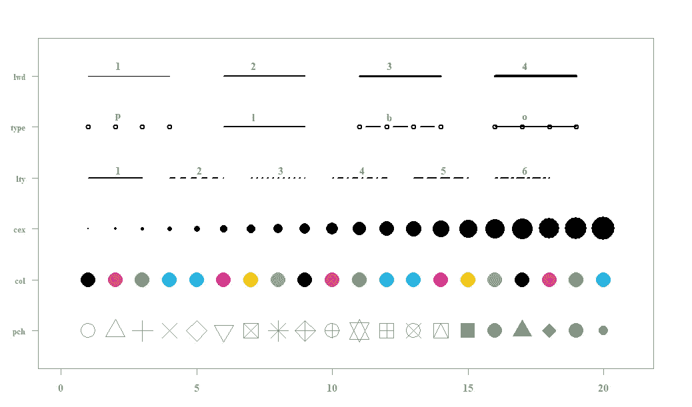

# R 中的基本绘图

> 原文：<https://towardsdatascience.com/base-plotting-in-r-eb365da06b22?source=collection_archive---------34----------------------->

## 在 R 中使用基本的绘图系统看起来让人不知所措，但事实并非如此。


R 中的基本 xy 散点图(左)与使用一些快速技巧的散点图(右)

R 中的基本绘图可能会令人生畏。它采用画布的方式来绘制，允许你在图形上绘制一层又一层的细节。因此，需要学习的函数和属性似乎是无穷无尽的，但是没有必要惊慌失措或者直接跳到 ggplot。本文强调了 base plot()函数的多功能性，同时为您提供了一些创建漂亮绘图的快速技巧。

在本文中，我使用了 Edgar Anderson 的 Iris 数据集，因此您可以复制代码并查看它的运行情况。我们将使用该数据集来创建和比较四个图表:

1.  你可以在 R 中创建的最基本的图，一个 XY 散点图
2.  使用颜色将 iris 数据集的散点图按物种分组的图
3.  具有自定义字体、颜色和大小的绘图，以及
4.  带有背景色和网格的绘图。

要加载数据集包并了解 Iris 数据集，请在 RStudio 控制台中输入以下代码:

```
**library**(datasets)
**help**(iris)
```

# 基本图与由数据子集着色的图


上面，我用基数 R 绘制了花瓣宽度和花瓣长度的关系图。左边的图是您可以在 R 中创建的最基本的图:一个带有 x 和 y 变量的散点图。

右边的图表传达了更多的信息，用颜色按物种对数据进行了细分。它看起来也更好，有轴标签、标题、颜色和图例。使用 ifelse()根据虹膜种类应用颜色。只需要多花几秒钟的时间来编写这种详细程度的代码，并增加信息和清晰度。

您可以使用以下代码在 R 中重新创建这两个图形:

```
##par lets us set global parameters for our graphs.
par(mfrow = c(1,2), mar = c(5,5,4,1))##Simple plot (left)
plot (iris$Petal.Length,iris$Petal.Width)##Plot showing species subsets (right)
plot(iris$Petal.Length, iris$Petal.Width, 
     xlab = "Petal Length",
     ylab = "Petal Width",
     main = "Petal Width vs Petal Length",
     pch = 20,
     col=ifelse(iris$Species == "setosa","coral1", 
                ifelse(iris$Species == "virginica","cyan4", 
                       ifelse(iris$Species ==  "versicolor",
                              "darkgoldenrod2", "grey"))))
##legend
legend("bottomright", c("setosa","virginica", "versicolor"),
       col = c("coral1","cyan4", "darkgoldenrod2"), pch=20)
```

物种子集的代码可分为三个部分:

1.  因素
2.  绘图属性
3.  传奇

## 1.因素

参数部分固定所有图的设置。这里我们没有添加很多论点。我们有**m flow**,它指定我们有一行和两列图——也就是说，两个图并排。 **mar** 属性是我们的边距宽度的向量，第一个值表示绘图下方的边距(5)，第二个值表示绘图左侧的边距(5)，第三个值表示绘图顶部的边距(4)，第四个值表示左侧的边距(1)。

```
par(mfrow = c(1,2), mar = c(5,5,4,1))
```

## 剧情

第二部分是情节的核心。您可以看到，通过向我们的 plot()函数添加五个参数，我们改进了图形的外观和有用性。这些论点是:

*   xlab:指定绘图的 x 轴标签
*   ylab:指定 y 轴标签
*   主:标题您的图表
*   pch:指定图形的符号系统
*   col:指定图形的颜色。

```
##Plot with some customization
plot(iris$Petal.Length, iris$Petal.Width, 
     xlab = "Petal Length",
     ylab = "Petal Width",
     main = "Petal Width vs. Petal Length",
     pch = 20,
     col=ifelse(iris$Species == "setosa","coral1", 
                ifelse(iris$Species == "virginica","cyan4", 
                       ifelse(iris$Species ==  "versicolor",
                              "darkgoldenrod2", "grey"))))
```

对你的图表外观影响最大的参数是 **col** 。当你开始的时候，我建议你记住这篇文章末尾的备忘单上的三到四种颜色的名称。

## 传奇

```
legend("bottomright", c("setosa","virginica", "versicolor"),
       col = c("coral1","cyan4", "darkgoldenrod2"), pch= c(20))
```

图例功能允许用户定义其位置、显示为标签的字符串以及显示在每个标签旁边的符号。像这样创造传奇是一把双刃剑:事实上，它不是自动的，这让你对你的传奇看起来有很大的控制，但也很容易给你的符号贴错标签，所以 *ojo* 。

# 字体和颜色自定义


如果您要为一般流通或有严格品牌指导原则的组织创建图形，这种级别的自定义可能是必要的。代码看起来很长，因为我包含了第二个萼片长度图来显示全局参数的应用，但是代码本质上有相同的三个部分:参数、图和图例。您可以看到，我没有对这些图做任何重大的修改，我只是添加了一些属性来定制我的图形的颜色、字体和字体大小。

这些图与第一部分中的图之间的一个重要变化是在开始的 par()函数中。在这里添加属性来指定字体、字体大小和颜色，为您的绘图创建了“全局”设置，使您的所有后续图形摆脱了 1980 年代的粗糙外观。我添加的属性是:

*   **字体**:par()表达式中的字体改变绘图函数外项目的字体。在这种情况下，它适用于图例，但也适用于您可能有的任何边距文本。
*   **font.axis** :轴数值标签的字体。
*   **fg** :前景颜色，表示文本和图形轮廓。
*   **col.axis** :坐标轴刻度和文字的颜色。
*   **cex.axis** :坐标轴刻度和文本的大小，相对于默认值 1。

我还在代码的 plot 部分添加了一些类似的属性:

*   **font.lab** :指定标签的字体
*   **col.lab** :指定标签的颜色
*   **font.main** :指定主标题的字体
*   **主栏**:指定主标题的颜色

这些属性的指定方式与其父属性(col 和 font)的指定方式完全相同。很简单，对吧？

我没有对图例做任何修改；par()函数为我做到了这一点。

```
##global settings
par(mfrow = c(1,2), mar = c(5,5,4,1),font = 7,font.axis = 7, 
    fg = "azure4",  col.axis = "azure4", cex.axis = .75)## First plot
   plot(iris$Petal.Length, iris$Petal.Width, 
       xlab = "Petal Length", 
       ylab = "Petal Width", 
       font.lab = 7,
       col.lab = "azure4",
       main = "Petal Width vs Petal Length",
       font.main = 7,
       col.main = "black",
       pch = 20,
       col=ifelse(iris$Species == "setosa","coral1", 
                ifelse(iris$Species == "virginica","cyan4", 
                       ifelse(iris$Species ==  "versicolor",
                              "darkgoldenrod2", "grey"))))
  ##legend
  legend("bottomright", c("setosa","virginica", "versicolor"),
       col = c("coral1","cyan4", "darkgoldenrod2"), pch=20)##Second plot
   plot(iris$Sepal.Length, iris$Sepal.Width, 
     xlab = "Sepal Length",
     ylab = "Sepal Width",
     font.lab = 7,
     col.lab = "azure4",
     main = "Sepal Width vs Sepal Length",
     font.main=7,
     col.main = "black",
     pch = 17,
     col=ifelse(iris$Species == "setosa","coral1", 
                ifelse(iris$Species == "virginica","cyan4", 
                       ifelse(iris$Species ==  "versicolor",
                              "darkgoldenrod2", "grey"))))
  ##legend
  legend("bottomright", c("setosa","virginica", "versicolor"),
       col = c("coral1","cyan4", "darkgoldenrod2"), pch=17)
```

# 背景

使用 r 中的基本绘图时，图表的背景很复杂。par()函数有一个背景属性， **bg** ，但是它将图表的整个区域都着色为背景色。例如:

```
par(mfrow = c(1,1), mar = c(5,5,4,1),bg = "grey") 
plot(iris$Petal.Length, iris$Petal.Width)
```


不是我们想要的。

在 base R 中，没有简单的方法在你的绘图背景上着色。您可以使用 **rect** 功能绘制一个与您的轴对齐的矩形，或者您可以使用 **abline** 。 **abline** 函数非常通用，用它来为我们的图形创建背景迫使我们以稍微不同的方式创建我们的情节。

我们将在前几节工作的基础上，给花瓣宽度和花瓣长度的关系图添加一个带有网格线的彩色背景。


花瓣宽度与花瓣长度的图表，带有使用 abline 创建的背景

```
##global parameters
par(mfrow = c(1,1), mar = c(5,5,4,1),font = 7,font.axis = 7,
    fg = "azure4",  col.axis = "azure4", cex.axis = .75) ##Create the empty plot
plot(NULL, ylim=c(0,2.5),xlim=c(0,7), 
     xlab = "Petal Length", 
     ylab = "Petal Width", 
     font.lab = 7,
     main = "Petal Width vs. Petal Length",
     font.main = 7,
     col.main = "black",)##Add the background color
abline(v = 0:7, col = "aliceblue", lwd = 200)
abline(v = 0:7, col = "white")
abline(h=0:2.5, col = "white")##Add the data points
points(iris$Petal.Length, iris$Petal.Width, 
       pch = 20,
       cex = 1.5,
       col=ifelse(iris$Species == "setosa","coral1", 
                  ifelse(iris$Species == "virginica","cyan4", 
                         ifelse(iris$Species ==  "versicolor",
                                "darkgoldenrod2", "grey"))))
##legend
legend("bottomright", c("setosa","virginica", "versicolor"),
       col = c("coral1","cyan4", "darkgoldenrod2"), pch=20)
```

如果您查看此图的代码，您会发现它创建情节的方式略有不同。首先，它建立了一个空白图，然后绘制信息层，从背景色开始，然后是数据点，然后是图例。背景颜色是使用粗 ab 线创建的纯色，使用细白线创建的网格:

```
##Add the background color
abline(v = 0:7, col = "aliceblue", lwd = 200)
abline(v = 0:7, col = "white")
abline(h=0:2.5, col = "white")
```

您可以看到，我们已经将我们的点属性(数据集、pch 和 col)移动到了 **points()** 函数中，但是我们没有更改它们。我添加了属性 **cex** 来增加点的大小。

# 备忘单

图表是向任何受众传达分析结果的最有效方式之一。像适当的标签、按颜色或符号设置数据子集以及字体调整这样简单的添加既增加了信息又提高了清晰度，然而我们始终看到 R 中的图形看起来就像是 30 年前创建的。在花时间清理、总结和分析你的数据之后，花一分钟在你的图上是有意义的。

下面是一些不错的备忘单，可以帮助你进行定制。

## 绘图的属性()



绘图函数的一些属性及其相关值([源代码](https://www.r-graph-gallery.com/6-graph-parameters-reminder.html))。对于 col，您可以看到只有 7 种不同的颜色值有一个数字名称，然后它们开始重复。

## 颜色；色彩；色调


42 个 R 颜色名称的备忘单([源代码](https://www.r-graph-gallery.com/42-colors-names.html)

## 字体

在 R 中有许多处理字体的方法，但是这里有一个基本的备忘单，它使用 font = x 处理与不同字体相关的数值。


本文使用的所有代码都可以在这里找到。