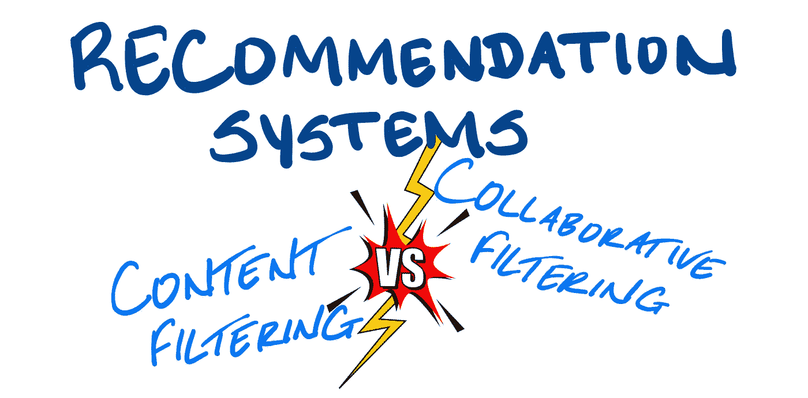
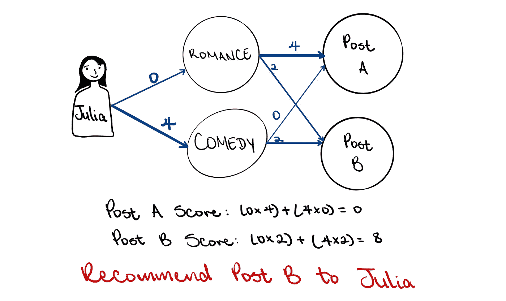
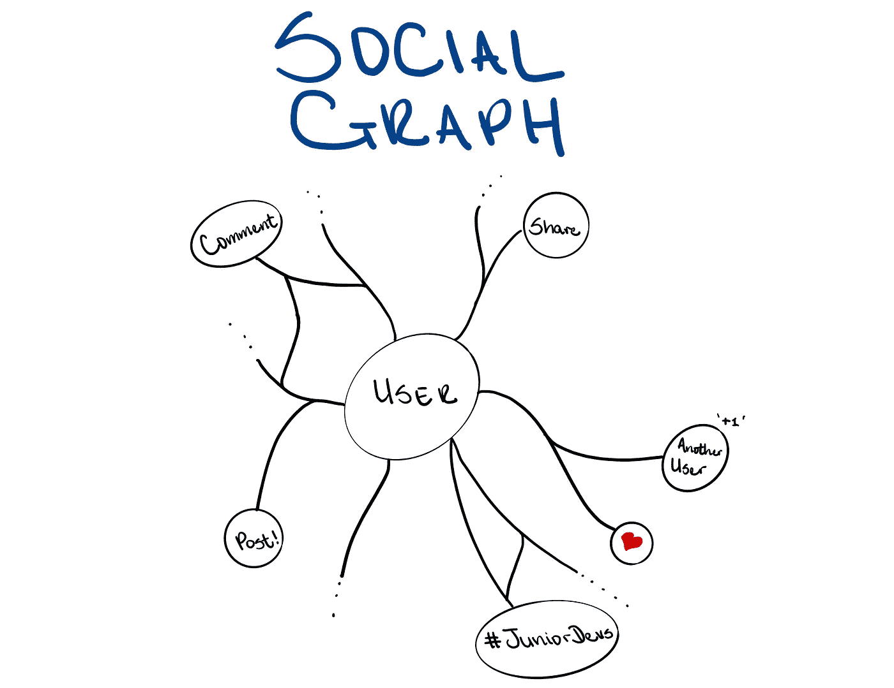
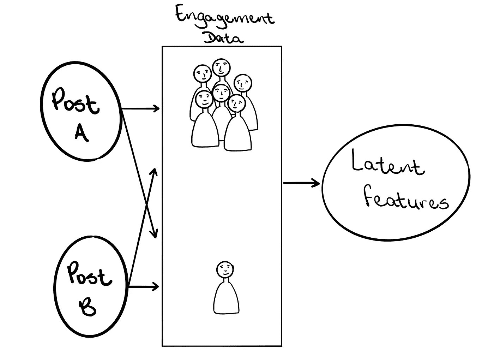
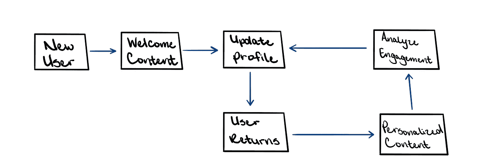

# 根据你的活跃程度，你应该喜欢这个:Instagram vs 抖音！

> 原文：<https://towardsdatascience.com/based-on-your-activity-you-should-like-this-instagram-vs-tiktok-5fcfa1c07e46?source=collection_archive---------29----------------------->

## 通过比较 Instagram 和抖音来评估推荐系统如何了解用户

图片作者:特里斯特·约瑟夫

“根据您的活动，我们认为您可能会喜欢这个。”这句话是几乎每个社交媒体平台上最常见的短语之一，而且有一个很好的理由。这些平台上的转化率是推动业务的因素。这个转换率本质上是看到帖子的总人数中对帖子采取了一些行动的人数。从帖子中采取的行动可以是简单地参与一条内容，访问与帖子链接的网站，甚至购买帖子中提到的商品。

在任何一种情况下，都可以看出为什么转换率越高越好。人们更有可能对他们感兴趣的事情或激发反应需求的事情采取行动。此外，在用户已经与他们感兴趣的东西交互之后，平台的目标是显示更多相似的内容，因为参与度将是相似的。这是推荐系统的本质；它确定一个用户可能感兴趣的列表，评估列表中哪些项目表现最好，然后向用户重复显示那些表现最好的项目。

如果你是一个有兴趣成为数据科学家的人，但你对动漫也不感兴趣，你更有可能点击一个写着“数据科学 5 大算法”的帖子，而不是一个写着“2020 年 5 大动漫”的帖子。在那之后，继续看到关于数据科学的帖子将是理想的。因此，平台用户可以看到的每一条内容都需要优化，以实现其最大潜力。最大化这种潜力的最好方法是只向用户展示他们感兴趣的内容。但是现在大问题来了，平台如何知道用户会对什么感兴趣？

图片作者:特里斯特·约瑟夫

平台可以通过两种主要的、通用的方式来确定用户的兴趣。这就是**内容过滤**和**协同过滤**，两种方式各有千秋。内容过滤使用关于用户和帖子的已知信息将事情联系起来。它包括从一组预定义的类别中给每个用户和帖子贴上标签，然后对这些联系进行评分。一旦分数被确定，就假设用户将偏好具有较高分数的内容。

让我们通过一个例子来更好地理解这个过程。为了简单起见，假设 Instagram 上的内容只有两类:爱情和喜剧。Julia 是一名 Instagram 用户，她喜欢喜剧，但不喜欢浪漫，所以她会被赋予喜剧 4 分，浪漫 0 分。现在有两个不同的职位可以推荐给朱莉娅。《邮报》A 只讲述浪漫，而《邮报》B 则兼具浪漫和喜剧。根据总分，茱莉亚应该对岗位 *B* 更感兴趣，这就是将向她推荐的岗位。

图片作者:特里斯特·约瑟夫

现在有更多的东西可以用来确定用户是否对一个帖子感兴趣，这些可以包括年龄、位置，甚至种族或民族；但概念保持相对一致。为了收集这些信息，平台通常要求用户创建某种偏好列表。这实际上可以通过填写一张表格来完成，“你喜欢喜剧还是爱情片？”，或者通过开发一个**社交图**。

社交图是将用户映射到他们表示感兴趣的所有内容的记录。在 Instagram 上，这将是关注另一个 Instagram 用户、喜欢其他用户的帖子以及在平台上分享帖子的行为。通过这样做，用户开发了一个他们认为最感兴趣的网络。这给用户一种感觉，他们可以控制自己在提要中看到的内容。这种方法面临的挑战是，对用户来说，填写他们喜欢的内容或与一组用户实际联系似乎是一项工作，人们并不像他们想象的那样擅长列出他们的偏好。

图片作者:特里斯特·约瑟夫

这让我们想到了平台可以用来确定用户兴趣的第二种方法；协同过滤。它的工作原理是，一个用户可能会对具有相似观看习惯的其他用户感兴趣的内容感兴趣。这在某种程度上可以被认为是颠倒了内容过滤方法。协作过滤方法不是有预定义的类别、映射和分数，而是调查用户在参与什么，然后从那里“向后”工作。使用一组参与度数据，目标是确定哪些特征将相似的帖子相互链接。这些特点是未知的，通常不会有一个标签，如喜剧，附在它身上。相反，它们被称为**潜在特征**，因为它们产生于数据中的潜在模式。

抖音是一个使用协同过滤的平台，所以让我们通过抖音算法来更好地理解这种方法是如何工作的。当一个新用户开始使用抖音时，他们不必提供偏好列表，也不必明确地追随任何人。相反，他们被带到一个欢迎页面，视频开始播放，最重要的指标是他们看了一个视频多长时间。该算法然后分析这些观看时间数据，以及有多少视频被重新观看或退出，以了解用户对什么感兴趣。假设如果用户观看视频的时间较长，如果他们多次重新观看视频，并且如果他们退出视频的频率较低，那么他们对该段内容感兴趣。

图片作者:特里斯特·约瑟夫

当用户再次访问时，他们会收到基于之前视频观看时间分析的个性化内容。这个方法绕过了社交图，而是创建了一个**兴趣图**。顾名思义，它是基于各种性能指标的用户到他们可能感兴趣的内容的映射。现在，抖音不是第一个使用这种方法的平台。YouTube 算法以类似的方式工作。然而，抖音视频通常比 YouTube 视频短得多，用户可以轻松发布更多内容。因此，抖音有很多数据可以借鉴。

这就是协同过滤方法的力量。有大量的数据可以学习和提取潜在的特征，然后可以用来更好地了解消费者，然后开发出惊人准确的推荐。这种方法的另一个优点是，用户不必通过建立联系或填写表格来表明他们感兴趣的内容。然而，这也可能导致用户陷入一个“相似内容”的兔子洞，他们不会明确搜索。

图片作者:特里斯特·约瑟夫

人们有时会说，任何足够先进的技术都和魔法没什么区别。通常，用户认为当一个平台向他们推荐他们真正感兴趣的东西时，那一定是奇迹。这不是魔法。相反，它是足够先进的技术。内容过滤和协同过滤都利用用户过去行为的一些数据来预测他们的一些情况。内容过滤要求用户建立一个社交图，并根据偏好将用户划分到自定义的类别中。另一方面，协同过滤让用户创建兴趣图，并根据从用户活动中学到的东西将内容特征聚集在一起。

那么平台如何知道用户会对什么感兴趣呢？用户会通过这些方法之一告诉他们。

**参考文献:**

[pitt.edu/~peterb/2480-012/ContentBasedFiltering.pdf](http://www.pitt.edu/~peterb/2480-012/ContentBasedFiltering.pdf)

[live book . manning . com/book/practical-recommender-systems/chapter-10/](https://livebook.manning.com/book/practical-recommender-systems/chapter-10/)

[developers . Google . com/机器学习/推荐/基于内容/基础知识](https://developers.google.com/machine-learning/recommendation/content-based/basics)

[developers . Google . com/machine-learning/推荐/协作/基础知识](https://developers.google.com/machine-learning/recommendation/collaborative/basics)

[link.springer.com/chapter/10.1007/978-3-540-72079-9_9](https://link.springer.com/chapter/10.1007/978-3-540-72079-9_9)

[ieeexplore.ieee.org/document/5197422](https://ieeexplore.ieee.org/document/5197422)

**其他有用的材料:**

[or eilly . com/library/view/intelligent-projects-using/9781788996921/](https://www.oreilly.com/library/view/intelligent-projects-using/9781788996921/)

[arxiv.org/ftp/arxiv/papers/1503/1503.07475.pdf](https://arxiv.org/ftp/arxiv/papers/1503/1503.07475.pdf)

[towards data science . com/introduction-to-recommender-systems-6 c 66 cf 15 ada](/introduction-to-recommender-systems-6c66cf15ada)