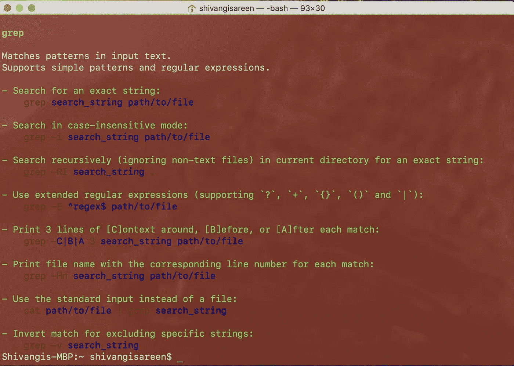
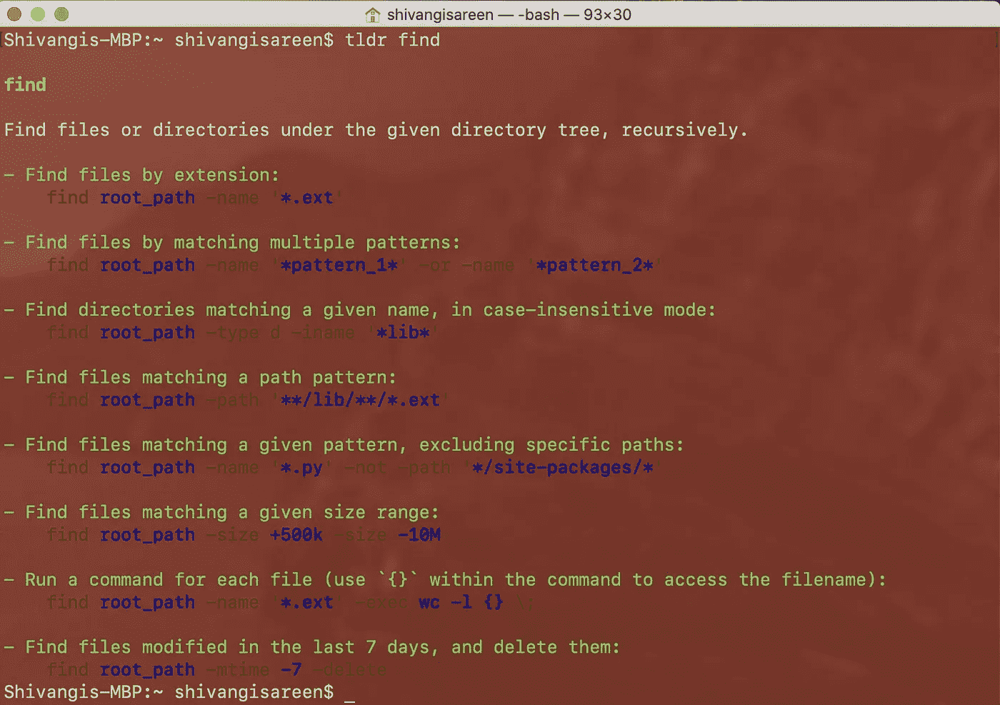
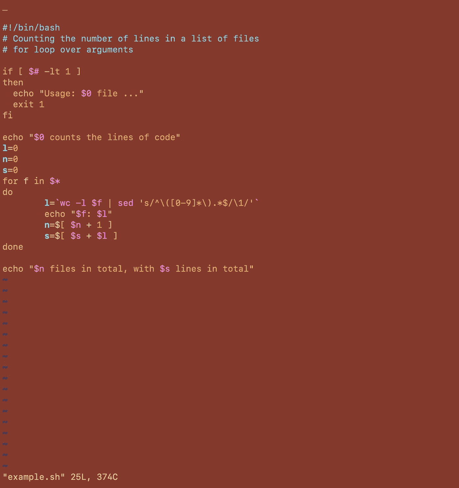
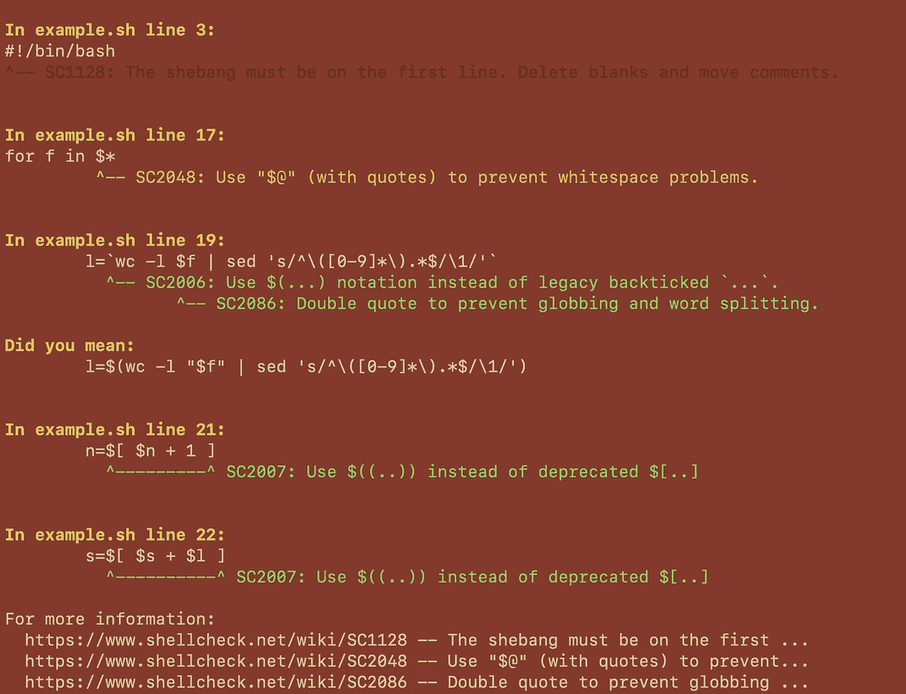
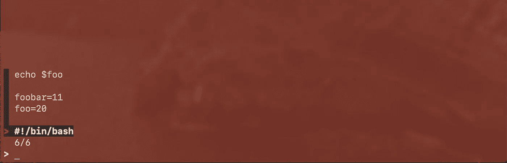

# Bash 命令在你的袖子里

> 原文：<https://towardsdatascience.com/bash-commands-up-your-sleeve-fc77b10fb09c?source=collection_archive---------38----------------------->

## 我最近遇到的 5 个 Bash 工具非常棒

由 [Kelly Sikkema](https://unsplash.com/@kellysikkema?utm_source=unsplash&utm_medium=referral&utm_content=creditCopyText) 在 [Unsplash](https://unsplash.com/s/photos/neat?utm_source=unsplash&utm_medium=referral&utm_content=creditCopyText) 上拍摄的照片

Shell 脚本非常有趣！一旦你对这些工具和它们的作用有所了解，情况会变得更好。

我将使用终端展示这些工具。任何时候你想在 Windows 上运行 Linux 命令行，打开 **PowerShell** 或命令提示符并输入 **bash** 。您也可以在搜索栏中搜索 **bash** 并选择在命令窗口中打开 **bash** 。

其中一些工具没有预装，因此需要`brew`安装。Homebrew 是一个 MacOS 的软件包管理器。

> 家酿网站的一个片段:
> 
> 家酿安装你需要的苹果(或你的 Linux 系统)没有的东西。
> 
> Homebrew 将软件包安装到它们自己的目录中，然后将它们的文件符号链接到`/usr/local`中。

事情是这样的:

`$ brew install <name-of-package>`

# tldr

*   `$ brew install tldr` : `tldr`是一个给你如何使用特定 bash 命令的例子的工具。例如
    `$ tldr grep`

`tldr grep`

`$ tldr find`

`tldr find`

您能想到的任何可能的 bash 命令，使用`tldr`并查看您可以使用它的许多方式。

TL；博士代表“太久；没读过”是`man`的一种备忘单。

# 外壳检查

*   `$ brew install shellcheck` : `shellcheck`用于对您的脚本进行检查。注意 ShellCheck 只支持`sh/bash/`。
    `$ shellcheck <name-of-bash-file>`

> ShellCheck 的目标是:
> 
> 指出并澄清典型的初学者语法问题，这些问题会导致 shell 给出模糊的错误消息。
> 
> 指出并澄清典型的中级语义问题，这些问题会导致 shell 行为怪异且违反直觉。
> 
> 指出可能导致高级用户的工作脚本在未来环境中失败的微妙警告、死角和陷阱。
> 
> 来源: [github](https://github.com/koalaman/shellcheck)

为了演示，我使用了我在这里找到的 bash 脚本。在 Vim 中打开的脚本如下:

example.sh

当我运行 shellcheck 命令时，结果如下:

`shellcheck example.sh`

这个工具我印象超级深刻！

# 历史

*   `$ history`:该命令输出 bash 终端上最近使用的命令列表。比起使用向上箭头键来浏览最近使用的命令(总是迷路，从来没有真正找到你要找的命令)，这是一种更好的方式来筛选你过去运行过的命令。

# fzf

*   `$ brew install fzf` : `fzf`是一个让你交互使用`grep`的工具(`grep`是一个模式匹配工具)。
    给定一个脚本`example2.sh`，我们可以通过将文件的内容输入`fzf` :
    `cat example2.sh | fzf`来交互式地搜索文件中的任何内容

`cat example2.sh | fzf`

要退出搜索模式，请按`ESC` + `q` + `ENTER`。

显然，使用的示例文件不足以展示强大的工具`fzf`。

# 布鲁特

*   `$ brew install broot` : `ls`不总是容易看的。仅将所有文件和目录输出到您的终端屏幕上，在导航和定位某些文件/文件夹时效率低下。所以，我们用`broot`。这是一个工具，列出您的目录和文件，在一个简单的方式，让你看看。在所需的目录中，键入`broot`并输入。一个目录和文件列表显示出来(颜色与类型相匹配)。你可以在一个目录上`ENTER`进一步查看它的内容。`broot`还可以让你直接从终端的默认应用程序中打开文件。

如果你想找出使用上述命令的更高级的方法，`tldr`它！注意，对于某些工具，GitHub 页面可能不存在。

这些不是很光滑吗？亲自尝试一下吧！