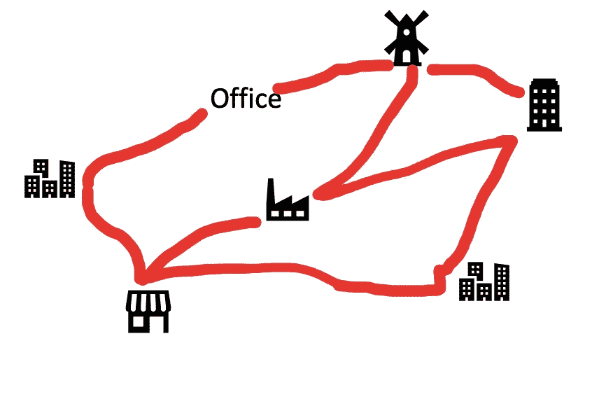
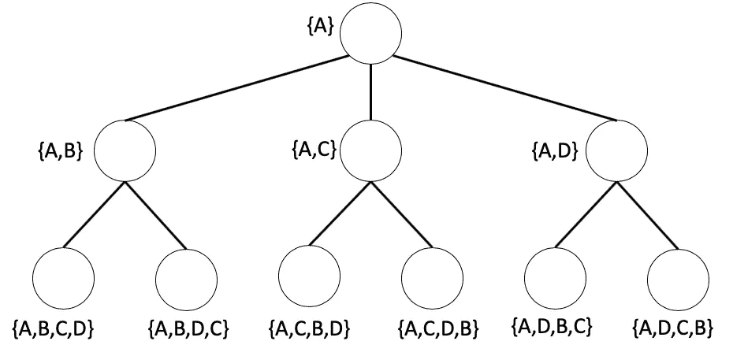
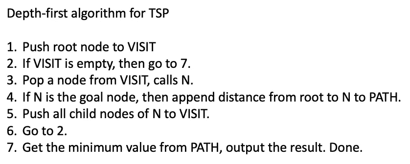
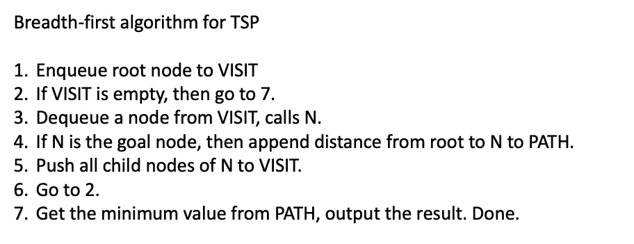
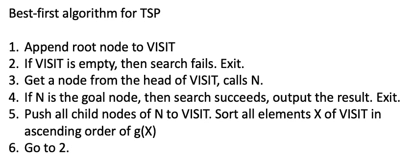
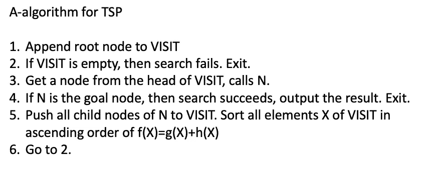
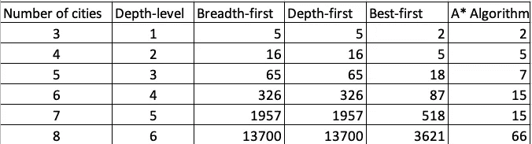
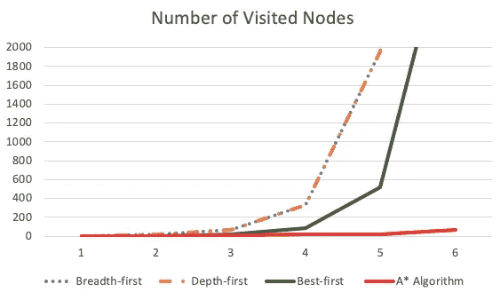
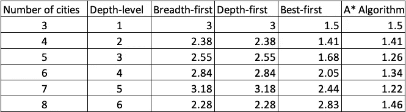
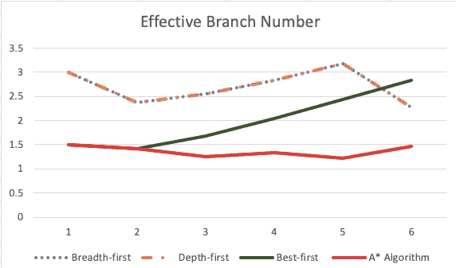

# 基本人工智能算法

> 原文：<https://towardsdatascience.com/basic-ai-algorithms-a7607b9ecdce?source=collection_archive---------4----------------------->

## 旅行商问题的搜索算法

为了用计算机解决问题，有必要用数字或符号的形式来表示问题，并用编程语言提供一个特定的过程。然而，在人工智能(AI)领域解决问题时，很难从一开始就指定一个问题的公式。因此，在观察状态变化的过程中，选择求解过程的灵活性是非常需要的。有些问题可以用图形或树形结构来表示，其中每个节点代表问题的一个状态。这种问题表述方法称为状态空间表示法。

# 状态空间表示

在状态空间表示方法中，问题的每个状态由图或树结构的节点表示。在这种情况下，该问题被转化为在特定的算子和约束下确定目标的搜索问题。在这篇文章中，我将以旅行商问题(TSP)为例进行介绍。

表示状态空间表示需要的一个问题:
(1)。问题的一组状态
(2)。一组操作符在问题的状态之间进行操作
(3)。初始状态和最终状态(目标)

## 旅行推销员问题

考虑以下情况。给你一个 n 个城市的列表，其中有任意两个城市之间的距离。现在，你必须从你的办公室开始，每个城市只去一次，然后回到你的办公室。你能走的最短路径是什么？这个问题被称为旅行推销员问题(TSP)。



## TSP 问题的公式化

为了使问题简单，我们考虑 3 个城市的问题。
让我们分别给办公室(A)和 3 个城市(B ) ( C ) ( D)打电话。我们通过{A}表示销售员离开了他的办公室来初始化问题状态。作为一个操作员，当他访问 city-B 时，问题状态更新为{A，B}，其中考虑了{ 0 }中元素的顺序。当销售人员访问了所有城市时，在这种情况下为{A，B，C，D}，离开的点 A 被自动添加到状态中，这意味着{A，B，C，D，A}。因此，这个 TSP 的初始状态是{A},最终状态(目标)是{A，X1，X2，X3，A},在这里旅行距离最小化。

把每个状态作为一个树结构的节点，我们可以把这个 TSP 表示为下面的树搜索问题。



# 强力搜索

## 深度优先搜索

深度优先搜索算法从根节点开始，在进行回溯之前沿着每个分支尽可能深地探索。在我们的 TSP 中，当一个带有所有城市标签的状态节点被访问时，它的总距离被存储。该信息稍后将用于定义最短路径。

设访问是一个 ***栈*** 来保存访问过的节点，路径是一个集合来保存从根节点到目标的距离。深度优先算法可以写成



## 广度优先搜索

深度优先搜索算法从根节点开始，在移动到下一个深度级别的节点之前，探索当前深度级别的所有节点。在我们的 TSP 中，当一个带有所有城市标签的状态节点被访问时，它的总距离被存储。该信息稍后将用于定义最短路径。

设访问是一个 ***队列*** 来保存访问过的节点，路径是保存从根节点到目标的距离的集合。广度优先算法可以写成



# 启发式搜索

在强力搜索中，访问所有节点，并且不考虑来自每个节点的信息(从节点到节点的距离)。这导致了大量的时间和内存消耗。为了解决这个问题，启发式搜索是一种解决方案。每个状态节点的信息用于考虑是否访问一个节点。该信息由通常由用户经验建立的启发式函数来表示。例如，我们可以通过从根节点到当前访问节点的距离，或者从当前访问节点到目标节点的距离来定义启发式函数。

## 最佳优先搜索

在最佳优先搜索中，我们使用到根节点的距离信息来决定首先访问哪个节点。设 g(X)为根节点到 node-X 的距离，因此，根节点访问 node-X 到 node-Y 的距离为 g(Y)=g(X)+d(X，Y)，其中 d(X，Y)为 X 和 Y 之间的距离。

让 VISIT 成为一个 ***列表*** 来保存访问过的节点。最佳优先算法可以写成



## A 算法(a*-算法)

在 A 算法搜索中，我们使用从当前访问节点到目标的距离信息作为启发式函数 h(X)。设 g(X)是根节点到 node-X 的距离，在这种情况下，我们按 f(X)=g(X)+h(X)考虑节点访问顺序的优先级。

在现实问题中，不可能获得 h(X)的精确值。在这种情况下，使用 h(X)的估计值 h’(X)。然而，设置 h’(X)有陷入局部最优解的风险。为了防止这个问题，建议选择 h'(X)其中 h'(X)≤h(X)用于所有 X。在这种情况下，它被称为 a*-算法，并且可以表明所获得的答案是全局最优答案。

在下面描述的实验中，我们将 h'(X)设置为从当前访问节点标签中未出现的每个城市到当前城市的所有可能路线的最小距离之和。例如，如果当前节点是{A，D}，则城市 B 和 C 不会出现在标签中。因此，h'(D)=min(从 C 开始的所有可能的路线距离)+min(从 B 开始的所有可能的路线距离)+min(从 D 开始的所有可能的路线距离)。

让 VISIT 成为一个 ***列表*** 来保存访问过的节点。A 算法可以写成



# 搜索算法之间的比较

我们用每一个引入的算法模拟 TSP，并把重点放在搜索问题的有效性上。在这里，搜索问题的有效性通过到达答案所访问的节点数和与树的深度级别相比的
有效分支数来评估。一个问题的有效分支数 b*是通过
N+1 = 1 + b* + (b*) +(b*) +…+(b*)^d 来计算的，b*越小的算法越有效。在这个实验中，我们用牛顿法求解这个方程，得到 b*的近似值。

关于访问节点数的讨论



关于有效分枝数的讨论



# 用 Python 实现

```
**# Randomly generate problem**import randommax_city_number = 8Gs = []for NN in range(2,max_city_number):Gs.append([[random.randint(1,10) for e in range(NN+1)] for e in range(NN+1)])**# Problem state representation: Tree structure**class node(object):def __init__(self,number=None):self.pre = Noneself.no = numberself.label = []self.child = []self.cost = None def add_child(self,number):tmp_node = node(number=number)tmp_node.pre = selftmp_node.label=[i for i in self.label]tmp_node.label.append(number)tmp_node.cost= get_bound(tmp_node.label)self.child.append(tmp_node)**# Evaluate Function for A Algorithm**def get_bound(label):f = 0for i in range(0,len(label)-1):f = f+graph[label[i]-1][label[i+1]-1]remain = city.difference(set(label))remain = list(remain)remain.append(label[-1])for i in remain:f = f+min_bound[i-1]if len(remain)==2:f=0label.append(remain[0])label.append(1)for i in range(0,len(label)-1):f = f+graph[label[i]-1][label[i+1]-1]return f**# Evaluate Function for Best-first Algorithm**def get_bound(label):f = 0remain = city.difference(set(label))remain = list(remain)remain.append(label[-1])for i in remain:f = f+min_bound[i-1]if len(remain)==2:f=0label.append(remain[0])label.append(1)for i in range(0,len(label)-1):f = f+graph[label[i]-1][label[i+1]-1]return f**# Evaluate Function for Depth-first/Breadth-first Algorithm**def get_bound(label,n_city):f = 0for i in range(0,len(label)-1):f = f+graph[label[i]-1][label[i+1]-1]if len(label)==len(graph):f = f+graph[label[-1]-1][0]return f**# Effective Branch Number calculation (Newton's Method)**def f(N,d,x):return (x**(d+1) - (N+1)*x + N)**2def df(N,d,x):return 2*f(N,d,x)*((d+1)*x**d-(N+1))def ddf(N,d,x):return 2*df(N,d,x)*((d+1)*x**d-(N+1))+2*f(N,d,x)*((d+1)*d*x**(d-1))def solve(N,d):x = 1.9delta = 1.0count = 0while abs(delta)>0.000001 and count<10000:delta = df(N,d,x)/(ddf(N,d,x)+0.00001)x = x - deltacount = count + 1return x**# EXPERIMENT1/2: 
# Search for GOAL (for A algorithm/Best-first Algorithm)**tree = node(number=1)tree.label.append(1)tree.cost=0 for i in range(len(Gs)):print("----------i=%d------------"%i)graph = Gs[i]NN = len(graph)for idx in range(NN):graph[idx][idx] = float('inf')city = range(1,len(graph)+1)city = set(city)min_bound = [min(graph[i]) for i in range(len(graph))] tree = node(number=1)tree.label.append(1)tree.cost=0 visit=[]visit.append(tree)count = 0fcnt = 0ans = 0while len(visit)>0:N = visit[0]if len(N.label)==(len(city)-2):fcnt = fcnt+1del(visit[0])count = count+1child_list = set(city).difference(set(N.label))if len(child_list)==0:ans = 1breakfor c in child_list:N.add_child(number=c)tmp = N.childfor i in tmp:visit.append(i)visit = sorted(visit,key= lambda x:x.cost) if ans==1:print("RESULT:",N.label,N.cost)b = solve(count,NN-2)print("d=%d ,N= %d ,  b*=%f"%(NN-2,count,b))print("ROUTEs: %d"%(fcnt))resultsA.append((NN-2,count,b))else:print("FAILED")**# EXPERIMENT3: 
# Search for GOAL (for Depth-first algorithm)**tree = node(number=1)tree.label.append(1)tree.cost=0for i in range(len(Gs)):print("----------i=%d------------"%i)graph = Gs[i]NN = len(graph)for idx in range(NN):graph[idx][idx] = float('inf')city = range(1,len(graph)+1)city = set(city)tree = node(number=1,n_city=len(city))tree.label.append(1)tree.cost=0visit=[]paths = []count = 0fcnt = 0visit.append(tree)while len(visit)>0:if len(visit)==0:breakN = visit.pop()if len(N.label)==(len(graph)+1):paths.append(N)fcnt = fcnt+1paths=sorted(paths,key= lambda x:x.cost)count = count+1child_list = set(city).difference(set(N.label))if len(child_list)==0:continuefor c in child_list:N.add_child(number=c)tmp = N.childfor i in tmp:visit.append(i)print("RESULT:",paths[0].label,paths[0].cost)print("d=%d ,N= %d ,  b*=%f"%(NN-2,count,solve(count,NN-2)))print("ROUTEs:%d"%(fcnt))**# EXPERIMENT4: 
# Search for GOAL (for Breadth-first algorithm)**tree = node(number=1)tree.label.append(1)tree.cost=0for i in range(len(Gs)):print("----------i=%d------------"%i)graph = Gs[i]NN = len(graph)for idx in range(NN):graph[idx][idx] = float('inf')city = range(1,len(graph)+1)city = set(city)tree = node(number=1,n_city=len(city))tree.label.append(1)tree.cost=0visit=[]paths = []count = 0fcnt = 0visit.append(tree)while len(visit)>0:if len(visit)==0:breakN = visit[0]
del(visit[0])if len(N.label)==(len(graph)+1):paths.append(N)fcnt = fcnt+1paths=sorted(paths,key= lambda x:x.cost)count = count+1child_list = set(city).difference(set(N.label))if len(child_list)==0:continuefor c in child_list:N.add_child(number=c)tmp = N.childfor i in tmp:visit.append(i)print("RESULT:",paths[0].label,paths[0].cost)print("d=%d ,N= %d ,  b*=%f"%(NN-2,count,solve(count,NN-2)))print("ROUTEs:%d"%(fcnt))
```