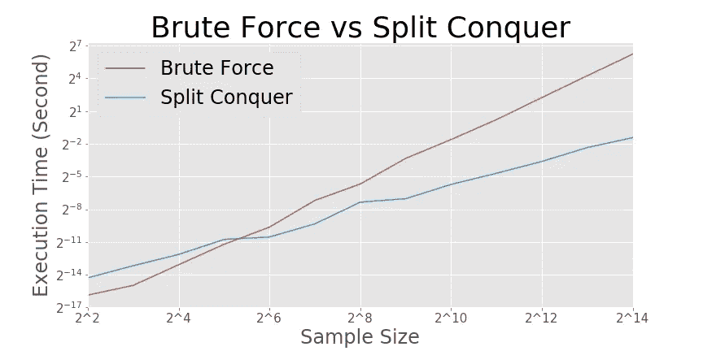

# 基本算法—计数求逆

> 原文：<https://towardsdatascience.com/basic-algorithms-counting-inversions-71aaa579a2c0?source=collection_archive---------18----------------------->

## 分裂-征服方法在随机数组中找到反转对的效率比暴力方法高多少

尽管近年来计算能力有了显著的提高，但是在大型数据集上操作仍然是昂贵的。因此，编写经济高效的代码是数据科学家的关键技能之一。虽然成本与输入数据大小成线性关系的算法可能与成本为平方的算法差别不大，但当数据集增加到数百万时，前者具有巨大的优势。

编写更有效算法的一个基本方法是分治法，在这种方法中，我们编写一个嵌套函数，递归地将相同的函数应用于输入子集。在这篇文章中，我们将比较分裂征服法和蛮力法在计算随机数组中的反转对。


亨利&公司在 [Unsplash](https://unsplash.com?utm_source=medium&utm_medium=referral) 上拍摄的照片

我们得到一组没有任何重复的数字，并被要求计算反转数。求逆是两个整数的数组中第*I*j、I 个元素大于第 *j* 个元素的情况。

如果数组由(2，3，8，6，1)组成，我们可以找到(2，1)，(3，1)，(8，6)，(8，1)，(6，1)的五个逆。

最简单和最容易的方法是比较数组中的所有对。用数组长度 *n* 我们正好可以比较 *n(n-1)/2* 对，代价是*θ(n)。*下面是一个不到十行的简单代码示例:

```
def bf_inversion_count(array):
    count = 0
    for i in range(len(array)):
        j = i + 1
        while j < len(array):
            if array[i] > array[j]:
                count +=1
            j += 1
    return count
```

让我们想一个更好更有效的方法。我们可以修改合并排序算法。分治算法的成本是:

*T(n) = 2T(n/2) + f(n)*

其中，总成本 *T(n)* 是两个半大小数组的成本 *T(n/2)* 和对两个数组之间的反转进行计数的成本 *f(n)* 之和。我们应该可以使*f(n)=θ(n)*使得*T(n)=θ(nlgn)。*

这是我的示例代码，主要是添加了计数行的合并排序代码。

```
def sc_inversion_count(array):

    length = len(array) if length == 1: 
        return array, 0 if length == 2:
        if array[0] > array[1]:
            return np.array([array[1], array[0]]), 1
        else:
            return array, 0

    elif length > 2:
        array_l = array[:length//2]
        array_r = array[length//2:]
        array_l_df = sc_inversion_count(array_l)
        array_r_df = sc_inversion_count(array_r)
        array_l_sorted = array_l_df[0]
        array_r_sorted = array_r_df[0] length_l = len(array_l)
        length_r = len(array_r) count = array_l_df[1] + array_r_df[1] l = 0
        r = 0

        sorted_list = []

        for i in range(length):
            if r == length_r:
                sorted_list.append(array_l_sorted[l])
                l += 1 elif l == length_l:
                sorted_list.append(array_r_sorted[r])
                r += 1             

            elif array_l_sorted[l] > array_r_sorted[r]:
                sorted_list.append(array_r_sorted[r])
                r += 1
                count += len(array_l_sorted) - l

            elif array_l_sorted[l] < array_r_sorted[r]:
                sorted_list.append(array_l_sorted[l])
                l += 1

        return np.array(sorted_list), count
```

现在，我们可以比较分裂-征服方法与蛮力方法的效率。随着数组大小的增加，显然分裂-征服方法在计算成本方面提供了巨大的优势。这个结果清楚地描述了高效编写算法的重要性。



来源:作者的计算