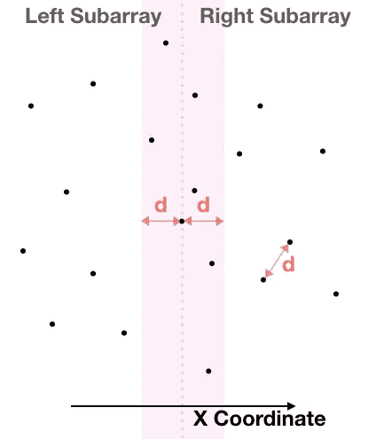
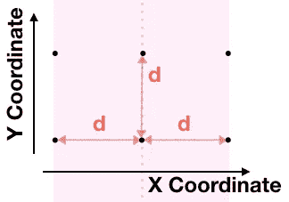
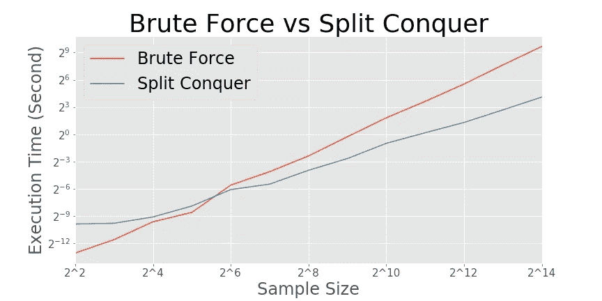

# 基本算法—寻找最接近的一对

> 原文：<https://towardsdatascience.com/basic-algorithms-finding-the-closest-pair-5fbef41e9d55?source=collection_archive---------4----------------------->

## 用分裂-征服算法确定二维平面上两点的最近对

编写性价比高的算法是作为一名数据科学家成功的关键之一，而在[上一篇文章](/basic-algorithms-counting-inversions-71aaa579a2c0)中我们在计算一个数组中的求逆时使用了分裂-征服法，这种方法的成本远低于蛮力法。这一次，我们将看到另一种分裂-征服算法如何从二维平面上的一组点中找到最近的一对点。


在 [Unsplash](https://unsplash.com?utm_source=medium&utm_medium=referral) 上由[雷米·佩内特](https://unsplash.com/@remypnt?utm_source=medium&utm_medium=referral)拍摄的照片

在时代广场或东京市中心仰望天空，我们会很容易找到最近的一对星星，因为在那里你只能看到几颗星星。如果你在一个不知名的地方，黑暗的夜空中无限多的星星会让你无法确定这一对。

对计算机来说也没什么不同；当他们确定平面上最接近的点对时，数据集的点越多，算法寻找距离最小的点对所需的时间就越长。成本的增加不仅仅是点的数量的线性增加，我们试图编写一个尽可能低的包含成本增加的算法。分裂-征服法在这个挑战中工作得很好，以类似的方式与算法计数倒置。

## 强力法——寻找最接近的一对

蛮力方法是，像在一个数组中计算反转一样，计算宇宙中每一对点的距离。对于 *n* 个点，我们需要测量 *n(n-1)/2* 个距离，成本是 n 的平方，即*θ(n)。*有了两个循环，这个算法的代码可以写成如下。

```
def **find_closest_brute_force**(array):

    result = {}
    result["p1"] = array[0]
    result["p2"] = array[1]
    result["distance"] = np.sqrt((array[0][0]-array[1][0])**2
                                +(array[0][1]-array[1][1])**2)

    for i in range(len(array)-1):
        for j in range(i+1, len(array)):
            distance = np.sqrt((array[i][0]-array[j][0])**2
                              +(array[i][1]-array[j][1])**2)
            if distance < result["distance"]:
                result["p1"] = array[i]
                result["p2"] = array[j]
                result["distance"] = distance
    return resultreturn result
```

现在我们想一个更好的方法，它的成本是。使用预分类和分治法是可能的。为了在一个坐标上对数组进行预排序，我们还使用了狭缝征服法，即合并排序算法。

## 合并排序

我们用一种叫做合并排序的算法对数组进行排序，这种算法比强力排序算法要快。merge-sort 算法拆分数组，对子数组进行排序(作为递归步骤)，比较两个子数组中最年轻的数字并挑选较年轻的，并重复该操作，直到两个子数组都用完为止。每个递归步骤的开销仅为*θ(n)*，因此算法的总开销保持在*θ(nlgn)。*

```
def **merge_sort**(array, coordinate=0):

    length = len(array) if length == 1:
        return array if length == 2:
        if array[0][coordinate] > array[1][coordinate]:
            return np.array([array[1], array[0]])
        else:
            return array

    elif length > 2:
        array_l = array[:length//2]
        array_r = array[length//2:]
        array_l_sorted = **merge_sort**(array_l, coordinate)
        array_r_sorted = **merge_sort**(array_r, coordinate)

        l_length = len(array_l)
        r_length = len(array_r) l = 0
        r = 0

        sorted_list = []

        for i in range(length):
            if r == r_length:
                sorted_list.append(array_l_sorted[l])
                l += 1 elif l == l_length:
                sorted_list.append(array_r_sorted[r])
                r += 1             

            elif array_l_sorted[l][coordinate] > array_r_sorted[r][coordinate]:
                sorted_list.append(array_r_sorted[r])
                r += 1

            elif array_l_sorted[l][coordinate] < array_r_sorted[r][coordinate]:
                sorted_list.append(array_l_sorted[l])
                l += 1

        return np.array(sorted_list)
```

## 分治法——寻找最接近的一对

如上所述，我们的目标是写一个算法，以 O(nlgn)的代价找到最近的一对点。使用分治算法，其递归步骤花费 *O(n)* 每一步就足够了。该算法将阵列划分为子阵列，关键是看两个子阵列中最近的一对是否。

分裂征服算法按 X 坐标对数组进行排序，将排序后的数组一分为二，将该算法递归应用于子数组，并检查是否存在一个距离比子数组中的距离短的数组对。

```
def **find_closest_nest**(array):
    X = **merge_sort**(array, 0)
    length = len(X)
    if length < 4:
        return **find_closest_brute_force**(array)

    else:
        array_l = X[:length//2]
        array_r = X[length//2:] dict_l = **find_closest_nest**(array_l)
        dict_r = **find_closest_nest**(array_r)

        if dict_l["distance"] > dict_r["distance"]:
            dict_both = dict_r
        else:
            dict_both = dict_l

        Y_list = []
        for i in range(length):
            if X[length//2-1][0]-dict_both["distance"] < array[i][0] < X[length//2-1][0]+dict_both["distance"]:
                Y_list.append(array[i]) Y = **merge_sort**(np.array(Y_list), 1)

        if len(Y) == 1:
            dict_final = dict_both
        elif len(Y) < 8:
            dict_y = **find_closest_brute_force**(Y)
            if dict_both["distance"] > dict_y["distance"]:
                dict_final = dict_y
            else:
                dict_final = dict_both            
        else:
            for i in range(len(Y)-7):
                dict_y = **find_closest_brute_force**(Y[i:i+7])        

                if dict_both["distance"] > dict_y["distance"]:
                    dict_final = dict_y
                else:
                    dict_final = dict_both

        return dict_final
```

最后一步，查看跨子阵列的对，需要一些技巧来将成本保持在线性水平(例如 *O(n)* ) *。*首先，我们将制作一个输入子集，它由距离 X 坐标中点 *d* 距离内的点组成； *d* 是子阵列内的一对**之间的最短距离。如果我们在子阵列上找到最近的一对点，这对点应该存在于距离将阵列分成子阵列的线的距离 *d* 内。**



在右手侧所示的例子中，子阵列中最近的一对**在右侧子阵列中确定(注意虚线上的点属于左侧子阵列)，其距离为 *d* 。**

如果最接近的一对存在于左右子阵列中，那么这些点应该在从将阵列分成两个子阵列的虚线开始的 *d* 的范围内。因此，我们可以查看阴影范围内的子集。

其次，我们通过 Y 坐标对上一步中获得的子集进行排序。我们表明，我们必须着眼于只有八个连续点的集合，每个在排序子集。



如图所示，横跨左右子阵列的 *2d** d 矩形中最多可以存在 8 个点(虚线上的点重复；两个属于左侧子阵列，另外两个在右侧)。

第三，我们查看按 Y 坐标排序的子集中的每组八个连续点。如果我们发现距离小于 *d* 的一对，这意味着最近的一对存在于子阵列中。这一步开销 *O(n)* ，这个递归算法的总开销停留在 *O(nlgn)。*

## 性能检查

我们了解到我们开发的分裂征服算法比暴力破解算法执行得更快。我们来比较两种算法的实际表现。在下面的图表中，两种算法的成本(执行时间)由不同大小的数组显示。这两条线清楚地表明，随着样本量的增加，分治法具有优势。这个结果证明了高效编码的重要性，这在上一篇文章中也讨论过。



来源:作者的计算