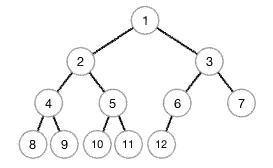
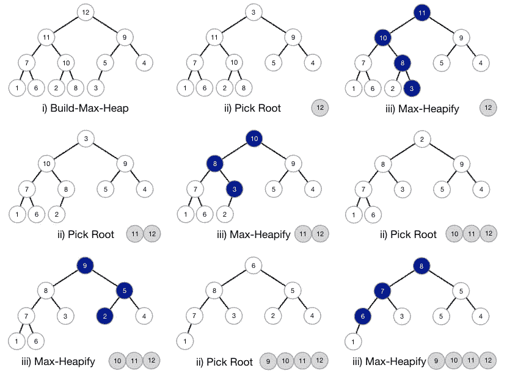
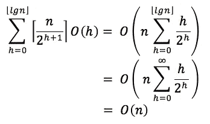
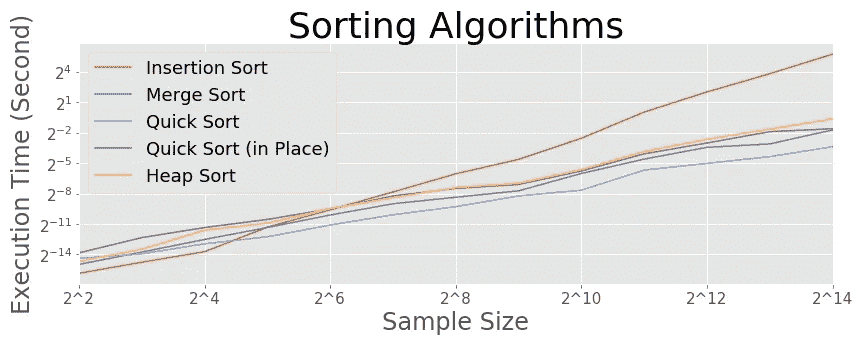

# 基本算法—堆排序

> 原文：<https://towardsdatascience.com/basic-algorithms-heapsort-31d64d6919a1?source=collection_archive---------14----------------------->

## 用“堆”数据结构对数组排序

在以前的帖子中，我们看到了不同的排序算法，如[合并排序](/basic-algorithms-finding-the-closest-pair-5fbef41e9d55)和[快速排序](/basic-algorithms-quicksort-b549ea9ef27)，这次讨论的是另一种排序算法 Heapsort。Heapsort，顾名思义，使用“堆”数据结构。


苏珊·霍尔特·辛普森在 [Unsplash](https://unsplash.com?utm_source=medium&utm_medium=referral) 拍摄的照片

## 许多

堆是一种数据结构，堆是二叉树的数组。二叉树的每个节点对应于数组的一个元素。由于一个节点有零个、一个或两个子节点，对于数组的第 *i-* 个元素，第 *2i-* 个和第( *2i+1* )个元素分别是其左右子节点。

下图描述了一个示例堆，其中节点数等于 12 元素数组中的顺序数。根是数组中的第一个元素，它的左右子元素分别是第二个和第三个元素。第六个元素只有一个左子，第七个没有。



最小堆示例

有两种堆:最小堆和最大堆。在最小堆中，父节点比子节点小(根节点最小)，而在最大堆中则相反(根节点最大)。在本文中，我们将使用 max-heap 属性进行堆排序。

## 堆排序

策略如下:I)将数组转换成最大堆；ii)挑选根，这是最大数；iii)将剩余的数组保持为最大堆；iv)递归 ii)和 iii)。

下面是步骤 iii)的代码，它也用于步骤 I)。这个“Max-Heapify”函数有两个输入:一个数组和一个整数。该函数将给定顺序的节点(输入整数)与其两个子节点进行比较。如果节点比任何一个子节点都小，它将与两个子节点中最大的一个交换。

```
def **max_heapify**(array, i):
    l = (i+1) * 2 - 1
    r = (i+1) * 2
    length = len(array) if l < length and array[l] > array[i]:
        largest = l
    else: 
        largest = i

    if r < length and array[r] > array[largest]:
        largest = r

    if largest != i:
        largest_value = array[largest]
        array[largest] = array[i]
        array[i] = largest_value
        **max_heapify**(array, largest)

    return array
```

虽然 Max-Heapify 不会耗尽整个堆，但是通过对除了叶子(堆的末端节点)之外的所有节点操作该函数，我们可以将任何数组转换为 max-heap。

```
def **build_max_heap**(array):
    length = len(array)
    for i in range(length//2, -1, -1):
        **max_heapify**(array, i) return array
```

现在我们准备实现 Heapsort。

```
def **heap_sort**(array):
    length = len(array)
    array = **build_max_heap**(array)
    for i in range(length-1, 0, -1):
        largest = array[0]
        array[0] = array[i]
        array[i] = largest
        **max_heapify**(array[:i], 0)

    return array
```

下图解释了 Heapsort 如何处理一个 12 元素数组；I)首先，我们将数组转换为最大堆；ii)取根 12，用最后一个元素 3 代替；iii)在剩余的 11 元素数组的根上处理 Max-Heapify，受影响的节点以深蓝色显示；iii)递归 ii)和 iii)。最后我们将得到一个按升序排序的数组。堆排序就地操作，在输入数组之外只存储恒定数量的数据。



示例堆排序过程

## 堆集成本

我们可以通过检查 Max-Heapify 和 Build-Max-Heap 的子函数来分析 Heapsort 的开销。

Max-Heapify 的代价是 *O(lgn)* 。比较一个节点和它的两个子节点的成本*θ(1)*，在最坏的情况下，我们递归 *⌊log* ₂ *n⌋* 次到底部。或者，Max-Heapify 的成本可以用堆的高度*h*O(h)来表示。



Build-Max-Heap 的开销是 *O(n)* 。由于一个 *n* 元素堆的深度为 *⌊lgn⌋* ，并且在任意高度，除了叶子之外还有 *⌈n/2ʰ⁺ ⌉* 节点，我们可以将成本导出为 Max-Heapify 成本的总和 *O(h)* ，如左图所示。

Heapsort 的总开销是 *O(nlgn)* ，因为它调用 Build-Max-Heap ( *O(n)* )和 Max-Heapify ( *O(lgn)* )超过 *(n-1)* 次。

## 性能检查

下图描述了不同的排序算法。正如预期的那样，Heapsort 遵循其他的 *O(nlgn)* -cost 算法，尽管它不如隐藏在 *O* 符号中的常数更高的 Quicksort 便宜。



来源:作者的计算

尽管 Heapsort 在排序算法上不如 Quicksort，但是 Heap 作为数据结构提供了许多不同的用途，其中最值得注意的是在优先级队列中。作为对堆的介绍，我们将在后面看到堆是如何应用于一个有效的优先级队列算法的。