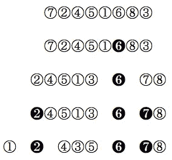
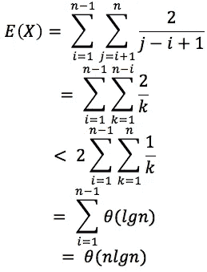
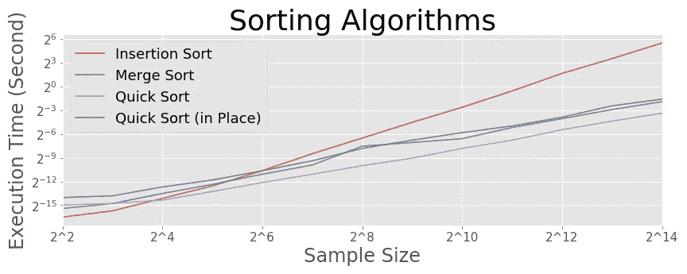
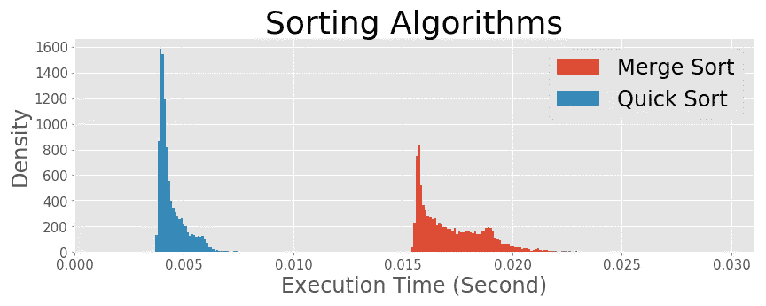

# 基本算法—快速排序

> 原文：<https://towardsdatascience.com/basic-algorithms-quicksort-b549ea9ef27?source=collection_archive---------18----------------------->

## 用随机选择的枢轴对数组排序

我在[的上一篇文章](/basic-algorithms-finding-the-closest-pair-5fbef41e9d55)中介绍了一种叫做 Merge-Sort 的排序算法，并在这篇文章中继续讨论另一种排序算法 Quicksort。快速排序的期望代价是*θ(nlgn)*，而代价为*θ(n)*的最坏情况只会以 2 */n 的概率出现！。*我将在稍后的性能比较中展示隐藏在*θ*符号中的常数在 Quicksort 中更低，因此该算法优于成本相同的 Merge-Sort*θ(nlgn)。*


安德鲁·布坎南在 [Unsplash](https://unsplash.com?utm_source=medium&utm_medium=referral) 上拍摄的照片

## 插入排序

插入排序是一种强力算法，它比较数组中的所有对来排序。这是人们在 porker 或其他纸牌游戏中常用的发牌方式。代价是*θ(n)。*

```
def **insertion_sort**(array):
    for j in range(1, len(array)):
        key = array[j]
        i = j - 1
        while i >= 0 and array[i] > key:
            array[i+1] = array[i]
            i -= 1
        array[i+1] = key
    return array
```

## 合并排序

在[之前的文章](/basic-algorithms-finding-the-closest-pair-5fbef41e9d55)中，我们讨论了作为基本分治算法之一的合并排序算法。这一次，我们将使用一个更简单的版本，因为我们只处理一维数组。

```
def **merge_sort**(array):

    length = len(array)

    if length == 1:
        return array

    elif length == 2:
        if array[0] > array[1]:
            return np.array([array[1], array[0]])
        else:
            return array

    elif length > 2:
        array_l = array[:length//2]
        array_r = array[length//2:]
        array_l_sorted = **merge_sort**(array_l)
        array_r_sorted = **merge_sort**(array_r) l = 0
        r = 0

        l_length = len(array_l)
        r_length = len(array_r)

        sorted_list = []

        for i in range(length):
            if r == r_length:
                sorted_list.append(array_l_sorted[l])
                l += 1 elif l == l_length:
                sorted_list.append(array_r_sorted[r])
                r += 1               

            elif array_l_sorted[l] > array_r_sorted[r]:
                sorted_list.append(array_r_sorted[r])
                r += 1

            elif array_l_sorted[l] < array_r_sorted[r]:
                sorted_list.append(array_l_sorted[l])
                l += 1

        return np.array(sorted_list)
```

## 快速排序

快速排序算法从一个数组中随机选取一个轴心，并将原始数组分成两个子数组:一个子数组由小于轴心的数字组成，另一个子数组由较大的数字组成。通过递归地这样做，我们将最终获得排序后的数组。



这里有一个简单的例子，你有一个 8 个数字的数组。在这种情况下，随机选择的支点变成了 6 个。然后，将小于 6 的数字分配给左边的子数组，将较大的数字分配给右边的子数组。

下一步是将算法递归应用到子阵列；随机枢轴现在在左(较小)子阵列中有两个，在右(较大)子阵列中有七个。通过递归地这样做，你将得到一个排序后的数组。

```
def **quick_sort**(array):
    length = len(array)

    if length <= 1:
        return array

    if length == 2:
        if array[0] > array[1]:
            return [array[1], array[0]]
        else:
            return array

    else:
        pivot = np.random.randint(0, length)
        small = []
        large = []

        for element in array:
            if element < array[pivot]:
                small.append(element)
            elif element > array[pivot]:
                large.append(element)

        if not small:
            return [array[pivot]] + **quick_sort**(large)
        elif not large:
            return **quick_sort**(small) + [array[pivot]]
        else:
            return (**quick_sort**(small)
                    + [array[pivot]]
                    + **quick_sort**(large))
```

在最坏的情况下，你可以按升序或降序随机选择支点(例如，在上面的例子中，1 比 8 或 8 比 1)，成本将是*θ(n)。然而，这是可以忽略的，因为它发生的概率只有 2/n！*(例中 21600 次一次)。所以我们考虑算法的期望成本。

排序算法的成本取决于它们比较了多少对。让我们考虑一下一个数组中的两个数 *Zi* 和 *Zj (i < j)* 进行比较的概率。 *Zi* 和 *Zj* 只有在 *Zi* 或 *Zj* 被选作支点时才直接比较，如果 *Zi* 和 *Zj* 之间的任意一个数被选作支点，则从不直接比较( *Zi* 和 *Zj* 被分配给单独的子阵)。当在*子*和 *Zj、*之外选择一个支点时，不会影响概率，因为*子*和 *Zj* 在同一个子阵列中。这样，*子*和 *Zj* 直接比较的概率是 *2/(j - i+1)* 。



因此，预期的比较次数是数组中所有数字对的 *2/(j - i+1)* 之和。

通过一些如左图所示的变形，我们发现该数字收敛到熟悉的*θ(nlgn)。*我们可以说快速排序算法的期望代价是*θ(nlgn)。*

## 就地快速排序

我们可以就地编写 Quicksort 算法，这意味着该算法只存储原始数组之外的常量数据。就地算法具有占用内存少的优点。下面是就地快速排序算法的代码。

```
def **quick_sort_in_place**(array, start, end):
    if start < end:

        if start + 1 == end:
            if array[start] > array[end]:
                larger = array[start]
                array[start] = array[end]
                array[end] = larger

        pivot = np.random.randint(start, end+1)
        pivot_value = array[pivot]

        array[pivot] = array[-1]
        array[-1] = pivot_value

        border = start - 1

        for i in range(start, end):
            if array[i] < pivot_value:
                border += 1
                border_value = array[i]
                array[i] = array[border]
                array[border] = border_value
        array[-1] = array[border+1]
        array[border+1] = pivot_value

        array = **quick_sort_in_place**(array, start, border+1)
        array = **quick_sort_in_place**(array, border+2, end) return array
```

## 性能检查

现在我们比较插入排序(*θ(n)*)、合并排序(*θ(nlgn)*)和快速排序(预期*θ(nlgn)*)的性能。



来源:作者的计算

显然，合并排序和快速排序比插入排序有优势，它们的斜率比插入排序平缓。由于隐藏在*θ(nlgn)*符号中的常数较低，快速排序算法比合并排序更快，而快速就地排序与合并排序花费的时间一样多(即就地优势被一些其他成本抵消)。

由于快速排序算法包含一些随机性，所以查看试验的成本分布是有用的。这是快速排序和合并排序算法处理 2 个⁰数 10，000 次试验的成本直方图。注意，如图所示，合并排序也容易出现随机性。两种分布都向最便宜的一端倾斜(左)。



来源:作者的计算

我们从快速排序算法中学到的一件事是，随机性可以成为我们的朋友。快速排序比其他排序算法更有效地处理大量数字。有了适当的概率论知识，我们也许能够写出成本较低的算法。