# 用 Python 实现科学数据的基本曲线拟合

> 原文：<https://towardsdatascience.com/basic-curve-fitting-of-scientific-data-with-python-9592244a2509?source=collection_archive---------0----------------------->

## [Python 科学绘图](https://towardsdatascience.com/tagged/python-science-plotting)

## 使用 Python 将非线性函数拟合到实验数据点的基本指南


克里斯·利维拉尼在 [Unsplash](https://unsplash.com/s/photos/statistics?utm_source=unsplash&utm_medium=referral&utm_content=creditCopyText) 上拍摄的照片

除了从我们的实验中绘制数据点之外，我们还必须经常将它们拟合到理论模型中，以提取重要的参数。这篇短文将指导如何将一组点拟合到一个已知的模型方程，我们将使用`scipy.optimize.curve_fit`函数来完成。用 Python 为科学出版物绘制数据的基础知识可以在我之前的文章[这里](/an-introduction-to-making-scientific-publication-plots-with-python-ea19dfa7f51e)中找到。我将介绍三种常见的非线性拟合:(1)指数拟合，(2)幂律拟合，以及(3)高斯峰值拟合。

为了使用`curve_fit`函数，我们使用下面的`import`语句:

```
# Import curve fitting package from scipy
from scipy.optimize import curve_fit
```

在这种情况下，我们只使用`scipy`包中的一个特定函数，所以我们可以直接导入*只是* `curve_fit`。

# **指数拟合**

假设我们有一个如下形式的一般指数函数，我们知道这个表达式适合我们的数据(其中 *a* 和 *b* 是我们将适合的常数):

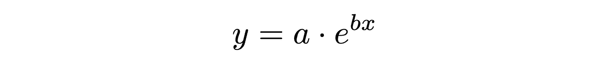

一般指数函数

首先，我们必须定义如上所示的指数函数，以便`curve_fit`可以使用它来进行拟合。

```
# Function to calculate the exponential with constants a and b
def exponential(x, a, b):
    return a*np.exp(b*x)
```

我们将从生成一个“虚拟”数据集来适应这个函数开始。要为我们的 *x* 值生成一组均匀分布在指定间隔上的点，我们可以使用`np.linspace`函数。

```
# Generate dummy dataset
x_dummy = np.linspace(start=5, stop=15, num=50)
```

`start` —我们序列的起始值

`stop` —序列的结束值(将包括该值，除非您提供额外的参数`endpoint=False`)

`num` —将间隔分割成的点数(默认为`50`)

注意，您不需要显式地写出输入名称— `np.linspace(-5, 5, 100)`同样有效，但是对于本文的目的来说，它使事情更容易理解。

对于我们的虚拟数据集，我们将把 *a* 和 *b* 的值都设置为 0.5。

```
# Calculate y-values based on dummy x-values
y_dummy = exponential(x_dummy, 0.5, 0.5)
```

为了确保我们的数据集不是完美的，我们将使用`np.random.normal`在我们的数据中引入一些噪声，它从正态(高斯)分布中抽取一个随机数。然后，我们将这个随机值乘以一个标量因子(本例中为 5 ),以增加噪声量:

```
# Add noise from a Gaussian distribution
noise = 5*np.random.normal(size=y_dummy.size)
y_dummy = y_dummy + noise
```

`size` —随机数输出数组的形状(在这种情况下与`y_dummy`的大小相同)

现在，让我们绘制我们的虚拟数据集，以检查它看起来像什么。因为我们有一个噪声数据点的集合，我们将做一个散点图，我们可以很容易地使用`ax.scatter`函数。我将跳过许多情节美学上的修改，这些在我的[上一篇文章](/an-introduction-to-making-scientific-publication-plots-with-python-ea19dfa7f51e)中详细讨论过。为了指定点的颜色，我直接使用了十六进制代码。

```
# Plot the noisy exponential data
ax.scatter(x_dummy, y_dummy, s=20, color='#00b3b3', label='Data')
```

`s` —以(点)为单位的标记大小，因此当该值增加四倍时，标记大小加倍

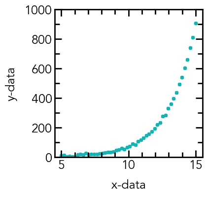

添加高斯噪声的虚拟指数数据散点图

一种通常更有用的可视化指数数据的方法是使用半对数图，因为它将数据线性化。为了将 *y* 轴的刻度从线性设置为对数，我们添加以下行:

```
# Set the y-axis scaling to logarithmic
ax.set_yscale('log')
```

由于对数函数中的渐近线，我们现在还必须将 y 轴下限设置为大于零。此外，对于刻度线，我们现在将使用`LogLocator`功能:

```
# Set the y-ticks
ax.yaxis.set_major_locator(mpl.ticker.LogLocator(base=10.0))# Set the y-axis limits
ax.set_ylim(0.1, 1000)
```

`base` —用于对数轴主刻度的基数

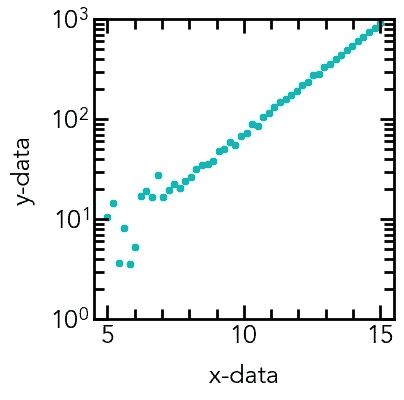

带有对数 y 轴的虚拟指数数据散点图

我们现在可以将我们的数据拟合到一般的指数函数中，以提取参数 *a* 和 *b* ，并将拟合叠加到数据上。请注意，尽管我们在上面给出了半对数图，但我们实际上并没有*改变*y 数据——我们只是改变了 *y* 轴的*刻度*。因此，我们仍然在拟合非线性数据，这通常更好，因为在拟合之前对数据进行线性化会改变拟合的残差和方差。

```
# Fit the dummy exponential datapars, cov = curve_fit(f=exponential, xdata=x_dummy, ydata=y_dummy, p0=[0, 0], bounds=(-np.inf, np.inf))
```

**输入**

`f` —用于装配的功能(在本例中为`exponential`)

`xdata` —拟合的 x 数据数组

`ydata` —拟合的 y 数据数组

`p0` —拟合参数的初始猜测值数组(a*a*和 b*b*均为 0)

`bounds` —参数的界限(-∞到∞)

**输出**

`pars` —来自 fit 的参数数组(在本例中为`[a, b]`)

`cov`—`pars`的估计协方差，可用于确定拟合参数的标准偏差(对角线的平方根)

我们可以从`curve_fit`输出中提取参数及其标准偏差，并通过从实际观察值(我们的虚拟数据)中减去计算值(从我们的拟合中)来计算残差

```
# Get the standard deviations of the parameters (square roots of the # diagonal of the covariance)
stdevs = np.sqrt(np.diag(cov))# Calculate the residuals
res = y_dummy - exponential(x_dummy, *pars)
```

`*pars` —允许我们展开`pars`数组，*即* `[a, b]`作为`a, b`输入

**拟合参数和标准偏差**

a =0.509 0.017

*b =* 0.499 0.002

我们看到两个拟合参数都非常接近我们的输入值`a = 0.5`和`b = 0.5`，因此`curve_fit`函数收敛到正确的值。现在，我们可以将拟合叠加到散点数据上，还可以绘制残差，残差应该是随机分布的，并且接近于 0，从而确认我们有很好的拟合。

```
# Plot the fit data as an overlay on the scatter data
ax.plot(x_dummy, exponential(x_dummy, *pars), linestyle='--', linewidth=2, color='black')
```

`linestyle` —绘制线的线型(`--`表示虚线)

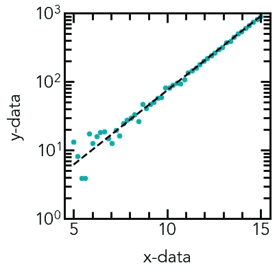

拟合线重叠的虚拟指数数据散点图

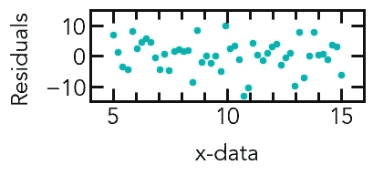

指数拟合的残差图

# **幂律拟合**

另一种常用的拟合函数是幂律，其一般公式可以是:

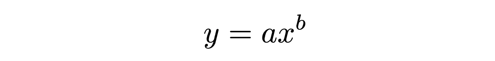

一般幂律函数

与之前的拟合类似，我们首先定义函数:

```
# Function to calculate the power-law with constants a and b
def power_law(x, a, b):
    return a*np.power(x, b)
```

然后，我们可以再次创建一个虚拟数据集，添加噪声，并绘制我们的幂律函数。

```
# Generate dummy dataset
x_dummy = np.linspace(start=1, stop=1000, num=100)
y_dummy = power_law(x_dummy, 1, 0.5)# Add noise from a Gaussian distribution
noise = 1.5*np.random.normal(size=y_dummy.size)
y_dummy = y_dummy + noise
```

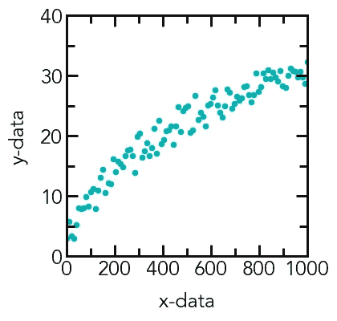

添加了高斯噪声的虚拟幂律数据的散点图

与指数拟合情况类似，幂律函数形式的数据可以通过绘制对数图来线性化，这一次， *x* 和 *y* 轴都被缩放。

```
# Set the x and y-axis scaling to logarithmic
ax.set_xscale('log')
ax.set_yscale('log')# Edit the major and minor tick locations of x and y axes
ax.xaxis.set_major_locator(mpl.ticker.LogLocator(base=10.0))
ax.yaxis.set_major_locator(mpl.ticker.LogLocator(base=10.0))# Set the axis limits
ax.set_xlim(10, 1000)
ax.set_ylim(1, 100)
```

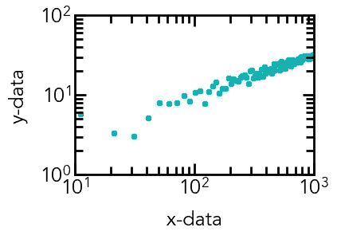

对数轴虚拟幂律数据散点图

现在，我们可以遵循与指数数据相同的拟合步骤:

```
# Fit the dummy power-law data
pars, cov = curve_fit(f=power_law, xdata=x_dummy, ydata=y_dummy, p0=[0, 0], bounds=(-np.inf, np.inf))# Get the standard deviations of the parameters (square roots of the # diagonal of the covariance)
stdevs = np.sqrt(np.diag(cov))# Calculate the residuals
res = y_dummy - power_law(x_dummy, *pars)
```

**拟合参数和标准偏差**

*a* = 1.057 0.096

*b* = 0.492 0.014

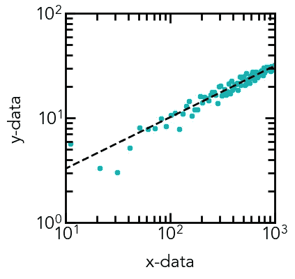

具有重叠拟合线的虚拟幂律数据散点图

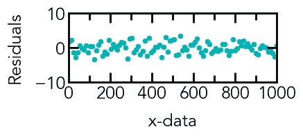

幂律拟合的残差图

# **高斯峰值拟合**

在诸如 X 射线衍射和光致发光的实验中，非常普遍地使用高斯函数、洛伦兹函数或两者组合的峰值拟合来确定线宽和其他属性。在这个例子中，我们将使用下面的通用公式来处理高斯峰值的拟合:

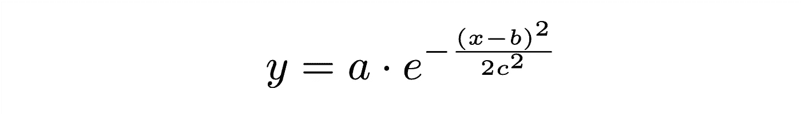

一般高斯函数

```
# Function to calculate the Gaussian with constants a, b, and c
def gaussian(x, a, b, c):
    return a*np.exp(-np.power(x - b, 2)/(2*np.power(c, 2)))# Generate dummy dataset
x_dummy = np.linspace(start=-10, stop=10, num=100)
y_dummy = gaussian(x_dummy, 8, -1, 3)# Add noise from a Gaussian distribution
noise = 0.5*np.random.normal(size=y_dummy.size)
y_dummy = y_dummy + noise
```

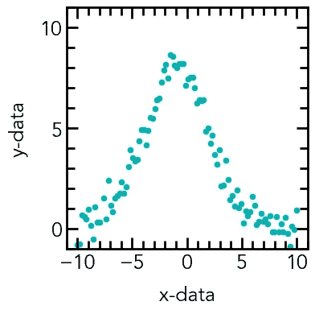

添加了噪声的虚拟高斯数据的散点图

就像在指数和幂律拟合中一样，我们将尝试进行高斯拟合，每个参数的初始猜测值为 0。

```
# Fit the dummy Gaussian data
pars, cov = curve_fit(f=gaussian, xdata=x_dummy, ydata=y_dummy, p0=[0, 0, 0], bounds=(-np.inf, np.inf))# Get the standard deviations of the parameters (square roots of the # diagonal of the covariance)
stdevs = np.sqrt(np.diag(cov))# Calculate the residuals
res = y_dummy - power_law(x_dummy, *pars)
```

但是，当我们这样做时，我们会得到以下结果:

```
print(pars)
>>> [0\. 0\. 0.]print(stdevs)
>>> [inf inf inf]
```

似乎我们的初始猜测不允许拟合参数收敛，所以我们可以用更真实的初始猜测再次运行拟合。您可以通过检查要拟合的峰值并选择合理的初始值来实现这一点。

```
# Fit the dummy Gaussian data
pars, cov = curve_fit(f=gaussian, xdata=x_dummy, ydata=y_dummy, p0=[5, -1, 1], bounds=(-np.inf, np.inf))
```

这一次，我们的拟合成功了，我们得到了以下拟合参数和残差:

**拟合参数和标准偏差**

*一个* = 8.074 0.128

*b*=–0.948 0.054

*c* = 2.945 0.054

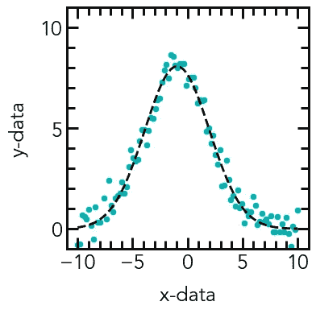

覆盖拟合的虚拟高斯数据散点图

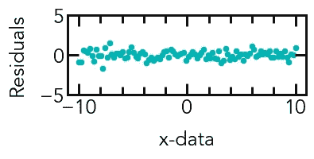

高斯拟合的残差图

# **结论**

希望，在前面例子的引导下，你现在应该能够将你的实验数据拟合到任何非线性函数！我希望你喜欢这个教程，这里展示的所有例子都可以在这个 [Github 仓库](https://github.com/venkatesannaveen/python-science-tutorial)找到。