# Python 中的基本日期时间操作

> 原文：<https://towardsdatascience.com/basic-datetime-operations-in-python-2d706be82c63?source=collection_archive---------8----------------------->


布鲁克·拉克在 [Unsplash](https://unsplash.com/s/photos/date-time?utm_source=unsplash&utm_medium=referral&utm_content=creditCopyText) 拍摄的照片

有时，处理包含日期和时间的数据可能是一项乏味的工作，谢天谢地，有这种内置的方式来帮助我们完成这项工作。Python 提供了一个**日期时间**模块，使我们能够以多种方式操作日期和时间。

在这个模块中，我们需要查看五个主要的对象类，根据我们想要做的工作，我们最终会需要它们。之后，我们将讨论一些解释课程任务的例子。这些类别如下-

1.  datetime.date :它允许我们在不干扰时间(月、日、年)的情况下操作日期
2.  **datetime.time** :它允许我们在不干扰日期(小时、分钟、秒、微秒)的情况下操作日期
3.  **datetime.datetime** :它允许我们操作日期和时间的组合(月、日、年、小时、秒、微秒)。
4.  **datetime.tzinfo** :处理时区的抽象类。这些类型的对象是不可变的。例如，考虑不同的时区和/或夏令时。
5.  **datetime.timedelta** :两个日期、时间或日期时间实例之差；该决议案

# 创建日期时间对象

由于 **datetime** includes 使我们能够处理日期和时间，因此，首先让我们看看这个对象的行为。 **datetime** 既是一个模块，也是该模块中的一个类。我们将从 **datetime** 模块中导入 **datetime** 类，并打印当前的日期和时间以便仔细查看。我们可以使用 **datetime** 的. now()函数来做到这一点。我们将打印我们的**日期时间**对象。

```
# import datetime class from datetime module
from datetime import datetime

# get today's date
today = datetime.now()
print(today)
```

输出如下所示:

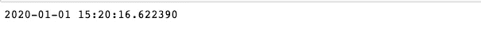

现在，如果我们想看类型，我们可以写:

```
print('Type :- ',type(today))
```

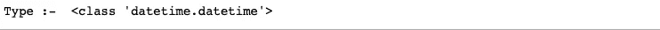

所以我们从上面看到今天确实是一个 datetime 类的 datetime 对象。

从上面的例子我们可以了解到**日期**和**时间**对象应该如何工作。**日期**只适用于日期，不包括**时间**，反之亦然。

```
dt_nw = datetime.now()

# to get hour from datetime
print('Hour: ', dt_nw.hour)

# to get minute from datetime
print('Minute: ', dt_nw.minute)
```

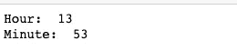

从 **datetime** 中，我们还可以使用它的。 **weekday()** 起数字的作用。但是我们可以使用日历模块和一种叫做**的方法将它转换成文本格式(即星期一、星期二、星期三……)。**日 _ 名()。

首先，我们将导入**日历**模块，然后找出月份和年份，并执行上述操作。

```
# import calendar module
import calendar

my_date= datetime.now()
# To get month from date
print('Month: ', my_date.month) 

# To get month from year
print('Year: ', my_date.year) 

# To get day of the month
print('Day of Month:', my_date.day)

# to get name of day(in number) from date
print('Day of Week (number): ', my_date.weekday())

# to get name of day from date
print('Day of Week (name): ', calendar.day_name[my_date.weekday()])
```

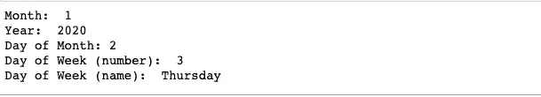

# 处理时区

现在我们需要了解两种 **datetime** 对象；

1.  感知——感知对象具有处理模糊时间所需的知识，它包含时区和夏令时信息，因此它可以相对于其他感知对象定位自己。
2.  天真——这个更容易处理。因为它不包含不同时区和夏令时的信息。操作仅仅依赖于程序。

对于需要 aware 对象的程序， **datetime** 、 **date** 和 **time** 对象有一个可选的时区信息属性， **tzinfo** 。但是 **tzinfo** 是一个抽象类。处理这个问题时，您必须决定到底需要哪些方法。因为这完全取决于对 aware **datetime** 对象的使用。

但是处理时区通过 **pytz** 模块变得很容易。它帮助我们处理跨时区转换，并处理使用该转换的地方的夏令时。让我们看看这个例子:

```
# import timezone from pytz module
from pytz import timezone

# Create timezone UTC
utc = timezone('UTC')

# Localize date & time
loc = utc.localize(datetime(2020, 1, 1, 3, 50, 0))
print(loc)

# Convert localized date & time into Asia/Dhaka timezone
dhaka = timezone("Asia/Dhaka")
print(loc.astimezone(dhaka))

# Convert localized date & time into Europe/Berlin timezone
berlin = timezone('Europe/Berlin')
print(loc.astimezone(berlin))
```

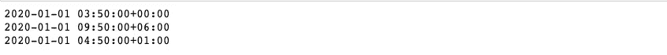

我们使用了 **localize()** 函数向 **datetime** 对象添加时区位置。函数 **astimezone()** 将现有的本地时区转换为任何其他指定的时区。

# 时间跨度和时差

有时在一个程序中，我们可能需要指定剩余时间或时间跨度。在这种情况下，我们总是可以使用**时间增量**对象。我们可以利用这一点，通过对日期或时间进行加减来操纵它们。让我们看一些例子:

```
#import timedelta
from datetime import timedelta
print(timedelta(days= 365, hours= 12, minutes= 30))
```

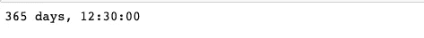

```
# get current time
now = datetime.now()
print ("Today's date & time: ", str(now))

#add 365 days to current date
future_date_after_one_year = now + timedelta(days = 365)
print('Date & time after one year: ', future_date_after_one_year)

#subtract 7 days from current date
seven_days_ago = now - timedelta(days = 7)
print('Date & time seven days ago: ', seven_days_ago)
# print('seven_days_ago object type: ', type(seven_days_ago))
```

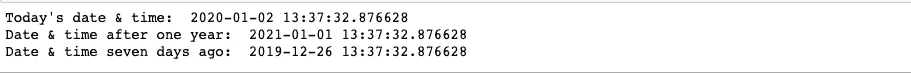

这就是我们如何处理**时间增量**对象。在大多数科学脚本/案例中，delta 总是意味着两个事物之间的差异。

# strftime() & strptime():日期格式

**datetime** 包含两个方法， **strptime()** 和 **strftime()** ，用于将对象从字符串转换为 **datetime** 对象，反之亦然。 **strptime(** )可以读取带有日期和时间信息的字符串并将其转换为 datetime 对象， **strftime()** 将 datetime 对象转换回字符串。

```
# import datetime
from datetime import datetime

date_str = "2 january, 2020"

# format date
date_obj = datetime.strptime(date_str, "%d %B, %Y")

print("Today's date is: ", date_obj)
```

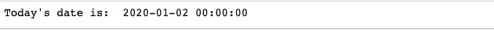

现在让我们看看 **strftime()** 的用法:

```
# current date and time
now = datetime.now()

# format time in HH:MM:SS
time = now.strftime("%H:%M:%S")
print("Time:", time)

# format date
date_time = now.strftime("%m/%d/%Y, %H:%M:%S")
print("Date and Time:",date_time)
```

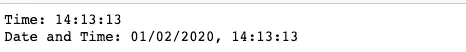

# 处理时间戳

在处理数据时，处理时间戳是非常常见的。也许你想以 [Unix 时间戳格式](https://en.wikipedia.org/wiki/Unix_time)存储你的数据。我们将使用 **datetime** 的 **timestamp()** 函数来完成这项工作。

```
# get current date
now = datetime.now()

# convert current date into timestamp
timestamp = datetime.timestamp(now)

print("Date and Time :", now)
print("Timestamp:", timestamp)
```

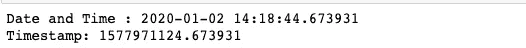

类似地，我们可以从时间戳转换成日期和时间对象。

```
timestamp = 1577971124.673931

#convert timestamp to datetime object
date_obj = datetime.fromtimestamp(timestamp)

print("Today's date & time:", date_obj)
```

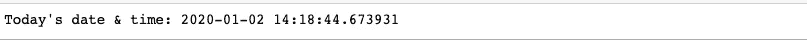

# 熊猫日期时间对象

Pandas 是 python 中数据科学项目的主要成分，这是理所当然的。它使得处理日期和时间比其他任何方法都容易。

使用 **to_datetime()** 将日期和时间文本字符串转换成 pandas Datetime 对象要容易得多。

这个函数很擅长通过自动检测字符串的格式将字符串转换成 Python datetime 对象，而不需要我们使用 strftime 模式来定义它。

```
# import pandas module
import pandas as pd

# create date object using to_datetime() function
date = pd.to_datetime("2nd of jan, 2020")
print(date)
```

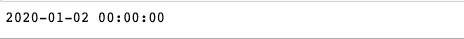

还有很多操作可以使用带有日期和时间数据的熊猫来完成。但这需要另一个自己的职位。然而，我希望这篇文章提供了关于我们可以用 datetime 模块和 pandas 进行的操作的初步概念。这里用到的所有代码都可以在我的 GitHub 账号[https://github.com/muniah](https://github.com/muniah)上找到。

*原载于 2020 年 1 月 2 日 https://muniah.com*[](https://muniah.com/basic-datetime-operations-in-python/)**。**