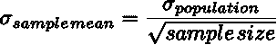
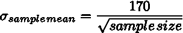

# A/B 测试的基本要素——用 Python 代码模拟

> 原文：<https://towardsdatascience.com/basic-elements-of-a-b-testing-with-python-code-to-simulate-2b7f342f5ac6?source=collection_archive---------20----------------------->


照片由 [Unsplash](https://unsplash.com?utm_source=medium&utm_medium=referral) 上的 battle creek 咖啡烘焙师拍摄

**什么更重要？你花了多少天进行 A/B 测试？或者你每天的样本量？较大的样本量比运行 A/B 测试很多天要重要得多。这篇文章将通过模拟向你展示为什么会这样。**

A/B 测试就像咖啡拔火罐；你想客观地决定哪种咖啡更好。这是这两个过程的目的，但是 A/B 测试确实试图做到客观。

假设你正在与一家大型电子商务公司合作。你的客户群平均每天购买 170 美元。网站设计团队希望引入一个更精简的网站，加载速度更快，他们假设这个新的网站设计不会降低平均订单价值。销售团队对此表示怀疑——由于这个新网站在主页上展示的产品较少，他们认为这将降低平均订单价值；他们不想在所有客户群中推出这个新网站。

你带着你的统计工具进来了:“为什么我们不在人口的一个小样本上测试这个，而不是在整个人口上？”

“听起来是个好主意”，web 团队和销售团队都同意，委托你设计测试，即 A/B 测试。

测试需要的东西:

1.  您将需要一个控制样本—将向这些客户展示旧网站，他们将继续以相同的平均订单价值 170 美元购买
2.  您还需要一个目标样本—您将向这些客户展示新网站
3.  你必须选择目标样本的样本大小——最小的样本大小，因为销售团队认为这个新网站有风险
4.  你将不得不选择几天来测试这个理论——同样是最少的，因为销售团队真的不急于改变网站，并且通常你想尽快知道这是否会对你的客户的购买习惯产生不利影响

从[中心极限定理](https://medium.com/p/central-limit-theorem-explained-with-python-code-230884d40ce0?source=email-1cc9a87c6964--writer.postDistributed&sk=9b76d0fd89a7d50c56ee20c666eba1ed)中你知道，你进行测试的天数越多，它就能更好地反映总体情况。但是您希望用最少的天数测试新特性，并尽快得出结论。

你运行一些模拟。

# 设置问题和模拟

但是，让我们后退一步，假设我们的控制样本和目标样本完全相同。本质上，我们没有推出一个新的网站。你也可以把这个场景表述为“我们将会看到，如果新网站没有对顾客购买产生影响，会发生什么”。我们一次随机抽取两个客户样本，并试图了解他们之间的差异是否纯粹是由于统计上的随机性。

换句话说，这是在问“如果你从同一个人群中随机抽取样本，他们的平均值有多不一样？”

因此，在本文的其余部分，让我们假设我们从相同的人群中抽取，也就是说，目标组和控制组都显示相同的网站。

让我们生成一个随机的指数分布(为什么是指数分布？我们在关于样本大小、*、*和均值、*、*的[中心极限定理](https://medium.com/p/central-limit-theorem-explained-with-python-code-230884d40ce0?source=email-1cc9a87c6964--writer.postDistributed&sk=9b76d0fd89a7d50c56ee20c666eba1ed)文章中讨论过，让我们这样做两次——一次针对对照样本，另一次针对(伪)目标样本。我说“伪”是因为他们都来自同一个人群，这是我们的客户群，显示在同一个网站上。每次这样做时，我们都会注意到对照样本和目标样本之间均值的差异:

δμ=对照样本的平均值—目标样本的平均值

那我们就这样做 *n* 次。

这是对照样本和目标样本之间的均值差异δμ，已绘制出来。


δμ(对照样本的平均值-目标样本的平均值):1)随着 A/B 测试天数的增加(列中向下)以及 2)随着样本量的增加(行中向右)。注意 x 轴上的范围:当您在一行中从左到右移动时，这个 x 轴范围会缩小，但是当您沿着任何一列向下移动时，这个范围或多或少会保持不变。

# 这些图说明了什么？

以下是一点一点的细节。但是，如果您有困难，请跳过这一步，跳到“**模拟观察总结**”部分。

增加天数:

1.  左上图是当你两次吸引 1000 名顾客(控制和目标)时，你这样做 5 天。控制平均值和目标平均值之间的差值绘制在 x 轴上。
    *所以你看到δμ(对照样本的均值——目标样本的均值)可以在负$5 和正$5 之间。也就是说，对照样本的平均值可能比目标样本的平均值少或多 5 美元。
2.  如果你看第二行最左边的图，它显示了如果你重复上述实验 15 天会发生什么——也就是说，你抽取 1000 个客户的随机样本对，每个样本对 15 天，然后你看这些对的平均值之间的差异。你可以看到，在这里，大部分时间δμ都在正负 5 美元之间。两个样本(从同一人群中抽取)的平均值相差高达 5 美元。
3.  事实上，您一直将天数增加到左下角的 60 天，同时保持 1000 名客户的相同样本量
    *您会看到目标组和控制组平均值之间的差异仍然有很大变化——它可以在$+/-20(x 轴的范围)之间变化，但大多数数据仍然在$+/-5 之间。
4.  所以这是一个问题。我们希望δμ接近 0 美元，因为两个样本都来自我们的同一批客户。

增加样本中的客户数量:

1.  我们来看右上方的图。它显示了如果您绘制 5 天的 100，000 个客户对，并计算这些分布对的平均值之间的差异
    *您会立即看到控制平均值减去目标平均值现在非常低，降至-0.75 美元至+$0.50 美元(x 轴范围)。也就是说，在所有 5 天的测试中，您的控制平均值和目标平均值的差异不会超过+/-1.00 美元。太好了！请记住，控制样本和目标样本来自相同的分布，因此它们的平均值应该大致相同
2.  事实上，如果您使用相同的 100，000 个客户样本对进行 60 天的测试，就像右下角的图一样，您会看到控制平均值和目标平均值之间的差异仍然不会发生很大变化，实际上，它们仍然只相差 1.00 美元

## 模拟观察总结

1.  这就是你看到的模式。如果您沿着任何特定的列向下，其中样本大小保持不变，天数增加，您看不到控制和目标平均值之间的**差异**δμ改善很多——X 轴上的范围保持不变。
2.  如果沿着任何给定的行从左到右，也就是说，如果在保持天数不变的情况下增加样本量，那么您会看到控制平均值和目标平均值之间的差异迅速缩小。请记住，我们希望这样，因为控件和目标都来自同一个客户群——还没有引入网站更改。

# A/B 测试参数估计—天数和样本量

**这个故事的寓意——只要超过 5 天左右，A/B 测试的天数不会有太大影响。但是你每天看的顾客数量确实有很大的影响。**

## A/B 测试的天数

理想情况下，至少应该是 30 天。为什么是 30？嗯，30 这个数字背后并没有什么魔力，但在工业上，这已经足够了。从[的中心极限定理帖子](https://medium.com/p/central-limit-theorem-explained-with-python-code-230884d40ce0?source=email-1cc9a87c6964--writer.postDistributed&sk=9b76d0fd89a7d50c56ee20c666eba1ed)中，我们看到我们需要抽取足够数量的样本，以确保我们有一个良好的样本均值正态分布。但是没有企业会让你运行 30 天的 A/B 测试，大多数企业不会。

往往一个企业只会给你 7 天时间做结论。**你确实可以在上面看到的短短 7 天内做出结论，如果你有一个好的样本量，我们将在下面讨论。**

## A/B 测试的目标群体的规模

剩下的就是目标群体(和对照组)的客户数量。这在很大程度上取决于你的企业愿意处理多少利润。在这个例子中，如果企业愿意说“由于纯粹的机会，5 美元的正负差异对我们没有影响”，那么您可以使用 1000 名客户的样本规模。如果企业要求他们可以处理不超过 1 美元的差异，那么您将不得不要求 100，000 名客户进行 A/B 测试，以确保您看到的任何差异都不是随机的。

但是，根据你公司的风险偏好，你如何得到准确的样本量呢？

我们可以参考这篇关于[中心极限定理](https://medium.com/p/central-limit-theorem-explained-with-python-code-230884d40ce0?source=email-1cc9a87c6964--writer.postDistributed&sk=9b76d0fd89a7d50c56ee20c666eba1ed)的文章。
在那里我们看到:



由于我们的总体是均值为 170 美元的指数分布，并且指数分布的均值和标准差相等，因此我们有:



现在你明白了为什么上面的一组图显示了当你从第一列移动到第三列时沿着 x 轴的分布减小了:当
样本量= 10(第一列)时
，σ(样本均值)=170/sqrt(10 )=$5.40
样本量= 10⁴(第二列)，σ(样本 mean)=170/sqrt(10⁴)=$1.70
样本量= 10⁵(第三列)，σ(样本 mean)=170/sqrt(10⁵)=$0.54

重新排列上述公式，我们得到样本量估计的**方程**:


其中，
σ_population 可以近似为总体均值，因为我们通常得到的是近似的指数分布，并且企业通常对总体均值有一个概念。在这种情况下，业务人员会告诉您，日平均订单价值为 170 美元。
σ_(样本均值)是你企业的风险偏好。例如，如果他们说“我们可以处理控制组和目标组之间不超过$2.00 的差异”，那么σ_(样本均值)=$2
在这个例子中，那么你的样本大小将是(170/2) =7225

# 其他注意事项

做完这一切后，你需要确保企业没有进行促销，或者你可以通过某种方式为你的控制和目标群体控制这些变量。然后，你必须确保你没有在你的目标群体或控制群体中意外地选择了更保守、更喜欢升职的人，反之亦然。但是如果你做了一个好的，真正随机的选择，那么这个问题就解决了。在后面的文章中，我将讨论如何选择一个真正随机的样本。

在下一篇文章中，我会告诉你如何评估你的 A/B 测试。

# Python 代码再现情节

您可以使用以下代码生成本文中的图表:

```
**import** matplotlib.pyplot **as** plt
**import** matplotlib.patches **as** mpatch
**import** statistics
**import** numpy **as** np

**def** two_exponential_distributions(n, samp_size, mu):
    *# do n times a sample of samp_size each with same mean sigma to see how they differ
    # returns a list of tuples:
    # each element in the list corresponds to one of the two distributions: so list is of length2
    # each element in the list is a tuple; teh tuple returns the number of samples, the sample size, the mean and the stddev* del_m = []
    m1arr = []
    m2arr = []
    **for** ii **in** range(0, n):
        s1 = np.random.exponential(mu, samp_size)
        m1 = np.mean(s1)
        m1arr.append(m1)

        s2 = np.random.exponential(mu, samp_size)
        m2 = np.mean(s2)
        m2arr.append(m2)

        del_m.append(m1 - m2)

    musig = []
    musig.append((n, samp_size, statistics.mean(m1arr), statistics.stdev(m1arr), del_m))
    musig.append((n, samp_size, statistics.mean(m2arr), statistics.stdev(m2arr), del_m))
    **return** musig

**def** simulate_n_sampsize():
    nn = [5, 15, 30, 60]
    ss = [1000, 10000, 100000]
    fig = plt.figure(figsize=(10, 7))
    fig.suptitle(**'Difference of Average Order Value Between Control and (psuedo)Target'**)
    fig.text(0.5, 0.04, **'Number of Customers'**, ha=**'center'**)
    fig.text(0.04, 0.5, **'Number of Days'**, ha=**'center'**, rotation=**'vertical'**)
    l1 = mpatch.FancyArrow(0.3, 0.08, 0.4, 0,
                           transform=fig.transFigure, figure=fig)
    l2 = mpatch.FancyArrow(0.08, 0.7, 0, -0.3,
                           transform=fig.transFigure, figure=fig)

    fig.lines.extend([l1, l2])

    plt.subplots_adjust(hspace=0.5)
    ii = 1
    nsmusig = []
    **for** n **in** nn:
        **for** s **in** ss:
            ax = fig.add_subplot(4, 3, ii)
            musig = two_exponential_distributions(n, s, 2000)
            ax.set_title(**'n={}, s={}'**.format(n, s))
            ii += 1
            nsmusig.append(musig[
                               0])  *# control sample's n, samp_size, statistics.mean(m1arr), statistics.stdev(m1arr) and del_m between control and target* nsmusig.append(musig[
                               1])  *# target sample's n, samp_size, statistics.mean(m1arr), statistics.stdev(m1arr) and del_m between control and target* plt.hist(musig[0][4], color=**'blue'**, edgecolor=**'black'**, bins=int(n), histtype=**'step'**)
            **for** item **in** ([ax.title, ax.xaxis.label, ax.yaxis.label] +
                             ax.get_xticklabels() + ax.get_yticklabels()):
                item.set_fontsize(8)
    plt.show()

    print(nsmusig)
    print([x[2] **for** x **in** nsmusig])
    print([x[2] **if** (x[0] == 5) **else** 0 **for** x **in** nsmusig])

    print(**'some means'**)
    **for** n **in** nn:
        print(n)
        print([x[2] **for** x **in** nsmusig **if** x[0] == n])
    print(**'some stddevs'**)
    **for** n **in** nn:
        print(n)
        print([x[3] **for** x **in** nsmusig **if** x[0] == n])

simulate_n_sampsize()
```