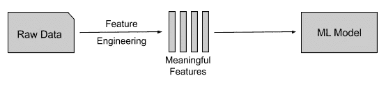

# 实现更高效机器学习的基础特征工程—下一步

> 原文：<https://towardsdatascience.com/basic-feature-engineering-to-reach-more-efficient-machine-learning-part-2-bc8e70d00343?source=collection_archive---------38----------------------->

克里斯多夫·伯恩斯在 [Unsplash](https://unsplash.com/s/photos/engineering?utm_source=unsplash&utm_medium=referral&utm_content=creditCopyText) 上拍摄的照片

关于 ML 的一个重要的事情是，大多数机器学习算法在只有原始数据的情况下不会有效地执行。你不能仅仅将一组特性输入到模型中，然后期望它表现良好。尤其是当数据集中有非数字数据时，机器学习模型不会像预期的那样工作，并且准确率非常低。

在这篇文章中，我们将看看**如何从一组干净的特性**中获得更有意义的特性。为了更好地理解，我将使用一个基本的分类问题来解释检测网络 DDOS 攻击的概念。我以前写过一篇文章，介绍了特征工程的基本步骤，包括清理原始数据的不同方法，以及将非数字数据嵌入数字格式的一些基本方法。可以参考更好的理解([基础特征工程达到更高效的机器学习](/basic-feature-engineering-to-reach-more-efficient-machine-learning-6294022e17a5))。

# 衍生有意义的特征

衍生要素应在清理现有原始要素后执行。那些清除的数据可以是数字格式，也可以是非数字格式。衍生特征的格式取决于上下文。如果您打算直接将这些嵌入数据输入到模型中，那么根据您的模型，它们最好是数字格式。**几乎所有机器学习模型的成功都取决于我们如何向模型呈现数据，也取决于训练**。

衍生特征并不是一项困难的任务，但是**需要对上下文或问题域**有很好的理解。推导建立在上下文之上。比方说，对于您要检测的条件，有某个参数超过了阈值。但是如果没有很好地理解问题领域，您可能不知道这些参数、阈值或关系。此外，我们可能需要根据问题推导出多个这样的条件。我们拥有的功能越多，模型的性能就越好。现在让我们看看一些流行的方法来获得这样的特征。

**1。通过参数之间的加/减**

一种流行的技术是在参数之间加减。这种加减可以在同一列的参数内进行，也可以在不同列之间进行。

**2。统计某个窗口内的发生次数**

另一种流行的技术是计算一个窗口内的出现次数。大多数情况下，这用于检测是否超过阈值。如果您的输入涉及时间戳，则可以应用时间窗口(即在特定时间窗口内计算发生的次数)。

**3。获取参数之间的比率**

在某些情况下，两个或多个参数之间的比率代表该领域的某些特征。但是要识别这样的模式，你必须是该领域的专家，或者必须做大量的实验。

**4。通过计算统计参数**

像平均值、中值、众数和标准差这样的统计参数代表了领域的行为或特征。通过根据领域计算此类参数，您可能能够获得新的特征。然而，需要一些数学背景来容易地识别这种模式。

**5。二元决策**

二元决策的答案要么是“0”，要么是“1”。通过回答二元问题可以得出新的特征。例如，我们可以通过检查某个参数是否超过阈值来创建一个特性列。特征值将为代表问题答案的“0”或“1”。

**6。交叉特征**

特征交叉是最流行的技术之一，尤其是涉及到线性问题时。基本思想是通过将两个或多个现有特征相乘(即交叉)形成一个新特征。

上面提到的只是一些流行的获得特征的技术。你**可以根据问题域**随意定义和衍生任何特性。

在创建了新的特征并为模型选择了最好的特征之后，我们就可以训练模型了。然而，**包括原始特征和新特征在内的所有特征可以采用不同的比例**。特别是当我们应用像特征交叉或后比率这样的技术时，这些新值将比现有值具有更大的范围。所以我们必须把所有的柱子放在同一个尺度上。

# 正常化

规范化的最终目标是将所有值放在相同的范围内，从而提高模型的性能。有几种方法可以实现标准化。**其中最著名的是**。

缩放意味着将列的值转换成标准范围，通常是 0 到 1。但是，只有当列的值近似均匀地分布在整个范围内，并且我们知道数据列的上限和下限时，缩放才有效。Python scikit 学习库提供了缩放值的函数。

如果缩放不适用，您可以尝试一种**其他方法，如特征裁剪、对数缩放或 z 分数**。要素裁剪将超出特定阈值的值限制为固定值。对数标度通过计算数据的对数，将大范围的值压缩到小范围内。Z-score 表示偏离值集平均值的标准偏差数。

现在让我们通过一个例子来更好地理解特性的派生。

# 实例研究

让我们考虑一种 DDOS 攻击情况，攻击者试图使系统的目标用户无法使用资源。在 DDOS 攻击中，攻击者通常使用多台计算机向单个系统发送大量请求。通过考虑 DDOS 攻击的基本定义，我们可以确定以下两个特征(**这两个不是仅有的两个特征**)。

1.  攻击者从一台计算机上发送同一组请求的频率比平时高得多。
2.  攻击者使用位于不同位置的多台计算机发送请求。

首先，让我们考虑与这两个特征相关的原始特征。通常，一个网络请求包含一个时间戳(如果没有可以用 AI 引擎记录)，消息体和包括源 IP 的报头。通过考虑第一个特性，我们可以**创建一个特性来计算某个时间窗口**内的请求数量。通常，特定网络资源有一个定义的阈值。这个阈值可以随时、因资源、因用户等而改变(这是我们必须使用 AI 来定义这样的阈值的一个原因)。我们可以定义一个特定长度的时间窗口，并计算该窗口内的请求数。输出编号是该模型的一个新功能。

通常，网络请求的报头包含请求的源 IP。**IP 地址可用于检测原始系统的位置**(位置、国家、州和许多其他事物的坐标可通过使用合适的数据库或 API 服务从 IP 地址获得)。通过考虑第二个特征，我们可以引入一个新的特征来检测在某个时间间隔内相同请求的位置变化。

考虑到上述两个特征，下面列出了检测 DDOS 攻击的两个衍生特征。请注意，上述两个特征并不是控制 DDOS 攻击的唯一两个特征，这两个特征的行为可能会因环境而异。此外，两个特征下面的**并不是控制 DDOS 攻击特征的唯一两个特征**，因此可能不足以检测攻击情况。

1.  5 分钟时间窗口内对资源路径的请求数。
2.  同一请求在 10 秒时间窗口内的位置变化距离。

# 结论

大多数机器学习算法在只有原始数据的情况下无法有效执行，因此需要应用特征工程技术。在本文中，我们已经确定了为机器学习模型派生新特征的重要性，以及如何在示例研究的帮助下派生有意义的特征。此外，我们还确定了标准化的重要性，以便将所有特征置于相同的范围内。作为结论，我想建议**特征工程是大多数机器学习模型**的核心。