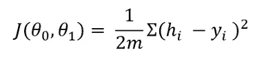
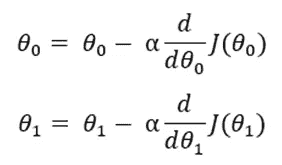
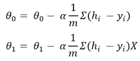
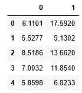
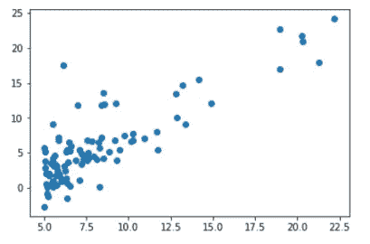
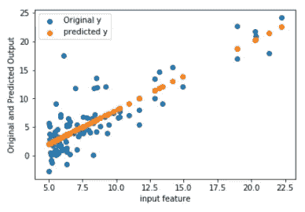
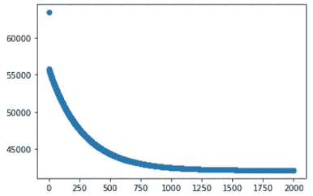

# Python 中的线性回归算法:一步一步

> 原文：<https://towardsdatascience.com/basic-linear-regression-algorithm-in-python-for-beginners-c519a808b5f8?source=collection_archive---------6----------------------->


杰里米·毕晓普在 [Unsplash](https://unsplash.com?utm_source=medium&utm_medium=referral) 上的照片

## 学习线性回归的概念，并使用 python 从头开始开发一个完整的线性回归算法

最基本的机器学习算法必须是单变量线性回归算法。如今，有如此多的先进的机器学习算法、库和技术可用，以至于线性回归似乎并不重要。但是学习基础知识总是一个好主意。这样你会非常清楚地掌握这些概念。在本文中，我将逐步解释线性回归算法。

## 想法和公式

线性回归使用预测的非常基本的想法。公式如下:

Y = C + BX

我们在学校都学过这个公式。提醒一下，这是一条直线的方程。这里，Y 是因变量，B 是斜率，C 是截距。通常，对于线性回归，它被写成:


这里，“h”是假设或预测的因变量，X 是输入特征，θ0 和θ1 是系数。θ值是随机初始化的。然后使用梯度下降，我们将更新θ值以最小化成本函数。下面是成本函数和梯度下降的解释。

## 成本函数和梯度下降

成本函数决定了预测与原始因变量的距离。这是它的公式



任何机器学习算法的思想都是最小化代价函数，使假设接近原始因变量。为此，我们需要优化θ值。如果我们分别基于θ0 和θ1 对代价函数取偏导数，就会得到梯度下降。为了更新θ值，我们需要从相应的θ值中减去梯度下降:



偏导数之后，上面的公式将变成:



这里，m 是训练数据的数量，α是学习率。我说的是一元线性回归。这就是为什么我只有两个θ值。如果有很多变量，那么每个变量都会有θ值。

## 工作示例

我要用的数据集来自吴恩达在 Coursera 上的机器学习课程。下面是用 Python 一步步实现线性回归的过程。

1.  导入包和数据集。

```
import numpy as np
import pandas as pd
df = pd.read_csv('ex1data1.txt', header = None)
df.head()
```



在该数据集中，第 0 列是输入要素，第 1 列是输出变量或因变量。我们将使用上面的直线公式使用第 0 列来预测第 1 列。

2.根据第 0 列绘制第 1 列。



输入变量和输出变量之间的关系是线性的。当关系是线性时，线性回归效果最好。

3.初始化θ值。我将θ值初始化为零。但是任何其他值也应该起作用。

```
theta = [0,0]
```

4.根据之前讨论的公式定义假设和成本函数。

```
def hypothesis(theta, X):
    return theta[0] + theta[1]*Xdef cost_calc(theta, X, y):
    return (1/2*m) * np.sum((hypothesis(theta, X) - y)**2)
```

5.根据数据帧的长度计算训练数据的数量。然后定义梯度下降的函数。在这个函数中，我们将更新θ值，直到成本函数最小。它可能需要任意次迭代。在每次迭代中，它将更新 theta 值，并且利用每次更新的 theta 值，我们将计算成本以跟踪成本。

```
m = len(df)
def gradient_descent(theta, X, y, epoch, alpha):
    cost = []
    i = 0
    while i < epoch:
        hx = hypothesis(theta, X)
        theta[0] -= alpha*(sum(hx-y)/m)
        theta[1] -= (alpha * np.sum((hx - y) * X))/m
        cost.append(cost_calc(theta, X, y))
        i += 1
    return theta, cost
```

6.最后，定义预测函数。它将从梯度下降函数中获得更新的θ，并预测假设或预测的输出变量。

```
def predict(theta, X, y, epoch, alpha):
    theta, cost = gradient_descent(theta, X, y, epoch, alpha)
    return hypothesis(theta, X), cost, theta
```

7.使用预测函数，查找假设、成本和更新的θ值。我选择学习率为 0.01，我将运行这个算法 2000 个时期或迭代。

```
y_predict, cost, theta = predict(theta, df[0], df[1], 2000, 0.01)
```

最终的θ值为-3.79 和 1.18。

8.在同一个图表中绘制原始 y 和假设或预测 y。

```
%matplotlib inline
import matplotlib.pyplot as plt
plt.figure()
plt.scatter(df[0], df[1], label = 'Original y')
plt.scatter(df[0], y_predict, label = 'predicted y')
plt.legend(loc = "upper left")
plt.xlabel("input feature")
plt.ylabel("Original and Predicted Output")
plt.show()
```



根据公式，假设图是一条直线，并且该直线穿过最佳位置。

9.记住，我们在每次迭代中跟踪成本函数。让我们画出成本函数。

```
plt.figure()
plt.scatter(range(0, len(cost)), cost)
plt.show()
```



正如我之前提到的，我们的目的是优化θ值，以最小化成本。正如你从这张图表中看到的，成本在开始时急剧下降，然后变得稳定。这意味着θ值如我们预期的那样得到了正确的优化。

我希望这有所帮助。下面是本文中使用的数据集的链接:

[](https://github.com/rashida048/Machine-Learning-With-Python/blob/master/ex1data1.txt) [## rashida 048/用 Python 进行机器学习

### 通过在 GitHub 上创建一个帐户，为 rashida 048/用 Python 进行机器学习开发做出贡献。

github.com](https://github.com/rashida048/Machine-Learning-With-Python/blob/master/ex1data1.txt) 

以下是其他一些机器学习算法的解决方案:

[Python 中的多元线性回归逐步](/multivariate-linear-regression-in-python-step-by-step-128c2b127171)

[使用优化功能的 Python 逻辑回归](/logistic-regression-with-python-using-optimization-function-91bd2aee79b)