# 基本航海指南

> 原文：<https://towardsdatascience.com/basic-seaborn-guide-d963a81cb608?source=collection_archive---------31----------------------->

## 您的数据科学工具


照片由 F [rank Mckenna](https://unsplash.com/@frankiefoto) 在 Unsplash 上拍摄

Seaborn 是一个可视化库，位于 matplotlib 之上，使它看起来更好看，并增加了一些额外的功能。数据可视化允许数据科学家向非科学读者传达他们的发现和结果，所以如果你想进入数据科学领域，这是一个很好的工具！

让我们从加载 2019 车型年车辆的真实数据集开始，但首先，我们需要导入相关的包！

```
import matplotlib.pyplot as plt%matplotlib inlineimport seaborn as sns
```

# 条形图

在本例中，我们希望查看所有车辆的档位数量。

```
gear_counts = df['# Gears'].value_counts()gear_counts.plot(kind='bar')
```

我们可以加载 Seaborn，只需对它调用 set()就可以将 matplotlib 的默认设置更改为更具视觉效果的设置。

现在，如果我们做同样的情节命令，它看起来更现代一点。

```
sns.set()gear_counts.plot(kind='bar')
```

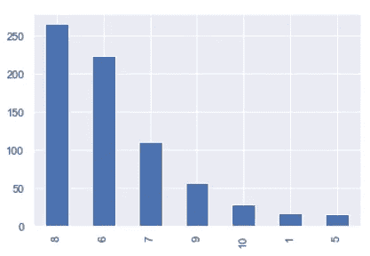

好多了！

# **距离图**

Seaborn 包括 matplotlib 没有提供的许多类型的情节。例如，“distplot”可用于绘制直方图以及叠加在其上的直方图的平滑分布。让我们以此数据库中车辆的 MPG 值分布为例。

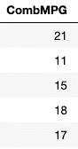

这是我们正在处理的数据

```
sns.distplot(df['CombMPG'])
```

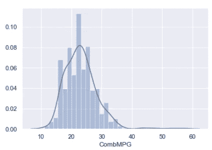

# 配对图

你经常遇到的是 Seaborn 的“结对情节”。这使您可以将各种属性的每种组合的图可视化，因此您可以在特征之间寻找有趣的模式。

作为一个例子，让我们寻找气缸、城市 MPG 等级、公路 MPG 等级和综合 MPG 等级之间的关系。

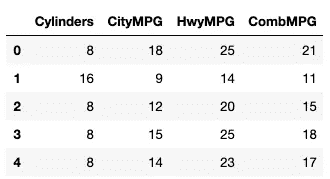

使用的数据

```
sns.pairplot(df2, height=2.5)
```

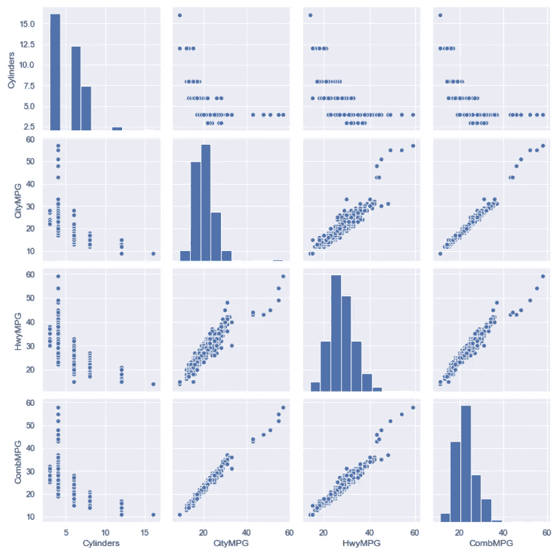

通过研究上面的结果，你可以看到气缸数量和 MPG 之间的关系，但 4 缸车辆的 MPG 范围非常广。在测量 MPG 值的不同方法之间似乎也有很好的线性关系，直到你达到更高的 MPG 等级。

# 散点图

这将在您选择的两个轴上绘制各个数据点，因此您可以看到数据在这些维度上的分布情况。

当你有发动机排量这样的顺序数据时，散点图会将自己排列成列，但它告诉我们，发动机排量的每个值都有一个相当大的 MPG 值范围，尽管如果你看看数据点聚集的地方，你可以看到随着发动机排量的增加，MPG 值有下降的趋势。

```
sns.scatterplot(x="Eng Displ", y="CombMPG", data=df)
```

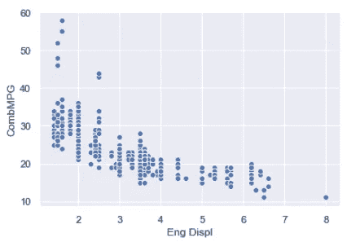

# 带直方图的散点图

Seaborn 还提供了一个“jointplot ”,它结合了散点图和两个轴上的直方图。这使您可以同时看到单个数据点和两个维度上的分布。

```
sns.jointplot(x="Eng Displ", y="CombMPG", data=df)
```

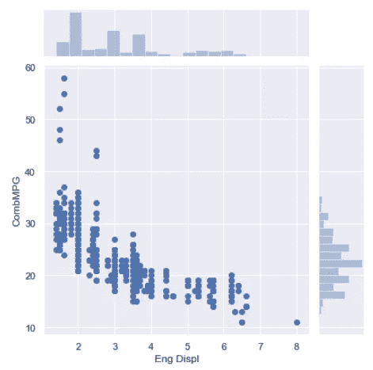

最常见的发动机排量似乎是 2，3 紧随其后。每加仑汽油的得分似乎大致遵循一条以 22 分左右为中心的钟形曲线。

# 线性散点图

“lmplot”为我们提供了覆盖在图表上的数据的线性回归，这使得较低 MPG 与较高发动机排量的总体趋势更加明显。就效率而言，高发动机排量似乎并不更好。

```
sns.lmplot(x="Eng Displ", y="CombMPG", data=df)
```

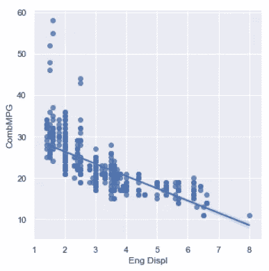

# 箱线图

接下来，我们来看一个“盒状图”。这就是所谓的“方框和胡须”图，它对于可视化给定类别的典型值非常有用，不会被异常值分散注意力。每个方框代表数据的第一个和第三个四分位数之间的范围，一条线代表中值。从框中延伸出来的“胡须”代表数据的其余部分的分布，除了清晰的异常值，这些异常值被绘制为胡须外部的单个点。

例如，让我们看看每个汽车制造商的箱线图，可视化他们生产的汽车的每加仑英里数。这让我们可以看到每个制造商提供的所有车辆的 MPG 评级的分布情况。

有很多制造商，所以为了使结果图可读，我们将增加 Seaborn 的默认图形大小，并使用 set_xticklabels 将标签旋转 45 度。

```
sns.set(rc={'figure.figsize':(15, 5)})ax = sns.boxplot(x='Mfr Name', y='CombMPG', data=df)ax.set_xticklabels(ax.get_xticklabels(),rotation=45)
```

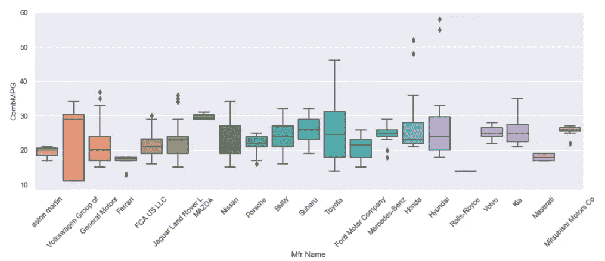

箱线图告诉我们，我们在每种变速箱类型上看到的 MPG 值的范围并不像乍看上去那样疯狂分布；许多极值实际上是离群值，在分析趋势时最好将其丢弃。

# 群体图

另一种可视化相同数据的方法是“群体图”它绘制的不是方框和触须，而是每一个单独的数据点——但这样做的方式是根据它们的分布将它们组合在一起。你看着就更有道理了。

```
ax = sns.swarmplot(x='Mfr Name', y='CombMPG', data=df)ax.set_xticklabels(ax.get_xticklabels(),rotation=45)
```

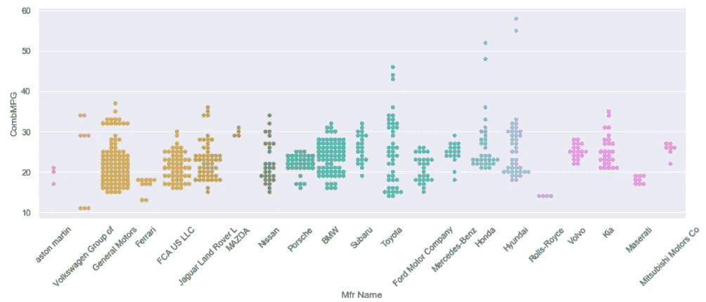

# 计数图

另一个工具是“计数图”这和直方图基本上是一样的，只是针对分类数据。它可以让你计算 X 轴上每个给定类别在数据中出现的次数，并绘制图表。例如，我们可以看到通用汽车公司提供的车型比其他任何公司都多，宝马紧随其后。

```
ax = sns.countplot(x='Mfr Name', data=df)ax.set_xticklabels(ax.get_xticklabels(), rotation=45)
```

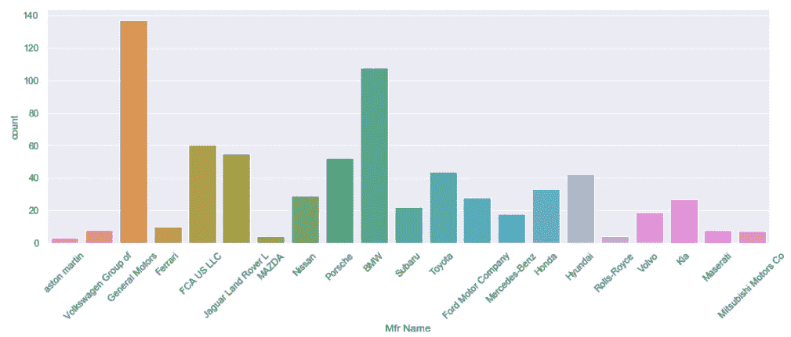

# 热图

热图允许你绘制某种表格形式的 2D 数据，用颜色代表 2D 表中每个单元格的单个值。

在本例中，我们将根据原始数据框创建一个数据透视表，以创建一个 2D 表，其中包含气缸数和发动机排量的每种组合的平均 MPG 评级。

生成的热图显示了沿 X 轴的所有发动机排量值，以及沿 Y 轴的所有气缸排量值。对于表格中的每个单元格，气缸和发动机排量组合的实际平均 MPG 等级不是用数字表示，而是用颜色表示，颜色范围从*深色表示小数值，浅色表示大数值。*

这确实可以让您看到一个清晰的趋势，随着我们从图表的左上移到右下，情况会逐渐变暗。这是有道理的。较高的 MPG 等级与较低的气缸数量和较低的发动机排量值相关。当我们使用 8 升 16 缸发动机时，平均每加仑汽油跑 12 英里，用黑色表示。

这张图表有很多缺失的数据，但是热图很好地处理了这些数据。3 缸 8 升发动机根本不存在！

```
df2 = df.pivot_table(index='Cylinders', columns='Eng Displ',          values='CombMPG', aggfunc='mean')sns.heatmap(df2)
```

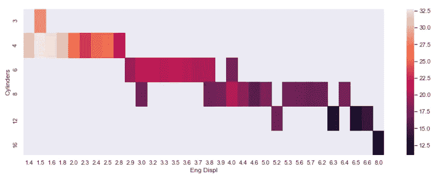

我的 Seaborn 教程到此结束。希望这对你的兼职项目和工作有帮助。谢谢大家！