# Python 中时间序列分析的基本统计数据

> 原文：<https://towardsdatascience.com/basic-statistics-for-time-series-analysis-in-python-4cb147d56535?source=collection_archive---------15----------------------->

## 了解描述性统计和推断性统计，快速启动您的时间序列分析


[Icons8 团队](https://unsplash.com/@icons8?utm_source=medium&utm_medium=referral)在 [Unsplash](https://unsplash.com?utm_source=medium&utm_medium=referral) 上的照片

时间序列只是一组按时间顺序排列的数据点，其中时间通常是独立变量。

现在，预测未来并不是时间序列分析的唯一目的。它还与评估重要属性相关，如平稳性、季节性或自相关性。

在进入更高级的建模实践之前，我们必须首先掌握基础知识。

在本文中，我们将通过介绍描述性和推断性统计来介绍时间序列分析的构建模块。当我们在时间序列上实现复杂的模型时，这些概念将会派上用场，因为统计显著性对于建立稳健的分析是必要的。

所有的代码示例都是 Python 语言，你可以拿着[的笔记本](https://github.com/marcopeix/time-series-analysis/tree/master/1.Basics)跟着学。

我们开始吧！

> 通过 Python 课程中的[应用时间序列分析，使用 Python 和 TensorFlow 应用更复杂的模型进行时间序列分析！](https://www.datasciencewithmarco.com/offers/tdU2mtVK)

# 描述统计学

[https://giphy.com/](https://giphy.com/)

描述性统计是对数据集进行汇总的一组值和系数。它提供了关于集中趋势和可变性的信息。

平均值、中值、标准偏差、最小值和最大值通常是我们要寻找的值。

那么，让我们看看如何用 Python 获得这些值。

首先，我们将导入所有需要的库。并非所有这些都用于描述性统计，但我们稍后会用到它们。

```
import pandas as pd
import matplotlib.pyplot as plt
import matplotlib.mlab as mlab
import seaborn as snsfrom sklearn.linear_model import LinearRegressionimport statsmodels.api as sm
```

现在，我们将探索数据集[*shampoo . CSV*](https://github.com/marcopeix/time-series-analysis/tree/master/1.Basics)*。*该数据集追踪某段时间内洗发水的历史销量。

为了查看整个数据集，我们可以执行以下 Python 代码:

```
data = pd.read_csv('shampoo.csv')
data
```

小心，因为这将显示整个数据集。在这种情况下，只有 36 个实例，但是对于较大的数据集，这不是很实际。

相反，我们应该使用下面这段代码:

```
data.head()
```

上面的代码行将显示数据集的前五个条目。您可以通过指定想要查看的条目数量来决定显示更多条目。

```
data.head(10)
```

上面一行将显示数据集的前 10 个条目。

现在，有一种非常简单的方法可以获得平均值、中值、标准差和其他关于数据集中心趋势的信息。

只需运行下面的代码行:

```
data.describe()
```

您应该会看到洗发水数据集的以下信息:

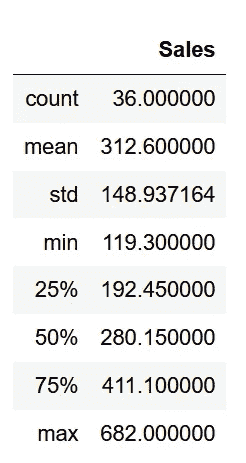

数据集的描述性统计

如您所见，通过这个简单的方法，我们获得了关于数据集大小、平均值和标准偏差、最小值和最大值的信息，以及关于其四分位数的信息。

## 形象化

数字是一个很好的起点，但是能够可视化一个时间序列可以给你快速的洞察力，这将帮助你把你的分析引向正确的方向。

当涉及到时间序列时，直方图和散点图是最广泛使用的可视化工具。

我们数据集的简单直方图可以显示为:

```
data.hist()
```

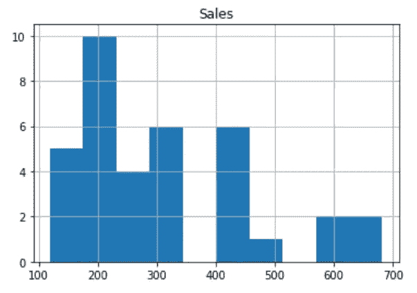

数据集的基本直方图

然而，我们可以做得更好。让我们绘制一个更好的直方图，并给这个轴添加标签。

```
plt.figure(figsize=[10, 7.5]); # Set dimensions for figureplt.hist(data['Sales'])
plt.title('Histogram of Shampoo Sales');
plt.xlabel('Shampoo Sales ($M)');
plt.ylabel('Frequency');
```

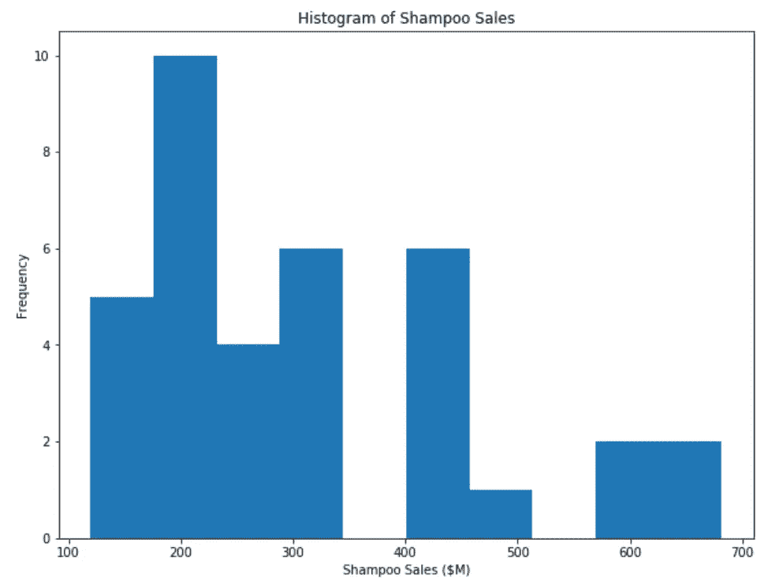

洗发水数据集的直方图

上面的直方图好多了。您可以更改许多参数来根据需要定制可视化。例如，您可以更改直方图中条柱的颜色和数量。

```
plt.figure(figsize=[10, 7.5]); # Set dimensions for figureplt.hist(data['Sales'], bins=20, color='#fcba03')
plt.title('Histogram of Shampoo Sales');
plt.xlabel('Shampoo Sales ($M)');
plt.ylabel('Frequency');
```

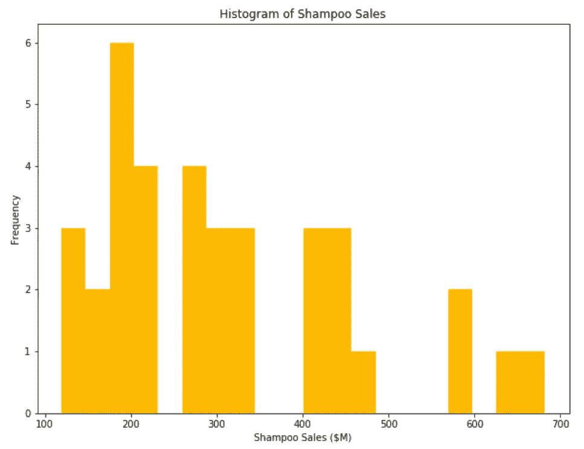

洗发水数据集的直方图

现在，您应该可以非常轻松地绘制直方图，并根据自己的需要进行定制。

最后但同样重要的是知道如何显示散点图。非常简单，我们可以像这样可视化我们的数据集:

```
plt.figure(figsize=[20, 7.5]); # Set dimensions for figuresns.scatterplot(x=data['Month'], y=data['Sales']);
plt.title('Historical Shampoo Sales');
plt.ylabel('Shampoo Sales ($M)');
plt.xlabel('Month');
```

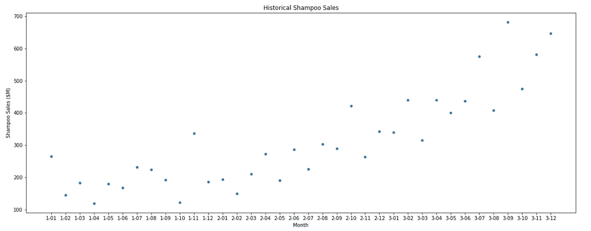

洗发水数据集的散点图

如果你想了解更多关于使用我们使用的库绘图的知识，并看看不同的参数如何改变绘图，请务必查阅 [matplotlib](https://matplotlib.org/) 或 [seaborn](https://seaborn.pydata.org/) 的文档。

# 推断统计学

【https://giphy.com/ 

顾名思义，推断统计是使用分析从数据集中推断属性。

通常，我们希望在数据集中找到一个趋势，以便进行预测。这也是我们检验不同假设的机会。

出于介绍的目的，我们将使用一个简单的线性回归来说明和解释时间序列背景下的推断统计。

## 时间序列的线性回归

在本节中，我们将使用另一个数据集来追溯大气中 CO2 的历史浓度。由于数据集跨越了 2014 年的历史，让我们只考虑 1950 年及以后的数据。

让我们应用之前所学的知识，展示我们数据的散点图。

```
# Dataset from here: [https://www.co2.earth/historical-co2-datasets](https://www.co2.earth/historical-co2-datasets)
co2_dataset = pd.read_csv('co2_dataset.csv')plt.figure(figsize=[20, 7.5]); # Set dimensions for figure# Let's only consider the data from the year 1950
X = co2_dataset['year'].values[1950:]
y = co2_dataset['data_mean_global'].values[1950:]sns.scatterplot(x=X, y=y);
plt.title('Historical Global CO2 Concentration in the Atmosphere');
plt.ylabel('CO2 Concentration (ppm)');
plt.xlabel('Year');
```

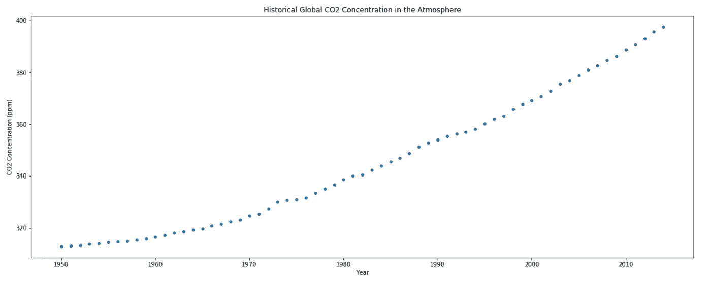

从 1950 年到 2014 年的二氧化碳浓度

如你所见，浓度似乎随着时间而增加。

虽然趋势似乎不是线性的，但它可能仍然可以解释数据的部分可变性。因此，让我们做如下假设:

*   CO2 浓度以线性方式依赖于时间，存在一些误差

在数学上，这表示为:

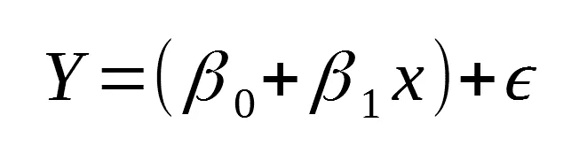

线性方程

你应该很容易把它看作一个线性方程，包含一个常数项、一个斜率和一个误差项。

重要的是要注意，在进行简单的线性回归时，要做以下假设:

*   误差呈正态分布，平均为 0
*   误差具有相同的方差(同方差)
*   这些错误互不相关

然而，在执行简单的线性回归时，这些假设在技术上都没有使用。我们不生成误差项的正态分布来估计线性方程的参数。

相反，**普通最小二乘法** (OLS)用于估计参数。这只是试图找到误差平方和的最小值:

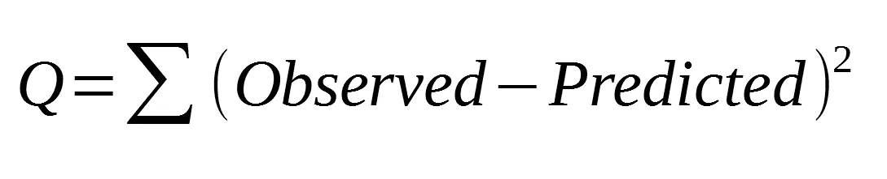

用 OLS 最小化的参数

## 线性回归在起作用

现在，让我们用一个线性模型来拟合我们的数据，并查看模型的估计参数:

```
X = co2_dataset['year'].values[1950:].reshape(-1, 1)
y = co2_dataset['data_mean_global'].values[1950:].reshape(-1, 1)reg = LinearRegression()reg.fit(X, y)print(f"The slope is {reg.coef_[0][0]} and the intercept is {reg.intercept_[0]}")predictions = reg.predict(X.reshape(-1, 1))plt.figure(figsize=(20, 8))
plt.scatter(X, y,c='black')
plt.plot(X, predictions, c='blue', linewidth=2)
plt.title('Historical Global CO2 Concentration in the Atmosphere');
plt.ylabel('CO2 Concentration (ppm)');
plt.xlabel('Year');
plt.show()
```

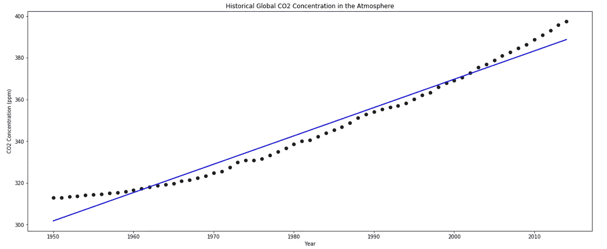

线性回归

运行上面的代码，你应该得到同样的图，你会看到斜率是 1.3589，截距是-2348。

参数有意义吗？

斜率确实是正的，这是正常的，因为浓度无疑在增加。

然而，截距是负的。这是否意味着时间 0，CO2 浓度为负？

不。我们的模型绝对不足以让我们回到 1950 年。但是这些参数是最小化误差平方和的参数，因此产生最佳的线性拟合。

## 评估模型的质量

从图中，我们可以直观地说直线不是我们数据的最佳拟合，但也不是最差的。

回想一下假设误差是正态分布的线性模型。我们可以通过绘制残差的 **QQ 图**来检验这个假设。

QQ 图是两种不同分布的分位数散点图。如果分布是相同的，那么我们会看到一条直线。

因此，如果我们绘制残差相对于正态分布的 QQ 图，我们可以看到它们是否落在一条直线上；这意味着我们的残差确实是正态分布的。

```
X = sm.add_constant(co2_dataset['year'].values[1950:])
model = sm.OLS(co2_dataset['data_mean_global'].values[1950:], X).fit()
residuals = model.resid
qq_plot = sm.qqplot(residuals, line='q')
plt.show()
```

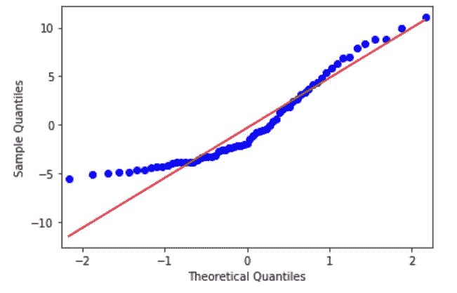

QQ-残差图

如你所见，蓝点代表残差，它们不在一条直线上。因此，它们不是正态分布的，这表明线性模型不是我们数据的最佳拟合。

这可以通过绘制残差直方图得到进一步支持:

```
X = sm.add_constant(co2_dataset['year'].values[1950:])
model = sm.OLS(co2_dataset['data_mean_global'].values[1950:], X).fit()
residuals = model.residplt.hist(residuals);
```

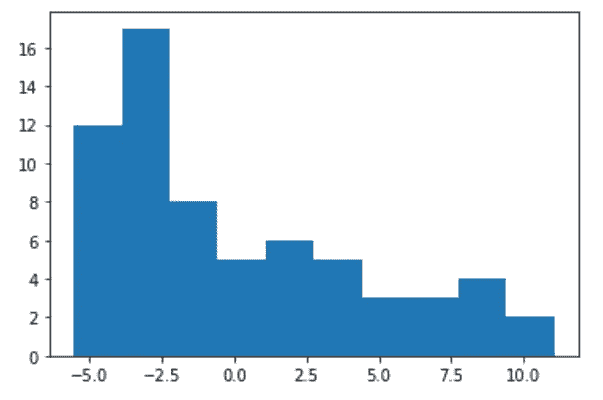

残差直方图

同样，我们可以清楚地看到它不是正态分布。

## 假设检验

推断统计学的一个主要组成部分是假设检验。这是一种确定观察到的趋势是否是由于随机性，或者是否有真正的统计意义的方法。

对于假设检验，我们必须定义一个假设和一个无效假设。假设通常是我们试图从数据中提取的趋势，而零假设恰恰相反。

让我们为我们的情况定义假设:

*   **假设**:时间与 CO2 浓度呈线性相关
*   **零假设**:时间和 CO2 浓度没有线性关系

厉害！现在，让我们使用另一个库为我们的数据集拟合一个线性模型，该库将为我们自动运行假设检验:

```
X = sm.add_constant(co2_dataset['year'].values[1950:])
model = sm.OLS(co2_dataset['data_mean_global'].values[1950:], X).fit()
print(model.summary())
```

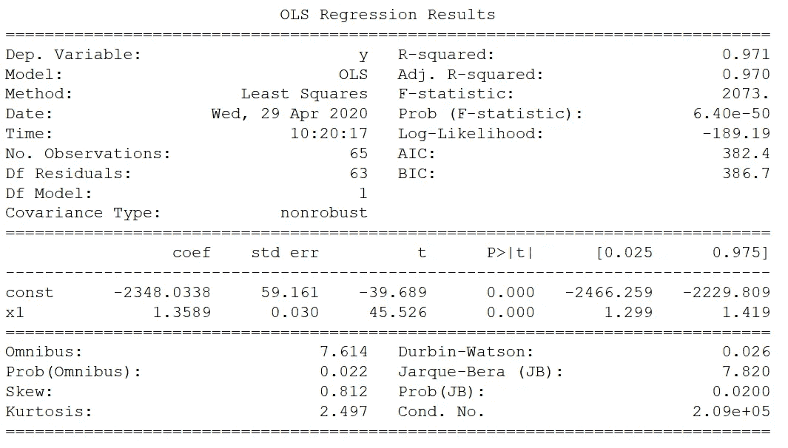

现在，这里有很多信息，但让我们只考虑几个数字。

首先，我们有一个非常高的 R 值 0.971。这意味着超过 97%的 CO2 浓度变化可以用时间变量来解释。

然后，F 统计量也很大:2073。这意味着时间和 CO2 浓度之间存在线性相关性具有统计学意义。

最后，查看斜率系数的 p 值，您会注意到它是 0。虽然该数字可能不为 0，但仍然非常小，这是存在线性相关性的另一个统计显著性指标。

通常，阈值 0.05 用于 p 值。如果小于这个值，则拒绝零假设。

因此，由于一个大的 F 统计量，结合一个小的 p 值，我们可以拒绝零假设。

就是这样！你现在处于一个非常好的位置来启动你的时间序列分析。

有了这些基本概念，我们将在它们的基础上构建更好的模型来帮助我们预测时间序列数据。

了解 Python 中时间序列分析的最新最佳实践:

*   [在 Python 中应用时间序列分析](https://www.datasciencewithmarco.com/offers/tdU2mtVK)

干杯！