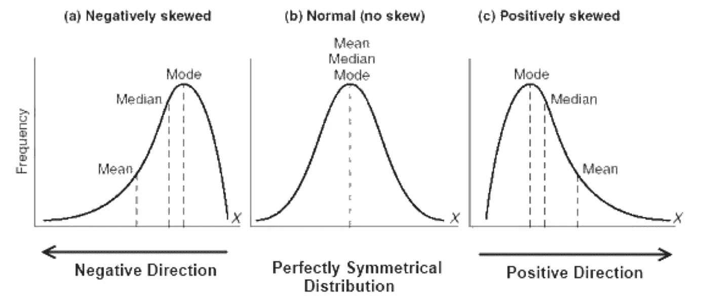
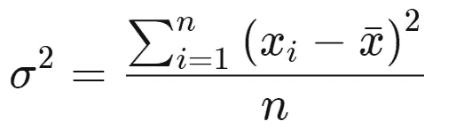
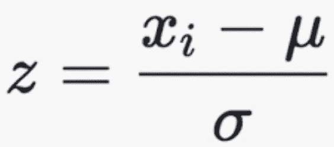
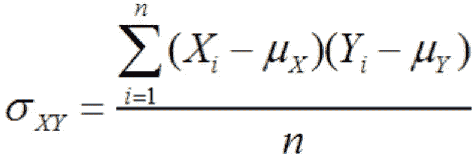
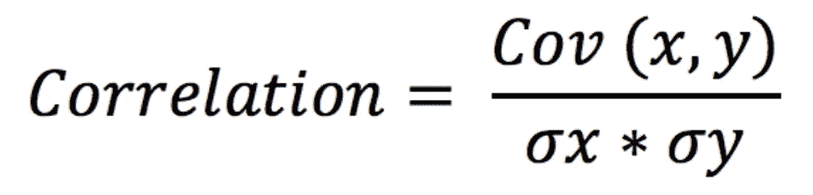
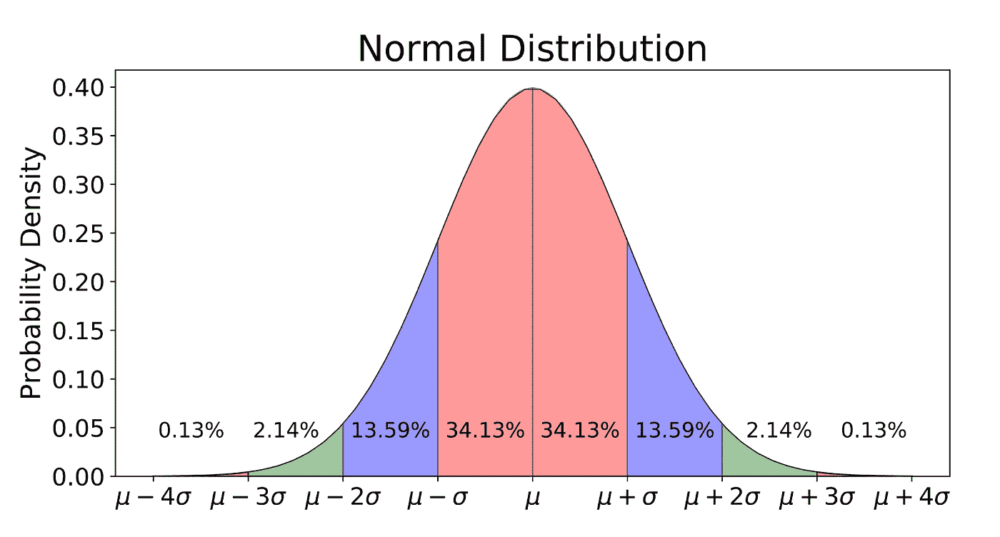
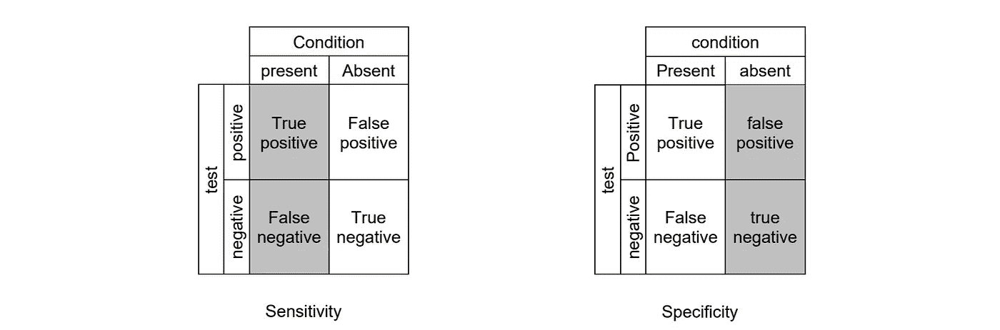
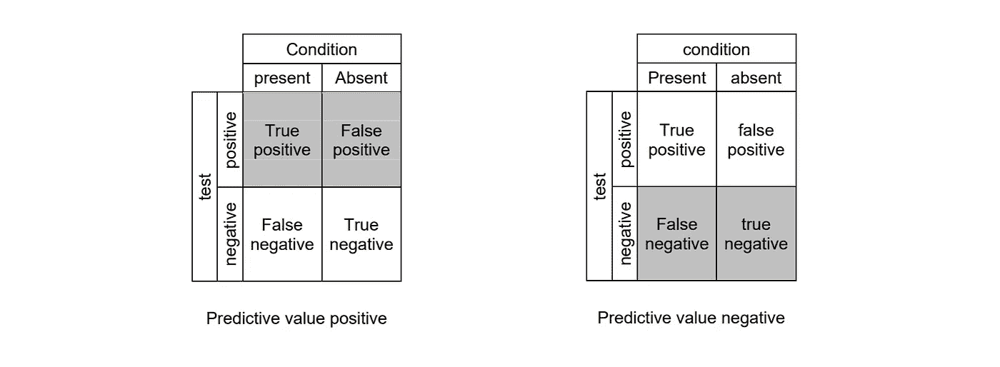

# 数据科学需要了解的基本统计数据

> 原文：<https://towardsdatascience.com/basic-statistics-you-need-to-know-for-data-science-1fdd290f59b5?source=collection_archive---------3----------------------->

## 让您开始数据科学之旅的基本统计概念

这样做的目的是全面概述统计学的基础知识，这是您开始数据科学之旅所需要的。已经有很多文章了，但我的目标是让这篇文章更简洁！

***如果你发现了这个有价值的东西，愿意支持我，就来看看*** [***我的 Patreon 页面***](https://www.patreon.com/terenceshin) ***！***

# 数据类型

**数值:**用数字表示的数据；是可以衡量的。可以是**离散的**或**连续的**。

**分类的:**将定性数据分类成类别。可以是**名义**(无顺序)也可以是**序数**(有序数据)。

# 集中趋势测量

**均值:**一个数据集的平均值。
**中位数:**有序数据集的中间；不易受离群值的影响。
**模式:**一个数据集中最常见的值；仅与离散数据相关。

# 差异量数

**范围:**数据集中最高值和最低值之差。

**方差(σ2):** 测量一组数据相对于平均值的分布程度。

**标准差(σ):** 数据集中数字分布的另一种度量；它是方差的平方根。

**Z-score:** 确定数据点偏离平均值的标准偏差数。

**R 平方:**拟合的统计测量，表明自变量解释了因变量的多少变化；仅对简单的线性回归有用。

**调整后的 R 平方:**已针对模型中预测器的数量进行调整的 R 平方的修改版本；如果新项对模型的改进超过偶然的预期，那么它就会增加，反之亦然。

# 变量之间关系的度量

**协方差:**测量两个(或多个)变量之间的方差。如果是正的，那么它们倾向于向同一个方向移动，如果是负的，那么它们倾向于向相反的方向移动，如果它们是零，那么它们彼此没有关系。

样本的分母变为(n-1)

**相关性:**衡量两个变量之间的关系强度，范围从-1 到 1；协方差的标准化版本。一般来说，+/- 0.7 的相关性代表两个变量之间的密切关系。另一方面，介于-0.3 和 0.3 之间的相关性表明变量之间几乎没有关系。

# 概率分布函数

**概率密度函数(PDF):** 连续数据的函数，其中任意点的值可以被解释为提供随机变量的值等于该样本的*相对*可能性。([维基](https://en.wikipedia.org/wiki/Probability_density_function))

**概率质量函数(PMF):** 离散数据的函数，给出给定值出现的概率。

**累积密度函数(CDF):** 告诉我们随机变量小于某个值的概率的函数；PDF 的积分。

# 连续数据分布

**均匀分布:**所有结果可能性相等的概率分布。

**正态/高斯分布:**通常称为钟形曲线，与 [**中心极限定理**](https://en.wikipedia.org/wiki/Central_limit_theorem) 有关；平均值为 0，标准偏差为 1。

**T-分布:**在样本量较小和/或总体方差未知时用于估计总体参数的一种概率分布(*参见更多* [*此处*](https://stattrek.com/probability-distributions/t-distribution.aspx) *)。*

**卡方分布:**卡方统计量的分布(*见* [*此处*](https://stattrek.com/probability-distributions/chi-square.aspx) *)。*

# 离散数据分布

**泊松分布:**概率分布，表示给定数量的事件在固定时间段内发生的概率。

**二项式分布:**一系列 n 次独立经历中成功次数的概率分布，每次经历都有自己的布尔值结果(p，1-p)。

# 朋友圈

**矩**描述了分布的性质和形状的不同方面。一阶矩是**均值，**二阶矩是**方差，**三阶矩是**偏度，**四阶矩是**峰度**。

# 可能性

**概率**是事件发生的可能性。

**条件概率[P(A|B)]** 是基于前一事件的发生，某一事件发生的可能性。

**独立事件**是其结果不影响另一事件结果概率的事件；P(A|B) = P(A)。

**互斥事件**是不能同时发生的事件；P(A|B) = 0。

**贝叶斯定理:**确定条件概率的数学公式。*“给定 B 的概率等于给定 A 的 B 的概率乘以 A 的概率超过 B 的概率”。*

# 准确(性)

**真阳性:**检测条件出现时的条件。

**真否定:**当条件不存在时，不检测条件。

**假阳性:**检测条件不存在时的条件。

**假阴性:**在条件存在时不检测条件。

**灵敏度:**又称**召回**；当条件存在时，测量测试检测条件的能力；灵敏度= TP/(TP+FN)

**特异性:**测量当条件不存在时，测试正确排除条件的能力；特异性= TN/(TN+FP)

**预测值阳性:**又称**精度**；对应于条件存在的阳性比例；PVP = TP/(TP+FP)

**预测值阴性:**对应于条件不存在的阴性比例；PVN = TN/(TN+FN)

# 假设检验和统计显著性

*查看我的文章“尽可能简单地解释假设检验”以获得更深入的解释* [*这里*](/hypothesis-testing-explained-as-simply-as-possible-6e0a256293cf) *。*

零假设:样本观察值完全来自偶然的假设。

**备选假设:**样本观测值受某种非随机原因影响的假设。

**P 值:**假设零假设正确，获得某项检验的观测结果的概率；较小的 p 值意味着有更强的证据支持替代假设。

**Alpha:** 显著性水平；当零假设为真时拒绝零假设的概率，也称为**1 型错误。**

**Beta:**2 型错误；未能拒绝虚假的零假设。

假设检验的步骤:
1。陈述零假设和替代假设
2。确定测试规模；是单尾还是双尾检验？
3。计算测试统计和概率值
4。分析结果，拒绝或不拒绝零假设(*如果 p 值大于α，不拒绝零假设！)*

就是这样！如果我发现我在旅程中错过了很多重要的话题，请随时评论并告诉我:)

> 更多类似的文章，请看 https://blog.datatron.com/的

# 感谢阅读！

如果你喜欢我的工作，想支持我…

1.  支持我的最好方式就是在**媒体**这里[关注我](https://medium.com/@terenceshin)。
2.  成为第一批在**Twitter**这里关注我的人之一。我会在这里发布很多更新和有趣的东西！
3.  此外，成为第一批订阅我的新 **YouTube 频道** [这里](https://www.youtube.com/channel/UCmy1ox7bo7zsLlDo8pOEEhA?view_as=subscriber)！
4.  关注我**LinkedIn**这里。
5.  在我的**邮箱列表** [这里](https://forms.gle/UGdTom9G6aFGHzPD9)报名。
6.  看看我的网站，[**terenceshin.com**](https://terenceshin.com/)。