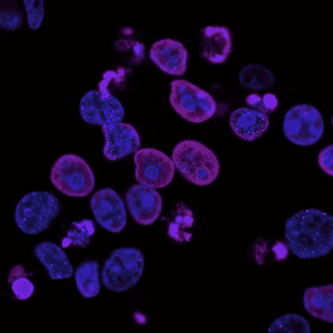
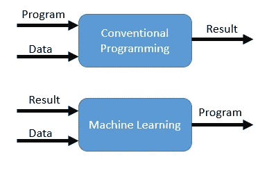

# 机器学习的基本步骤

> 原文：<https://towardsdatascience.com/basic-steps-of-machine-learning-56495730c0e5?source=collection_archive---------82----------------------->

## [内部 Ai](https://towardsdatascience.com/tagged/inside-ai)

## 透过肿瘤学的镜头

让我们开始更深入地研究机器学习的基础知识。我们将从使用机器学习背后的基本理论和我们将用于解决新问题的大纲开始。最后，我们将讨论一些常见的 ML 模型可以解决的潜在问题。

从 [NCI](https://unsplash.com/photos/L7en7Lb-Ovc) 到 [Unsplash](https://unsplash.com/)

## 为什么是机器学习？

机器学习需要一种处理问题的新方法。在传统的编程中，一个具有一些领域知识的人必须推导出一个将输入转换成期望输出的程序。在这种情况下，输入和转换是已知的。

在机器学习中，未知的是转换。也就是说，我们提供输入**和**结果输出(至少在监督学习中)。随着我们的建模变得越来越复杂，一个人通过传统的编程为所有的特性做出必要的转换变得很困难。

传统编程和机器学习之间的差异通过它们的输出凸显出来。[链接](https://medium.com/@rstefanus16/conventional-programming-vs-machine-learning-a3b7b3425531)

此外，随着我们的数据集变得越来越大和越来越复杂，人类很难在数据中识别出新的、重要的模式。但是机器更容易理解这种维度。也就是说，由于“维数灾难”，我们可以在模型中包含的特征数量是有限的。随着维度的增加，我们的点之间的距离增加，数据变得稀疏。我们将在后面讨论为什么这很重要，以及如何对抗“诅咒”。

## 我们应该如何处理一个 ML 问题？

我先说这个帖子是针对一个通用的 ML 模型的。各种模型的相对用例、优点和缺点超出了本文的范围，但是可以通过快速的 Google 搜索获得资源。[这里以](https://blogs.sas.com/content/subconsciousmusings/2017/04/12/machine-learning-algorithm-use/#:~:text=When%20most%20dependent%20variables%20are,models%20are%20appropriate%20for%20beginners.)为例。

# 1-获取数据

这可以采取多种形式。如果你能接触到电子健康记录(EHR)，那太好了。如果你有单一研究的实验数据或跨元研究的数据，那就更好了。一般来说，一开始你能检查的越多越好。在数据清理和 EDA 过程中，我们将对数据有更好的感觉，并将对包括或不包括什么做出更明智的决定。

API 是一个很好的资源。以下是一些可供选择的方法:

*   HealthData.gov:新冠肺炎、EHR、医疗保险等。
*   【HealthIT.gov】T2:EHR、全州绩效指数、临床医生流失等。
*   [Rapid API](https://rapidapi.com/collection/healthcare) :收集了一系列医疗保健相关的 API，主题广泛

# 2 —处理您的数据

一旦有了数据集合，就需要对其进行预处理，以便在机器学习模型中使用。有些模型对输入数据有非常具体的要求(比如没有遗漏条目)，所以如果适用的话，请确保阅读所选模型和包的文档。

无论型号类型如何，都需要采取一些步骤。您应该熟悉的一些流程:

1.  **处理缺失值**:您可以删除 NaN 值，估算相似子集中的中值/平均值，或者将缺失值标记为类别或选择的替代值。
2.  **删除重复条目** : Pandas 有一个 drop_duplicate()方法。
3.  **检查不一致性**:例如，如果在列中添加了额外类别的拼写错误，或者某个数值被存储为“字符串”或“对象”，请使用 df.column.dtype 进行检查
4.  **过滤掉有影响的离群值**:警告一句，你不应该删除离群值，除非它是真实存在的危险。并非所有的异常值都会影响模型的准确性。
5.  如果分类，检查**等级不平衡**。

你可能需要做的另一个过程是特性选择和工程。这可能包括为分类列创建虚拟变量、移除具有多重共线性的要素(相关变量)或创建基于其他列提供潜在新见解的新列。

> 这里有一篇很棒的[文章](/feature-engineering-for-machine-learning-3a5e293a5114)深入探讨特性工程，包括缩放、日志转换、一键编码等。

# 3 —选择一个模型

终于到了模特的时间了！同样，有许多资源可以确定哪种模型适合您的需求。这里有一个来自 [scikit-learn](https://peekaboo-vision.blogspot.com/2013/01/machine-learning-cheat-sheet-for-scikit.html) 的精彩总结。

基于我们的用例，我们需要确定我们的模型是应该利用[监督学习还是非监督学习](/supervised-vs-unsupervised-learning-14f68e32ea8d)。对于监督学习，我们试图训练一个模型，将输入正确地转换为相应的**已知的**输出。这意味着我们需要知道输出是什么，但情况并非总是如此。然后将使用无监督学习，其中我们让模型在我们的数据中找到关系。

监督学习模型的一些例子是回归和分类模型，如逻辑回归、支持向量机(SVMs)或神经网络。

对于无监督学习，我们没有已知的输出。这些模型常用于[聚类分析](/unsupervised-machine-learning-clustering-analysis-d40f2b34ae7e)和[降维](https://machinelearningmastery.com/dimensionality-reduction-for-machine-learning/)。

# 4 —培训

现在我们已经选择了一个模型，收集并处理了数据。我们准备开始训练模型。我们首先将数据集分为训练集、验证集和测试集。训练/验证/测试数据的确切比例取决于您使用的模型。具有较少功能的模型更容易调整，因此可能需要较少的验证数据。

根据你的训练计划，你将以不同的方式进行训练。像往常一样，检查文档。Scipy 和 Keras 模型有一个. fit()方法。PyTorch 要求编写自己的训练循环。

# 5 —评估

有几个[指标](/accuracy-precision-recall-or-f1-331fb37c5cb9)你可能听说过，可以用来确定你的模型是否成功:

1.  **准确度**:正确分类输出的百分比(真阳性+真阴性)
2.  **精度**:真阳性与真阳性和假阳性的比率
3.  **回忆**:真阳性与实际总阳性的比率(真阳性+假阴性)

这些乍一看都很像。在假阳性很重要的情况下，精确度很重要。在假阴性很重要的情况下，回忆很重要。一如既往，牢记您的业务理解和目标应该推动您的评估指标。

我警告不要把准确性作为你的主要或者唯一的评估标准。举个例子，假设你正在开发一个模型来预测一个病人是否患有一种只影响 0.01%人口的罕见疾病。由于大类不平衡，我们的模型每次都会预测“无病”！那将会有 99.99%的**准确度**！但是，你可以猜到，这不是一个有用的模型。

关于使用验证集优化模型的说明。当您迭代地改进您的模型时，请注意一遍又一遍地针对您的验证集进行测试将会导致过度适应该验证集，并且模型将不会很好地推广到新的数据(实际的测试集)。解决这个问题的一种方法是使用合成方法，通过交叉验证来“洗牌”训练和验证集，如 k-fold 交叉验证。简而言之，您将训练数据的不同子集视为该单次拟合的验证集，然后再进行下一次拟合。

> 这是机器学习计算机视觉的一个伟大而幽默的应用:[吉娃娃还是松饼](https://www.freecodecamp.org/news/chihuahua-or-muffin-my-search-for-the-best-computer-vision-api-cbda4d6b425d/)？

# 6 —调谐

在我们开始之前，我们必须划分参数和超参数。参数是**模型本身**使用误差最小化和梯度下降来改变不同特征的权重和偏差。

超参数是**人类用户**可以改变的，例如，改变模型经历的迭代次数、改变学习速率、隐藏层的数量和组成、丢弃、优化器和损失函数等。这些超参数是我们实际调整模型的方式。经过大量的耐心和反复试验，我们可以找到一个更好的设置来获得更好的指标。请记住，根据我们的目标，*推理*或*预测*，这个过程可能看起来非常不同。也许我们需要增加复杂性来提高准确性，或者我们需要去除复杂性来使我们的模型更容易解释(例如，更少的黑箱)。

> 这里有一些[资源](/hyperparameter-optimization-with-keras-b82e6364ca53)来深入研究[调优](/model-parameters-and-hyperparameters-in-machine-learning-what-is-the-difference-702d30970f6)。

# 7 —预测

现在我们已经训练和调整了我们的模型，我们可以开始进行预测了！这就是我们一直在建设的。我们确切的预测显然取决于我们的模型是什么。也许使用一个 [CNN](https://www.ncbi.nlm.nih.gov/pmc/articles/PMC7119277/#:~:text=In%20this%20paper%2C%20we%20introduced,cancer%20types%20or%20as%20normal.) 通过输入组织切片来预测癌症的存在。或者使用 EHR 记录开发一个[分类模型](https://www.ajmc.com/journals/issue/2020/2020-vol26-n1/predicting-hospitalizations-from-electronic-health-record-data)来预测患者住院情况。

# 回顾一下我们的流程

*   收集和准备您的数据
*   选择型号
*   训练、评估、调整、重复
*   预测！

因此，现在你可以在头脑中有计划地进行数据科学研究了！请记住，这不是一个线性的过程，你应该为你的目标尽可能多地重复这些步骤。

我之前关于机器学习在肿瘤学中的应用的文章可以在这里找到—

 [## 机器学习和人工智能在肿瘤学中的应用

### 肿瘤学的最新进展为癌症治疗和长期缓解带来了令人兴奋的选择。然而…

towardsdatascience.com](/machine-learning-ai-applications-in-oncology-73a8963c4735)