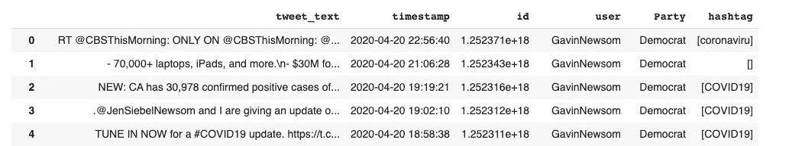
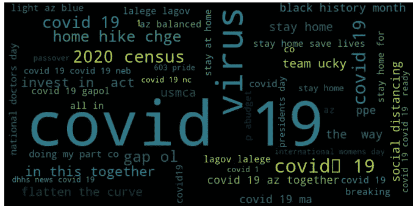
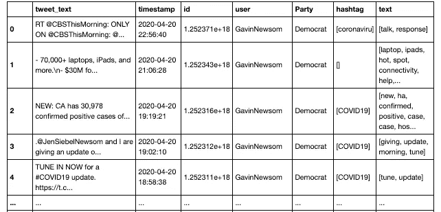

# Python 中的基本 Tweet 预处理

> 原文：<https://towardsdatascience.com/basic-tweet-preprocessing-in-python-efd8360d529e?source=collection_archive---------3----------------------->

## 推文预处理！

## 了解如何使用 Python 预处理推文


[https://hdqwalls.com/astronaut-hanging-on-moon-wallpaper](https://hdqwalls.com/astronaut-hanging-on-moon-wallpaper)

***编者注:*** [*走向数据科学*](http://towardsdatascience.com/) *是一份以研究数据科学和机器学习为主的中型刊物。我们不是健康专家或流行病学家，本文的观点不应被解释为专业建议。想了解更多关于疫情冠状病毒的信息，可以点击* [*这里*](https://www.who.int/emergencies/diseases/novel-coronavirus-2019/situation-reports) *。*

只是为了给你一点背景，为什么我要预处理推文:鉴于截至 2020 年 5 月的当前形势，我对美国州长关于正在进行的*的政治话语感兴趣。我想分析一下两个政党——共和党&民主党对给定的形势做出了怎样的反应，新冠肺炎。他们此时的主要目标是什么？谁更关注什么？他们最关心的是什么？*

*在收集了从新冠肺炎案例 1 的第一天开始的各州州长的推文后，我们将它们合并成一个数据帧[(如何将各种 JSON 文件合并成一个数据帧)](https://medium.com/@shahparthvi22/merge-multiple-json-files-to-a-dataframe-5e5421c40d06)并进行预处理。*

*我们总共收到了大约 3 万条推文。一条推文包含了很多关于它所代表的数据的观点。未经预处理的原始推文是高度非结构化的，包含冗余信息。为了克服这些问题，通过采取多个步骤来执行 tweets 的预处理。*

*几乎每个社交媒体网站都因其以标签形式表现的主题而闻名。特别是对我们来说，标签起了重要作用，因为我们对#Covid19、#冠状病毒、#StayHome、#InThisTogether 等感兴趣。因此，第一步是基于 hashtag 值形成一个单独的特征，并对它们进行分段。*

# ***1。使用正则表达式提取 hashtag***

## *作为新功能“hashtag”添加到新列的所有 hashtag 的列表*

```
*tweets[‘hashtag’] = tweets[‘tweet_text’].apply(lambda x: re.findall(r”#(\w+)”, x))*
```

**

*提取标签后*

*然而，超过一个单词的标签必须分段。我们使用库 ***ekphrasis 将这些标签分割成 n 个单词。****

```
*#installing ekphrasis
!pip install ekphrasis*
```

*安装完成后，我选择了一个基于 twitter 语料库的分割器*

```
*from ekphrasis.classes.segmenter import Segmenter#segmenter using the word statistics from Twitter
seg_tw = Segmenter(corpus=”twitter”)*
```

*我找到的最相关的 tweet-preprocessor—***tweet-preprocessor****，*这是 Python 中的一个 tweet 预处理库。*

*它处理—*

*   *资源定位符*
*   *提及*
*   *保留字(RT，FAV)*
*   *表情符号*
*   *笑脸消除(游戏名)*

```
*#installing tweet-preprocessor
!pip install tweet-preprocessor*
```

# *2 .文本清理(URL、提及等。)*

## *将清理后的(删除网址和提及后的)推文添加到一个新列，作为新功能“文本”*

*清理是使用***tweet-preprocessor***包完成的。*

```
*import preprocessor as p#forming a separate feature for cleaned tweets
for i,v in enumerate(tweets['text']):
    tweets.loc[v,’text’] = p.clean(i)*
```

# *3.标记化、删除数字、停用词和标点符号*

## *新特征“文本”的进一步预处理*

*NLTK(自然语言工具包)是预处理文本数据的最佳库之一。*

```
*#important libraries for preprocessing using NLTK
import nltk
from nltk import word_tokenize, FreqDist
from nltk.corpus import stopwords
from nltk.stem import WordNetLemmatizer
nltk.download
nltk.download('wordnet')
nltk.download('stopwords')
from nltk.tokenize import TweetTokenizer*
```

*   *去掉数字，降低文字高度(便于处理)*

```
*data = data.astype(str).str.replace('\d+', '')
lower_text = data.str.lower()*
```

*   *删除标点符号*

```
*def remove_punctuation(words):
 new_words = []
 for word in words:
    new_word = re.sub(r'[^\w\s]', '', (word))
    if new_word != '':
       new_words.append(new_word)
 return new_words*
```

*   *词汇化+标记化—使用内置的 TweetTokenizer()*

```
*lemmatizer = nltk.stem.WordNetLemmatizer()
w_tokenizer = TweetTokenizer()def lemmatize_text(text):
 return [(lemmatizer.lemmatize(w)) for w in \
                                     w_tokenizer.tokenize((text))]*
```

*最后一个预处理步骤是*

*   *删除停用字词—有一个预定义的英文停用字词列表。但是，您可以像这样修改停用字词，只需将这些字词附加到停用字词列表中。*

```
*stop_words = set(stopwords.words('english'))tweets['text'] = tweets['text'].apply(lambda x: [item for item in \ 
                         x if item not in stop_words])*
```

# *4.词云*

## *分段标签的频率分布*

*在预处理步骤之后，我们排除了推文中的所有地名和缩写，因为它充当了泄漏变量，然后我们对最常出现的标签进行了频率分布，并创建了一个词云—*

**

*这是意料之中的。*

```
*from wordcloud import WordCloud#Frequency of words
fdist = FreqDist(tweets['Segmented#'])#WordCloud
wc = WordCloud(width=800, height=400, max_words=50).generate_from_frequencies(fdist)
plt.figure(figsize=(12,10))
plt.imshow(wc, interpolation="bilinear")
plt.axis("off")
plt.show()*
```

*最终的数据集—*

**

*最终的代码—*

```
*import pandas as pd
import numpy as np
import json
from collections import Counter
from wordcloud import WordCloud
import matplotlib.pyplot as plt
import re, string, unicodedata
import nltk
from nltk import word_tokenize, sent_tokenize, FreqDist
from nltk.corpus import stopwords
from nltk.stem import LancasterStemmer, WordNetLemmatizer
nltk.download
nltk.download('wordnet')
nltk.download('stopwords')
from nltk.tokenize import TweetTokenizer!pip install ekphrasis
!pip install tweet-preprocessor
import preprocessor as ptweets['hashtag'] = tweets['tweet_text'].apply(lambda x: re.findall(r"#(\w+)", x))for i,v in enumerate(tweets['text']):
    tweets.loc[v,’text’] = p.clean(i)def preprocess_data(data):
 #Removes Numbers
 data = data.astype(str).str.replace('\d+', '')
 lower_text = data.str.lower()
 lemmatizer = nltk.stem.WordNetLemmatizer()
 w_tokenizer =  TweetTokenizer()

 def lemmatize_text(text):
  return [(lemmatizer.lemmatize(w)) for w \
                       in w_tokenizer.tokenize((text))] def remove_punctuation(words):
  new_words = []
   for word in words:
      new_word = re.sub(r'[^\w\s]', '', (word))
      if new_word != '':
         new_words.append(new_word)
   return new_words words = lower_text.apply(lemmatize_text)
 words = words.apply(remove_punctuation)
 return pd.DataFrame(words)pre_tweets = preprocess_data(tweets['text'])
tweets['text'] = pre_tweetsstop_words = set(stopwords.words('english'))
tweets['text'] = tweets['text'].apply(lambda x: [item for item in \
                                    x if item not in stop_words])from ekphrasis.classes.segmenter import Segmenter# segmenter using the word statistics from Twitter
seg_tw = Segmenter(corpus="twitter")
a = []
for i in range(len(tweets)):
 if tweets['hashtag'][i] != a
  listToStr1 = ' '.join([str(elem) for elem in \
                                       tweets['hashtag'][i]])
  tweets.loc[i,'Segmented#'] = seg_tw.segment(listToStr1)#Frequency of words
fdist = FreqDist(tweets['Segmented#'])
#WordCloud
wc = WordCloud(width=800, height=400, max_words=50).generate_from_frequencies(fdist)
plt.figure(figsize=(12,10))
plt.imshow(wc, interpolation="bilinear")
plt.axis("off")
plt.show()*
```

*希望我帮到你们了。*

*如果文本预处理得好，文本分类通常会工作得更好。一定要给它一些额外的时间，最终一切都是值得的。*