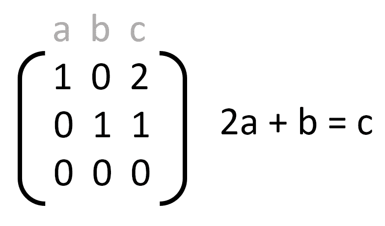
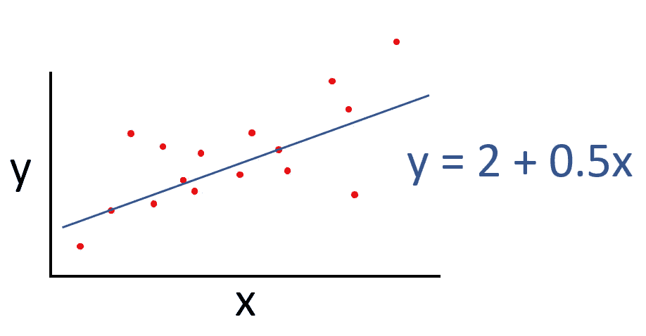
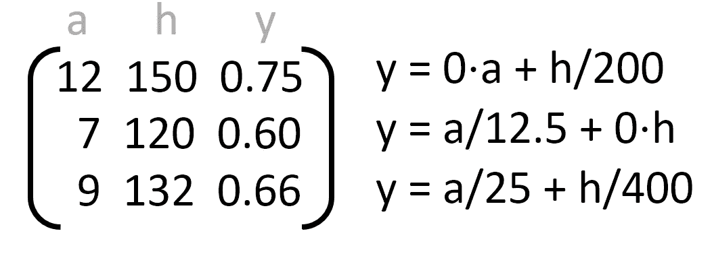

# 基础:多重共线性和可解释性

> 原文：<https://towardsdatascience.com/basics-multicollinearity-and-interpretability-3dfef2168efc?source=collection_archive---------33----------------------->

## 鲁莽的数据科学家的基本错误之一。

马库斯·斯皮斯克在 [Unsplash](https://unsplash.com?utm_source=medium&utm_medium=referral) 上的照片

多重共线性是数据集的一种属性，它可能会给您带来对模型和数据的意外、不稳定但在技术上并非错误的解释。在进行回归分析之前检查多重共线性(为简洁起见，以下简称为 MC)有助于确保从数据中获得最大的洞察力，并且不会忽略重要的关系。

多重共线性的例子。

数据中的 MC 意味着数据表中的多列(即特征、预测值、输入变量)是*线性* *依赖*。换句话说，数据表中存在可以表示为其他列的线性组合的列。您的数据矩阵 *X* 不是满秩的。

我将在线性模型的上下文中证明 MC 的重要性。这个问题也延伸到非线性模型，但只是不容易暴露，因为需要复杂的[解释方法](/why-how-interpretable-ml-7288c5aa55e4)来解释这种模型。

线性模型(如线性回归)以*可解释*而闻名，这意味着与复杂的非线性模型(如神经网络)不同，很容易看出输入与输出之间的关系。您只需读出系数:系数的幅度和符号直接对应于相关特性对输出的影响。

通常，数据分析师通过应用线性回归并检查回归系数，使用该属性来量化两个或多个列的关系。

线性回归模型使得 x 和 y 的关系很容易看出。

*MC 通过引入模糊性破坏了线性回归的可解释性。*在 MC 数据集中，输出不仅可以表示为列的唯一线性组合，还可以等价地表示为其共线列的组合。

以一个虚构的玩具为例，它预测孩子的阅读能力( *y* )是其年龄( *a* )和身高( *h* )的函数。让我们假设年龄和身高在我们的数据中完全相关，如下例所示。现在我们可以将 *y* 等效表示为:

阅读能力 y、年龄 a 和身高 h(单位:厘米)的数据集示例。

这三个表达式都是正确的，但是它们导致对数据中的关系的非常不同的解释。在第一种情况下，我们可以得出结论，身高是阅读能力的唯一预测因素，年龄没有任何作用。在最后一种情况下，我们可能倾向于假设身高和年龄都是预测阅读能力所需要的。

看待这个问题的另一种方式是，多共线性矩阵不是满秩的。非满秩矩阵 X 是不可逆的。还有，(X^T)X 是不可逆的。线性回归的解析最小二乘解需要 X^T)X 的精确反演，因此它对于多共线性矩阵是不存在的。对于“几乎”MC 矩阵，问题是[病态](https://en.wikipedia.org/wiki/Condition_number)。

到目前为止，我们考虑了一些列是其他列的*精确*线性组合的情况。在实践中，这种情况可以忽略不计，因为如果我们使用真实(即有限和有噪声的)数据，这种精确的关系实际上永远不会出现。但是，即使列只是近似共线，我们仍然有一个可解释性的问题。我们的模型在固定数据集上可能相当稳定，但对数据中的微小变化仍然敏感。添加或删除一些样本可以使我们的模型从依赖一组特征“跳到”另一组特征——就像以前一样。

如前所述，MC 不仅会妨碍*线性*模型的可解释性，还会影响非线性模型及其解释方法，如[输入梯度](https://arxiv.org/pdf/1312.6034.pdf)、[逐层相关性传播](/indepth-layer-wise-relevance-propagation-340f95deb1ea)，或[综合梯度](https://arxiv.org/pdf/1703.01365.pdf)。这是因为不确定性不在于所使用的解释方法，而在于数据，因此也就在于可以从中学习的模型。

现在您已经了解了多重共线性的概念和后果，您可能想知道如何在数据中检测它以及如何补救它的影响。这些步骤超出了我想在这篇文章中传达的基本内容，但是我建议看看在维基百科上收集的有用的方法列表。

希望你学到了有用的东西！