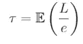
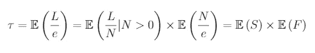
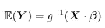
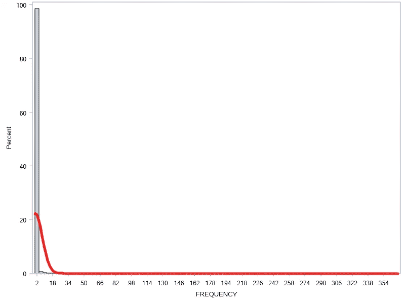

# 保险定价基础

> 原文：<https://towardsdatascience.com/basics-of-insurance-pricing-47243c2630b9?source=collection_archive---------4----------------------->

## 快速介绍 GLM 模特


布雷特·乔丹在 [Unsplash](https://unsplash.com/) 上的照片

# **简介**

在这篇文章中，保险定价的基础知识将被解释:为什么定价如此重要，如果定价策略不一致会发生什么，以及保险公司如何使用统计模型设定他们的保费。在最后一节中，我们将使用真实的保险数据进行一个非常简单的案例研究，以充实导言中的思想。

## **为什么定价很重要**

保险业是一个关注对冲不确定财务损失风险的行业，因此保险公司的业务在很大程度上是一项风险管理工作。被保险人通过一份被称为保险单的合同与保险公司交易未来风险以获得固定的保费，如果保单持有人遭受损失，他们可以在保单允许的情况下向保险公司提出索赔。保费是由保险公司在任何索赔之前设定的，因此，公司预测客户的风险以设定有利可图的保费是至关重要的。考虑到这一点，预测模型在保险公司广泛使用就不足为奇了；无论是评估客户还是设定保费。

作为一个例子来强调有一个深思熟虑的定价策略的重要性，假设有两家保险公司，A 和 B，A 有相对于损失风险的低保费，而 B 有相对于风险的适当保费。在这种情况下，高风险客户会选择 A，因为他们的保费与 B 相比相对较低，因此 A 会吸引高风险客户，实际上看到他们的利润被吃掉。相反，如果 A 的保费太高，他们不会吸引任何有利可图的客户，仍然亏损。根据这个简单的例子，我们明白了为什么有竞争力的定价策略是至关重要的。

此外，根据埃森哲金融服务公司 2017 年全球分销和营销消费者调查，对 18 个市场的 32，715 名保险客户的研究发现，价格是客户忠诚度的头号驱动因素，52%的汽车保险客户选择价格作为他们的首要杠杆。


作者图片

## **保险公司如何制定保费？**

如上所述，保险费是根据客户的风险确定的，以确保客户的损失得到补偿。然而，这并不代表最终价格的全部。像任何其他业务一样，保险公司有自己的成本，并通过运营来盈利。因此，保费不仅要弥补客户的损失，还要弥补成本，保持可观的利润。

尽管如此，保费的基础是根据客户的风险选择保费。要做到这一点，必须估计客户寻求保险的风险。根据我们考虑的保险产品，使用不同的解释变量，通常分为两组:*主题变量*，涉及购买保险的人，和*客体变量*，涉及被保险的客体；无论是房子、汽车或任何其他可保物品。例如，在家庭保险中，精算师可以使用诸如财产的居住面积、家庭中居住的人数或投保者的年龄等变量。潜在的假设是，这些变量和风险之间存在相关性，这种相关性看起来当然不同，但作为一个例子，财产保险的风险通常随着承保人的年龄而降低，因为年老通常意味着更加注意和小心。

**什么是风险？**

在保险术语中，风险是有害的或意想不到的事情发生的可能性。这可能涉及贵重财产和物品的丢失、被盗或损坏，也可能涉及有人受伤。从统计学的角度来看，风险可以定义为:



其中 *L* 为损失， *e* 为保险有效期(敞口)。如果我们假设索赔的大小与索赔的频率无关，我们可以进行如下扩展:



其中 *N* 是索赔的数量， *S* 是索赔的严重性或规模， *F* 是索赔频率。

**评估风险的方法**

精算师使用统计方法来估计风险并不奇怪，直到 20 世纪 80 年代，精算师都依赖线性回归来模拟风险，但由于建立了一个称为广义线性模型(GLM)的模型，这种情况发生了变化。GLM 相对于简单的线性回归的优势在于，GLM 模型通过所谓的*链接函数*(下面等式中的 g)*允许非线性相关性。*



其中 *Y* 为因变量， *X* 为自变量，β为回归拟合的参数。请注意，如果没有链接函数，表达式将只是简单的线性回归。

今天，大多数保险公司的保费是使用 GLM 模型来确定的，它们在一定程度上已经成为精算师的舒适区。然而，近年来，由于技术突破和许多行业大数据的实现，在业务应用中使用机器学习(ML)的普及程度出现了激增，保险业也不例外。当在保险业中使用 ML 模型时，记住 GDPR 是很重要的，因为它对模型的可解释性提出了要求。因此，易于解释的基于树的模型通常受到青睐，甚至被证明在保险数据上比传统的 GLMs 具有更好的预测准确性(见[https://arxiv.org/abs/1904.10890](https://arxiv.org/abs/1904.10890))。

**建模假设**

在任何模型中，必须对数据的性质和使用的变量做出假设。我们已经遇到了保险风险模型中常见的一个假设，即客户索赔的严重程度和频率是独立的。利用这一假设，精算师建立了两个模型，一个是严重性模型，一个是频率模型，然后将两个模型的预测结合起来，得出风险估计值。但是，这不是一个必要的假设，因为风险也可以直接建模。无论作出何种决定，因变量，无论是风险、严重程度还是频率，总是假定遵循已知的统计分布。例如，客户提交的索赔数量通常被假定为按照泊松分布分布，而严重性通常遵循伽马分布。当精算师直接对风险建模时，通常选择所谓的 Tweedie 分布。

# **案例分析:从理赔数据到风险预测**

这里的一个例子是建立一个频率模型的家庭保险数据使用统计软件 R。

首先，我们看看手头的数据，索赔数量是我们的因变量，我们通过直方图将其可视化，以查看它遵循什么分布，并获得问题的概述:



显然，索赔数量严重倾斜，因为大多数客户没有任何索赔，所以我们看到峰值为零。这激发了为什么使用泊松分布可能是一个好主意，通过调整泊松分布中的λ参数，可以捕获这种偏斜。

建模的第一步是清理数据并选择要使用的要素。完成这些后，我们可以对数据进行 GLM 拟合。

首先，我们将数据读入 R，并将其分成训练/测试集:

```
Frequency_data <- read.csv("C:/Users/Samuel Tober/Desktop/Projects/Data/Frequency_data.csv")set.seed(123) #Set seed for reproducibility
sample <- sample.split(Frequency_data, SplitRatio = 0.80) #Split data into 80% training 20% test
train = subset(Frequency_data, sample==TRUE)
test = subset(Frequency_data, sample==FALSE)
```

然后，我们使用“glm”软件包将 GLM 模型拟合到训练数据:

```
model <- glm('NO_CLAIM_NOT_NULL ~ NO_INSUR + AGE_INSUR_PERS +                                    LIVE_AREA + offset(log(EXP_COV))', family = poisson(link = "log"),         data = train)
```

在这里，我们将索赔数量(NO_CLAIM_NOT_NULL)建模为家庭人数(NO_INSUR)、客户年龄(AGE_INSUR_PERS)和房产居住面积(LIVE_AREA)的函数。请注意，我们在 GLM 模型中包含了风险敞口(EXP_COV)作为补偿，这样我们就可以对比率数据使用泊松回归(泊松通常仅适用于计数数据)。此外，我们指定 link = "log "，其中 link 指的是前面提到的链接函数 g，我们选择对数，因为我们处理的是泊松分布数据。

接下来，我们使用均方误差(MSE)和平均绝对误差(MAE)作为度量标准来测试和评估该模型(有更合适的度量标准，如泊松偏差，但这里我们选择一个简单易懂的度量标准用于教育目的，在未来的文章中有更多关于度量标准的信息):

```
pred <- exp(predict(model, test))
MSE <- sqrt(mean((test$NO_CLAIM_NOT_NULL - pred*test$EXP_COV)^2)) #Mean squared error
MAE <- sum(abs(test$NO_CLAIM_NOT_NULL - pred*test$EXP_COV))/nrow(test) #Mean absolute error> MSE = 0.182480104096452
> MAE = 0.0582112950956896
```

有了这个模型，我们现在可以预测保险客户的索赔频率，如果我们同样建立一个严重性模型，我们在频率-严重性独立性假设下得到一个完全成熟的定价模型。

请注意，这是一个极其简化的示例，请参考[https://www . casact . org/pubs/monographs/papers/05-gold burd-Khare-tevet . pdf](https://www.casact.org/pubs/monographs/papers/05-Goldburd-Khare-Tevet.pdf)和/或【https://link.springer.com/book/10.1007/978-3-642-10791-7】获取 GLM 模式的更多解释和展示。