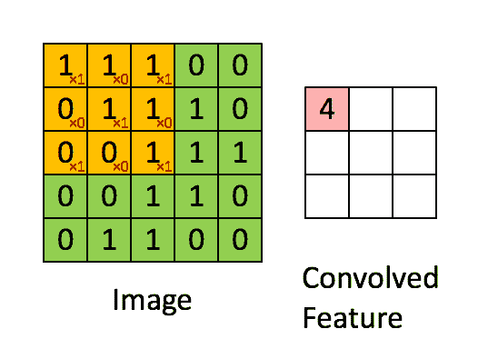

# OpenCV 内核和卷积的基础知识

> 原文：<https://towardsdatascience.com/basics-of-kernels-and-convolutions-with-opencv-c15311ab8f55?source=collection_archive---------4----------------------->

## 如何使用 Python 和 OpenCV 将简单的内核应用于图像

我一直在尝试用 Python 和 OpenCV 学习计算机视觉，我总是偶然发现术语*内核*和*卷积*。


[图片来自 JESHOTS](https://pixabay.com/photos/laptop-woman-education-study-young-3087585/)

起初，我试图依靠那些 gif 和一些简短的解释，但我经常对它们的使用感到困惑，所以我决定更好地看看它。

在这篇文章中，我将分享我对内核和卷积的一些了解，同时探索它的一些主要应用，如模糊，锐化，提取和腐蚀。

## 核和卷积

和我一样，你可能觉得这和玉米有关系，其实没有。


[身份](https://en.wikipedia.org/wiki/Identity_function)内核——用[碳](https://carbon.now.sh/)制成的图片

计算机视觉中的核是矩阵，用于在我们的数据中执行某种卷积。让我们试着分解一下。

卷积是两个函数之间创建第三个函数的数学运算。在图像处理中，它通过遍历每个像素来执行与该像素及其邻居的计算。

内核将定义卷积的大小、应用于卷积的权重以及通常位于中心的锚点。

因此，在 3×3 矩阵中，每个像素只受其周围像素的影响，而 7×7 的像素会改变它。


[高斯模糊](https://en.wikipedia.org/wiki/Gaussian_blur)

好的，那么要把它应用到一个图像上，我们会:用它的定位点把它定位在一个给定的像素上，在核的值和像素的值之间执行一些操作，为那个像素定义一个新的值，然后移动到下一个。



图片来源:[https://giphy.com/gifs/blog-daniel-keypoints-i4NjAwytgIRDW](https://giphy.com/gifs/blog-daniel-keypoints-i4NjAwytgIRDW)

总结:

*   我们可以通过与图像的像素交互来过滤和修改图像；
*   这种相互作用可能发生在盘旋时；
*   这些卷积使用核来描述像素将如何受到影响；
*   内核表示每个操作的区域、值/权重和锚点；

## 亲自动手

说得够多了，让我们看看如何使用这些内核。
我们将使用 OpenCV、Numpy 和 Matplotlib。

```
import cv2
import numpy as np
import matplotlib.pyplot as plt
```

导入库后，我们可以绘制原始图像，这样我们就知道发生了什么变化。

```
image = cv2.imread('Images/6.jpg')
image = cv2.cvtColor(image, cv2.COLOR_BGR2RGB)fig, ax = plt.subplots(1, figsize=(12,8))
plt.imshow(image)
```


[雅典艺术学院——拉斐尔](https://www.pexels.com/photo/nativity-painting-of-people-inside-a-dome-159862/)

酷，现在让我们做一个模糊图像的内核。我们将使用 Numpy 构建一个 3x3 的 1 矩阵，然后除以 9。


[https://en . Wikipedia . org/wiki/Kernel _(image _ processing)](https://en.wikipedia.org/wiki/Kernel_(image_processing))

```
>>> kernel = np.ones((3, 3), np.float32) / 9
>>> kernel
...
array([[0.11111111, 0.11111111, 0.11111111],
       [0.11111111, 0.11111111, 0.11111111],
       [0.11111111, 0.11111111, 0.11111111]], dtype=float32)
```

我们可以用. filter2D 把它应用到图像上。

```
img = cv2.filter2D(image, -1, kernel)fig, ax = plt.subplots(1, figsize=(12,8))
plt.imshow(img)
```


框模糊。

让我们用一个锐化的内核来尝试一下。


[https://en . Wikipedia . org/wiki/Kernel _(image _ processing)](https://en.wikipedia.org/wiki/Kernel_(image_processing))

```
kernel = np.array([[0, -1, 0],
                   [-1, 5, -1],
                   [0, -1, 0]])
```


锐化。

通过使用. filter2D，我们可以使用任何我们想要的内核来应用线性过滤器。但是也有更舒适的方式来达到这些结果。

## 简单的方法

OpenCV 有一些方便的函数来过滤图像，很多时候你甚至不需要定义内核。

我们可以利用。模糊应用一个框模糊，我们只需要传递图像和内核的大小。

```
image = cv2.imread('Images/6.jpg')
**image = cv2.blur(img, (5,5))**
image = cv2.cvtColor(image, cv2.COLOR_BGR2RGB)fig, ax = plt.subplots(1, figsize=(12,8))
plt.imshow(image)
```


框模糊。

高斯模糊和中值模糊:

```
image = cv2.imread('Images/6.jpg')
image = cv2.cvtColor(image, cv2.COLOR_BGR2RGB)fig, ax = plt.subplots(1, figsize=(12,16))ax = plt.subplot(211)
g = **cv2.GaussianBlur(image, (3,3), 0)**
plt.imshow(g)ax = plt.subplot(212)
m = **cv2.medianBlur(image, 3)**
plt.imshow(m)
```


高斯和中值模糊。

## 膨胀和腐蚀

内核还可以帮助放大和侵蚀图像——这在处理图片和文本时似乎很有用。

```
image = cv2.imread('Images/9.png')# convert to black and white
image = cv2.cvtColor(image, cv2.COLOR_BGR2GRAY) 
r ,image = cv2.threshold(image, 150, 255, cv2.THRESH_BINARY)# create kernel
kernel = np.ones((5,5), np.uint8)fig, ax = plt.subplots(1, figsize=(16,12))# original
ax = plt.subplot(232)
plt.imshow(image, cmap='Greys')
plt.title('original')# erosion
e = cv2.erode(image, kernel)
ax = plt.subplot(234)
plt.imshow(e, cmap='Greys')
plt.title('erosion')# dilation
d = cv2.dilate(image, kernel)
ax = plt.subplot(235)
plt.imshow(d, cmap='Greys')
plt.title('dilation')# morphological gradient (dilation - erosion)
m = cv2.morphologyEx(image, cv2.MORPH_GRADIENT, kernel)
ax = plt.subplot(236)
plt.imshow(m, cmap='Greys')
plt.title('dilation - erosion')
```


图片作者[赫尔巴努](https://pixabay.com/vectors/thank-card-text-writing-lettering-3148710/)

在该应用中，核是定义所应用效果的形状和范围的结构化元素。即使您必须创建一个矩阵，OpenCV 也有一些功能来简化这个过程。


[https://docs . opencv . org/trunk/d9/d61/tutorial _ py _ morphology _ ops . html](https://docs.opencv.org/trunk/d9/d61/tutorial_py_morphological_ops.html)

内核和卷积比我预期的要简单得多，也更容易理解为什么它们在图像处理中被如此广泛地使用，以及它们如何增加复杂性以支持图像分类、对象检测等任务。

感谢阅读我的文章。我希望你能更清楚地了解卷积是如何使用内核来执行运算的。

**资源:** [OpenCV 2D 滤镜](https://docs.opencv.org/2.4/doc/tutorials/imgproc/imgtrans/filter_2d/filter_2d.html)；
[OpenCV 平滑](https://docs.opencv.org/2.4/doc/tutorials/imgproc/gausian_median_blur_bilateral_filter/gausian_median_blur_bilateral_filter.html)；
[OpenCV 过滤](https://docs.opencv.org/2.4/modules/imgproc/doc/filtering.html?highlight=bilateralfilter)；
[OpenCV 形态变换](https://docs.opencv.org/trunk/d9/d61/tutorial_py_morphological_ops.html)；

**更进一步:**
[OpenCV 去噪](https://docs.opencv.org/2.4/modules/photo/doc/denoising.html)；
[OpenCV 边缘检测](https://docs.opencv.org/trunk/da/d22/tutorial_py_canny.html)；