# 每个数据科学家都应该了解线性代数的基础知识

> 原文：<https://towardsdatascience.com/basics-of-linear-algebra-for-data-science-9e93ada24e5c?source=collection_archive---------14----------------------->


照片由 Michael Dziedzic 在 Unsplash 上拍摄

## 线性代数是我们如此熟悉的强大的机器学习算法的背后

**线性代数**是广泛应用于各个学科的数学领域。**数据科学领域**也依赖于线性代数的许多不同应用。这并不意味着每个数据科学家都需要有非凡的数学背景，因为你将处理的数学量在很大程度上取决于你的角色。然而，很好地理解线性代数确实会增强对许多**机器学习算法**的理解。首先，要真正理解**深度学习算法**，线性代数是必不可少的。本文介绍了最重要的基本线性代数概念，并展示了线性代数的两个相关数据科学应用。

# 内容

*   矩阵和向量
*   矩阵运算
*   矩阵求逆
*   正交矩阵
*   线性代数在数据科学中的应用(奇异值分解和主成分分析)

# 矩阵和向量

简而言之，我们可以说线性代数是向量和矩阵的数学。我们利用这样的向量和矩阵，因为它们是表示大量信息的方便的数学方法。

矩阵是由行和列组成的数字、符号或表达式的数组。矩阵的特征在于它的行数 m 和列数 n。一般来说，阶为' **m x n** '(读作:“m 乘 n”)的矩阵具有 m 行和 n 列。下面，我们展示一个 2×3 矩阵 A 的例子:

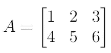

我们可以通过相应的行和列来引用矩阵的各个元素。例如，A[1，2] = 2，因为数字 2 位于第一行第二列。

只有一列的矩阵称为**向量**。例如，上面矩阵 A 的每一列都是一个向量。让我们把矩阵 A 的第一列作为向量 v:

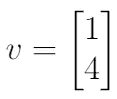

在向量中，我们也可以指单个的元素。这里，我们只需要使用一个索引。例如，v[2] = 4，因为 4 是向量 v 的第二个元素。

# 矩阵运算

当我们能够用矩阵进行代数运算时，我们分析和解决线性代数领域中特殊问题的能力将会大大提高。这里列出了执行这些操作的最重要的基本工具。

## ㈠矩阵和

如果 A 和 B 是 m×n 矩阵，那么**和** A+B 就是 m×n 矩阵，它的列是 A 和 B 中对应列的和，和 A+B 只有在 A 和 B 大小相同时才定义。

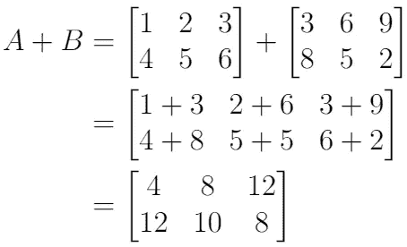

当然，矩阵的减法，A-B，以同样的方式工作，B 中的列从 a 中的列中减去

## (二)标量倍数

如果 r 是标量，那么矩阵 A 的标量倍数是 r*A，即其列是 A 中相应列的 r 倍的矩阵。

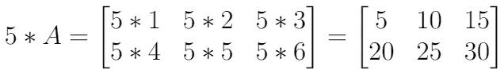

## ㈢矩阵向量乘法

如果矩阵 A 的大小是 m×n(因此，它有 n 列)，并且 u 是大小为 n 的向量，那么 A 和 u 的乘积，用 Au 表示，是 A 的列的**线性组合**，使用 u 中的相应条目作为权重。

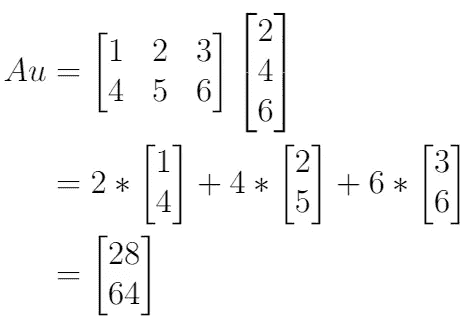

**注**:只有矩阵 A 的列数等于向量 u 的项数，才定义乘积 Au！

**性质**:如果 A 是 m×n 矩阵，u 和 v 是大小为 n 的向量，r 是标量，则:

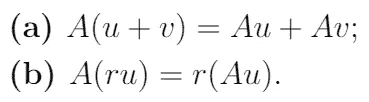

## ㈣矩阵乘法

如果 A 是一个 m×n 矩阵，B = [ **b** 1， **b** 2，…， **b** p]是一个 n×p 矩阵，其中 **b** i 是矩阵 B 的第 I 列，那么矩阵乘积 AB 就是 m×p 矩阵，它的列是 A **b** 1，A **b** 2，…，A **b** p。所以

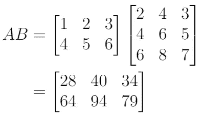

因为

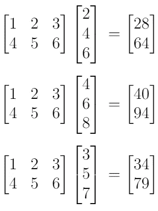

**注**:A 中的列数必须与 B 中的行数相匹配，才能进行矩阵乘法。

**性质**:设 A 是 m×n 矩阵，设 B 和 C 的大小使得和与积被定义，设 r 是标量。然后:

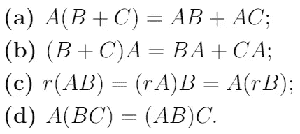

## (五)矩阵的幂

如果 a 是一个 n×n 矩阵， *k* 是一个正整数，那么 A^k (A 的 k 次方)是 a 的 *k* 个副本的乘积:

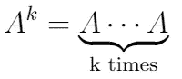

## ㈥矩阵转置

假设我们有一个大小为 m×n 的矩阵 a，那么 a 的转置矩阵(用 A^T 表示)是 n×m 矩阵，它的列是由 a 的相应行组成的

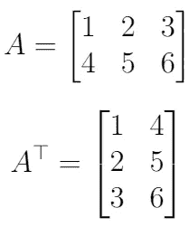

**性质**:设 A 和 B 为矩阵，其大小适合下列和与积。然后:

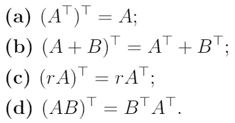

# **矩阵求逆**

矩阵代数提供了处理矩阵和创建各种有用公式的工具，其方式类似于用实数处理普通代数。例如，一个实数的(乘法)**逆**，比如说 3，就是 3^-1，或者 1/3。该逆满足以下等式:

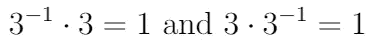

这个概念可以推广到方阵。如果存在一个 n×n 矩阵 C，则称 n×n 矩阵 A 是可逆的:

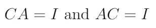

其中 I 是 n×n**单位矩阵**。单位矩阵是对角线上有 1 而其他地方有 0 的方阵。下图显示了 5 x 5 单位矩阵:

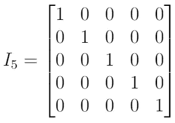

回到上面的可逆性原理，我们称矩阵 c 为 a 的**逆**事实上，c 是由 a 唯一确定的，因为如果 b 是 a 的另一个逆，那么 B = BI = B(AC) = (BA)C = IC = C。这个唯一的逆由 A^-1 表示，因此:

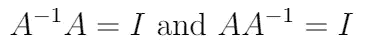

**属性**:

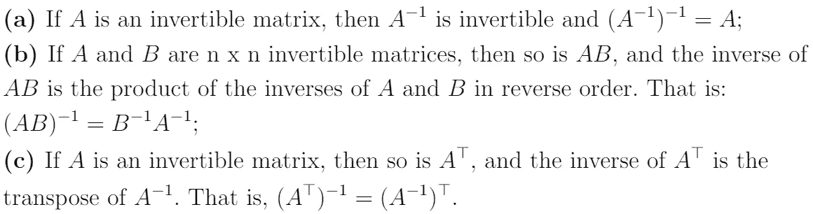

# 正交矩阵

正交矩阵是其列和行是正交单位向量的方阵。也就是说，**正交矩阵**是可逆矩阵，我们称之为 Q，其中:

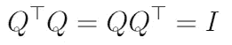

这导致了等价的特征:如果矩阵 Q 的转置与其逆矩阵相等，则矩阵 Q 是正交的:

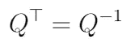

# 线性代数在数据科学中的应用

为了展示线性代数在数据科学领域中的相关性，我们将简要介绍两个相关的应用。

## 奇异值分解

**奇异值分解**是数据科学领域中一个非常重要的概念。奇异值分解的一些重要应用是图像压缩和降维。让我们在这里集中讨论后一种应用。**降维**是将数据从一个高维空间转换到一个低维空间，这样原始数据中最重要的信息仍然保留。这是期望的，因为一旦数据的维度太高，数据的分析在计算上变得难以处理。

SVD 将矩阵分解为三个独立矩阵的乘积，如下所示:

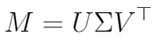

在哪里

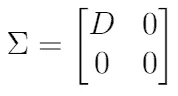

假设矩阵 M 是一个 M×n 矩阵:

*   u 是**左奇异向量**的 m×m 正交矩阵；
*   σ是 M×n 矩阵，其中 D(即 r×r)中的对角元素是 M 的前 r 个奇异值**；**
*   v 是**右奇异向量**的 n×n 正交矩阵。

奇异值可用于理解由每个奇异向量解释的**方差量**。它捕捉的差异越多，它包含的信息就越多。通过这种方式，我们可以使用这些信息将向量的数量限制在我们希望捕获的方差的数量之内。

手动计算 SVD 是可能的，但是当矩阵变得更高维时，这很快变成一个密集的过程。在实践中，人们正在处理大量的数据。幸运的是，通过使用`Numpy`，我们可以很容易地用 Python 实现 SVD。为了使例子简单，我们定义一个 3×3 的矩阵 M:

```
import numpy as np
from numpy.linalg import svd

# define the matrix as a numpy array
M = np.array([[4, 1, 5], [2, -3, 2], [1, 2, 3]])

U, Sigma, VT = svd(M)

print("Left Singular Vectors:")
print(U)
print("Singular Values:")
print(np.diag(Sigma))
print("Right Singular Vectors:")
print(VT)
```

输出:

```
Left Singular Vectors:
[[-0.84705289  0.08910901 -0.52398567]
 [-0.32885778 -0.8623538   0.38496556]
 [-0.41755714  0.49840295  0.75976347]]
Singular Values:
[[7.62729138 0\.         0\.        ]
 [0\.         3.78075422 0\.        ]
 [0\.         0\.         0.72823326]]
Right Singular Vectors:
[[-0.58519913 -0.09119802 -0.80574494]
 [-0.23007807  0.97149302  0.0571437 ]
 [-0.77756419 -0.21882468  0.58949953]]
```

因此，在这个小例子中，奇异值(通常表示为σ)为σ1 = 7.627，σ2 = 3.781，σ3 = 0.728。于是，当只使用前两个奇异向量时，我们解释为(σ1 + σ2 ) / (σ1 + σ2 + σ3 ) = 99.3%的方差！

## 主成分分析

正如奇异值分解一样，**主成分分析(PCA)** 是一种降维的替代技术。PCA 的目标是创建新的不相关变量，称为**主成分**，最大化捕获的方差。因此，我们的想法是降低数据集的维度，同时尽可能多地保留“可变性”(即信息)。这个问题归结为求解一个**特征值-特征向量**问题。

由于特征值和特征向量超出了本文的范围，我们将不深究 PCA 的数学解释。

# 结论

在数据科学领域，数学无处不在。要成为一名成功的数据科学家，你绝对不需要知道每个概念背后的所有数学细节。然而，为了能够在处理数据和算法时做出更好的决策，您需要对其背后的数学和统计学有坚实的理解。本文主要关注线性代数的基础知识，作为一名数据科学家，这是一门非常重要的数学学科。