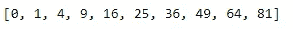
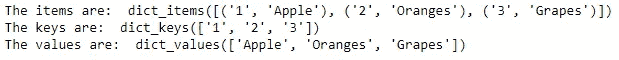
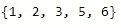
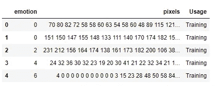

# 机器学习所需的 Python 基础知识及其库模块

> 原文：<https://towardsdatascience.com/basics-of-python-and-its-library-modules-required-for-machine-learning-51c9d26026b8?source=collection_archive---------21----------------------->

## [关于 ML 的一切](http://towardsdatascience.com/tagged/All%20About%20ML)

## 通过对机器学习所需的每个库的直观理解，学习 python 数据结构的基础知识

照片由[在](https://unsplash.com/@thisisengineering?utm_source=unsplash&utm_medium=referral&utm_content=creditCopyText) [Unsplash](https://unsplash.com/?utm_source=unsplash&utm_medium=referral&utm_content=creditCopyText) 上拍摄

ython 是数据科学、机器学习和深度学习的最佳编程选择之一。Python 为完成每项任务提供了广泛的选择。它非常容易使用，也是开始编程的最佳方式之一，因为它使用起来相当简单，学习起来也相当容易。它还有一个不断更新和升级的社区。在撰写本文时，python 的最新版本是 3.8。

本文假设读者具有轻微或适度的编程知识，并了解一点 python。如果你之前没有编程知识，那么不要担心。Python 非常容易上手，YouTube 上有大量免费视频，网上也有很多有趣的教程。如果你们想让我从头开始做一个 python 基础教程，请随时告诉我。只要对 python 有一个基本的了解，我们就可以继续了解这种令人惊叹的语言，以及对机器学习有益的所有扩展和库。

> 注意:这将是我的“关于机器学习”课程的第二部分。但是，每个后续零件都将是独立零件。你可以根据你的方便以任何顺序阅读这个系列。我将在接下来的文章中尝试涵盖基础知识和大多数机器学习算法。要查看该系列的其他部分，您可以点击[此处](http://towardsdatascience.com/tagged/All%20About%20ML)。如果你还没有看过之前的文章，请点击下面的链接。

 [## 开始使用 Python 掌握机器学习的旅程

### 了解精通机器学习的基本要求

towardsdatascience.com](/starting-your-journey-to-master-machine-learning-with-python-d0bd47ebada9) 

你可以从下面的链接下载 python。

 [## 下载 Python

### 关于特定端口的信息、开发人员信息来源和二进制可执行文件由发布经理或……

www.python.org](https://www.python.org/downloads/) 

## 你能从这篇文章中期待什么？

今天，我们将探讨机器学习所需的 python 的所有基本概念。我们将理解 python 的各种数据结构，然后继续深入挖掘机器学习所需的所有库的基础。我们将用一些简单的代码片段来涵盖所有这些概念，以便更好地掌握这些库和特性。所以，事不宜迟，让我们动手做一些编码吧！

在 [Unsplash](https://unsplash.com?utm_source=medium&utm_medium=referral) 上由 [Max Duzij](https://unsplash.com/@max_duz?utm_source=medium&utm_medium=referral) 拍照

# Python 中的数据结构:

数据结构是以某种方式组织起来的数据元素的集合。python 中有很多内置的数据结构。让我们逐一探讨这些问题。

## 1.列表—

列表是可变的有序元素序列。可变意味着列表可以被修改或改变。列表用方括号“[ ]”括起来。我们在 python 中用于机器学习的列表的重要函数是——“append ”,用于向列表添加元素,“len”函数用于查找列表的长度，而“sort”函数用于按升序排列列表中的元素。这三个通常是列表中最常用的函数。列表切片是另一个理解起来非常有用的概念。列表元素可以通过它们的索引号来寻址。第 0 个索引由第一个元素组成，第 1 个索引由第二个元素组成，依此类推。

关于列表的另一个重要概念是**列表理解**。这是通过提供一种简洁的方式来创建列表，从而简化代码。创建多达 10 个正方形的示例如下:

您也可以在名为**嵌套列表**的列表中创建一个列表。这些通常对机器学习中的矩阵运算有帮助。

## 2.字典—

字典是条目的无序集合。与列表和其他数据结构(如元组或集合)不同，字典数据结构有一对称为键和值的元素。dict()函数可以用来给一个变量分配一个字典。另一种方法是使用花括号' {} '将变量指定为字典。定义了一个字典之后，我们主要有三个函数——**items**函数用于查看字典的键和值, **keys** 函数用于访问字典的键, **values** 函数用于访问各个键的所有值。字典功能甚至可以用于为熊猫图书馆构建数据框。它是和列表一样重要的数据结构之一。下面的例子展示了如何声明一个字典并访问字典中的所有变量。

## 3.元组—

元组数据结构类似于列表数据结构，在列表数据结构中，可以用固定数量的元素定义元组。唯一的区别是元组是不可变的。这可以防止对元组中的元素进行任何修改，因为不能从创建的特定元组中追加或删除更多的元素。可以通过指定元组函数或使用普通括号“()”来创建元组。访问元组中的元素的过程可以通过访问它的特定索引位置来完成，类似于列表。还可以创建嵌套元组，即元组中的元素元组。元组数据结构的主要优点是它可以适合于定义图上的(X，Y)点，使得这些点在整个程序中保持一致并且不能被改变。让我们看一个嵌套元组的例子，其中主元组包含((x1，y1))和(x2，y2)形式的另外两个元组。让我们来看看如何访问元组的 y1 元素，如下面的代码块所示。

上面代码块的输出是 2，也就是 y1 和我们想要访问的元素。

## 4.集合—

集合是无序元素的集合。这些元素也没有被索引。可以通过使用 set 函数或使用只有一个元素的大括号“{ 0 }”来定义集合。集合数据结构是可变的，因为元素可以被添加或删除，但是集合只包含每个元素中的一个。元素的重复不能在一个集合中重复，并且一个集合总是有序的。从最小意义到最大意义进行排序，即按升序排序。集合可用于执行数学集合运算，如并、交、对称差等。下面是一个代码块，展示了集合的简单工作。

其他的数据结构是**字符串**和**冻结集**。大多数观众在学习 python 的基础知识时都已经了解了字符串。我将简要介绍字符串，但我个人并没有在我的机器学习项目中大量使用冻结集，因为我觉得它没那么有用。如果你有兴趣了解更多关于这些的信息，请随时学习。

**字符串**可以在单引号“”或双引号“”中定义。字符串是不可变的字符序列。计算机不处理字符。相反，他们处理数字，尤其是二进制数字。尽管您可能在屏幕上看到字符，但在内部，它是以 0 和 1 的组合形式存储和操作的。这种将字符转换为数字的过程称为编码，相反的过程是解码。美国信息交换标准码(ASCII)和 Unicode 是一些常用的编码。在 Python 中，字符串是 Unicode 字符序列。字符串用于编码的常用格式化技术是用字节表示的 UTF-8 标准。

照片由 [Emil Widlund](https://unsplash.com/@emilwidlund?utm_source=medium&utm_medium=referral) 在 [Unsplash](https://unsplash.com?utm_source=medium&utm_medium=referral) 拍摄

# python 中用于机器学习的基本重要库:

## 1.熊猫—

Pandas**模块是 python 中的一个开源库，用于创建数据框，这对于组织数据非常有用。Pandas 广泛用于数据科学、机器学习和深度学习领域，用于数据的结构化排列。在 pandas 中创建的数据框是数据的二维表示。将 pandas 库作为 pd 导入后，您可以可视化您喜欢的表格数据。这方面的一个例子如下所示:**

总的来说，pandas 模块是一个用于系统查看数据的极好的库，它还允许执行各种各样的操作。

## 2.Matplotlib —

Matplotlib 模块是可视化数据框或任何其他形式数据的最佳工具之一。Matplotlib 用于可视化数据，以便在数据科学中进行探索性数据分析。了解我们正在处理的数据类型以及确定必须执行的下一步操作非常有用。该库提供了各种各样的可视化功能，如散点图、条形图、直方图、饼图和许多其他类似的功能。将 matplotlib.pyplot 模块作为 plt 导入，以便使用 matplotlib 执行可视化任务。下面是一个例子

散点图

条形图

图中显示了使用 matplotlib 绘制的散点图和条形图。该模块的一个优点是使用非常简单，并且在提供可视化方面非常有效。它还可以与 **seaborn** 库结合使用，以获得更好的视觉和美学效果。

## 3.NumPy —

NumPy 库代表**数值 Python** 。numpy 库是执行矩阵运算的最佳选择之一。它支持多维数组。可以在数组上执行大量的数学和逻辑运算。通过将列表转换成 numpy 数组，我们可以执行诸如加法、减法、点积等计算。numpy 的用例适用于计算机视觉和自然语言处理项目。在计算机视觉中，您可以使用 numpy 数组来可视化 numpy 数组中的 RGB 或灰度图像，并相应地转换它们。在自然语言处理项目中，为了优化计算，您通常喜欢将文本数据转换成向量和数字的形式。将 numpy 作为 np 导入，您可以将文本数据转换为分类数据，如下所示:

## 4.Scikit-learn —

scikit-learn 模块是机器学习和预测数据分析的最佳工具之一。它提供了广泛的预建算法，如逻辑回归，支持向量机(SVM)，分类算法，如 K 均值聚类，以及更多的操作。这是初学者开始学习机器学习算法的最佳方式，因为该模块提供了简单高效的工具。它是开源的，可以在商业上使用，同时几乎允许任何人访问。它是可重用的，并受到诸如 NumPy、SciPy 和 Matplotlib 等库的支持。导入 sklearn 模块来运行 scikit-learn 代码。下面是一个代码示例，用于将我们拥有的数据集分割成一种形式的训练和测试或验证数据。这对于模型的训练和评估是有用的。

## 5.NLTK —

NLTK 库代表自然语言工具包平台，它是自然语言处理数据的机器学习的最佳库之一。自然语言处理(NLP)是人工智能的一个分支，它帮助计算机理解、解释和操纵人类语言。NLTK 库非常适合基于语言的任务。它为分类、标记化、词干化、标记、解析和语义推理等任务提供了广泛的选项。它允许用户将数据分成实体，这些实体可以组合在一起，以产生更有组织的意义。该库可以作为 nltk 导入，下面是一个句子标记化的示例代码。

> **注:**这只是对所有库的简单介绍。如果你还没有完全理解它们，那也没什么。在本系列接下来的部分中，我们将通过实际的例子以及它们在机器学习算法和问题中的具体应用来更详细地了解每一个问题。

# 结论:

我们能够对各种数据结构和它们执行的任务有一个简单的了解，同时对 python 中提供机器学习灵活性的各种库有一个直观的了解。有了 python 及其相应的机器学习库模块的基础知识，我们就可以更深入地探索机器学习的各个领域和算法了。在接下来的文章中，我们将重点关注探索性数据分析和机器学习背后的数学。一旦完成，我们将单独查看每个算法，并对它们及其特定用例进行完整的分解。

对于本文中使用的一些代码、截图和图像，参考了我以前的一些文章。请随意查看下面的参考资料。

 [## 使用深度学习的人类情感和手势检测器:第 1 部分

### 了解如何从零开始构建具有深度学习的人类情感和手势检测器。

towardsdatascience.com](/human-emotion-and-gesture-detector-using-deep-learning-part-1-d0023008d0eb)  [## 基于自然语言处理和深度学习的下一个单词预测

### 使用 LSTM 设计单词预测系统

towardsdatascience.com](/next-word-prediction-with-nlp-and-deep-learning-48b9fe0a17bf)  [## 使用一维卷积层的创新聊天机器人

### 从头开始使用深度学习和 Conv-1D 层构建聊天机器人

towardsdatascience.com](/innovative-chatbot-using-1-dimensional-convolutional-layers-2cab4090b0fc) 

从以下链接查看与本系列相关的所有文章:

 [## 关于 Ml 的一切——走向数据科学

### 阅读《走向数据科学》中关于 Ml 的文章。共享概念、想法和代码的媒体出版物。

towardsdatascience.com](https://towardsdatascience.com/tagged/All%20About%20ML) 

谢谢大家坚持到最后，祝大家有美好的一天！