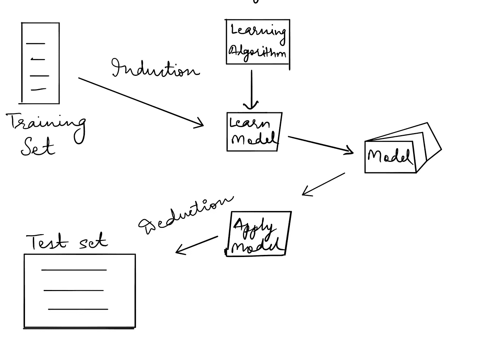

# 监督学习基础(分类)

> 原文：<https://towardsdatascience.com/basics-of-supervised-learning-classification-d26c00d80100?source=collection_archive---------40----------------------->

## 在具有概念、组件和示例的机器学习中

由 [Unsplash](https://unsplash.com/s/photos/machine-learning?utm_source=unsplash&utm_medium=referral&utm_content=creditCopyText) 上的 [Pietro Jeng](https://unsplash.com/@pietrozj?utm_source=unsplash&utm_medium=referral&utm_content=creditCopyText) 拍摄

在这篇文章中，我们将深入探讨监督学习的概念，或者更确切地说是机器学习领域中的分类。我们将讨论分类的定义、组成和例子。

分类可以定义为学习一个目标函数 ***f*** 的任务，该目标函数将每个[属性](/journey-into-data-mining-3b5ccfa5343)集合 ***x*** 映射到一个预定义的[标签](/journey-into-data-mining-3b5ccfa5343) ***y*** *。*

**示例:**将一条新闻分配到预定义的类别之一。

在数据科学或机器学习的社区中，对数据所做的任何事情都被称为**建模。**在分类的背景下，有两种类型的建模:

1.  *描述性建模:*分类模型可以作为一种解释工具，用于区分不同类别的对象。**示例:**基于特征定义椎骨类型的模型。
2.  *预测建模:*分类模型也可用于预测未知记录的类别标签。

分类技术最适合预测或描述带有[二进制或名义类别](/journey-into-data-mining-3b5ccfa5343)的数据集。它们对于[有序类别](/journey-into-data-mining-3b5ccfa5343)(例如，将一个人归类为高、中或低收入群体的成员)不太有效，因为它们没有考虑类别之间的隐含顺序。

从鸟瞰图分类

让我们稍微详细地看看上面提到的所有组件。

1.  *训练和测试集:*整个数据通常分为两部分，一部分由学习算法用来学习一个模型(称为训练数据)，另一部分用来评估所学习模型的性能(称为测试数据)。更多细节请看下面的帖子。

 [## 数据挖掘和机器学习中的数据预处理

### 有了详细的概念…

towardsdatascience.com](/data-preprocessing-in-data-mining-machine-learning-79a9662e2eb)  [## Python 中的数据预处理

### 对于机器学习与工作代码的例子…

towardsdatascience.com](/data-preprocessing-in-python-b52b652e37d5) 

2.*学习算法:*它是一种在数据集(训练集)中寻找模式，并将该数据的属性与训练数据集中提到的类别关联起来的算法，这样当测试数据作为输入时，它就可以分配准确的类别。

学习算法的一个关键目标是建立具有良好概括能力的模型，即准确预测先前未知记录的类别标签的模型。

3.*模型/分类器:*它实际上做分类。它识别一个数据实例与另一个数据实例的差异，然后将新的数据实例分配给其中一个类。

4.*归纳与演绎:*在理解它之前，需要理解分类的两个阶段。它们分别是**学习和**查询阶段。

学习阶段由两部分组成，即归纳(训练)和演绎(测试)。

查询阶段也称为应用阶段。

现在用更正式的方式来说吧。

正式定义:

*   在任务测试上有所改进，
*   关于业绩计量 P，
*   基于经验 e。

这个正式的定义可能有点难以理解。举几个例子可以更好理解。

**示例:垃圾邮件分类**

*   任务 T-将电子邮件分类为垃圾邮件/非垃圾邮件
*   性能指标 P —正确分类的电子邮件的比例
*   体验 E —手动标记垃圾邮件/非垃圾邮件

**举例:跳棋**

*   任务 T —玩跳棋
*   绩效指标 P —锦标赛中获胜游戏的百分比
*   体验 E——与自我对抗的机会

其他例子包括

*   基于 MRI 扫描的结果将细胞分类为恶性或良性
*   根据星系的形状对它们进行分类

上述这些例子可以基于不同的学习方法进行建模。以下是一些学习方法:

1.  朴素贝叶斯分类器
2.  决策树分类器
3.  神经网络
4.  基于规则的分类器
5.  支持向量机

还有很多。

我将免费赠送一本关于一致性的电子书。在这里获得你的免费电子书。

感谢您的阅读。我希望阅读这篇文章的人都清楚监督学习的基本知识。

如果你喜欢阅读这样的故事，那么你应该 [**在你的收件箱**](https://tarun-gupta.medium.com/subscribe) 中收到我的帖子，如果你想支持我成为一名作家，考虑[注册成为一名媒体成员](https://tarun-gupta.medium.com/membership)。每月 5 美元，你可以无限制地阅读媒体上的故事。如果你注册使用我的链接，我会赚一小笔佣金，不需要你额外付费。

 [## 加入我的推荐链接-塔伦古普塔

### 作为一个媒体会员，你的会员费的一部分会给你阅读的作家，你可以完全接触到每一个故事…

tarun-gupta.medium.com](https://tarun-gupta.medium.com/membership) 

你可以在这里阅读我的更多帖子:

 [## 标记故事列表的快速链接—感谢您的访问

### 我也有一份以快节奏出版为目标的出版物。读书成为作家。

tarun-gupta.medium.com](https://tarun-gupta.medium.com/thank-you-for-visiting-my-profile-9f708062c75e)