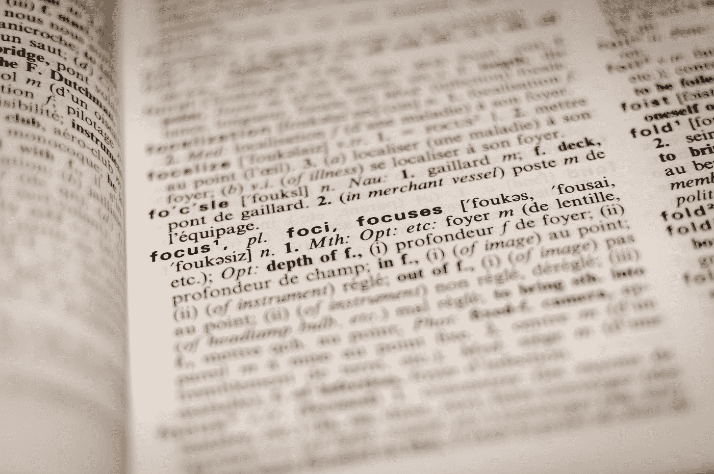

# 使用 Tensorflow 的标记器基础

> 原文：<https://towardsdatascience.com/basics-of-tokenizer-using-tensorflow-f5c8e04d686?source=collection_archive---------46----------------------->

## 一个直观的仪表板，用于研究记号赋予器的工作原理

> **这篇文章是写给那些在自然语言处理领域是新手，想做一个情感分类/文本分类的项目的人。**



由[罗曼·维尼斯](https://unsplash.com/@rvignes?utm_source=medium&utm_medium=referral)在 [Unsplash](https://unsplash.com?utm_source=medium&utm_medium=referral) 上拍摄的照片

> **什么是标记化？**

顾名思义，记号化意味着将句子分成一系列记号，或者用外行的话来说，我们可以说，只要句子中有空格，我们就在它们之间添加一个逗号，这样我们的句子就会被分解成记号，每个单词都获得一个唯一的整数值。

*下面是使用 TensorFlow 的 python 代码。*

```
tokenizer = Tokenizer ( num_words=20, oov_token='<OOV>')
tokenizer.fit_on_texts(sentence)word_index=tokenizer.word_index
sequences=tokenizer.texts_to_sequences(sentence)
```

在执行了上面这段代码后，我们的普通文本被转换成一组整数，如下所示。

```
[[3, 4, 5, 2], [3], [4, 5, 2], [6, 7, 8], [9, 2]]
['Hello How are you ?', 'Hello', 'How are you', 'I am fine', 'Thank You']
```

现在我们的任务是将可变长度的数组转换成固定长度的数组，这可以使用填充来完成。

> **什么是填充？**

填充是通过截断(如果长度大于定义的 max_length，则截断数组)或填充(如果长度小于 max_length，则用 0 填充数组)将可变长度的整数数组转换为固定长度的方法。

下面是这样做的 python 代码。

```
padded=pad_sequences(sequences, maxlen=7, truncating='post')
```

执行上面的代码后，我们的新数组的长度将是固定的，如下所示。

```
[[0 0 0 3 4 5 2]
[0 0 0 0 0 0 3]
[0 0 0 0 4 5 2]
[0 0 0 0 6 7 8]
[0 0 0 0 0 9 2]]
```

> **对应文字的整数值**

下面是 python 代码，看看每个单词对应的值是什么。

```
tokenizer.word_index
```

执行上述代码后，输出将如下所示。

```
{'<OOV>': 1, 'am': 7, 'are': 5, 'fine': 8, 'hello': 3, 'how': 4, 'i': 6, 'thank': 9, 'you': 2}
```

> **结论**

在这里，我们实现了基本的标记器，这将有助于使用深度学习进行情感分类，并将用于真实世界的数据集中。