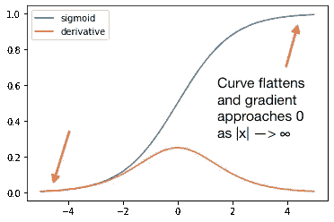
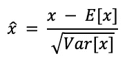
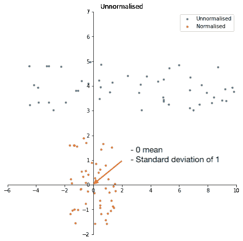
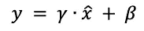

# 批量标准化说明

> 原文：<https://towardsdatascience.com/batch-normalisation-explained-5f4bd9de5feb?source=collection_archive---------16----------------------->

## 批量标准化

## 批量标准化工作原理及其解决的问题的详细指南

在这篇文章中，我详细介绍了批量规范化及其工作原理。Loffe 和 Szegedy 在 2015 年引入了批量规范化，并迅速成为几乎每个深度网络中实施的标准功能。

# 概述

1.  内部协变量移位
2.  消失和爆炸渐变
3.  批量标准化是如何工作的？
4.  批量标准化的优势

# 1.内部协变量移位

批量标准化处理的关键问题是*内部协变量移位*。由于神经网络的本质，会发生内部协变量移位。在训练的每一个时期，**权重被更新，不同的数据被处理**，这意味着神经元的输入每次都略有不同。当这些变化传递到下一个神经元时，它会产生一种情况，即每个神经元的输入分布在每个时期都是不同的。

通常，这没什么大不了的，但在深层网络中，输入分布的这些微小变化会快速累积，并在网络深处放大。最终，由最深层神经元接收的输入分布在每个时期之间变化很大。

因此，这些神经元需要不断适应不断变化的输入分布，这意味着它们的学习能力受到严重制约。这种不断变化的输入分布被称为内部协变量移位。

# 2.消失和爆炸渐变

批量规格化处理的另一个问题是消失或爆炸梯度。在整流线性单元(ReLUs)之前，使用饱和激活函数。饱和函数是具有朝向左右边界的“平坦”曲线的函数，例如 sigmoid 函数。



Sigmoid 曲线及其导数

在 sigmoid 函数中，随着 *x* 的值趋向于∞，梯度趋向于 0。随着神经网络被训练，权重可以被推向 s 形曲线的饱和端。这样，梯度变得越来越小，接近 0。

当这些小梯度在网络中更深地相乘时，它们会变得更小。当使用反向传播时，梯度以指数方式接近 0。这种“消失”梯度严重限制了网络的深度。

虽然可以通过使用 ReLU 等非饱和激活函数轻松管理这种消失梯度，但批量归一化仍然有一席之地，因为它通过确保没有值变得过高或过低，防止权重被推到那些饱和区域。

# 3.批量标准化是如何工作的？

批量标准化通过**减去**小批量**平均值**和**除以**小批量**标准偏差**来标准化层输入。小批量指的是为任何给定时期提供的一批数据，是整个训练数据的子集。



批量归一化的公式，其中 x̂指的是归一化的向量。

标准化确保输入的平均值为 0，标准偏差为 1，这意味着每个神经元的输入分布是相同的，从而解决了内部协变量偏移的问题，并提供了正则化。



然而，网络的代表性已经严重受损。如果对每一层进行归一化，则前一层所做的权重变化和数据间的噪声会部分丢失，因为在归一化过程中会丢失一些非线性关系。这可能导致传递次优权重。

为了解决这个问题，批处理规格化增加了两个可训练的参数，gamma γ和 beta β，它们可以缩放和移动规格化的值。



随机梯度下降可以在标准反向传播过程中调整γ和β，以找到最佳分布，从而解决数据之间的噪声和权重变化的稀疏性。从本质上讲，这些参数缩放并改变了归一化的输入分布，以适应给定数据集的特性。

例如，假设未归一化的输入分布对于给定的数据集是最佳的，γ和β将收敛到√Var[x]和 E[x]，从而获得原始的未归一化的 *x* 向量。因此，批量归一化确保归一化对于给定的数据集总是最优的。

## a.为什么要针对小批量进行标准化？

理想情况下，标准化应该针对整个训练数据集，因为这确保了不同批次之间的输入分布没有变化。然而，由于不在当前批次中的任何数据集都在反向传播的范围之外，随机梯度下降将不起作用，因为归一化中使用的统计数据来自该范围之外。

因此，标准化是针对小批量进行的，以确保可以进行标准反向传播。唯一的含义是，每一批应该在某种程度上代表整个训练集的分布，如果您的批大小不是太小，这是一个安全的假设。

## b.测试阶段

在训练期间，使用小批量中的样本计算平均值和标准偏差。但是，在测试中，计算新值没有意义。因此，批量标准化使用在训练期间计算的运行平均值和运行方差。需要引入一个新的参数，动量或衰变。

```
running_mean = momentum * running_mean + (1-momentum) * new_mean
running_var = momentum* running_var + (1-momentum) * new_var
```

动量是对最后一次看到的小批量的重视，也被称为“滞后”。如果动量设置为 0，运行平均值和方差来自最后一次看到的小批量。然而，这可能是有偏见的，不是理想的测试。相反，如果动量设置为 1，它将使用第一个小批量的运行平均值和方差。本质上，动量控制每个新的小批量对运行平均值的贡献。

理想情况下，动量应设置为接近 1 (>0.9)，以确保运行均值和方差的缓慢学习，从而忽略小批量中的噪声。

# 4.批量标准化的优势

## a.更高的学习率

通常，较大的学习速率会导致梯度消失/爆炸。然而，由于批量标准化处理了这一点，可以放心地使用更大的学习率。

## b.减少过度拟合

批量归一化具有正则化效果，因为它向每一层的输入添加了噪声。这阻止了过度拟合，因为模型不再单独为给定的训练示例产生确定性的值。

# 结论

批量标准化的力量已经在机器学习的许多领域反复展示。这是一个简单的解决方案，将产生几乎任何型号的性能显着改善。

# 参考资料:

[1] [批量归一化:通过减少内部协变量偏移加速深度网络训练](https://arxiv.org/abs/1502.03167)