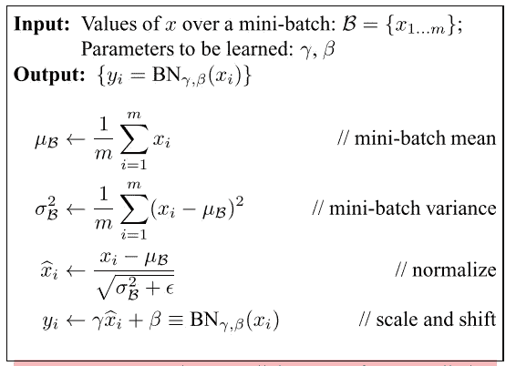

# 批量标准化—直观的解释

> 原文：<https://towardsdatascience.com/batch-normalization-an-intuitive-explanation-42e473fa753f?source=collection_archive---------20----------------------->

## 为什么批量范数有助于训练深度学习模型？

这篇文章的目的是提供一个简单直观的理解批处理规范化(BN)以及它如何帮助训练更深更好的模型。我们开始吧，好吗？

开始吧！伊恩·杜利在 [Unsplash](https://unsplash.com?utm_source=medium&utm_medium=referral) 上拍摄的照片

# **前奏:**

一般来说，规范化是指将不同范围的数字压缩到一个固定的范围。例如，考虑简单双参数模型 f(x)的输入 **x1** 和 **x2**

**f(x)= w1 * x1+w2 * x2**

如果 x1 和 x2 处于完全不同的范围，比如 x1 的范围是[1000–2000]而 x2 的范围是[0.1–0.5]，那么按原样使用它们就意味着优化我们的损失函数。直观地说，在这种情况下，模型参数没有一个公平的竞争环境，网络容易被 w1 压倒。通过将 x1 和 x2 的范围归一化为[0–1 ],可以使所有输入达到相似的范围，并帮助模型更快地学习。这是应用于输入的规范化的特例，称为 ***输入规范化*** (咄！).在计算机视觉中，通常使用训练数据集的平均值和标准差来标准化模型输入。如果你仍然困惑，我推荐[这个来自吴恩达](https://www.coursera.org/lecture/deep-neural-network/normalizing-inputs-lXv6U)的简短的视觉解释。

好了，有了上述直觉，让我们问这个问题:考虑到输入只是深层神经网络(DNN)的另一层，那么模型的其他层的输入呢？将这些中间输入标准化是否也有益？

这就引出了我们的问题陈述。

# **问题——或者说我们为什么需要批量定额:**

深度学习模型通常是一系列级联的层，每一层都接收一些输入，应用一些计算，然后将输出移交给下一层。本质上，每一层的输入构成了该层试图以某种方式“适应”的数据分布。现在，只要一个层的输入数据分布在数据的多个批处理/传递中保持相当一致，该层就可以轻松地完成拟合数据的“任务”。

但是模型/网络管道的本质使得这种一致的输入分布的期望变得困难。随着不同的小批量数据在网络中加载和传递，各层的输入分布会发生跳跃，使我们的各层更难完成工作。除了拟合基础分布之外，所讨论的图层现在还必须考虑图层输入分布中的漂移。这种转移输入分布的现象被称为 ***内部同变量转移*** 。

另一个问题是，当网络的不同参数的比例与梯度更新相关联时，它们可能导致 ***爆炸和消失梯度*** 。一些激活可能会被推到它们的饱和区域，并且可能永远不会从那里恢复。直观上，模型参数不再具有公平的竞争环境(就像前面提到的 f(x)中 w1 和 w2 的比例一样),并且一些参数的梯度可能不受控制地增加和减少。因此，从梯度更新中分离网络参数的比例可能有利于训练。 避免爆炸和消失梯度的变通方法通常包括使用更鲁棒的激活函数，如***【ReLU】，*** 选择较低的学习速率和小心初始化网络参数，但由于有许多旋钮要调节，核心问题仍然存在:训练我们的 DNN 是一个挑战。

# **解决方案:**

批处理规范化旨在解决我们上面描述的问题:

1.  避免不稳定的梯度
2.  减少网络初始化对收敛的影响。
3.  允许更快的学习速率导致更快的收敛。

所有这些都是通过一个相当简单的方法→ ***来实现的，即使用数据集均值和标准偏差*** 来归一化每个中间层的输入。理想情况下，与输入归一化一样，批处理归一化也应基于*整个数据集*归一化每个图层，但 *t* 这并非微不足道，因此作者进行了简化: ***使用小型批处理统计数据而非*** 进行归一化，因此得名—批处理归一化。

就是这样！

不完全是，我还没有复制粘贴强制 BN 方程！

图片来自[http://arxiv.org/abs/1502.03167](http://arxiv.org/abs/1502.03167)

在上面的片段中，前三个方程计算批次平均值和标准差，然后分别用这些矩对输入进行归一化。第三步中的ε是一个小数值，有助于数值稳定性。需要注意的关键点是，对批处理中的所有输入维度分别进行归一化(在卷积术语中，认为是通道)

最后一个等式引入了两个参数-> *伽马(缩放)*和*贝塔(移位)*来进一步变换归一化的输入。原因是简单的标准化通过限制其范围降低了后续激活的表达能力(对于 sigmoid，这将限制其输出到 S 曲线的线性范围)。为了克服这一点，BN 允许网络学习 gamma 和 beta 参数，以便让层“调整”标准化的输入分布，使其更具表现力。与每个小批量计算的平均值和方差相反，伽马和贝塔参数是在整个数据集上学习的。

# BN 有助于内部协变量转移->神话还是事实？

在介绍 BN 时，我说它有助于解决内部同变量转移的问题，这也是最初的作者声称的。但是，经过几年的辩论和研究，最近的证据指出情况可能并非如此。批次标准和内部协变量移位可能无关。事实上，在某些情况下，BN 实际上可能*增加*内部同变移位！

一个这样的实验训练了三个不同的模型:

1.没有国阵的 DNN

**2.一个 DNN **与**和 **BN****

**3.具有 **BN** 的 DNN **，但是现在具有添加噪声**的**(在应用 BN 之后并且在应用激活以创建同变量移位之前)。****

**结果表明，后两种模型更快地达到更好的精度，这是预期的，因为它们使用了 BN。然而，第二种模式并不比第三种模式好多少。这表明，虽然 BN 确实有助于更好的训练制度，但它可能与内部协变量变化无关。**

**那么，BN 到底为什么有效呢？**

**有些答案很直观。由于 BN 对每一层的输入进行归一化，这将梯度从网络参数的规模中解耦，从而防止不稳定的梯度。这也允许更高的学习率，因为网络现在有更少的机会卡住。所有这些都是稳定训练体制的关键因素。**

**进一步观察发现，BN 实际上将优化过程(准确地说是损失面)重新参数化为更平滑的状态。直观地说，这意味着 BN 采用了一个充满山丘和山谷的复杂损失表面，并使其变得更简单，山丘和山谷越来越少。优化过程现在可以朝着全局最优迈出更有信心和更大的步伐(具有更大的学习率),并且陷入可怕的局部最优的机会更少。用专业术语来说，这被描述为“平滑损失函数的*】Lipschitz ness”。***

***我在参考资料部分包括了所有的资源，如果你想了解更多关于 BN 的细节，我强烈推荐你阅读前三篇文章。***

***今天到此为止，各位！一如既往的感谢阅读！***

# ***参考***

1.  ***约夫和塞格迪(2015 年)。*批量标准化:通过减少内部协变量偏移来加速深度网络训练*。[http://arxiv.org/abs/1502.03167](http://arxiv.org/abs/1502.03167)***
2.  ***比约克、戈麦斯、塞尔曼和温伯格。*了解批量标准化*。
    [https://arxiv.org/abs/1806.02375](https://arxiv.org/abs/1806.02375)***
3.  ***桑图尔卡，齐普拉斯，伊利亚斯，麻省理工学院，˛。*批量规范化对优化有什么帮助？* [https://arxiv.org/abs/1805.11604](https://arxiv.org/abs/1805.11604)***
4.  ***[https://www.jeremyjordan.me/batch-normalization/](https://www.jeremyjordan.me/batch-normalization/)***