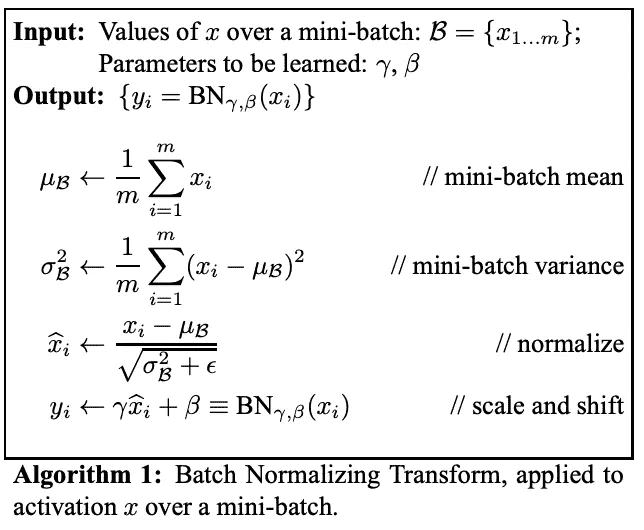
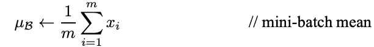
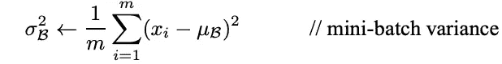
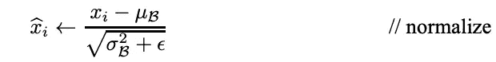
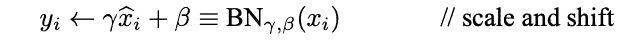

# 解释了神经网络中的批量标准化(算法分解)

> 原文：<https://towardsdatascience.com/batch-normalization-explained-algorithm-breakdown-23d2794511c?source=collection_archive---------11----------------------->

## 理解深度神经网络中使用的一种常见转换技术

瓦迪姆·谢尔巴科夫在 [Unsplash](https://unsplash.com/s/photos/breakdown?utm_source=unsplash&utm_medium=referral&utm_content=creditCopyText) 上拍摄的照片

# 介绍

**批量归一化(BN)** 是很多机器学习从业者都会遇到的技术。如果你曾经使用过卷积神经网络，比如[exception](https://arxiv.org/abs/1610.02357)、 [ResNet50](https://www.mathworks.com/help/deeplearning/ref/resnet50.html) 和 [Inception V3](https://uk.mathworks.com/help/deeplearning/ref/inceptionv3.html) ，那么你就使用过批量归一化。

这篇文章解释了 BN 背后的基本直觉。对于那些已经熟悉 BN 技术的人来说，这篇文章深入研究了 BN 算法并解释了它的关键部分。

# 定义

批量标准化是一种减轻深度神经网络中不稳定梯度影响的技术。BN 为神经网络引入了一个附加层，该层对来自前一层的输入执行操作。

该操作对输入值进行标准化和规范化。然后，输入值通过缩放和移位操作进行转换。

*如果这令人困惑，下面的下一节将使该技术变得更加清晰。*

# 说明

Christian Szegedy 和 Sergey Ioffe 于 2015 年在这篇已发表的[论文](https://arxiv.org/abs/1502.03167)中提出了批量标准化技术。

通过在神经网络层内引入输入值的内部标准化，执行批量标准化作为**加速深度神经网络**训练阶段的解决方案。

术语“批处理规范化”中使用“*批处理*”的原因是因为神经网络通常一次用一组经过整理的数据进行训练，这组或一组数据被称为批处理。BN 技术中的运算发生在整批输入值上，而不是单个输入值上。

通常，在机器学习中，在将数据传递到输入层之前，通常会对输入数据进行规范化。我们规范化的部分原因是为了确保我们的模型能够适当地一般化。这是通过确保值的比例是平衡的来实现的，并且尽管值的比例变化，值的范围也是保持和成比例的。

通常对输入数据进行规范化，但是网络中的内部数据流应该保持规范化。

BN 是在神经网络层之间传递的输入值内标准化的内部实施者。内部标准化限制了通常发生在层内激活的协变量偏移。

如前所述，BN 技术的工作原理是对进入 BN 层的输入数据执行一系列操作。下面是一个小批量 BN 算法的数学符号片段。

官方研究[论文](https://arxiv.org/pdf/1502.03167.pdf)中提出的批量归一化操作

上图中的数学符号可能看起来有点吓人，但是有一些主要的要点。

1.  **输入数据的标准化**
2.  输入数据的**归一化**和**重新缩放**
3.  **偏置**的**输入数据**

标准化是将一批输入数据转换为平均值为零、标准差为一的操作。在 BN 算法中，我们需要计算最小批量的平均值，然后计算方差。方差提供了关于标准偏差的信息；我们只需要求方差的平方根。

让我们分解算法的数学符号，解释这个过程。

计算当前小批量的平均值

第一个操作计算小批量内输入的平均值。运算的结果是一个包含每个输入平均值的向量。

*m* 指小批量的投入数量。

谓卑鄙。

*B* 是指当前批次的下标。

*xi* 是输入数据的一个实例。

一批(*‘B’*)的平均值(*’*)是通过该批的几个输入实例的总和除以输入总数(*‘m’*)来计算的。

计算当前小批量的差异

在上面的操作中，输入方差( *σ* )通过平方输入的标准偏差来计算。为了计算标准偏差，我们取当前小批量中的每个输入实例( *Xi* )，减去在先前操作中计算的小批量的平均值( *B* ),并对结果求平方。

这个值然后被平方以获得方差( *σ* )。

标准化输入

现在我们有了**零定心和标准化输入**所需的所有值。在上面的操作中，我们对输入数据进行了标准化处理。术语标准化和规范化可以互换使用。这两个术语之间有细微的差别。

在上面的操作中，从每个输入时刻减去批次的平均值。然后我们将结果除以当前批次的标准偏差值与平滑项( *ε* )相加的平方根值。

平滑项( *ε* )通过停止除以零值来确保运算中的数值稳定性。平滑项通常为 0.00005。

缩放和偏移输入

在最后一个操作中，输入值的**重新缩放和偏移**发生。该操作的输出是 BN 算法对当前小批量的结果。

在最后的操作中，我们介绍了 BN 算法的两个新组件。这些分量是参数向量，用于包含来自先前操作的值的向量的缩放( *γ* )和移位( *β* )。用于缩放和移位的参数向量的值是可学习的参数。在神经网络训练期间，BN 确保可学习的参数是能够使每个小批量精确标准化的最佳值。

BN 变换是提高深度神经网络性能的有效方法。

# 批量标准化的好处

*   在深度神经网络中包括批量标准化技术改进了训练时间
*   BN 能够利用更大的学习速率，这在训练神经网络时缩短了收敛时间
*   减少渐变消失的常见问题
*   减少了神经网络内的协变量移位

# 结论

BN 背后的算法并没有看起来那么复杂。

通过引入现代机器学习库，如 [TensorFlow](https://www.tensorflow.org/) 和 [PyTorch](https://pytorch.org/) ，抽象出在神经网络内实现 BN 的复杂性。这使得在神经网络中实现 BN 成为一项微不足道的任务。

理解批处理规范化算法如何操作仍然是一项有价值的技能。