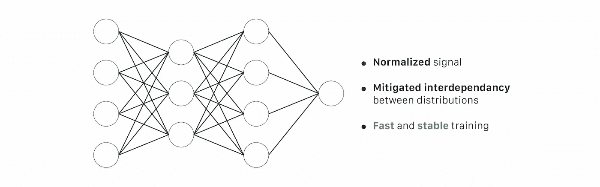

# 3 个理解层次的批量标准化

> 原文：<https://towardsdatascience.com/batch-normalization-in-3-levels-of-understanding-14c2da90a338?source=collection_archive---------0----------------------->

## [入门](https://towardsdatascience.com/tagged/getting-started)

## 到目前为止，我们对它了解多少:从 30 秒摘要到综合指南

鸣谢:[贾巴里·蒂莫西](https://unsplash.com/@jabari21?utm_source=unsplash&utm_medium=referral&utm_content=creditCopyText)上 [Unsplash](https://unsplash.com/s/photos/dam?utm_source=unsplash&utm_medium=referral&utm_content=creditCopyText)

T 网上有很多关于批量归一化(BN)的内容。然而，他们中的许多人都在捍卫一种过时的直觉。我花了很多时间将所有这些零散的信息放在一起，以建立对这个基本方法的良好直觉，我认为一步一步的演练可能对一些读者有用。

特别是，这个故事旨在带来:

*   从到**三级理解**的**更新解释**:30 秒，3 分钟，全面指导；
*   涵盖**关键要素**以充分利用 BN；
*   **在 Google Colab **、**中使用 Pytorch 实现 BN 层的简单实现**，从官方论文中复制基于 MNIST 的实验(随意摆弄[笔记本](https://github.com/Johann-Huber/batchnorm_pytorch/blob/main/batch_normalization_in_pytorch.ipynb))；
*   理解**为什么 BN 仍然不为人所知**(甚至在阅读了高质量作者的解释之后！).

让我们投入进去吧！

# 概观

a)**[**30 秒**](https://medium.com/p/14c2da90a338#b93c)**

**B) [**再过 3 分钟**](https://medium.com/p/14c2da90a338#ad2e)**

**— 1.[原理](https://medium.com/p/14c2da90a338#3164)**

**— — 1.1.[培训](https://medium.com/p/14c2da90a338#dc3f)**

**— — 1.2.[评估](https://medium.com/p/14c2da90a338#5ce9)**

**— 2.[在实践中](https://medium.com/p/14c2da90a338#5920)**

**— 3.[结果概述](https://medium.com/p/14c2da90a338#5c4f)**

**C) [**了解批量归一化(BN)**](https://medium.com/p/14c2da90a338#e5ba)**

**— 1.[实施](https://medium.com/p/14c2da90a338#6cd2)**

**— 2.[实践中的 BN](https://medium.com/p/14c2da90a338#018e)**

**— — 2.1.[原文章结果](https://medium.com/p/14c2da90a338#1f09)**

**— — 2.2.[正规化，一个 BN 副作用](https://medium.com/p/14c2da90a338#9a0a)**

**— — 2.3.[评估期间的标准化](https://medium.com/p/14c2da90a338#36f2)**

**— — 2.4.[稳定性问题](https://medium.com/p/14c2da90a338#6775)**

**— — 2.5.[递归网络&图层归一化](https://medium.com/p/14c2da90a338#d000)**

**— — 2.6.[非线性之前还是之后？](https://medium.com/p/14c2da90a338#3321)**

**— 3.[BN 为什么管用？](https://medium.com/p/14c2da90a338#acf0)**

**— — 3.1.[第一个假设:围绕内部协变量移位(ICS)的困惑](https://medium.com/p/14c2da90a338#8c6f)**

**— — 3.2.[第二个假设:减轻分布之间的相互依赖性](https://medium.com/p/14c2da90a338#e773)**

**— — 3.3.[第三个假设:使优化前景更加平滑](https://medium.com/p/14c2da90a338#fb36)**

**— 4.总结:我们现在了解了什么**

**[**结论**](https://medium.com/p/14c2da90a338#ff33)**

**[**开题**](https://medium.com/p/14c2da90a338#6bf0)**

**[致谢](https://medium.com/p/14c2da90a338#73dc)**

**[参考文献](https://medium.com/p/14c2da90a338#c2a9)**

**[更进一步](https://medium.com/p/14c2da90a338#75d3)**

# ****A)在 30 秒内****

****【BN】**是一种算法方法，使深度神经网络*【DNN】****训练更快**。*****

*****它由**使用当前批次的第一和第二统计矩(均值和方差)归一化来自隐藏层的激活向量**组成。这个归一化步骤正好在非线性函数之前(或之后)应用。*****

**********

*****多层感知器(MLP) **无批量归一化(BN) |** 鸣谢:作者-设计:[娄高清](https://www.instagram.com/louhacquetdelepine/)*****

**********

*****多层感知器(MLP)**(BN)|**鸣谢:作者-设计:[娄高清](https://www.instagram.com/louhacquetdelepine/)*****

*****所有当前的深度学习框架都已经实现了应用批量规范化的方法。它通常用作模块，可以作为标准层插入到 DNN 中。*****

******备注:对于那些喜欢阅读代码而不是文本的人，我在* [*这个 repo*](https://github.com/Johann-Huber/batchnorm_pytorch/blob/main/batch_normalization_in_pytorch.ipynb) *中写了一个简单的批量规范化实现。******

# *****b)3 分钟后*****

## *****B.1)原则*****

*****在训练和测试阶段，批处理规范化的计算方式不同。*****

*******B.1.1)培训*******

*****在每个隐藏层，批量标准化将信号转换如下:*****

********************

*****BN 层首先使用(1)和(2)确定整批激活值的**均值𝜇** 和**方差σ** 。*****

*****然后**用(3)归一化激活向量****【z^(i】**。这样，每个神经元的输出都遵循一个标准的正态分布。(𝜀是用于数值稳定性的常数)*****

**********

*******批量归一化第一步。**一个 3 神经元隐藏层的例子，批量大小为 b。每个神经元遵循标准正态分布。 **|** 鸣谢:作者-设计:[娄高清](https://www.instagram.com/louhacquetdelepine/)*****

*****它最终通过应用带有两个可训练参数(4)的 *𝛾* 和 *𝛽* 的线性变换来计算**层的输出****ẑ(i】**。该步骤允许模型通过调整以下两个参数来为每个隐藏层选择最佳分布:*****

*   ******𝛾* 允许调整标准偏差；*****
*   ******𝛽* 允许调整偏差，将曲线移向右侧或左侧。*****

**********

*******𝛾*和𝛽* 参数的好处。**修改分布(顶部)允许我们使用非线性函数的不同机制(底部)。 **|** 鸣谢:作者—设计:[娄高清](https://www.instagram.com/louhacquetdelepine/)*****

******备注:解释 BN 层有效性的理由容易受到误解和错误的影响(即使在原文中也是如此)。最近的一篇论文[2]反驳了一些错误的假设，提高了社区对这种方法的理解。我们将在第 C.3 节讨论这个问题:“BN 为什么起作用？”。******

*****在每次迭代中，网络计算与当前批次相对应的平均𝜇和标准差σ。然后，它通过梯度下降训练 *𝛾* 和 *𝛽，使用[指数移动平均(EMA)](https://en.wikipedia.org/wiki/Moving_average) 赋予最新迭代更多的重要性。******

*******B.1.2)评估*******

*****与训练阶段不同，**在评估阶段**，我们可能没有完整的批次输入到模型中。*****

*****为了解决这个问题，我们计算( **𝜇** _pop， **σ** _pop)，如:*****

*   *******𝜇** _pop:研究人群的估计均值；*****
*   *******σ** _pop:研究人群的估计标准差。*****

*****使用在训练期间确定的所有( **𝜇** _batch， **σ** _batch)来计算那些值，并且在评估期间直接馈入等式(3)(而不是调用(1)和(2))。*****

******备注:我们将在第 C.2.3 节“评估期间的标准化”中深入讨论该问题。******

## *****B.2)实际上*****

*****在实践中，我们将批量归一化视为一个标准层，如感知器、卷积层、激活函数或漏失层。*****

*****每个流行的框架都已经实现了批处理规范化层。例如:*****

*******py torch**:[torch . nn . batch norm 1d](https://pytorch.org/docs/stable/generated/torch.nn.BatchNorm1d.html)， [torch.nn.BatchNorm2d](https://pytorch.org/docs/stable/generated/torch.nn.BatchNorm2d.html) ， [torch.nn.BatchNorm3d](https://pytorch.org/docs/stable/generated/torch.nn.BatchNorm3d.html)*****

*******tensor flow/Keras**:[TF . nn . batch _ normalization](https://www.tensorflow.org/api_docs/python/tf/nn/batch_normalization)，[TF . Keras . layers . batch normalization](https://www.tensorflow.org/api_docs/python/tf/keras/layers/BatchNormalization)*****

*****所有 BN 实现都允许您独立设置每个参数。然而，**输入向量大小是最重要的一个**。它应该设置为:*****

*   *****当前隐层有多少神经元(针对 MLP)；*****
*   *****当前隐藏层中有多少个过滤器(对于卷积网络)。*****

*****看看你最喜欢的框架的在线文档，并阅读 BN 层页面:它们的实现有什么特别的吗？*****

## *****B.3)结果概述*****

*****即使我们还不理解批处理规范化的所有底层机制(参见 C.3)，但有一点大家都同意:**它工作**。*****

*****为了获得第一个洞察力，让我们看看官方文章的结果[1]:*****

**********

*****图 1:**BN 如何影响训练。**ImageNet(2012)验证集上的准确度，相对于训练迭代次数。比较了五个网络:“初始”是标准初始网络[3]，“BN-X”是具有 BN 层的初始网络(对于 3 种不同的学习速率:x1，x5，x30，初始最优网络，“BN-X-Sigmoid”是具有 BN 层的初始网络，其中所有的 ReLU 非线性被 Sigmoid 代替。|来源:[1]*****

*****结果很明显:BN 层**使训练更快**，而**允许更大范围的学习速率**而不会影响训练的收敛性。*****

******备注:此时，你应该对 BN 层有足够的了解来使用它们。然而，如果您想从批处理规范化中获得最大收益，您将需要更深入地挖掘！******

**********

*******批量归一化和这张图有什么联系？** |信用:[达尼洛·阿尔维斯](https://unsplash.com/@daniloalvesd?utm_source=unsplash&utm_medium=referral&utm_content=creditCopyText)上 [Unsplash](https://unsplash.com/s/photos/taps?utm_source=unsplash&utm_medium=referral&utm_content=creditCopyText)*****

# *****c)了解批量标准化(BN)*****

# *****C.1) **实施*******

*****我已经用 Pytorch 重新实现了批处理规范化层，以再现原始的论文结果。代码可以在这个 github 库上找到。*****

*****我建议你看看网上的一些 BN 层的实现。看看在自己喜欢的框架里是怎么编码的，很有启发！*****

# *****实践中的 BN 层*****

*****在深入理论之前，让我们先从批处理规范化有哪些确定性开始。*****

*****在本节中，我们将看到:*****

*   *****BN 如何影响**培训绩效**？为什么这种方法在如今的深度学习中如此重要？*****
*   *****我们必须注意哪些副作用？*****
*   *******当**和**我们应该如何**使用 BN？*****

## *****C.2.1)来自原始文章的结果*****

*****如前所述，BN 被广泛使用，因为它几乎总是**让深度学习模型表现得更好**。*****

*****官方文章[1]进行了 3 个实验来说明其方法的有效性。*****

*****首先，他们在 MNIST 数据集(手写数字)上训练了一个分类器。该模型由 3 个完全连接的层组成，每层 100 个神经元，全部由 sigmoid 功能激活。他们已经使用随机梯度下降(SGD)和相同的学习率(0.01)对该模型训练了两次(有和没有 BN 层)50 000 次迭代。请注意，BN 层正好放在激活函数之前。*****

*****您可以轻松地再现这些结果，而无需 GPU，这是一个更熟悉这个概念的好方法！*****

**********

*****图 2:**BN 如何影响简单多层感知器(MLP)的训练** |左:训练精度 w.r.t .迭代|右:训练损失 w.r.t .迭代|作者*****

*****看起来不错！批处理规范化提高了我们的网络性能，包括损失和准确性。*****

*****第二个实验包括查看隐藏层中的激活值。以下是对应于最后一个隐藏层(就在非线性之前)的图:*****

**********

*****图 3 : **批量归一化对最后一个隐藏层激活值的影响|** 鸣谢:作者*****

*****如果没有批处理规范化，激活的值在第一次迭代中会有很大的波动。相反，当使用 BN 时，活化曲线更平滑。*****

**********

*****图 4 : **批量标准化对隐藏层激活的影响** |有 BN 的模型比没有 BN 的模型有更平滑的激活曲线| Credit : author*****

*****此外，当添加 BN 层时，信号噪声更小。这似乎使模型的收敛更容易。*****

*****这个例子没有显示批处理规范化的所有好处。*****

*****官方文章进行了第三次实验。他们希望在更大的数据集 ImageNet (2012)上添加 BN 图层时比较模型性能。为此，他们训练了一个强大的神经网络(当时)，名为 Inception [3]。最初，这个网络没有任何 BN 层。他们添加了一些，并通过修改其学习率来训练模型(x1，x5，x30 以前的最佳值)。他们还试图在另一个网络中用 sigmoid 替换每个 ReLU 激活功能。然后，他们将这些新网络的性能与原来的进行了比较。*****

*****以下是他们得到的结果:*****

**********

*******图 5 :** **批量归一化对训练的影响(ImageNet)** |《盗梦空间》:原网[3]；“BX-基线”:与 BN 的 Inception 相同，学习率(LR)相同；“BX-x5”:与 BN、LR x5 的《盗梦空间》相同；“BX-x30”:与 BN 的 Inception 相同，LR x30“BN-x5-Sigmoid”:与 Inception 相同，使用 BN、LR x5 和 Sigmoid 代替 ReLU | Source : [1]*****

*****从这些曲线中我们可以得出以下结论:*****

*   *****增加 BN 层导致**更快和更好的收敛**(其中更好意味着更高的精度)；*****

*****在如此大的数据集上，这种改善比在小 MNIST 数据集上观察到的改善要显著得多。*****

*   *****增加 BN 层允许我们使用**更高的学习速率(LR)而不影响收敛**；*****

*****作者已经成功训练了他们的 Inception-with-BN 网络，使用了比原始网络高 30 倍的学习速率**。请注意，5 倍大的 LR 已经使普通网络发散了！*******

*****这样，就更容易找到一个“可接受的”学习率:位于欠拟合和梯度爆炸之间的 LR 的间隔要大得多。*****

*****此外，较高的学习率有助于优化器避免局部极小值收敛。受到鼓励去探索，优化器将**更容易收敛于更好的解决方案**。*****

*   *****基于 **sigmoid 的模型** **达到了与基于 ReLU 的模型的竞争结果*******

*****我们需要后退一步，看看更大的图景。我们可以清楚地看到，与 sigmoid 模型相比，基于 ReLU 的模型可以获得略好的性能，但这不是这里的重点。*****

*****为了说明为什么这个结果是有意义的，让我重新表述一下 Ian good fellow(GANs[6]的发明者，著名的“[深度学习](https://www.deeplearningbook.org/)”手册的作者)对此的看法:*****

> *****在 BN 之前，我们认为在隐藏层中使用 sigmoid 有效地训练深度模型几乎是不可能的。我们考虑了几种解决训练不稳定性的方法，比如寻找更好的初始化方法。这些解决方案很大程度上是启发式的，而且太脆弱，不令人满意。**批量归一化使那些不稳定的网络可训练**；这个例子说明了这一点。*****
> 
> *****——伊恩·古德菲勒(改编自:[来源](https://www.youtube.com/watch?v=Xogn6veSyxA))*****

*****现在我们明白了为什么 BN 对深度学习领域有如此重要的影响。*****

*****这些结果为**提供了批处理标准化对网络性能的益处的概述**。然而，有一些副作用，你应该记住，以获得最大的 BN。*****

## *****C.2.2)规则化，一个 BN 副作用*****

*****BN 依靠批量第一和第二统计矩(均值和方差)来归一化隐藏层激活。然后，输出值与当前批次统计数据紧密相关。根据当前批处理中使用的输入示例，这种转换会增加一些噪声。*****

*****添加一些噪声以避免过度拟合…听起来像是一个**正则化过程**，不是吗？；)*****

*****在实践中，**我们不应该依靠批量归一化来避免过拟合**，因为[正交性](https://en.wikipedia.org/wiki/Orthogonality_(programming))很重要。简而言之，我们应该始终确保一个模块解决一个问题。依靠几个模块来处理不同的问题使得开发过程比需要的要困难得多。*****

*****尽管如此，了解正则化效应还是很有趣的，因为它可以解释网络中的一些意外行为(尤其是在健全性检查期间)。*****

******备注:批量越大，正则化越小(因为它减少了噪声影响)。******

**********

*******如果我们想在如此出色的嵌入式系统上部署批量规范化模型，该怎么办？** |信用:[玛利亚·卡斯特利](https://unsplash.com/@liacastelli?utm_source=unsplash&utm_medium=referral&utm_content=creditCopyText)于 [Unsplash](https://unsplash.com/s/photos/robotics?utm_source=unsplash&utm_medium=referral&utm_content=creditCopyText)*****

## *****评估过程中的标准化*****

*****有两种情况可以在**评估模式**中调用模型:*****

*   *****在进行**交叉验证**或**测试**时，在模型训练和开发过程中；*****
*   *****当**部署**模型时。*****

*****在第一种情况下，为了方便起见，我们可以使用当前的批处理统计数据来应用批处理规范化。在第二个例子中，**使用同样的方法没有意义**，因为我们不一定要预测整个批次。*****

*****让我们看一个带有嵌入式摄像头的机器人的例子。我们可以有一个模型，使用当前的框架来预测任何即将到来的障碍的位置。因此，我们希望每次迭代都在单个帧(即一个 rgb 图像)上计算推断。如果训练批量为 N，**我们应该为模型期望的(N - 1)个其他输入选择什么来进行前向传播？*******

*****记住，对于每一个 BN 层，( *𝛽* ， *𝛾* )都是使用归一化信号训练的。所以**我们需要确定** **(𝜇，σ)** 才能有有意义的结果。*****

*****一种解决方案是选择任意值来完成批量。通过将第一批输入到模型中，我们将获得感兴趣的图像的某个结果。如果我们用其他随机值构建第二批，我们将对同一幅图像有不同的预测。**一个输入两个不同的输出不是理想的模型行为**。*****

*****这一招就是定义( **𝜇** _pop， **σ** _pop)，分别是**目标人群**的估计均值和标准差。这些参数计算为训练期间确定的所有( **𝜇_** 批次，**σ**_ 批次)的平均值。*****

*****我们就是这么做的！*****

******备注:这个技巧可能会导致评估阶段的不稳定性:让我们在下一部分讨论它。******

## *****C.2.4) BN 层稳定性*****

*****尽管批处理规范化工作得很好，但它有时会导致稳定性问题。存在 BN 层在评估阶段使激活值爆炸的情况(使模型返回 loss = NaN)。*****

*****我们刚刚提到如何确定( **𝜇** _pop， **σ** _pop)，以便在评估期间使用它们:我们计算在训练期间计算的所有( **𝜇_** 批次，**σ**_ 批次)的平均值。*****

*****让我们考虑一个只在包含运动鞋的图像上训练的模型。如果测试集中有类似德比的鞋子呢？*****

**********

*******如果输入分布从训练到评估变化太大，模型可能对某些信号**、**反应过度，导致活动发散。** |信用:[格里夫](https://unsplash.com/@grailify?utm_source=unsplash&utm_medium=referral&utm_content=creditCopyText)(左)[叶佳](https://unsplash.com/@jimmy2018?utm_source=unsplash&utm_medium=referral&utm_content=creditCopyText)(右)在 [Unsplash](https://unsplash.com/?utm_source=unsplash&utm_medium=referral&utm_content=creditCopyText)*****

*****我们假设隐藏层的激活值在训练和评估期间将具有显著不同的分布——可能太多了。在这种情况下，**估计的(𝜇_pop，σ_pop)不能正确估计真实总体均值和标准差。**应用( **𝜇** _pop， **σ** _pop)可能会将激活值推离(𝜇 = 0，σ = 1)，导致**高估激活值**。*****

******备注:训练集和测试集之间分布的移动称为“协变量移动”。我们将在(C.3 .)节中再次讨论这种效应。******

*****BN 的一个众所周知的特性增加了这种效果:在训练期间，激活值使用它们自己的值进行归一化。在推断期间，使用训练期间已经计算的( **𝜇** _pop， **σ** _pop)对信号进行归一化。因此，用于标准化的**系数不考虑实际激活值本身。*******

*****一般来说，训练集必须与测试集“足够相似”:否则，就不可能在目标任务上正确地训练模型。所以在大多数情况下， **𝜇** _pop 和 **σ** _pop 应该很适合测试集。如果不是，我们可以得出结论，训练集不够大，或者它的质量对于目标任务来说不够好。*****

*****但是有时候，[就这么发生了](https://discuss.pytorch.org/t/model-eval-gives-incorrect-loss-for-model-with-batchnorm-layers/7561/38)。这个问题并不总是有一个干净的解决方案。*****

*****我曾亲自面对过一次，在[肺纤维化进展卡格尔比赛](https://www.kaggle.com/c/osic-pulmonary-fibrosis-progression)期间。训练数据集由元数据和与每个患者相关的肺部 3D 扫描组成。这些扫描的内容是复杂多样的，但是我们只有大约 100 名患者来分成训练集和验证集。结果，当模型从训练模式切换到评估模式时，我想用于特征提取的卷积网络返回 NaN。调试愉快。*****

*****当您无法轻松获得额外的数据来增强您的训练集时，您必须找到一种变通方法。在上面的例子中，我已经手动强制 BN 层也在验证集上进行计算( **𝜇** _batch， **σ** _batch)。(我同意，这是一种丑陋的修复方式，但我没有时间了。；) )*****

*****在你的网络中增加 BN 层——假设它不会有负面影响——并不总是最好的策略！*****

## *****C.2.5)递归网络和层标准化*****

*****在实践中，人们普遍承认:*****

*   *******对于卷积网络(CNN)** : **批量归一化(BN)** 比较好*****
*   *******对于递归网络(RNN)** : **图层归一化(LN)** 比较好*****

*****BN 使用当前批次来规格化每个单个值，而 LN 使用所有当前层来进行规格化。换句话说，使用来自单个示例的其他特征来执行归一化，而不是在所有当前批量示例中使用相同的特征。这种解决方案对于循环网络似乎更有效。注意，很难为这些种类的神经元定义一致的策略，因为它们依赖于相同权重矩阵的多次乘法。我们是否应该独立地规范化每一步？或者我们应该计算所有步骤的平均值，然后递归地应用标准化？*(直觉论证的来源* *:* [*这里*](https://www.youtube.com/watch?v=Xogn6veSyxA) *)******

*****我不会在这个问题上做任何进一步的详述，因为这不是本文的目的。*****

## *****C.2.6)非线性之前还是之后？*****

*******从历史上看，** BN 层位于**非线性函数之前，这与作者当时的目标和假设一致:*******

*****他们在文章中指出:*****

> *****“我们希望确保，对于任何参数值，网络总是产生具有期望分布的激活。”*****
> 
> *****——谢尔盖·约菲和克里斯蒂安·塞格迪(来源:[1])*****

*****一些实验表明，在非线性函数之后立即定位 BN 层**会导致更好的结果**。这里有一个[的例子](https://github.com/ducha-aiki/caffenet-benchmark/blob/master/batchnorm.md#bn----before-or-after-relu)。*****

*****Keras 的创始人、现任谷歌工程师的 Franç ois Chollet 表示:*****

> *****“我还没有回去检查他们在原始论文中的建议，但我可以保证克里斯蒂安[塞格迪] **最近写的代码在 BN** 之前应用 relu。不过，这偶尔还是一个争论的话题。*****
> 
> *****—弗朗索瓦·乔莱([来源](https://github.com/keras-team/keras/issues/1802))*****

*****尽管如此，许多常用的迁移学习架构在非线性之前应用 BN(ResNet，mobilenet-v2，…)。*****

*****请注意，文章[2]质疑了原文章[1]所捍卫的解释 BN 有效性的假设(见 C.3.3))，将 BN 层放在激活函数之前，但没有给出充分的理由。*****

*****据我所知，**这个问题还在讨论**。*****

******延伸阅读:这里有一个有趣的* [*reddit 线程*](https://www.reddit.com/r/MachineLearning/comments/67gonq/d_batch_normalization_before_or_after_relu/dgqaksn/)*——即使有些论点没有说服力——激活后大多赞成 BN。******

**********

*******我那些乱七八糟的代码到底为什么能工作？|** 信用: [Rohit 农民](https://unsplash.com/@rohitfarmer?utm_source=unsplash&utm_medium=referral&utm_content=creditCopyText)上 [Unsplash](https://unsplash.com/s/photos/child-computer?utm_source=unsplash&utm_medium=referral&utm_content=creditCopyText)*****

# *****C.3)批量归一化为什么有效？*****

*****在大多数情况下，批处理规范化提高了深度学习模型的性能。太好了。但是我们想知道黑匣子里到底发生了什么。*****

*****这就是事情变得有点棘手的地方。*****

*****问题是:**我们还不确切知道**是什么让批处理规范化工作得这么好**还是**。DL 社区中经常讨论一些假设:我们将一步一步地探索它们。*****

*****在开始讨论之前，我们将看到以下内容:*****

*   *****原文[1]假设 BN 有效性是由于的**减少**他们称之为**内部协变量移位** (ICS)。最近的一篇论文[2]驳斥了这一假设。(参见 C.3.1)*****
*   *****另一个假设更加谨慎地取代了第一个假设:BN **减轻了训练过程中各层之间的相互依赖性**。(参见 C.3.2)*****
*   *****麻省理工学院最近的一篇论文[2]强调了 BN 对**优化景观平滑度**的影响，使得训练更加容易。(参见 C.3.3)*****

*****我敢打赌，探索这些假设将有助于您建立一个关于批处理规范化的强大直觉。*****

*****我们走吧！*****

## *****C.3.1)假设 n 1 — BN 减少了内部协方差偏移(ICS)*****

*******批量正常化尽管对 DNN 的表现有着根本性的影响，但仍然会受到误解**。*****

*****关于 BN 的困惑大多是由于原始文章【1】支持的**错误假设。*******

*****Sergey Ioffe 和 Christian Szegedy 对 BN 介绍如下:*****

> *****“在训练过程中，我们将深度网络内部节点分布的变化称为**内部协变量移位**。[……]我们提出了一种新的机制，我们称之为**批量标准化**，它向减少内部协变量偏移迈出了**的一步，并在这样做的过程中极大地加速了深度神经网络的训练。”*******
> 
> *****——谢尔盖·约菲和克里斯蒂安·塞格迪(来源:[1])*****

*****换句话说，BN 是有效的，因为它部分地解决了内部协变量转移的问题。*****

*******这种说法受到了后来作品的严峻挑战【2】**。*****

******批注:从现在开始，* ***ICS*** *指内部协变移位。******

*****为了理解是什么导致了这样的混乱，让我们从讨论什么是协变量移位 i *，*开始，以及它是如何受到归一化的影响的。*****

## *****什么是协变量转移(分布稳定性观点)？*****

*****[1]的作者明确地定义了它:**协变量转移**——从分布稳定性的角度——描述了一个模型输入分布的**转移。推而广之，**内部协变量移位**描述了发生在**深度神经网络**的**隐层**中的这种现象。*******

***让我们通过一个例子来看看为什么它会成为一个问题。***

***让我们假设我们想要训练一个能够回答以下问题的分类器:**这个图像包含一辆汽车吗？如果我们想从一个非常大的无标签数据集中提取所有的汽车图像，这样的模型将会节省我们大量的时间。*****

***我们会有一个 RGB 图像作为输入，一些卷积层，然后是完全连接的层。输出应该是一个单一的值，输入到一个逻辑函数中，使最终值介于 0 和 1 之间——描述输入图像包含一辆汽车的概率。***

******

***图 5 : **一个** **简单的 CNN 分类器。|** 鸣谢:作者-设计:[娄高清](https://www.instagram.com/louhacquetdelepine/)***

***为了训练这样一个模型，我们需要大量带标签的图像。***

***现在，假设我们只有用于训练的“普通”汽车。如果我们让模型给一级方程式赛车分类，它会有什么反应？***

******

*****如前所述，协变量转移会使网络激活发散(第 C.2.4 节)。即使没有，也会降低整体性能！** |演员表:[迪瓦·克里希纳](https://unsplash.com/@dhivakrishna?utm_source=unsplash&utm_medium=referral&utm_content=creditCopyText)(左)和[弗哈特·德尼兹·福斯](https://unsplash.com/@ferhat?utm_source=unsplash&utm_medium=referral&utm_content=creditCopyText)(右)在 [Unsplash](https://unsplash.com/?utm_source=unsplash&utm_medium=referral&utm_content=creditCopyText)***

***在这个例子中，在**培训和测试分布之间有一个转移。**更广泛地说，不同的汽车方向、闪电或天气状况足以影响我们的车型性能。这里，**我们的模型不能很好地概括。*****

***如果我们在特征空间中绘制提取的特征，我们将得到如下结果:***

******

*****图表 6.a :** **为什么我们需要归一化模型输入值？案例没有规范化。**在训练过程中，输入值是分散的:在点密度较高的地方，近似函数会非常精确。相反，在点的密度较低的情况下，它将是不准确的，并且服从随机性。(例如，近似曲线可以是绘制的 3 条线之一。) **|** 鸣谢:作者-设计:[楼高清](https://www.instagram.com/louhacquetdelepine/)***

***假设**十字**描述与不包含任何汽车的**图像相关的特征，而**圆环**描述包含汽车**的**图像。在这里，一个函数可以将两个系综分开。但是在图的右上角，函数可能不太准确:没有足够的点来确定一个好的函数。这可能会导致分类器在评估过程中出现许多错误。*****

***为了有效地训练我们的模型，我们需要许多汽车图像，在任何我们可以想象的可能的环境中。即使这仍然是我们今天训练 CNN 的方式，我们也要确保我们的模型能够使用尽可能少的例子进行很好的概括。***

***这些问题可以总结如下:***

> ***从模型的角度来看，训练图像在统计上与测试图像差别太大。
> 有一个**协变档**。***

***我们可以用更简单的模型来面对这个问题。众所周知，**线性回归**模型在输入值归一化时更容易优化(即使其分布接近( **𝜇** = 0， **σ** = 1)):这就是为什么**我们通常归一化一个模型的输入值。*****

******

***图表 6.b : **为什么我们需要归一化模型输入值？规范化案例。**在训练期间，标准化输入信号使特征空间中的点彼此更接近:现在更容易找到一个良好的概括函数。 **|** 鸣谢:作者—设计:[楼高清](https://www.instagram.com/louhacquetdelepine/)***

***在 BN 论文发表之前，这种解决方案已经广为人知。对于 BN，[1]的作者希望将这种方法扩展到隐藏层，以帮助训练。***

## ***内部协变量转移恶化训练:原始论文假说***

******

*****图 7:分布稳定性视角下的内部协变量移位(ICS)原理**(ICS _ distrib)。 **|** 鸣谢:作者-设计:[楼高清](https://www.instagram.com/louhacquetdelepine/)***

***在我们的汽车分类器中，我们可以将隐藏层视为单元，当它们识别出一些与汽车相关的“概念”特征时，就会被激活:它可能是一个车轮、一个轮胎或一扇门。我们可以假设前面描述的效果会发生在隐藏的单元中。有一定方向角的轮子会激活特定分布的神经元。理想情况下，我们希望**让一些神经元对任何车轮方向**的可比分布做出反应，这样模型就可以有效地推断出输入图像包含汽车的概率。***

***如果输入信号中存在巨大的协变量偏移，**优化器将很难很好地推广**。相反，如果输入信号总是遵循标准的正态分布，那么优化器将更容易泛化。考虑到这一点，[1]的作者应用了在隐藏层标准化信号的策略。他们假设强制(𝜇 = 0，σ = 1)中间信号分布将**有助于网络在特征的“概念”级别上的泛化**。***

***然而，我们并不总是希望隐藏单元中的标准正态分布。这会降低模型的代表性:***

******

*****图表 8 :** **我们为什么不总是要一个标准的正态分布在隐单元中。**此处，sigmoid 函数仅在其线性范围内有效。 **|** 鸣谢:作者-设计:[娄高清](https://www.instagram.com/louhacquetdelepine/)***

***最初的文章以 sigmoid 函数为例，说明为什么标准化本身就是一个问题。如果输入信号值介于 0 和 1 之间，**非线性函数仅在其线性范围内工作**。听起来有问题。***

***为了解决这个问题，他们添加了两个可训练参数 *𝛽* 和 *𝛾* ，允许优化器为特定任务定义最佳均值(使用 *𝛽* 和标准偏差(使用 *𝛾* )。***

***⚠Warning:下面的假设现在已经过时了。许多关于 BN 的伟大内容仍然声称它是使方法在实践中起作用的原因。然而，最近的作品对它提出了严峻的挑战。***

***在[1]发布后的几年里，DL 社区对 BN 有效性的解释如下:***

> *****—假设 1———*****
> 
> ***BN ➜ **输入信号的标准化**在隐藏单元内➜添加两个可训练参数到**调整分布**并最大限度地利用非线性➜更容易训练***

***这里，归一化到(𝜇 = 0，σ = 1)是 BN 有效性的主要解释。**这一假设已经受到挑战**(见第 C.3.3 节)，被另一个假设所取代:***

> *****—假设 2————*****
> 
> ***隐藏单元内输入信号的 BN ➜归一化➜ **减少隐藏层之间的相互依赖性**(从分布稳定性角度看)➜更容易训练***

***有一个微小但非常重要的区别。这里，**规范化的目的是减少层之间的相互依赖性**(从分布稳定性的角度来看)，因此优化器可以通过只调整两个参数来选择最佳分布！让我们进一步探讨这个假设。***

******

*****批量归一化和这张图有什么联系？** |信用:[达尼洛·阿尔维斯](https://unsplash.com/@daniloalvesd?utm_source=unsplash&utm_medium=referral&utm_content=creditCopyText)在 [Unsplash](https://unsplash.com/s/photos/taps?utm_source=unsplash&utm_medium=referral&utm_content=creditCopyText) 上***

## ***C.3.2)假设 n 2 — BN 减轻了训练期间隐藏层之间的相互依赖性***

***关于这一节:我找不到任何关于这一节所讨论的假设的确凿证据。因此，我决定主要依靠 Ian Goodfellow 对那件事的解释(特别是在 [*这个精彩的视频*](https://www.youtube.com/watch?v=Xogn6veSyxA) *)。****

***考虑下面的例子:***

******

***图 9 : **一个简单的 DNN** ，它由线性变换组成。|灵感来自 Ian Goodfellow***

***其中(a)、(b)、(c)、(d)和(e)是网络的顺序层。这里有一个非常简单的例子，所有的层都通过线性变换连接起来。让我们假设我们想要使用 SGD 来训练这样的模型。***

***为了更新层(a)的权重，我们需要根据网络的输出计算梯度:***

******

***我们首先考虑一个没有 BN 层的网络。从上面的等式，我们得出结论，如果所有梯度都很大，grad(a)就会很大。相反，如果所有梯度都很小，grad(a)几乎可以忽略不计。***

***通过观察隐藏单元的输入分布，很容易看出各层之间的依赖程度:( a)权重的修改将修改(b)权重的输入分布，这将最终修改(d)和(e)的输入信号。这种相互依赖性对于训练稳定性可能是有问题的:**如果我们想要** **调整特定隐藏单元的输入分布，我们需要考虑整个层序列**。***

***然而，SGD 考虑层之间的一阶关系。所以他们没有考虑到上面提到的更高程度的关系！***

******

*****图解 10 :** **假设 n 2 原理**。BN 层通过标准化每个隐藏单元内部的信号，使信号调节更加容易，并允许使用 *𝛽* 和 *𝛾* 进行分布调节。BN 就像一个阀门，在某些点上使流量控制更容易，而不会恶化网络的潜在复杂性！ **|** 鸣谢:作者-设计:[楼高清](https://www.instagram.com/louhacquetdelepine/)***

***添加 BN 层显著降低了训练期间各层之间的相互依赖性(从分布稳定性的角度来看)。**批量正常化就像一个阀门，阻止流量，并允许使用 *𝛽* et *𝛾*** 进行调节。然后，不再需要考虑所有参数来获得隐藏单元内部分布的线索。***

****备注:优化器可以进行更大的权重修改，而不会影响其他隐藏层中调整后的参数。它使超参数调谐方式更容易！****

***这个例子抛开了声称 BN 有效性是由于中间信号分布的归一化到(𝜇 = 0，σ = 1)的假设。
在这里，BN 的目标是**使优化器的工作更容易**，允许它**调整隐藏层分布**，一次只需**两个参数**。***

*****⚠** 然而，请记住**这主要是猜测**。这些讨论应该被用作建立对 BN 的直觉的见解。我们仍然不知道为什么 BN 在实践中是有效的！***

***2019 年，来自麻省理工学院的一组研究人员进行了一些关于 BN 的有趣实验[2]。他们的结果严重挑战了假设 n 1 (仍然被许多严肃的博客帖子和 MOOCS 分享！).***

***如果我们想避免关于 BN 对训练的影响的“局部极小假设”,我们应该看看这篇论文。)***

******

***好吧…你最好初始化好。 |鸣谢:[翠西张](https://unsplash.com/@tracyzhang?utm_source=unsplash&utm_medium=referral&utm_content=creditCopyText)上 [Unsplash](https://unsplash.com/s/photos/desert-landscape?utm_source=unsplash&utm_medium=referral&utm_content=creditCopyText)***

## ***C.3.3)假设 n3-BN 使优化前景更加平滑***

****关于这一部分:我已经综合了[2]的结果，这些结果可以帮助我们对 BN 建立更好的直觉。我不可能面面俱到，这篇文章很密集，如果你对这些概念感兴趣，我建议你通读一遍。****

***让我们直接进入[2]的第二个实验。他们的目标是**检验 ICS 和 BN 对训练表现的益处之间的相关性**(假设 1)。***

****符号:我们现在用****ICS _ distrib****来指代这个协变量移位。****

***为此，研究人员训练了三个 VGG 网络(在 CIFAR-10 上) :***

*   ***第一个没有任何 BN 层；***
*   ***第二个确实有 BN 层；***
*   ***第三个类似于第二个，除了在激活之前**他们已经在隐藏单元**中明确添加了一些 ICS_distrib(通过添加随机偏差&方差)。***

***他们测量了每个模型达到的精度，以及分布值随迭代的演变。以下是他们得到的结果:***

******

***图 6:**ICS _ distrib |**上的 BN，有 BN 的网络比标准的网络训练速度快；在受管制的网络上明确增加 ICS_distrib 不会损害 BN 的利益。|来源:[2]***

***我们可以看到，第三个网络的 ICS 非常高。然而，**嘈杂的网络仍然比标准网络训练得更快。**其达到的性能可与使用标准 BN 网络获得的性能相媲美。这个结果表明 **BN 有效性与 ICS_distrib 无关。**哎呀！***

***我们不应该太快抛弃 ICS 理论:如果 BN 有效性不是来自 ICS_distrib，**它可能与 ICS 的另一个定义**有关。毕竟，假设 n 1 背后的直觉是有道理的，不是吗？***

***ICS_distrib 的主要问题是它的定义与隐藏单元的输入分布有关。所以和优化问题本身没有直接联系。***

***[2]的作者提出了 ICS 的另一个定义:***

***让我们考虑一个固定的输入 x。***

> ***我们从**优化**的角度将**内部协变量移位**定义为在反向传播误差 **L(X)_it** 之后在隐藏层 k 上计算的**梯度**与在权重的**迭代=** **it** 更新之后根据损失 **L(X)_it+1** 在同一层 k 上计算的梯度之间的差。***

***该定义旨在**更多地关注梯度**而不是隐藏层输入分布，假设它可以为我们提供更好的线索，说明 ICS 如何影响**底层优化问题**。***

****符号:****ICS _ opti****现在指的是从优化角度定义的 ICS。****

***在下一个实验中，作者评估 ICS_opti 对训练绩效的影响。为此，他们测量了具有和不具有 BN 层的 DNN 在训练期间 ICS_opti 的变化。为了量化 ICS_opti 定义中提到的梯度变化，他们计算:***

*   *****L2 差:**在权重更新之前和之后，梯度是否具有接近的范数？*理想情况下:0****
*   *****余弦角度**:在权重更新前后，渐变是否具有相近的方向？*理想情况下:1****

******

*****图 7 :** **BN 对 ICS_opti 的影响** **|** L2 diff 和余弦角暗示 BN 并没有阻止 ICS_opti(似乎稍微增加了一点，不知怎么的)。|来源[2]***

***结果有点令人惊讶:依赖于 BN **的网络似乎比标准网络具有更高的 ICS_opti** 。记住带 BN(蓝色曲线)的网络比标准网络(红色曲线)训练得快！***

***ICS 似乎肯定与训练表现无关…至少对于 ICS 的定义是这样的。***

***不知何故，批量归一化对网络产生了**另一个** **的影响**，这使得收敛更容易。***

***现在，让我们研究一下**BN 如何影响** **优化格局**。我们可能会在那里找到线索。***

***这是这个故事中的最后一个实验:***

******

*****图 11 :** **渐变方向的优化景观探索**。论文中进行的实验[2] |灵感来自[安德鲁·](https://www.microsoft.com/en-us/research/video/how-does-batch-normalization-help-optimization/)-设计:[娄高清](https://www.instagram.com/louhacquetdelepine/)***

***从单个梯度，我们用不同的**优化步骤**更新权重(其作用类似于学习率)。直观地说，我们从特征空间中的**某个点**(即**网络配置ω)** 定义一个方向，然后**在这个方向**上越来越远地探索优化景观。***

***在每一步，我们测量**坡度**和**损失**。因此，我们可以将优化领域的不同点与起点进行比较。如果我们测量大的变化，那么**景观非常不稳定**并且梯度是不确定的:**大的步骤可能会恶化优化**。相反，如果测量的变化很小，则**景观是稳定的**并且梯度是可信的:**我们可以应用更大的步长而不损害优化**。换句话说，我们可以用一个**更大的学习速率**，并使**收敛得更快**(BN 的一个众所周知的性质)。***

***让我们来看看结果:***

******

*****图 8 :** **BN 对优化景观平滑的影响** |使用 BN 显著减少梯度变化。|来源:[2]***

***我们可以清楚地看到**BN 层的优化前景更加平滑**。***

***我们终于有了可以用来解释 BN 有效性的结果:BN 层在某种程度上使得优化前景更加平滑。这使得优化器的工作更容易:我们可以定义一个更大的学习率，而不会受到梯度消失(权重停留在突然平坦的表面上)或梯度爆炸(权重突然落入局部最小值)的影响。***

***我们可以知道公式化的第三个假设，由[2]提出:***

> *****—假设三** : — — — — — —***
> 
> ***BN ➜对隐单元➜内部输入信号的归一化使得**优化景观更平滑** ➜更快更稳定的训练***

***这又引出了另一个问题:**BN 是如何让优化版图变得更加平滑的？*****

***[2]的作者也从理论的角度探讨了这些问题。他们的工作很有启发性，有助于更好地掌握批处理规范化的平滑效果。特别是，他们表明 BN 使优化景观更加平滑，而**保留了正常景观的所有最小值**。换句话说， **BN 重新参数化底层优化问题，使训练更快更容易**！***

*****⚠** 在额外的研究中，【2】的作者观察到**这种效应并不是 BN** 独有的。他们用其他**归一化方法**(例如 L1 或 L2 归一化)获得了相似的训练性能。这些观察表明 BN 的有效性主要是由于**偶然发现**，利用了我们还没有完全识别的潜在机制。***

******

***现在是时候设定一个非常高的学习率了。 |信用:[寻找丹|丹·格林维斯](https://unsplash.com/@finding_dan?utm_source=unsplash&utm_medium=referral&utm_content=creditCopyText)上 [Unsplash](https://unsplash.com/s/photos/desert?utm_source=unsplash&utm_medium=referral&utm_content=creditCopyText)***

***作为本节的总结，本文**对**广为接受的观点提出了严峻挑战，即 **BN 的有效性主要是由于 ICS 的减少**(从训练稳定性分布的角度，以及从优化的角度)。但是，它强调了 **BN 平滑效果对优化前景**的影响。***

***虽然本文陈述了一个关于 **BN 对训练速度**影响的假设，但它并没有回答为什么 **BN 有助于推广**。***

***他们简要地争辩说,**使最优化前景更加平滑可以帮助模型收敛于平坦的最小值**,后者具有**更好的概括属性**。不过，没有更多细节了。***

***他们的主要贡献是挑战了普遍承认的 BN 效应对 ICS 的影响——这已经很显著了！***

## ***C.4)总结:BN 为什么管用？目前我们知道些什么***

*   *****假设 1** : BN 层**减轻内部协变量偏移** (ICS)***

***❌ **错:**【2】表明，在实践中，**ics 和训练成绩之间没有相关性**。***

*   *****假设 2** : BN 层通过允许其**仅用两个参数**调整隐藏单元的输入分布，使优化器的工作更加容易。***

***❓ **也许:**这种假设强调了参数之间的相互依赖性，使得优化任务更加困难。**没有确凿的证据，**尽管如此。***

*   *****假设三** : BN 层**重新参数化底层优化**问题，使其更加平滑稳定。***

***❓:也许吧:他们的结果是最近才有的。据我所知，到目前为止，他们还没有受到挑战。他们提供了经验证明和一些理论论证，但是一些基本问题仍然没有答案(比如“BN 如何帮助一般化？”).***

*****讨论**:在我看来，后两种假设是兼容的。直观地说，我们可以把假设 n 2 看作是从一个有许多参数的问题到许多有几个参数的问题的投影；一种降维，这将有助于推广。有什么想法吗？***

***许多问题仍然悬而未决，批处理规范化仍然是当今的一个研究课题。讨论这些假设仍然有助于更好地理解这种常用的方法，抛弃一些我们已经想了几年的错误说法。***

***然而，这些问题并不妨碍我们在实践中利用 BN 的优势！***

# ***结论***

*****批量归一化** (BN) 是**近年来在**深度学习** (DL)领域最重要的进展**之一。依靠两次连续的线性变换，这种方法使得深度神经网络(DNN) **训练更快**和**更稳定**。***

***关于什么使得 BN 在实践中有效，最广为接受的假设是在训练期间隐藏层之间的**相互依赖**的**减少**。然而，**优化景观平滑度**的归一化变换影响似乎是 BN **有效性**的重要机制。***

***现在许多常用的 DNN 都依赖于 BN(例如:ResNet [4]，EfficientNet [5]，…)。***

***如果你对深度学习感兴趣，你肯定要熟悉这种方法！***

# ***开放问题***

***即使 BN 在多年的实践中看起来是有效的，许多关于其潜在机制的问题仍然没有答案。***

***以下是关于 BN 的未决问题的非详尽列表:***

*   ***BN 如何帮助**泛化**？***
*   ***BN 是使优化更容易的最佳归一化方法吗？***
*   ******𝛽* 等人 *𝛾*** 如何影响优化景观平滑度？***
*   ***[2]进行的探索优化景观的实验集中在**BN 对梯度**的短期影响:他们测量了几个步长值的**单次迭代**的梯度&损失的变化。BN 如何长期影响坡度**？权重的相互依赖性对优化前景有其他有趣的影响吗？*****

# *****承认*****

*****非常感谢 Lou haquet-dele pine 绘制的所有图表，以及她在校对方面的全面帮助！*****

# *****参考*****

*****[1]约夫，s .，&塞格迪，C. (2015)。[批量归一化:通过减少内部协变量移位加速深度网络训练](https://arxiv.org/abs/1502.03167)， *arXiv 预印本 arXiv:1502.03167* 。*****

*****[2]桑图尔卡尔、齐普拉斯、易勒雅斯和马德瑞(2018 年)。[批量规范化如何帮助优化？](https://arxiv.org/abs/1805.11604)、*神经信息处理系统的进展******

*****[3] Szegedy，c .，Liu，w .，Jia，y .，Sermanet，p .，Reed，s .，Anguelov，d，…和 Rabinovich，A. (2015)。[深入卷积](https://arxiv.org/pdf/1409.4842.pdf)，*IEEE 计算机视觉和模式识别会议论文集******

*****[4]何，王，张，徐，任，孙等(2016)。[用于图像识别的深度残差学习](https://arxiv.org/abs/1512.03385)。在*IEEE 计算机视觉和模式识别会议论文集******

*****[5]谭，m .，，乐，2019 . [Efficientnet:反思卷积神经网络的模型缩放](https://arxiv.org/abs/1905.11946)， *arXiv 预印本 arXiv:1905.11946* 。*****

*****[6] Goodfellow，I .、Pouget-Abadie，j .、Mirza，m .、Xu，b .、Warde-Farley，d .、Ozair，s .、A. Bengio，Y. (2014)，[生成对抗网络，](http://papers.nips.cc/paper/5423-generative-adversarial-nets) *神经信息处理系统进展******

# *****更进一步*****

*   *****伊恩·古德费勒的精彩演讲。他在课程开始时谈到了批量标准化:[链接](https://www.youtube.com/watch?v=Xogn6veSyxA)*****
*   *****一名作者口头介绍论文[2]。观众提出尖锐的问题，开启关于国阵的精彩辩论:[链接](https://www.microsoft.com/en-us/research/video/how-does-batch-normalization-help-optimization/)*****
*   *****"我们应该把 BN 放在激活之前还是之后？"在 stackoverflow 上:[链接](https://stackoverflow.com/questions/39691902/ordering-of-batch-normalization-and-dropout)*****
*   *****"我们应该把 BN 放在激活之前还是之后？"在 reddit 上:[链接](https://www.reddit.com/r/MachineLearning/comments/67gonq/d_batch_normalization_before_or_after_relu/dgqaksn/)*****