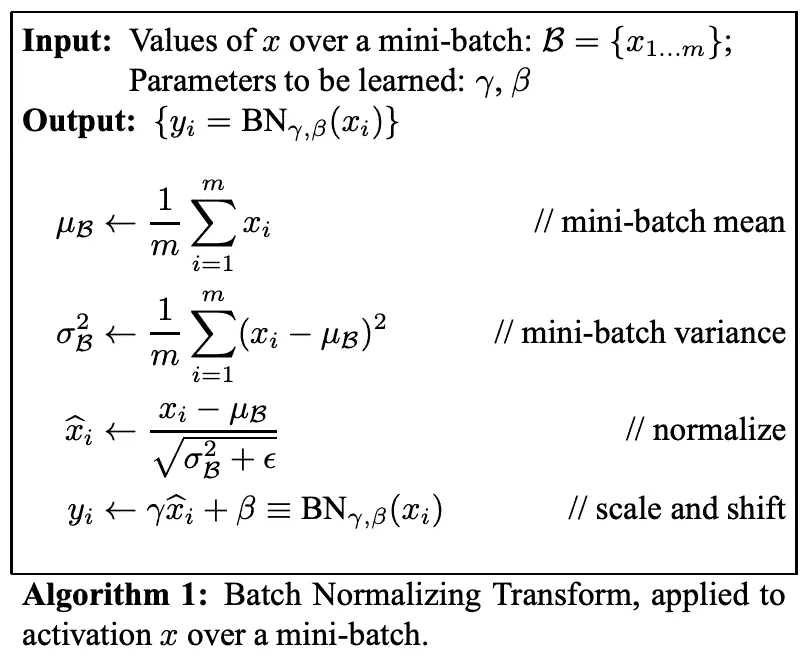
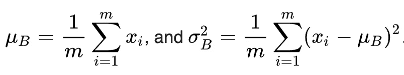
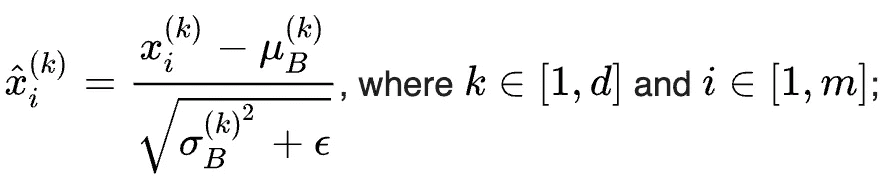
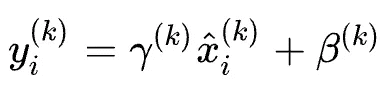
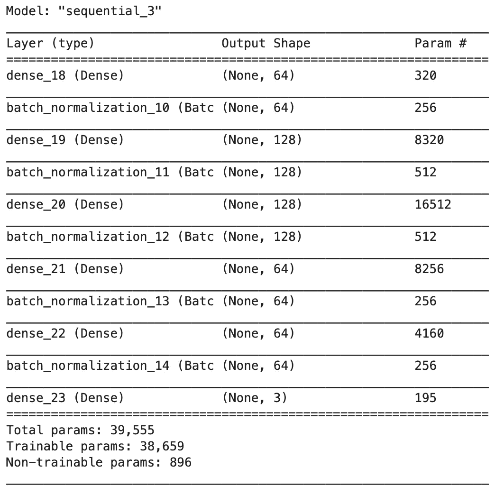
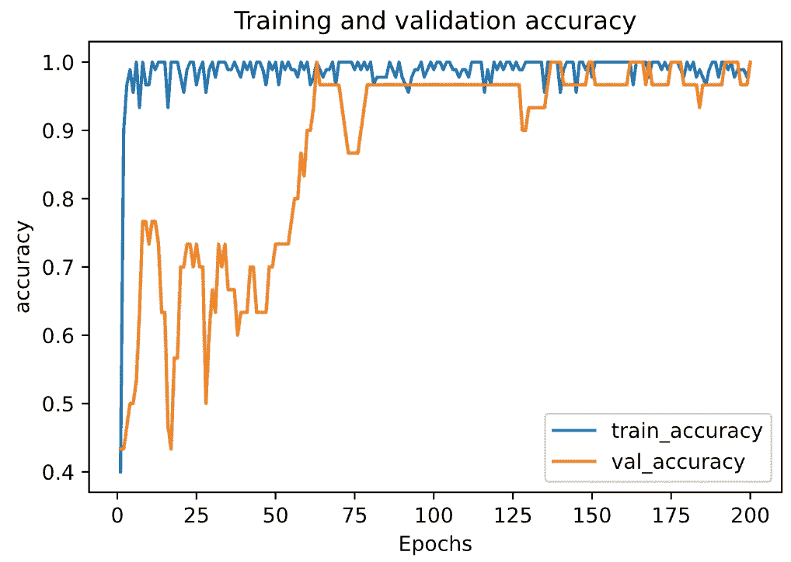
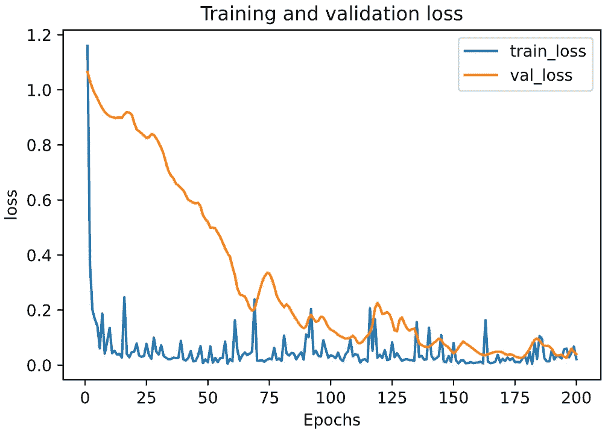

# 实践中的批量规范化:以 Keras 和 TensorFlow 2.0 为例

> 原文：<https://towardsdatascience.com/batch-normalization-in-practice-an-example-with-keras-and-tensorflow-2-0-b1ec28bde96f?source=collection_archive---------2----------------------->

## 添加和自定义批处理规范化的分步教程


照片由[马库斯·温克勒](https://unsplash.com/@markuswinkler?utm_source=unsplash&utm_medium=referral&utm_content=creditCopyText)在 [Unsplash](https://unsplash.com/s/photos/machine-learning?utm_source=unsplash&utm_medium=referral&utm_content=creditCopyText) 上拍摄

在本文中，我们将重点关注在我们的机器学习模型中添加和定制批处理规范化，并查看一个示例，说明我们如何在 Keras 和 TensorFlow 2.0 的实践中做到这一点。

# 批处理规范化的简明介绍

在深度学习的兴起中，最重要的一个思想一直是一种叫做 ***批量规格化*** (也叫 ***批量规格化*** )的算法。

> ***批量标准化*** 是一种用于训练深度神经网络的技术，它将每个小批量的输入标准化到一个层。这具有稳定学习过程和显著减少训练深度网络所需的训练时期的效果。
> 
> 杰森·布朗利

在训练期间，可以通过计算每个小批量层的每个输入变量的平均值和标准偏差，并使用这些统计数据来执行标准化，从而实现批量标准化。

形式上，批处理规范化算法[1]被定义为:



来自原论文:[批量归一化:通过减少内部协变量移位加速深度网络训练](https://arxiv.org/pdf/1502.03167v3.pdf)

在该算法中，`*B*`被用来表示整个训练集的一个规模为`m`的小批量。`*B*`的均值和方差可计算如下:



对于具有 *d* 维度输入`*x* = (*x_1*, …, *x_d*)`的层，其输入的每个维度可以单独归一化(重新居中和重新缩放)。因此，一个 *d* 维输入的归一化可以计算为:



ε加在分母中以保持数值稳定，它是一个任意小的常数。

最后，为了恢复网络的表示能力，变换步骤被定义为:



其中参数β和γ随后在优化过程中被学习。

批量标准化的好处有[2]:

*   **可以更快地训练深度神经网络:**虽然由于正向传递期间的额外归一化计算和反向传播期间要训练的额外超参数，每次训练迭代将更慢，但它应该收敛得更快；因此，训练总体上应该更快。
*   **更高的学习率:**梯度下降一般需要较小的学习率，网络才能收敛。随着网络变得更深，梯度在反向传播过程中变得更小，因此需要更多的迭代。使用批量标准化允许更高的学习率，从而提高训练速度。
*   **更容易初始化权重:**权重初始化可能很困难，尤其是在创建更深层次的网络时。批次标准化降低了对初始起始重量的敏感度。

如果您正在寻找完整的解释，您可能会发现以下资源很有用:

*   [原纸](https://arxiv.org/abs/1502.03167)
*   [deep learning . ai 中的批量规范化](https://www.coursera.org/lecture/deep-neural-network/normalizing-activations-in-a-network-4ptp2)

在下面的文章中，我们将在我们的机器学习模型中添加和定制批处理规范化。

# 环境设置、源代码和数据集准备

我们将使用与在[模型正则化教程](/machine-learning-model-regularization-in-practice-an-example-with-keras-and-tensorflow-2-0-52a96746123e)中相同的数据集。如果你已经熟悉这一章，你可以跳过它。

为了运行本教程，您需要安装

> *TensorFlow 2，numpy，pandas，sklean，matplotlib*

它们都可以直接安装在 vis PyPI 上，我强烈建议创建一个新的虚拟环境。关于创建 Python 虚拟环境的教程

*   [使用“virtualenv”创建虚拟环境，并将其添加到 Jupyter 笔记本中](/create-virtual-environment-using-virtualenv-and-add-it-to-jupyter-notebook-6e1bf4e03415)
*   [使用“conda”创建虚拟环境，并将其添加到 Jupyter 笔记本中](https://medium.com/analytics-vidhya/create-virtual-environment-using-conda-and-add-it-to-jupyter-notebook-d319a81dfd1)

## 源代码

这是一个循序渐进的教程，所有的说明都在这篇文章中。源代码请查看我的 Github [机器学习报告](https://github.com/BindiChen/machine-learning)。

## 数据集准备

本教程使用[安德森鸢尾花(iris)](https://en.wikipedia.org/wiki/Iris_flower_data_set) 数据集进行演示。数据集包含五个属性下的一组 150 条记录:*萼片长度*、*萼片宽度*、*花瓣长度*、*花瓣宽度、*和*类别*(从 sklearn 数据集称为*目标*)。

首先，让我们导入库并从 ***scikit-learn*** 库中获取虹膜数据集。你也可以从 [UCI 虹膜数据集](https://archive.ics.uci.edu/ml/datasets/iris)下载。

```
import tensorflow as tf
import pandas as pd
import numpy as np
import matplotlib.pyplot as plt
from sklearn.datasets import load_iris
from sklearn.model_selection import train_test_split**iris = load_iris()**
```

为了研究数据，让我们将数据加载到一个数据帧中

```
# Load data into a DataFrame
**df = pd.DataFrame(iris.data, columns=iris.feature_names)** # Convert datatype to float
**df = df.astype(float)** # append "target" and name it "label"
**df['label'] = iris.target** # Use string label instead
**df['label'] = df.label.replace(dict(enumerate(iris.target_names)))**
```

并且`df`应该如下所示:


我们注意到 ***标签*** 列是一个分类特征，需要将其转换为[一键编码](/what-is-one-hot-encoding-and-how-to-use-pandas-get-dummies-function-922eb9bd4970)。否则，我们的机器学习算法将无法直接将其作为输入。

```
# label -> one-hot encoding
**label = pd.get_dummies(df['label'], prefix='label')**
**df = pd.concat([df, label], axis=1)**
# drop old label
df.drop(['label'], axis=1, inplace=True)
```

现在，`df`应该是这样的:


接下来，让我们创建`X`和`y`。Keras 和 TensorFlow 2.0 只接受 Numpy 数组作为输入，所以我们必须将 DataFrame 转换回 Numpy 数组。

```
# Creating X and y**X = df[['sepal length (cm)', 'sepal width (cm)', 'petal length (cm)', 'petal width (cm)']]**
# Convert DataFrame into np array
**X = np.asarray(X)y = df[['label_setosa', 'label_versicolor', 'label_virginica']]** # Convert DataFrame into np array
**y = np.asarray(y)**
```

最后，让我们使用来自 **sklearn** 库的`**train_test_split()**` 将数据集拆分成训练集(80%)和测试集(20%)。

```
X_train, X_test, y_train, y_test = **train_test_split**(
  **X,
  y,
  test_size=0.20**
)
```

太好了！我们的数据已经准备好建立一个机器学习模型。

# 用批量归一化建立神经网络模型

用 Keras 和 TensorFlow 2.0 创建机器学习模型有 [3 种方法。由于我们正在构建一个简单的全连接神经网络，为了简单起见，让我们使用最简单的方法:带有`Sequential()`的顺序模型。](/3-ways-to-create-a-machine-learning-model-with-keras-and-tensorflow-2-0-de09323af4d3)

首先，让我们导入`Sequential`和`BatchNormalization`

```
from tensorflow.keras.models import **Sequential**
from tensorflow.keras.layers import Dense, **BatchNormalization**
```

让我们继续创建一个顺序模型

```
model = Sequential([
    Dense(64, **input_shape=(4,)**, activation="relu"),
    Dense(128, activation='relu'),
    Dense(128, activation='relu'),
    Dense(64, activation='relu'),
    Dense(64, activation='relu'),
    Dense(3, **activation='softmax'**)
]);
```

我们的型号有以下规格:

*   第一层(也称为输入层)有`input_shape`来设置输入尺寸`(4,)`
*   输入层有 64 个单元，后面是 2 个密集层，每个层有 128 个单元。然后还有 2 个密度层，每个层有 64 个单元。所有这些层都使用`relu`激活功能。
*   输出密集层有 3 个单元和`softmax`激活功能。

我们可以将批量规范化添加到我们的模型中，添加方式与添加`Dense`层相同。

```
model = Sequential([
    Dense(64, input_shape=(4,), activation="relu"),
    **BatchNormalization(),**
    Dense(128, activation='relu'),
    **BatchNormalization(),**
    Dense(128, activation='relu'),
    **BatchNormalization(),**
    Dense(64, activation='relu'),
    **BatchNormalization(),**
    Dense(64, activation='relu'),
    **BatchNormalization(),**
    Dense(3, activation='softmax')
]);
```

`BatchNormalization()`在每一批标准化前一层的激活，默认情况下，它使用以下值[3]:

*   动量默认为`0.99`
*   超参数ε默认为`0.001`
*   超参数β默认为一个`all-zeros`向量
*   超参数γ默认为一个`all-ones`矢量

这些都可以通过给`BatchNormalization()`添加可选参数来改变。例如

```
from tensorflow.keras.initializers import **RandomNormal, Constant**# Model with default batch normalization
model = Sequential([
    Dense(64, input_shape=(4,), activation="relu"),
    BatchNormalization(),
    Dense(128, activation='relu'),
    BatchNormalization(),
    Dense(128, activation='relu'),
    BatchNormalization(),
    Dense(64, activation='relu'),
    BatchNormalization(),
    Dense(64, activation='relu'),
    **BatchNormalization(
        momentum=0.95, 
        epsilon=0.005,
        beta_initializer=RandomNormal(mean=0.0, stddev=0.05), 
        gamma_initializer=Constant(value=0.9)
    ),**
    Dense(3, activation='softmax')
]);
```

`RandomNormal()`生成正态分布的张量，而`Constant()`生成常数值的张量。通过运行`model.summary()`，您应该会得到一个如下所示的模型摘要:



## 培养

现在让我们用批处理规范化来编译和拟合我们的模型。我们首先用以下规范编译我们的模型

*   使用 Adam ( `adam`)优化算法作为优化器
*   使用分类交叉熵损失函数(`categorical_crossentropy`)来解决我们的 ***多类分类*** 问题
*   为简单起见，使用`accuracy`作为我们在训练和测试期间评估模型的评估指标。

```
model.compile(
    **optimizer='adam', 
    loss='categorical_crossentropy', 
    metrics=['accuracy']**
)
```

之后，我们可以调用`model.fit()`来使我们的模型符合训练数据。

```
history = model.fit(
    X_train, 
    y_train, 
    epochs=200, 
    validation_split=0.25, 
    batch_size=40, 
    verbose=2
)
```

如果一切顺利，我们应该得到如下输出

```
Train on 90 samples, validate on 30 samples
Epoch 1/200
90/90 - 3s - loss: 0.8735 - accuracy: 0.5778 - val_loss: 1.0685 - val_accuracy: 0.6667
Epoch 2/200
90/90 - 0s - loss: 0.1983 - accuracy: 0.9333 - val_loss: 1.0640 - val_accuracy: 0.4667
......
......
Epoch 200/200
90/90 - 0s - loss: 0.0532 - accuracy: 0.9778 - val_loss: 0.1453 - val_accuracy: 0.9333
```

## 模型评估

最后，是时候看看这个模型到底有没有用了

*   绘制训练和验证损失和准确性，以观察我们的模型的准确性如何随着时间的推移而提高。
*   使用我们之前搁置的测试数据集`X_test`再次测试我们的模型

让我们创建一个函数`plot_metric()`来绘制指标。

```
%matplotlib inline
%config InlineBackend.figure_format = 'svg'
def plot_metric(history, metric):
    train_metrics = history.history[metric]
    val_metrics = history.history['val_'+metric]
    epochs = range(1, len(train_metrics) + 1)
    plt.plot(epochs, train_metrics)
    plt.plot(epochs, val_metrics)
    plt.title('Training and validation '+ metric)
    plt.xlabel("Epochs")
    plt.ylabel(metric)
    plt.legend(["train_"+metric, 'val_'+metric])
    plt.show()
```

通过运行`plot_metric(history, 'accuracy')`绘制精度进度。



通过运行`plot_metric(history, 'loss')`绘制损失进度。



在测试集上评估模型

```
# Evaluate the model on the test set
model.**evaluate**(**X_test**, **y_test**, verbose=2)
```

我们应该得到如下所示的输出

```
30/1 - 0s - loss: 0.1192 - accuracy: 0.9667
[0.11924469470977783, 0.96666664]
```

# 好了

感谢阅读。

请在我的 Github 上查看[笔记本的源代码。](https://github.com/BindiChen/machine-learning)

如果你对机器学习的实用方面感兴趣，请继续关注。

参考资料:

*   [1] [批量归一化:通过减少内部协变量偏移加速深度网络训练](https://arxiv.org/pdf/1502.03167v3.pdf)
*   [2]深度学习的以人为中心的视觉分析，第 7–8 页
*   [3] [来自 Keras API 文档的批量标准化](https://keras.io/api/layers/normalization_layers/batch_normalization/)