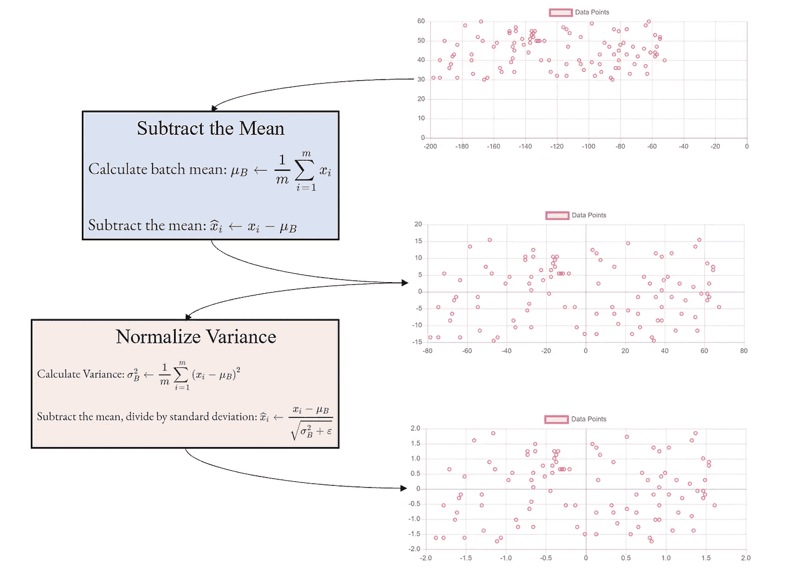
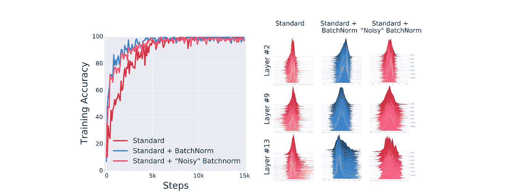

# 批处理规范化:一个非常通用的深度学习工具

> 原文：<https://towardsdatascience.com/batch-normalization-the-greatest-breakthrough-in-deep-learning-77e64909d81d?source=collection_archive---------19----------------------->

来源:[创新企业](https://s3.amazonaws.com/ie-summits/pages/background_images/000/002/409/original/Machine-learning-BG.jpg20180531-18048-r3l7vg?1540988666)。图片免费分享。

## 它是如何工作的——又是如何如此有效的？

尽管批处理规范化的概念本身相当简单，但它解决了深度神经网络中许多常见而持久的问题，因此被许多人视为深度学习中最伟大的突破之一。

训练一个卷积神经网络来处理图像在几个问题上非常困难——有大量的参数需要大量的计算，学习目标有许多糟糕的局部最小值，需要大量的训练数据，但最重要的是，特别容易出现消失和爆炸梯度。

消失梯度问题是在训练深度神经网络时经常遇到的不稳定行为的例子，并且当神经网络如此长且复杂以至于神经网络不能将有用的梯度信息反向传播到网络开始处的权重时发生。这通常是因为当信号在整个网络中反向传播时，激活功能会逐渐减弱信号。因此，模型输入附近的图层保持相对不变，提供的值很少，从而限制了模型发挥其真正的预测能力。因此，到目前为止，优化器只能使用它可以访问的权重来优化模型，因此，即使前端结构没有被利用，优化器也会停滞不前，没有任何改进。

由作者创建

另一方面，当大的误差梯度连续累积并导致训练期间神经网络权重的大的、不稳定的、钟摆状的更新时，就会出现爆炸性梯度问题。消失梯度和爆发梯度都提供了经常困扰神经网络的两个巨大问题。为了解决这些梯度问题，用于解决它们的主要方法包括小心地设置学习速率(当模型接近最优值时缓慢地衰减学习速率)，设计具有不同激活函数的更好的 CNN 架构，更小心地初始化权重，以及调整数据分布。最有效的解决方案是批量标准化。

批量归一化图层接收流经网络的数据，并输出经过重缩放和归一化的过滤器。这具有改变流经整个网络的输入分布的效果。

作者创建的图像。

最初的批处理规范化论文声称批处理规范化在提高深度神经网络性能方面如此有效是因为一种称为“内部协变量移位”的现象。根据这一理论，当模型参数更新时，深层神经网络中隐含层的输入分布不规则地变化。批量标准化本能地恢复输入的分布，这些输入在通过隐藏层时可能已经移动和伸展，从而防止训练受阻。

在 CIFAR-10 上训练的标准 VGG 网络的(a)训练(优化)和(b)测试(泛化)性能的比较，有和没有批量归一化。(c)使用和不使用批量标准化比较第三层和第十一层的权重。请注意更加集中和正常的分布，与标准的倾斜和不均匀的分布相反。来源— arXiv:1805.11604v5 .图片免费分享。

不幸的是，对内部协变量变化的本能解释被证明是不正确的。事实上，输入通过隐藏层时的分布变化似乎不会对模型的训练产生太大影响。揭示这一真理的开创性论文《批处理规范化如何帮助优化》的作者来自麻省理工学院，进行了一项实验，以衡量内部协变量转移理论的有效性。

实验中，在 CIFAR-10 数据集上训练了一个标准和两个标准+批量归一化标准 VGG16 网络架构。其中一个标准+批次归一化网络在批次归一化层之后*注入了完全随机的噪声，导致了大量的内部协变量偏移，而这些偏移无法通过批次归一化层进行“校正”。结果令人着迷——尽管很明显,“嘈杂”批量归一化网络后的权重分布不如常规批量归一化模型中的均匀，但它的表现一样好，两个批量归一化神经网络都优于标准网络。*

来源— arXiv:1805.11604v5 .图片免费分享。

相反，作者发现批处理规范化平滑优化景观。当梯度下降优化器试图找到全局最优值时，它需要对当前最优值是局部最优值还是全局最优值做出权衡决定，并牺牲误差的暂时增加以获得更大的下降。通常，在具有许多陡峭山峰、平坦平原和锯齿状山谷的崎岖地形中的优化者发现这项任务很困难，并且变得过度依赖于通常不小心设置的学习速率，从而导致较差的准确性。

来源— arXiv:1805.11604v5 .图片免费分享。

批量归一化大大减少了损失景观、梯度生产率和β平滑度的变化，使得导航地形以找到全局误差最小值的任务变得更加容易。简单地添加批量标准化图层具有几个巨大的优势:

*   *在设置初始学习率*时更加自由。大的初始学习率不会导致在优化过程中错过最小值，并且可以导致更快的收敛。
*   *加速学习速度衰减*。由于批量标准化使模型对超参数更加稳健，因此除了为最佳训练时间设置更高的初始学习速率之外，还可以加速学习速率衰减的速率。
*   *去掉漏音*。当使用批量标准化时，可以不使用漏失层，因为漏失会造成损坏和/或减慢训练过程。批量标准化引入了防止过度拟合的另一种形式。
*   *降低 L2 权重正规化。成功训练一个神经网络的很大一部分是调整权重。虽然使用 L2 正则化(以误差的平方来惩罚对象以强调对较大对象的惩罚)是有效且常用的，但它也带来了自己的一系列问题，包括权重复杂性的增加和过度拟合的趋势。批处理规范化具有正则化属性，这可能是一种更“自然”的正则化形式。*
*   *解决消失渐变问题*。虽然内部协变量移位可能不会提高精度，但它在某种程度上涉及到消失梯度问题。当输入的分布发生变化时，由于激活函数(例如，sigmoid 将最小值设置为 2.5，或 ReLU 将任何 *x <* 0 设置为 0)，它将倾向于固有的较小梯度更新。批量标准化有助于确保在反向传播过程中，通过将分布从网络的末端转移到起点，信号被听到且不被减弱。
*   *解决爆炸梯度问题。*由于批量标准化平滑了优化前景，它消除了累积的极端梯度，从而消除了梯度累积导致的主要重量波动。这极大地稳定了学习。

感谢阅读！