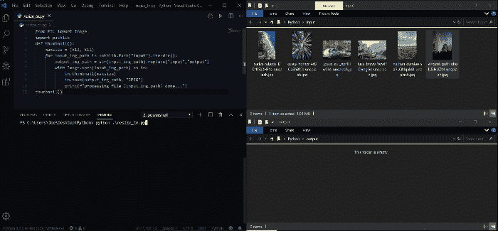

# 使用 Pillow 在 Python 中批量调整图像大小

> 原文：<https://towardsdatascience.com/batch-resizing-images-in-python-with-pillow-94f558b1759b?source=collection_archive---------21----------------------->

## 一个重要的 PYTHON 技巧

## 一步一步的使用 Python 调整图片大小的指南


带枕头的蟒蛇插图作者[金彩云](https://medium.com/@chaeyunkim)

有时你需要为你的项目编辑大量的图片。例如，在 web 开发中，大容量调整图像大小是为了使所有图像变得更小、更亮，以优化通过 web 的传输速度。在数据科学中，您可能需要提高所有图像的 DPI，以便在科学文章中发布。在图像处理软件中自己管理它们可能会很无聊。所以，你可以试着用枕头自动为你做这项工作！

这篇短文将通过一个示例脚本，一步步向您展示如何使用 Python 中的 **Pillow** ，重点关注批量调整图像大小。即使这个 **Pillow** 库已经推出很久了，它仍然像在 2020 年一样强大和非常有用。



使用 Python 和 Pillow 调整文件夹中所有图像大小的示例。(作者 gif)

例如，上面的 gif 图像显示，Python with Pillow 只需大约 8-10 行代码就可以调整/重缩放一个文件夹中的所有图像文件。Pillow 可以完成多种操作，如调整大小、重新缩放、旋转、变换、在文件格式之间转换、增强对比度等等。

# **我们开始吧！**

## 装置

您可以简单地使用`**pip**` 安装**枕**库，如下所示:

```
**$ pip install pillow**
```

Python 2.x 不再支持最新的 Pillow。您可以在下面检查 Pillow 版本以匹配您的 Python 版本。


枕头版支持(来源:[https://pillow.readthedocs.io/en/stable/installation.html](https://pillow.readthedocs.io/en/stable/installation.html))

## 基本用法

枕头的概念很简单，有三个步骤

1.  加载一幅图像(或大量图像)
2.  进行一些图像编辑/处理操作
3.  以您喜欢的格式保存编辑过的图像。

```
**from PIL import Image** # ---- 1 ---- **im = Image.open("*input_path"*)** # ---- 2 ---- **# ... Do some operation** # ---- 3 ---- **im = Image.save("*output_path"*)**
```

## 支持格式

> **枕头**支持多种光栅文件格式。图书馆可以识别和阅读 30 多种不同的文件格式。书写支持不太广泛，但支持大多数常见的交换和表示格式。[1]

现在，让我们来看一些真实的例子:

# 真实实践

您可以使用`pathlib`或`os`遍历文件夹中的每个图像文件，然后使用 Pillow 加载图像。之后，您可以使用`thumbnail`命令将图像尺寸缩小到指定的最大宽度或最大高度值，并保留图像的外观。

```
# Load image 
**im = Image.open(input_img_path)**#Smaller image/ preserve the aspect of the image **resized_im = im.thumbnail(<maxwidth>, <maxheight>)**# Or Resize image to exact specified size **resized_im = im**.**resize(<width>, <height>)** # Then, save the resized image
**resized_im**.**save(<output_img_path>, <file type>, dpi, ...)**
```

例如，下面的脚本显示了如何调整名为“input”的文件夹中的所有图像的大小，使其最大宽度和高度为 512 像素，并保留图像的外观，并将它们以 300 dpi 的 JPEG 格式保存在“output”文件夹中。这个例子使用`pathlib`遍历一个文件夹中的所有文件。

[resizeImages.py](https://gist.github.com/JoeThunyathep/e8f843e26ec822ec9cec58c9ba3e9431)

使用这个脚本，您可以在第 7 行和第 8 行之间添加任何图像操作。如旋转，变换，文件格式之间的转换，增强对比度。您可以从 Pillow [文档](https://pillow.readthedocs.io/en/stable/index.html)中看到可用操作的列表。

此外，还有几个 Python 图像处理工具可以使用，比如 OpenCV 和 scikit Image。

## 临终遗言

所以，大概就是这样。我希望你喜欢这篇文章，并发现它对你的日常工作或项目有用。如果您有任何问题或意见，请随时给我留言。

关于我&查看我所有的博客内容:[链接](https://joets.medium.com/about-me-table-of-content-bc775e4f9dde)

安全**健康**和**健康**！💪

**感谢您的阅读。📚**

## 参考

[1]Alex Clark[https://Pillow . readthe docs . io/en/stable/handbook/image-file-formats . html](https://pillow.readthedocs.io/en/stable/handbook/image-file-formats.html)(2020)，Pillow (PIL 福克)