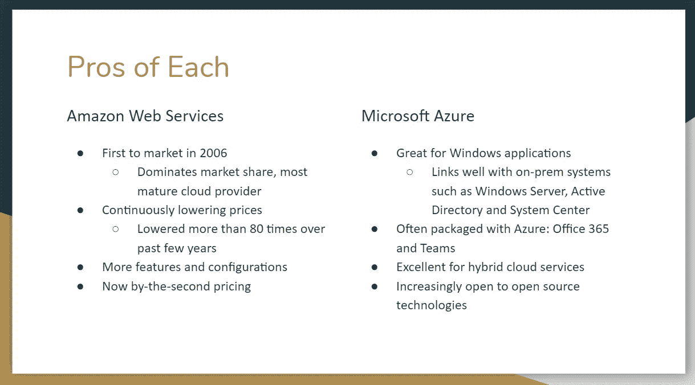
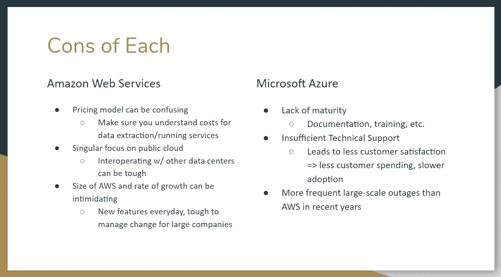

# 公共云之王争夺战:AWS vs. Azure

> 原文：<https://towardsdatascience.com/battle-for-the-king-of-public-cloud-aws-vs-azure-9c5505dabb1e?source=collection_archive---------40----------------------->

## 我应该信任谁来满足我的企业未来十年的软件开发需求？

照片由来自 [Pexels](https://www.pexels.com/photo/art-carving-close-up-crown-189528/?utm_content=attributionCopyText&utm_medium=referral&utm_source=pexels) 的[迈克](https://www.pexels.com/@mikebirdy?utm_content=attributionCopyText&utm_medium=referral&utm_source=pexels)拍摄

不管你喜不喜欢，公共云正在接管。有什么不喜欢的呢？

云计算使得管理我们所有的计算机系统资源变得非常容易。它提供了一个抽象层，这在 2006 年之前似乎是不可能的。

我们不再需要以物理方式管理我们的底层基础架构。这些发展意味着我们不再需要:

*   购买不动产来放置我们的服务器。
*   雇佣工人来处理维护(供暖/制冷、电线等。)
*   当我们看到使用量激增时，添加新的物理服务器。
*   受到任何类型的基础设施可用性的限制。

这使我们能够:

*   尽可能降低我们的成本。
*   专注于我们的业务，提高功能开发速度
*   有更好的安全性
*   通过改进的灾难恢复实现高可用性

我们业务的发展速度是前所未有的。我们从未有过如此快速地从计划到生产的能力。

但是，就像科技世界中的一切一样，一旦有了新的前沿，每个人都必须做出自己的版本。

我们将关注云计算领域的两个领导者:Amazon Web Services 和 Microsoft Azure。

# 目标

回答问题:我应该选择谁来满足我的企业未来十年的软件开发需求？

AWS 和微软 Azure 已经成为这个领域的两个领导者。所以今天，我们要深入研究这两个，并确定哪个更好。

# 目录

*   [AWS 概述](#0ded)
*   [蔚蓝概述](#81f3)
*   [利弊](#7f43)
*   [培训和认证](#1159)
*   [结论](#9147)

# AWS 概述

照片由[克里斯蒂安·威迪格](https://unsplash.com/@christianw?utm_source=unsplash&utm_medium=referral&utm_content=creditCopyText)在 [Unsplash](https://unsplash.com/s/photos/amazon?utm_source=unsplash&utm_medium=referral&utm_content=creditCopyText) 上拍摄

云计算可以追溯到 60 年代，那时首次实现了计算机不同方面的“虚拟化”。所以说亚马逊开创了云计算是不正确的。

但是就**基础设施即服务(IaaS)** 以及我们今天所知的方式而言，亚马逊在将它推向大众方面发挥了巨大作用。

什么是 IaaS？将原始计算能力作为服务提供的能力，以及通过互联网访问和配置新服务器和存储的能力。

如果不是亚马逊，我们会有云计算吗？很难想象我们会走到这一步。

早在 2006 年，亚马逊就推出了亚马逊网络服务。他们的第一批服务是 S3(简单存储服务)、EC2(弹性云计算)和 SQS(简单队列服务)。

这些服务允许您通过在线 web 服务界面(S3)将数据存储在在线存储中，在 web 应用程序之间进行通信(SQS)，以及按需部署新服务器(EC2)。

此后，截至 2020 年，AWS 的服务超过 212 项。这些服务几乎涵盖了您发展 IT 业务所需的一切。服务横跨数据库、网络、移动、开发者工具、物联网(IoT)、机器学习、AR & VR、区块链、量子技术。这个清单还在继续。

随着这些服务的发展，云计算游戏将被永远改变。

# Azure 概述

由 [Ashkan Forouzani](https://unsplash.com/@ashkfor121?utm_source=unsplash&utm_medium=referral&utm_content=creditCopyText) 在 [Unsplash](https://unsplash.com/s/photos/microsoft?utm_source=unsplash&utm_medium=referral&utm_content=creditCopyText) 上拍摄

微软 Azure 起步较晚，最初在 2008 年以“Project Red Dog”开始，并在 2010 年正式成为“Windows Azure ”,当时它已投入商业使用。这是它开始获得动力的时候。

Azure 寻求提供许多与 AWS 相同的服务，包括虚拟机、对象存储和内容交付网络。然而，这些服务是专门为微软产品设计的。

也就是说，如果您的企业是使用 Windows 堆栈(Microsoft SQL Services、Microsoft。网络服务、实时服务、Sharepoint 等。)，Azure 会对你有帮助。

意识到他们需要超越 Windows 堆栈，Azure 开始提供对更多编程语言、框架和操作系统的支持。

因为它不再只是 Windows 的工具，2014 年，他们更名为“微软 Azure”

与 AWS 类似，Azure 提供基础设施即服务(IaaS)、软件即服务(SaaS)和平台即服务(PaaS)。

# 利弊

## 赞成的意见

## 骗局

# 培训和认证

怎么才能入门？

获得其中任何一种云技术的认证对你和你的职业生涯来说都是非常有价值的，并且对于任何想要了解更多关于云的知识的人来说都是一个很好的起点。

## 微软目前提供三种认证:

*   Azure 管理员助理
*   Azure 解决方案架构师专家
*   Azure 安全工程师助理

## AWS 提供了更多(以及许多专业):

*   云从业者(基础)
*   开发人员(助理)
*   系统运行管理员(助理)
*   DevOps 工程师(专业)
*   解决方案架构师(助理和专业人员)

试图在解决方案架构师和开发人员认证之间做出选择？[点击这里](/solutions-architect-vs-developer-an-aws-certification-breakdown-4a7a28a8d7bd)看我对两者的对比。

如果你已经知道你想追求哪种认证，我已经写了一些关于如何开始获得[解决方案架构师](/the-ultimate-aws-solutions-architect-certification-guide-56c21d4078ed)和[开发人员](https://medium.com/better-programming/how-to-become-aws-cloud-developer-certified-7318a67f7085)认证的文章。

查看 [AWS](https://aws.amazon.com/certification/) 和 [Azure](https://www.microsoft.com/en-us/learning/certification-overview.aspx) 的完整认证列表。

# 结论

我想谈谈定价，并做一个功能细分；然而，这些云提供商中的每一个都在不断地重新思考他们的价格模型并发布新功能。今天在价格和功能可用性方面是正确的，明天可能就不正确了。

但是回到我们的问题:*我应该选择谁来托管我的企业未来十年的软件开发需求？*

当然，要看情况。如果你正在处理一个已经存在的微软堆栈，我会推荐 Azure。

但如果我要从零开始创业，并且只能选择一个，我会选择 AWS。为什么？因为 AWS 的成熟程度和培训机会。我觉得使用 AWS 作为我的云提供商会更安全。

如果我让一名新工程师入职，而他们对云一无所知，他们可以通过 AWS 认证快速学习。目前最热门的认证是 AWS 解决方案架构师和 AWS 开发人员，他们的需求量很大。

这并不是说微软不提供认证。他们是。他们只是还没有达到 AWS 的成熟水平。

不成熟也延伸到文档和技术支持。由于 AWS 自身和社区的大力支持，学习如何在 AWS 中使用新功能或故障排除变得更加简单。

当然，你可以一直使用多云策略，并两者并用。你不必只选择一个。

但是为了这个讨论，如果我*必须*选择一个，我会选择 AWS，因为它们目前的成熟度。

# 赖安·格里森报道

 [## Node.js 与 Spring Boot——你该选择哪一个？

### 轻松点。Spring Boot。对吗？没那么快…

medium.com](https://medium.com/better-programming/node-js-vs-spring-boot-which-should-you-choose-2366c2f76587)  [## 是时候忘记反应，加入苗条的潮流了吗？

### 一场真正的泰坦之战(苗条还能算泰坦吗？)

medium.com](https://medium.com/better-programming/is-it-time-we-forget-react-and-jump-on-the-svelte-bandwagon-4848bb5d0839)  [## 解决方案架构师与开发人员:AWS 认证细分

### 哪个适合你？

towardsdatascience.com](/solutions-architect-vs-developer-an-aws-certification-breakdown-4a7a28a8d7bd)