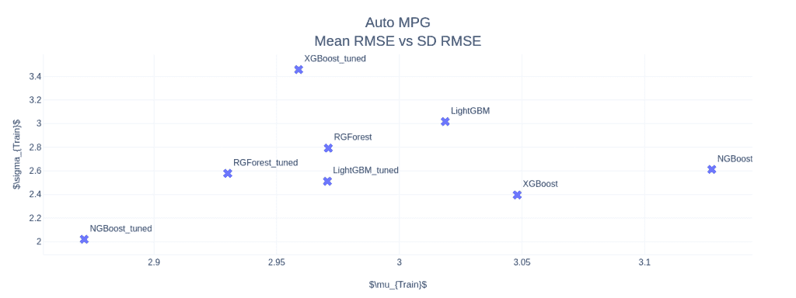

# 助推器之战

> 原文：<https://towardsdatascience.com/battle-of-the-boosters-8ffd0671e56b?source=collection_archive---------56----------------------->

## [梯度助推器](http://towardsdatascience.com/tagged/the-gradient-boosters)

## 最后一名支持者站在一场激烈的打斗比赛中

在梯度推进领域，我们已经取得了长足的进步。如果您已经阅读了整个系列，那么您应该对这个领域中主要算法的理论和实践方面有更好的理解。在对这些算法背后的数学和理论进行了一番严肃的研究后，我认为在一篇高度实用的博客文章中看到它们的实际应用会是一个有趣的改变。

所以，我向你们展示，助推器之战。


[出席](https://unsplash.com/@attentieattentie?utm_source=medium&utm_medium=referral)在 [Unsplash](https://unsplash.com?utm_source=medium&utm_medium=referral) 上的照片

# 数据集

我从 Kaggle 数据集中选择了几个数据集进行回归，主要是因为它在 Google Colab 中易于设置和运行。另一个原因是，我不需要在数据预处理上花很多时间，相反，我可以选择一个公共内核并开始破解。我还将分享我们选择的数据集的 EDA 的一个内核。所有的笔记本也会被分享，博客底部有链接。

1.  [auto pgg](https://www.kaggle.com/uciml/autompg-dataset)—数据是来自 UCI 机器学习库的汽车技术规格。
    外形:(398，9)， [EDA 内核](https://www.kaggle.com/devanshbesain/exploration-and-analysis-auto-mpg)，数据量:低
2.  [房价:高级回归技术](https://www.kaggle.com/c/house-prices-advanced-regression-techniques/overview)—Ames 住房数据集由 Dean De Cock 编制，用于数据科学教育。对于寻找经常被引用的波士顿住房数据集的现代化和扩展版本的数据科学家来说，这是一个令人难以置信的替代方案。有 79 个解释变量描述了(几乎)爱荷华州埃姆斯住宅的每个方面，这个比赛挑战你预测每个家庭的最终价格。
    外形:(1460，81)， [EDA 内核](https://www.kaggle.com/erikbruin/house-prices-lasso-xgboost-and-a-detailed-eda)，数据量:中等
3.  [电动机温度](https://www.kaggle.com/wkirgsn/electric-motor-temperature) —数据集包括从部署在测试台上的永磁同步电动机(PMSM)收集的几个传感器数据。PMSM 代表了德国 OEM 的原型模型。
    外形:(998k，13)， [EDA 内核](https://www.kaggle.com/wkirgsn/eda-and-baseline-on-motor-temperature-estimation)，数据量:高

# 实验装置

# 竞争中的算法

1.  XGBoost
2.  LightGBM
3.  正则贪婪森林
4.  NGBoost

# 数据预处理

这里没什么特别的。只是做了一些基本的数据清理和缩放。大部分代码来自某个随机内核。唯一的一点是，相同的预处理应用于所有算法

# 交叉验证设置

我选择了交叉验证，以确保不同算法之间的比较更具普遍性，而不是针对某个特定的数据分割。在这个练习中，我选择了一个简单的 5 折 K 折。

# 估价

**评估指标:**均方误差

为了对所有算法进行标准评估(幸好它们都是 Sci-kit Learn api)，我定义了几个函数。

**默认参数:**首先用模型的默认参数拟合 CV 分割。我们记录 CV 分数的平均值和标准偏差，然后拟合整个训练分割以预测测试分割。


**使用超参数调整**:与上一个非常相似，但是增加了一个 GridSearch 步骤来查找最佳参数。


超参数调优并不详尽，但相当不错。

我们针对不同算法运行 GridSearch 的网格有

**XGBoost** :

```
{ "learning_rate": [0.01, 0.1, 0.5], "n_estimators": [100, 250, 500], "max_depth": [3, 5, 7], "min_child_weight": [1, 3, 5], "colsample_bytree": [0.5, 0.7, 1], }
```

**灯 GBM** :

```
{ "learning_rate": [0.01, 0.1, 0.5], "n_estimators": [100, 250, 500], "max_depth": [3, 5, 7], "min_child_weight": [1, 3, 5], "colsample_bytree": [0.5, 0.7, 1], }
```

RGF :

```
{ "learning_rate": [0.01, 0.1, 0.5], "max_leaf": [1000, 2500, 5000], "algorithm": ["RGF", "RGF_Opt", "RGF_Sib"], "l2": [1.0, 0.1, 0.01], }
```

**NGBoost** :

因为 NGBoost 有点慢，我没有为所有实验定义一个标准的网格，而是沿着每个参数独立地搜索，并根据实验的直觉决定一个网格

# 结果

我已经列出了所有三个数据集的训练 CV 分割的 RMSEs 的平均值和标准偏差。对于电动马达，我没有调整数据，因为它的计算成本很高。

# 自动编程


自动 MPG 数据集结果



自动 MPG 平均值与 SD (RMSE)散点图


4 次 CV 分割和 1 次测试分割的执行时间

# 房价:高级回归技术


房价数据集结果


房价均值与标准差(RMSE)散点图


4 次 CV 分割和 1 次测试分割的执行时间

# 电机温度


电机温度数据集结果


电机温度平均值与标准差(RMSE)散点图


4 次 CV 分割和 1 次测试分割的执行时间

# 最后的话

> ***免责声明*** :这些实验绝不是完整的。人们需要更大规模的实验来得出哪个算法做得更好的结论。此外，我们还需要记住没有免费的午餐定理。

马上，NGBoost 似乎是这个领域的一个强有力的竞争者。在 AutoMPG 和房价数据集中，NGBoost 在所有其他助推器中表现最好，无论是在平均 RMSE 还是在 CV 分数的标准差上，都是如此，而且差距很大。NGBoost 还显示了默认版本和优化版本之间相当大的差距。这表明，要么默认参数没有设置好，要么数据集的每次调整都是从 NGBoost 获得良好性能的关键因素。但是该算法的致命弱点是运行时间。这些巨大的横条高耸在其他横条之上，我们可以看到，与其他加速器相比，运行时实际上处于不同的规模。特别是在像电机温度数据集这样的大型数据集上，运行时间非常大，因此我也没有调整算法。在竞争中，它在其他支持者中排名最后。

另一个突出的算法是正则化贪婪森林，它的性能与 XGBoost 一样好，甚至更好。在中低数据设置下，运行时间也堪比在位王者 XGBoost。

在低数据设置下，XGBoost 和 LightGBM 等流行算法表现不佳。并且 CV 值的标准差较高，特别是 XGBoost，表明它过拟合。XGBoost 在三个例子中都有这个问题。在运行时方面，LightGBM 是王者(尽管我没有针对计算性能进行过调整)，在所有三个例子中都击败了 XGBoost。在高数据设置中，它通过比其他竞争对手低得多的 RMSE 和运行时间，击败了其他一切。

## 带实验的 Colab 笔记本

*   [自动 MPG](https://colab.research.google.com/drive/1CRlVgzzjZQH7EN8YfSWr1bOGMfDZ_jFo?usp=sharing)
*   [房价](https://colab.research.google.com/drive/1jtPpCcNpRCVE-BTEAR8irdbV1Qfo0Bax?usp=sharing)
*   [电机温度](https://colab.research.google.com/drive/1J6vG4sMudRr1gKJ0nJvnHk6_JmxjCird?usp=sharing)

## **其他文章** [***渐变增强器***](http://towardsdatascience.com/tagged/the-gradient-boosters)

*   [良好的旧梯度增强](/the-good-old-gradient-boosting-f4614b0e62b0)
*   [正规化的贪婪森林](/regularized-greedy-forest-a17cd0c85f06)
*   [XGBoost](/xgboost-b736c2ab10ce)
*   [LightGBM](/lightgbm-800340f21415)
*   [CatBoost](/catboost-d1f1366aca34)
*   [自然渐变](/natural-gradient-ce454b3dcdfa)
*   [NGBoost](/ngboost-aca51711c8f5)

我们已经在梯度增强领域取得了长足的进步，我希望至少对你们中的一些人来说，梯度增强并不意味着 XGBoost。这个世界上有很多算法都有自己的特点，其中很多算法的性能与 XGBoost 相当或者更好。另一个令人兴奋的领域是概率回归。我希望 NGBoost 变得更加高效，跨越计算效率障碍。一旦发生这种情况，NGBoost 是概率回归空间中一个非常强的候选者。

*原载于 2020 年 7 月 1 日 http://deep-and-shallow.com*[](https://deep-and-shallow.com/2020/07/01/the-gradient-boosters-vii-battle-of-the-boosters/)**。**