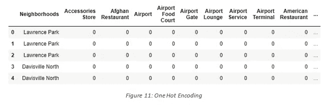
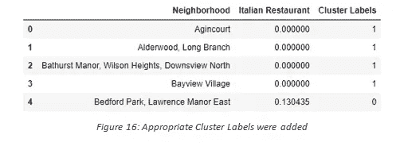
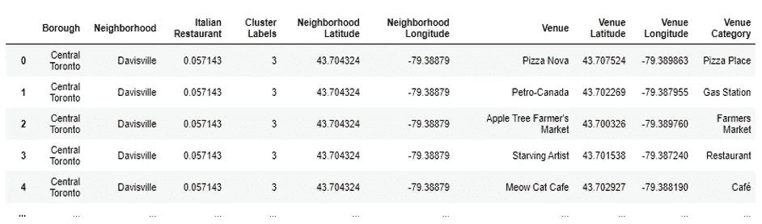

# 邻里之战

> 原文：<https://towardsdatascience.com/battle-of-the-neighborhoods-b72ec0dc76b5?source=collection_archive---------46----------------------->

照片由 [Pixaby](https://pixabay.com/photos/toronto-skyline-waters-sunset-dawn-3112508/) 提供

## 使用数据科学在多伦多寻找最佳社区

作者:乌马尔·汗

这个项目旨在利用在 IBM 数据科学专业课程中学到的所有数据科学概念。我们定义一个业务问题，将被利用的数据，并使用这些数据，我们能够使用机器学习工具来分析它。在这个项目中，我们将一步一步地经历从问题设计、数据准备到最终分析的所有过程，并最终提供一个商业利益相关者可以用来做决策的结论。

# 目录

1.  介绍
2.  目标受众
3.  数据概述
4.  方法学
5.  讨论
6.  结论

# **1。识别业务问题(简介):**

多伦多是加拿大人口最稠密的地区之一。作为充满机会的土地，它将来自不同种族背景的各种各样的人带到了加拿大的核心城市多伦多。作为加拿大最大的城市，估计人口超过 600 万，人口的多样性是毋庸置疑的。多元文化体现在各个社区，包括:唐人街、Corso Italia、小印度、肯辛顿市场、小意大利、韩国城等等。多伦多市中心是不同种族之间互动的中心，为企业家提供了许多创业或发展业务的机会。这是一个人们可以尝试各种文化精华的地方，无论是在工作时还是只是路过。多伦多以其美食而闻名。

这个项目的目标是使用 Foursquare 的位置数据和场地信息的区域聚类来确定多伦多开设餐馆的“最佳”社区。比萨和意大利面是多伦多最受欢迎的菜肴之一，源自意大利。多伦多是意大利人的第四大家园，人口超过 50 万，有很多机会开一家新的意大利餐厅。通过这个项目，我们将为一位企业家在加拿大多伦多开设一家新的意大利餐厅找到最合适的地点。

[Pablo](https://unsplash.com/@pablomerchanm) 在 [Unsplash](https://unsplash.com/photos/GFW3dJRiMsQ) 拍摄的照片

# 2.目标受众

这个项目是针对那些想开一家新的意大利餐馆或扩大现有业务的企业家或企业主的。分析将提供目标受众可以使用的重要信息

# 3.数据概述

将需要的数据将是已准备好的 CSV 文件的组合，用于从多个来源进行分析，这些来源将提供多伦多的街区列表(通过维基百科)、街区的地理位置(通过地理编码器包)和与意大利餐馆有关的地点数据(通过 Foursquare)。场地数据将有助于找到哪个街区最适合开设意大利餐厅。

# 3.1 —数据采集:

## 来源 1:通过维基百科的多伦多社区

图 1:维基百科页面显示了多伦多的居民区列表以及各自的邮政编码

1.  [https://en . Wikipedia . org/wiki/List _ of _ postal _ codes _ of _ Canada:_ M](https://en.wikipedia.org/wiki/List_of_postal_codes_of_Canada:_M)

上面显示的维基百科网站提供了几乎所有关于社区的信息。它包括邮政编码，行政区和多伦多的街区名称。由于数据的格式不适合分析，所以从这个站点收集数据(如图*图 2* 所示)。

图 2:从维基百科网站收集的数据放入熊猫数据框

## 来源 2:使用地理编码器包的地理位置数据

2.【https://cocl.us/Geospatial_data 

第二个数据来源为我们提供了带有各自邮政编码的街区的地理坐标。该文件是 CSV 格式的，所以我们必须将其附加到 Pandas 数据框中(如图 3 所示)。

## 来源 3:使用 Foursquare 的场馆数据

我们进行了一些数据清理。从图 5(上图)中可以看出，邻域是按照邻域的名称进行分组的，因此以后的数据聚类更加容易。

# 4.方法学

# 4.1 —数据清理

在收集所有数据并将其放入数据框后，需要清理和合并数据以开始分析过程。从维基百科获取数据时，有些行政区未被分配到任何街区。因此，做出了以下假设:

1.只会处理具有指定区的像元。未分配的行政区会被忽略。

2.一个邮政编码区中可以有多个居民区。例如，在维基百科页面的表格中，您会注意到 M5A 被列出了两次，并且有两个街区:Harbourfront 和 Regent Park。这两行将合并成一行，相邻行用逗号分隔，如图*图 2* 第 4 行所示。

3.如果一个像元有一个区，但没有分配邻域，那么邻域将与区相同。

在实现以下假设后，根据区对行进行分组，如下所示。

使用从 Geocoder 包中收集的纬度和经度，我们根据邮政编码将两个表合并在一起。

之后，从 Foursquare API 中提取的场地数据与上表合并，为我们提供了 500 米半径内的本地场地，如下所示。

# 4.2 —数据探索

清理完数据后，下一步是分析数据。然后我们用叶子制作了一张地图，并根据每个街区所在的行政区对其进行了颜色编码。

这段代码为我们提供了下面的地图:

接下来，我们使用 Foursquare API 获得多伦多所有场所的列表，包括公园、学校、咖啡馆、亚洲餐馆等。获得这些数据对于分析多伦多的意大利餐馆数量至关重要。多伦多总共有 45 家意大利餐馆。然后，我们将 Foursquare 地点数据与邻近地区数据合并，这样我们就可以得到每个邻近地区最近的地点。

# 4.3 —机器学习

然后，为了分析数据，我们执行了一项技术，将分类数据转换为机器学习算法的数值数据。这种技术叫做 **One hot encoding** 。对于每一个街区，单个场馆被转换成每个街区有多少个场馆的频率。

然后，我们根据邻近地区对这些行进行分组，并取每个场馆类别出现频率的**平均值**。

之后，我们创建了一个新的数据框，它只存储街区名称以及该街区意大利餐馆的平均出现频率。这使得数据可以基于每个单独的邻域进行汇总，并使数据分析更加简单。

## k 均值聚类

为了使分析更有趣，我们希望根据附近意大利餐馆的平均数量对附近进行聚类。为此，我们使用了 **K-Means** 聚类。为了得到我们的最佳 K 值，既不过度拟合也不欠拟合模型，我们使用了**肘点**技术。在这种技术中，我们使用不同数量的 K 值进行测试，测量精确度，然后选择最佳的 K 值。最佳 K 值选择在直线具有最大转弯的点上。在我们的例子中，我们的肘点在 K = 4。这意味着我们总共有 4 个集群。

然后，我们使用一个模型，准确地指出最佳 K 值。我们从 *Yellowbrick 包中导入了“ *KElbowVisualizer* ”。*然后，我们将上面的 K-Means 模型与 Elbow visualizer 进行拟合。

这给出了下面的模型:

我们只是整合了一个模型来拟合误差并计算失真分数。从虚线中，我们可以看到弯头位于 K=4 处。此外，在 K-Means 聚类中，基于某个变量相似的对象被放入同一聚类中。具有相似的意大利餐馆平均频率的街区被分成 4 组。这些簇中的每一个被标记为从 0 到 3，因为标记的索引从 0 而不是 1 开始。

之后，我们将场地数据与上表合并，创建了一个新表，作为分析在多伦多新开一家意大利餐厅的新机会的基础。然后，我们使用 Python 中的 Folium 包创建了一个地图，并根据聚类标签对每个邻域进行了着色。

*   集群 1 —红色
*   集群 2 —紫色
*   第 3 组——蓝绿色
*   第 4 组—深卡其色

上图显示了意大利餐馆平均出现频率相似的不同聚类。

# 4.4 —数据分析

我们总共有 4 个聚类(0，1，2，3)。在我们逐一分析它们之前，让我们检查每个聚类中的街区总数以及该聚类中的平均意大利餐馆数。从使用 Matplotlib 制作的条形图(图 18)中，我们可以比较每个集群的邻域数量。我们看到，聚类 1 的邻域最少(1)，而聚类 2 的邻域最多(70)。簇 3 有 14 个街区，而簇 4 只有 8 个。然后我们比较了每个集群的平均意大利餐馆。

## 聚类分析

这一信息至关重要，因为我们可以看到，尽管聚类 1 中只有 1 个邻域，但其意大利餐馆的数量最多(0.1304)，而聚类 2 中的邻域最多，但意大利餐馆的平均数量最少(0.0009)。普通意大利餐馆的平均值构成了图 18 的数据。此外，从地图上，我们可以看到集群 2 中的居民区是人口最稀少的。现在让我们单独分析这些集群(注意:这些只是数据的片段)。

## *聚类 1(红色):*

第一组位于北约克地区。贝德福德和劳伦斯庄园东是该集群中的两个社区。集群 1 有 19 个独特的地点，其中只有 3 个是意大利餐馆。聚类 1 具有最高的意大利餐馆平均值，相当于 0.130435。意大利餐厅的平均水平最高的原因是，所有这些餐厅都在贝德福德和劳伦斯庄园东两个街区。

## *集群 2(蓝色):*

总共有 70 个街区，229 个不同的场地，只有一家意大利餐馆。因此，在第 2 组中靠近场馆的意大利餐馆的平均数量是最低的，为 0.01。在地图上，我们可以看到集群 3 的节点分散在整个多伦多，使其成为人口最稀少的集群之一。

## *集群 3(青绿色):*

集群 3 拥有第二低的意大利餐馆平均数。第 3 组主要位于市区，但也有一些在西多伦多，东多伦多和北约克的居民区。像瑞尔森，多伦多统治中心，唐米尔斯，花园区，女王公园和更多的街区都包括在这个集群中。总共有 176 个独特的场馆，其中 27 个是意大利餐厅。

## *聚类 4(深卡其色):*

第 4 组场馆位于多伦多市区、西部、东部和中部以及斯卡伯勒。中央湾街、多伦多大学、中央湾街和河谷镇等街区构成了这个集群。第 4 组共有 91 个独特的场馆，16 家意大利餐厅。这是该集群中意大利餐馆的第二高平均值，约为 0.063。

因此，每个聚类中的普通意大利餐馆的排序如下:

1.聚类 1 (≈0.1304)

2.聚类 4 (≈0.0632)

3.聚类 3 (≈0.0317)

4.聚类 2 (≈0.0009)

# 5.讨论:

大多数意大利餐馆都在由红色聚类表示的聚类 1 中。位于北约克区的意大利餐馆平均数量最高的街区是贝德福德公园和劳伦斯庄园东。尽管在集群 2 中有大量的社区，但是几乎没有意大利餐馆。我们看到，在多伦多市区(集群 3)有倒数第二的意大利餐馆。看看附近的场地，多伦多市中心是开设新意大利餐厅的最佳地点，因为该地区有许多社区，但几乎没有意大利餐厅，因此消除了任何竞争。拥有巨大机会的第二好的社区是在阿德莱德和国王、美景镇等地区。也就是第二组。该地区有 70 个街区没有意大利餐馆，这给了开一家新餐馆的好机会。这种分析的一些缺点是——聚类完全基于从 Foursquare API 获得的数据。此外，该分析没有考虑邻近地区的意大利人口，因为这在选择开设新意大利餐厅的地点时会起到很大的作用。这总结了该项目的最佳发现，并建议企业家在这些地方开设一家正宗的意大利餐厅，几乎没有竞争。

# 6.结论

总之，为了结束这个项目，我们有机会解决一个业务问题，解决这个问题的方式与真正的数据科学家相似。我们利用大量 Python 库来获取信息、控制内容、分解和可视化这些数据集。我们利用 Foursquare API 调查了多伦多附近的环境，从维基百科获得了大量数据，这些数据是我们用 Beautifulsoup 网络抓取库抓取的。我们还利用 seaborn 和 Matplotlib 库中的不同绘图进行了可视化。类似地，我们应用人工智能策略来预测给定信息的错误，并利用 follow 将其描绘在地图上。

有改进空间或某些缺点的地方让我们知道，这个项目可以在更多信息和独特的机器学习策略的帮助下进一步改进。此外，我们可以利用这一风险来调查任何情况，例如，开一家替代餐馆或开一家电影院等等。理想情况下，这项任务充当使用数据科学解决更复杂的现实生活问题的初始方向。

代码可以在 Github 上找到，也可以在 T2 的 Linkedin 上找到我！！！

进入下一个问题:)