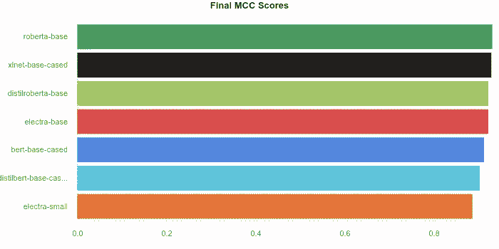
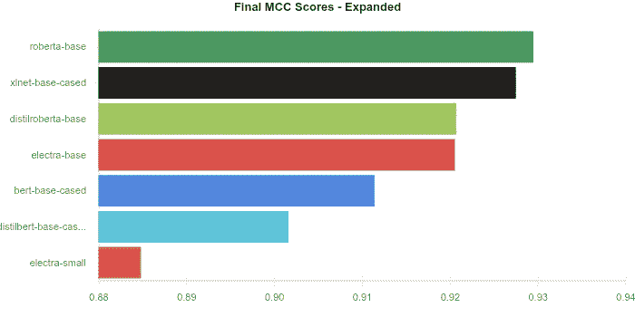
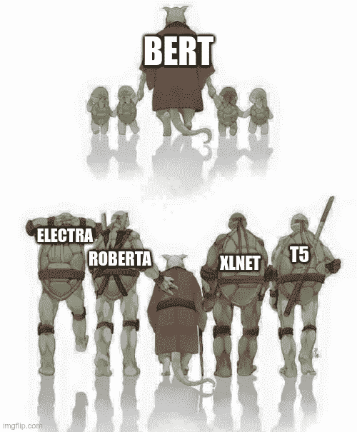
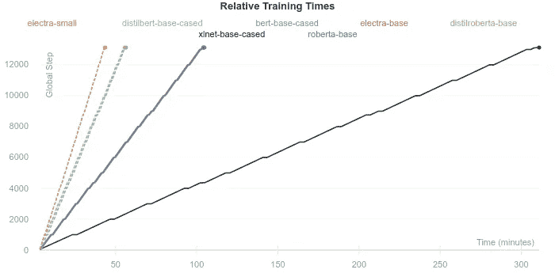
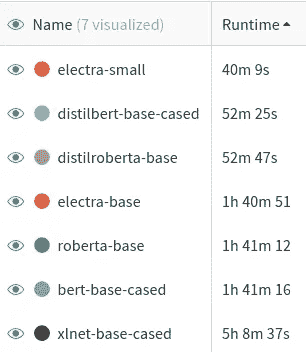
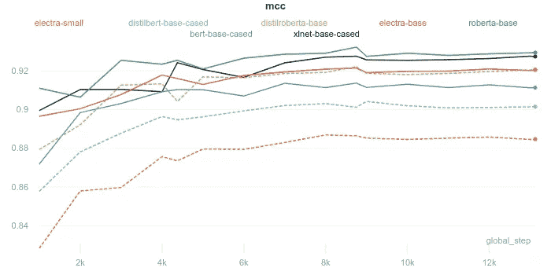

# 变形金刚之战:伊莱克特拉，伯特，罗伯塔，还是 XLNet

> 原文：<https://towardsdatascience.com/battle-of-the-transformers-electra-bert-roberta-or-xlnet-40607e97aba3?source=collection_archive---------11----------------------->

## 伊莱克特拉是新来的。让我们来看看它是如何对抗老守卫的！

图片由 [272447](https://pixabay.com/users/272447-272447/?utm_source=link-attribution&utm_medium=referral&utm_campaign=image&utm_content=569288) 来自 [Pixabay](https://pixabay.com/?utm_source=link-attribution&utm_medium=referral&utm_campaign=image&utm_content=569288)

Transformer 模型成功背后的“秘密”之一是迁移学习技术。在迁移学习中，一个模型(在我们的例子中是一个 Transformer 模型)使用一个无监督的*预训练目标在一个巨大的数据集上*预训练*。*同样的模型然后*在手头的实际任务中进行微调*(通常是监督训练)。这种方法的美妙之处在于*微调*数据集可以小到 500–1000 个训练样本！如果称之为深度学习，这个数字小到可能会被嗤之以鼻。这也意味着昂贵且耗时的流水线部分*预训练*只需进行一次，并且*预训练*模型可在此后的任意数量的任务中重复使用。因为*预先训练的*模型通常是公开的🙏，我们可以获取相关模型，*在自定义数据集上对其进行微调*，几个小时后就有一个最先进的模型可以使用了！

如果您有兴趣了解预训练如何工作，以及如何在单个 GPU 上训练一个全新的语言模型，请查看下面链接的我的文章！

 [## 理解 ELECTRA 并训练一个 ELECTRA 语言模型

### 变形金刚模型如何学习语言？伊莱克特拉有什么新消息？你如何在一个…

towardsdatascience.com](/understanding-electra-and-training-an-electra-language-model-3d33e3a9660d) 

ELECTRA 是谷歌发布的*预训练*变形金刚模型的最新类别之一，与大多数其他版本相比，它有所改变。在很大程度上，Transformer 模型遵循了人们熟知的深度学习路径，更大的模型、更多的训练和更大的数据集等于更好的性能。然而，ELECTRA 通过使用更少的计算能力、更小的数据集、*和*更少的训练时间，超越了早期的模型，如 BERT，从而扭转了这种趋势。*(如果你想知道，伊莱克特拉和伯特的“尺寸”是一样的)。*

在这篇文章中，我们将看看如何使用一个*预训练的* ELECTRA 模型进行文本分类，并在此过程中与其他标准模型进行比较。具体来说，我们将比较下面列出的每个模型的最终性能(马修斯相关系数 *(MCC)* )和训练时间。

*   electra-小型
*   电子基础
*   伯特基础案例
*   蒸馏底壳的
*   蒸馏贝塔碱
*   罗伯塔基地
*   xlnet-base-cased

和往常一样，我们将使用[简单变形金刚](https://github.com/ThilinaRajapakse/simpletransformers)库(基于拥抱脸[变形金刚](https://github.com/huggingface/transformers)库)来完成这项工作，并且我们将使用[权重&偏差](https://www.wandb.com/)进行可视化。

您可以在库的[示例目录](https://github.com/ThilinaRajapakse/simpletransformers/tree/master/examples/text_classification/yelp_reviews_polarity)中找到这里使用的所有代码。

# 装置

1.  从[这里](https://www.anaconda.com/distribution/)安装 Anaconda 或 Miniconda 包管理器。
2.  创建新的虚拟环境并安装软件包。
    `conda create -n simpletransformers python pandas tqdm`
    `conda activate simpletransformers`
    
3.  如果您使用 fp16 培训，请安装 Apex。请遵循此处的说明[。](https://github.com/NVIDIA/apex)
4.  安装简单变压器。
    

# 数据准备

我们将使用 Yelp 评论极性数据集，这是一个二元分类数据集。下面的脚本将下载它并存储在`data`目录中。或者，您可以从 [FastAI](https://s3.amazonaws.com/fast-ai-nlp/yelp_review_polarity_csv.tgz) 手动下载数据。

# 超参数

一旦数据在`data`目录中，我们就可以开始训练我们的模型。

简单的变压器模型可以进行广泛的配置(见[文档](https://simpletransformers.ai/docs/usage/#configuring-a-simple-transformers-model))，但是我们将只进行一些基本的、“足够好的”超参数设置。这是因为我们更感兴趣的是在平等的基础上相互比较模型，而不是试图优化每个模型的绝对最佳超参数。

考虑到这一点，我们将把`train_batch_size`增加到`128`，并且我们将把`num_train_epochs`增加到`3`，这样所有的模型都将有足够的训练来收敛。

这里需要注意的是，XLNet 的`train_batch_size`减少到了`64`，因为它不能在 RTX 泰坦 GPU 上用`train_batch_size=128`进行训练。但是，通过将`gradient_accumulation_steps`设置为`2`，将有效批量更改为`128`，可以将这种差异的影响降至最低。(每两步只计算一次梯度并更新一次模型权重)

影响训练的所有其他设置都保持默认值不变。

# 训练模型

设置培训流程非常简单。我们只需要将数据加载到数据帧中并定义超参数，然后我们就可以开始比赛了！

为了方便起见，我使用相同的脚本来训练所有模型，因为我们只需要在每次运行之间更改模型名称。模型名称由 shell 脚本提供，该脚本还会自动为每个模型运行训练脚本。

培训脚本如下所示:

*注意，Yelp 评论极性数据集使用标签* `*[1, 2]*` *分别表示正极和负极。我把这个改成* `*[0, 1]*` *分别表示否定和肯定。简单变形金刚要求标签从* `*0*` *(咄！)而负面情绪的一个标签* `*0*` *就直观了很多(在我看来)。*

可以自动化整个过程的 bash 脚本:

*注意，您可以通过向 bash 脚本添加* `*rm -r outputs*` *来删除每个阶段保存的模型。如果你没有足够的磁盘空间，这可能是个好主意。*

训练脚本还将记录权重和偏差的评估分数，让我们可以轻松地比较模型。

有关训练分类模型的更多信息，请查看简单转换程序文档。

# 结果

你可以在这里找到我所有的结果[。尝试使用不同的图表和信息！](https://app.wandb.ai/thilina/Classification%20Model%20Comparison?workspace=user-thilina)

让我们回顾一下重要的结果。

## 最终分数

这些是每个模型获得的最终 MCC 分数。如你所见，所有型号的分数都非常接近。

为了更好地了解差异，下面的图表放大到 X 轴，只显示范围 0.88-0.94。

*请注意，放大视图虽然有助于发现差异，但会扭曲对结果的感知。因此，下表仅用于说明目的。* ***当心隐藏了零的图！***

`roberta-base`型号领先，`xlnet-base`紧随其后。接下来是`distilroberta-base`和`electra-base`车型，它们之间几乎没有任何区别。老实说，在这种情况下，两者之间的差异可能更多地是由于随机机会而不是其他任何东西。最后，我们分别有`bert-base-cased`、`distilbert-base-cased`和`electra-small`。

查看实际值会发现它们非常接近。

在这次实验中，罗伯塔似乎比其他模特表现得更好。然而，我敢打赌，通过一些技巧，如超参数调整和集成，ELECTRA 模型能够弥补这一差异。这一点得到了当前 GLUE 基准[排行榜](https://gluebenchmark.com/leaderboard)的证实，在该排行榜中，伊莱克特拉位于罗伯塔之上。

重要的是要记住，与 RoBERTa 相比，ELECTRA 模型所需的*预培训资源要少得多(大约四分之一)。对于`distilroberta-base`也是如此。尽管`distilroberta-base`模型相对较小，但在*将*提取到`distilroberta-base`之前，您需要原始的`roberta-base`模型。*

XLNet 模型几乎与 RoBERTa 模型并驾齐驱，但它比这里显示的所有其他模型需要更多的计算资源(参见训练时间图)。

古老的(虽然不到两年)BERT 模型开始显示出它的年龄，并且被除了`electra-small`模型之外的所有模型超越。

[https://imgflip.com/i/40s1sv](https://imgflip.com/i/40s1sv)

虽然不完全符合其他型号的标准，但`electra-small`型号的性能仍然令人钦佩。正如所料，它训练速度最快，内存需求最小，推理速度最快。

## 说到训练时间…

训练的速度主要由模型的大小(参数的数量)决定，XLNet 的情况除外。与 XLNet 一起使用的训练算法使得它比比较的 BERT、RoBERTa 和 ELECTRA 模型慢得多，尽管具有大致相同数量的参数。与这里测试的其他模型相比，XLNet 的 GPU 内存需求也更高，因此需要使用更小的训练批量(如前所述，64 比 128)。

推断时间(此处未测试)也应遵循这一总体趋势。

最后，另一个重要的考虑因素是每个模型收敛的速度。*所有这些模型都训练了 3 个完整时期，没有使用早期停止。*

显然，在收敛需要多少训练步骤方面，模型之间没有可辨别的差异。所有的模型似乎都集中在 9000 步左右。当然，收敛所需的*时间*会因训练速度的不同而不同。

# 结论

很难在不同的变压器型号之间做出选择。然而，我们仍然可以从我们看到的实验中获得一些有价值的见解。

*   根据具体情况，旧型号可能会超过 ELECTRA 型号。但是，它的优势在于它能够以明显更少的用于*预训练*的计算资源达到有竞争力的性能水平。
*   ELECTRA [论文](https://openreview.net/pdf?id=r1xMH1BtvB)指出`electra-small`模型明显优于类似规模的 BERT 模型。
*   为了更快的训练和推断，Transformer 模型的精华版本牺牲了一些精度点。在某些情况下，这可能是一种理想的交换。
*   XLNet 牺牲了训练和推理的速度，以换取在复杂任务上可能更好的性能。

基于这些见解，我可以提供以下建议(尽管应该有所保留，因为不同数据集之间的结果可能会有所不同)。

*   对于大多数任务来说，这似乎仍然是一个很好的起点。根据结果，您可以决定超参数调整，变大，或变小！
*   如果你正在训练一个新的语言模型，或者如果你想微调一个语言模型，我推荐使用 ELECTRA 方法。尤其是在计算资源和/或可用数据有限的情况下。

看看*大型*车型是否也追随这一趋势会很有趣。我希望在以后的文章中测试这一点(T5 也可能会加入进来)！

如果你想看到一些关于不同模型的训练和推理速度的更深入的分析，请查看下面链接的我的早期文章(很遗憾，没有 ELECTRA)。

 [## 蒸馏还是不蒸馏:伯特、罗伯塔和 XLNet

### 变形金刚是自然语言处理中无可争议的王者。但是有这么多不同的模型，它可以…

towardsdatascience.com](/to-distil-or-not-to-distil-bert-roberta-and-xlnet-c777ad92f8)