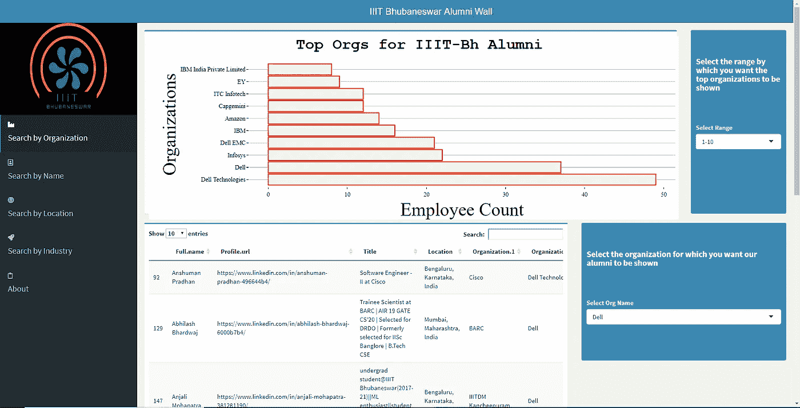

# 作为一名大学生，与数据科学领域的新冠肺炎展开较量

> 原文：<https://towardsdatascience.com/battling-covid-19-with-data-science-as-a-university-student-ffcb9304b4c?source=collection_archive---------40----------------------->

## 利用简历来照亮大学同学的就业前景

科尔·凯斯特在 [Unsplash](https://unsplash.com/?utm_source=unsplash&utm_medium=referral&utm_content=creditCopyText) 上的照片

> 随着新冠肺炎给全球经济带来厄运，世界正面临一个不确定的时期。

作为一名本科生，当可能的流行病传播的消息开始涌入时，我的实习/工作前景肯定受到了打击。几周之内，这个雪球越滚越大，变成了疫情，几乎让整个世界陷入了停顿。就目前的情况来看，求职者尤其是新加入劳动大军的人的前景变得相当暗淡。

# 动机:

随着疫情的持续，受伤的经济是理所当然的；但是，亲眼目睹我的朋友、队友和学长们失去工作和实习机会是令人心痛的。因此，作为应对措施，我开始在 LinkedIn 上搜索空缺职位和实习生，并疯狂地向大学校友发送大量联系请求。

就在那时，我产生了这个想法。在这些痛苦的时刻，最有可能帮助我们的是我们的校友。因此，由于未能找到一个联系校友的机构门户，我决定自己动手。

# 首选武器(闪亮):

我心里很清楚我想要的是什么，我想向我的队友们提供关于我们校友的有见地的和可操作的信息。这让我陷入了困境，因为我对 web 开发不是很精通，但已经和 R 一起工作了一段时间。

所以，我有两个选择:

*   参加一些在线课程，温习我的 HTML、CSS、JS 知识，可能还有 MongoDB，在 web 开发方面提高一些水平，然后处理这个项目。
*   利用我在 R 方面更好的水平，用我的方式构建了一个可以托管的 [R 闪亮](https://shiny.rstudio.com/)应用。

因为时间是至关重要的，而且考虑到我的不安，这个选择是显而易见的。

# 整装待发:

尽管我对 R 有丰富的工作知识，但 R 闪亮的开发对我来说是一个完全陌生的领域。所以我决定[完成一个关于 R Shiny 开发的快速课程](https://www.datacamp.com/statement-of-accomplishment/course/d8e4cb3a2972eabf746e178513d1a485b3e3a5c0?share=true)并继续我的项目。

多亏了 Datacamp 讲师简洁明了的解释，我才得以顺利通过课程，同时对开发这种令人难以置信的工具(如 Shiny)的人充满敬畏。

# 这个项目终于开始了:

## 构建校友数据集:

这是我马上面临的第一个问题。为了收集我大学校友的数据，我不得不从 LinkedIn 上搜集数据，LinkedIn 对发现搜集者非常警惕。

所以我在网上做了一些调查，发现每天 150 个个人资料是安全的。超过这个限制意味着我的个人资料很有可能被标记。此外，我必须使用我自己的个人资料，否则大多数校友将显示为“LinkedIn 会员”,这是一个没有很多联系的虚拟个人资料。因此，最初的目标是 400-500 份档案，我开始着手工作。

## 数据木工:

一旦数据被抓取并存储在一个. csv 文件中，我就有了清理数据的任务。在下面给出的代码中，我采取了以下步骤:

1.  已删除任何重复条目。
2.  从数据中删除了所有不必要的字段。
3.  识别学生(因为他们不与任何组织相关联)，并将他们从数据集中删除。
4.  现在，数据已经清理完毕，可以使用了。

## 应用程序的布局:

为了美观，我决定用“*Shinydashboard”*而不是普通的闪亮。在任何类型的开发活动中，在开始编码之前，拥有最终产品的草图是至关重要的。我设想我的应用程序具有以下功能:

1.  用户应该能够直观地检查所有的组织，地点和行业的大学(IIIT 布巴内斯瓦尔)校友就业。
2.  然后，用户应该能够选择一个特定的组织，位置和行业，以查看与之相关的所有校友。
3.  然后，用户应该能够按姓名搜索校友的所有详细信息。

## ui。r 和服务器。r:

考虑到布局，我开始编码。以下是我在我的**界面中采取的步骤。R** 文件，以及代码(完整的代码可以从我的 Github repo 中获得，文章末尾给出了链接):

1.  已加载所有必需的库。
2.  给了一个合适的标题。
3.  在侧边栏菜单中，添加了应用程序布局中提到的所有搜索功能。
4.  在仪表板主体中，创建了与侧边栏菜单功能相关的所有组件。

代表性代码。如需完整代码，请访问我的 github repo。

以下是我在我的**服务器上采取的步骤。R** 文件，以及代码(完整的代码可以从我的 Github repo 中获得，文章末尾给出了链接):

1.  创建函数来帮助从数据加工后获得的原始数据集准备不同的数据集。
2.  创建了辅助函数来生成图和表。
3.  渲染了所有相关组件。

代表性代码。如需完整代码，请访问我的 github repo。

## 部署应用程序:

使用“*r studio”*和“ *Shinyapps.io* ”部署应用程序相当容易。注册和创建账户只需几分钟。更多信息可以在[这里](https://www.shinyapps.io/)找到。

以下是我最终作品的片段(IIIT·布巴内斯瓦尔校友墙):

最终产品片段:IIIT-Bh 校友墙

# 结论:

如果你对代码感兴趣，这里是。

如果你想看看我最终部署的产品，这里是。但是请记住以下几点:

*   **在您的笔记本电脑/台式机上查看该应用程序**以获得所涉及的图表/绘图的清晰视图。如果由于某种原因无法使用，请在移动设备上使用横向模式。
*   此应用程序在您的浏览器中的最佳观看效果****为 80%缩放比例**而非 100%默认比例，按“*Ctrl”+“-”*缩小。这很可能是由于一些固有的闪亮问题。**
*   **我还是一名学生，所以我使用免费的 Shinyapp 托管层，因此**应用加载**会很慢。此外，积极观看的时间有限也是一个额外的缺点。**

**我缺乏 CSS 技能，这让我很不满意，但是如果你有不错的 CSS 和/或 JS 技能，你可以利用这个教程为你的学院设计一个更好的“校友墙”版本。所以我现在就要结束了，祝你一切顺利，用你的技能去改善和帮助你所关心的人。**

**你也可以给我买杯 T21 咖啡来支持我的工作。**

**谢谢你，祝你成功。**