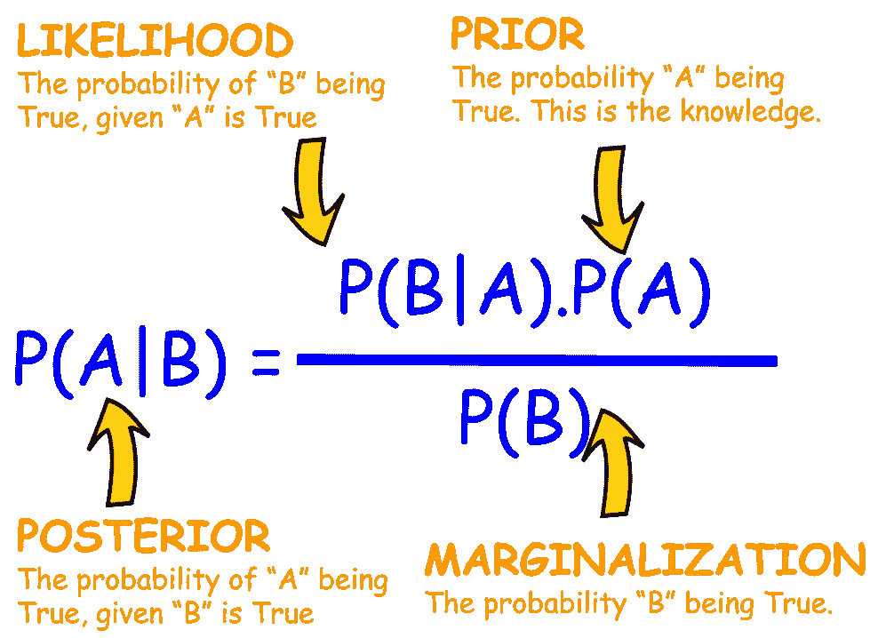
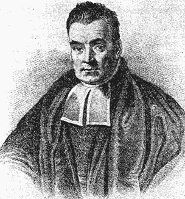
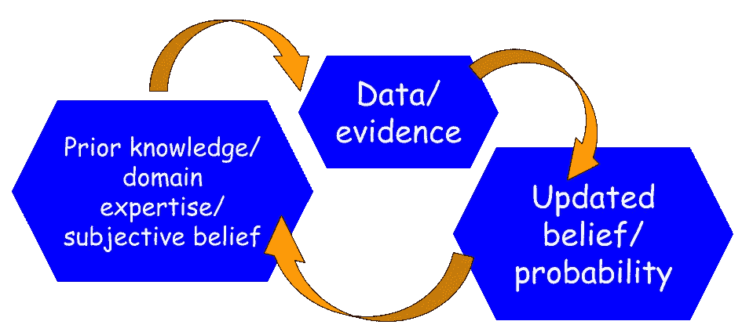
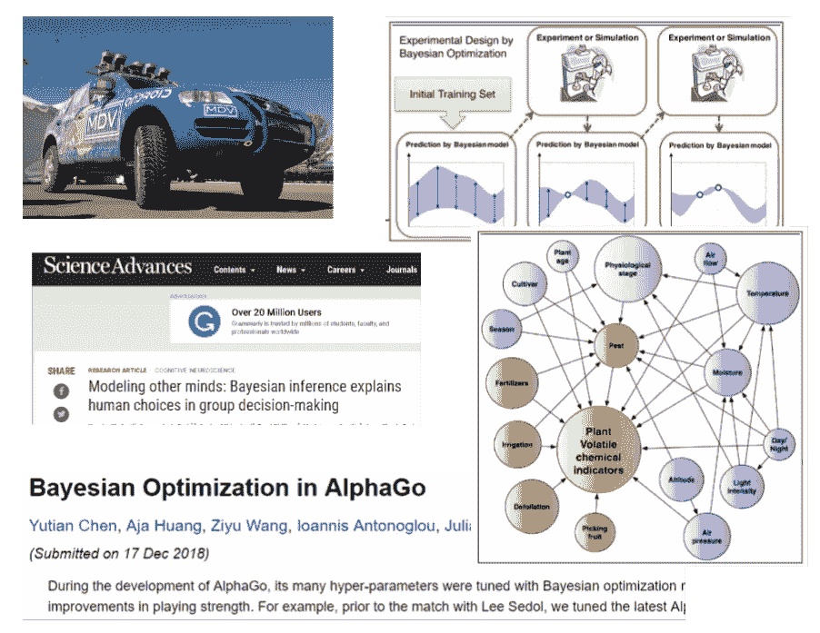
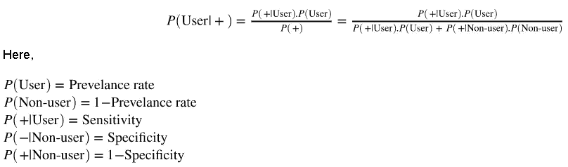
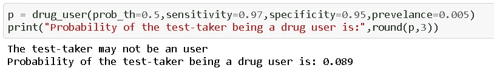
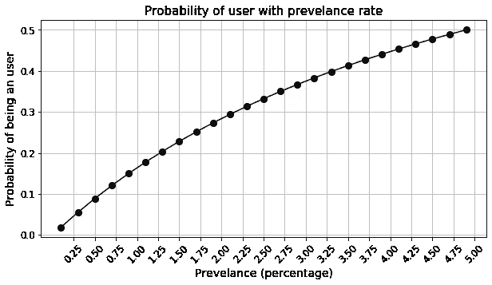
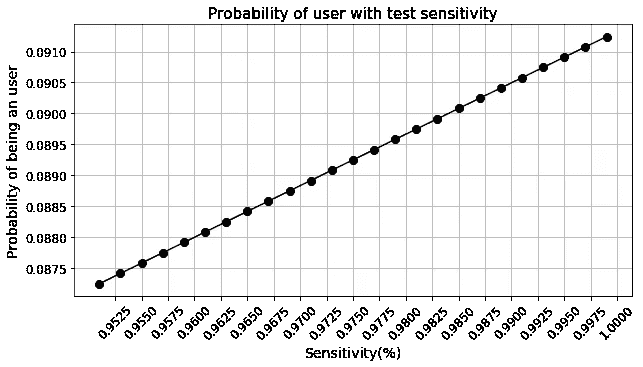
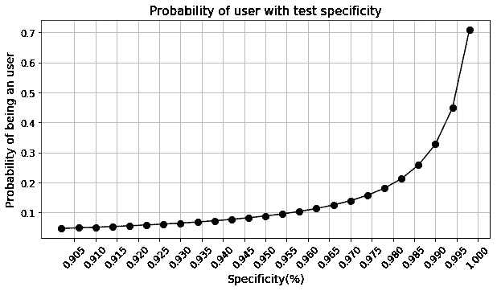
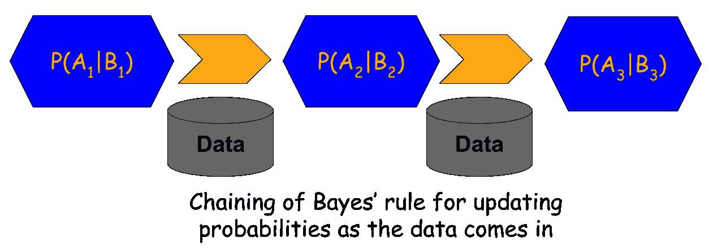

# 贝叶斯法则及简单实用的例子

> 原文：<https://towardsdatascience.com/bayes-rule-with-a-simple-and-practical-example-2bce3d0f4ad0?source=collection_archive---------4----------------------->

## 我们用 Python 代码演示了简单而实用的贝叶斯规则应用示例。

# 贝叶斯法则

贝叶斯定理(或称贝叶斯定律或贝叶斯法则)被称为概率统计中最强有力的规则。它描述了一个事件发生的概率，基于可能与该事件相关的条件的先验知识。



例如，如果疾病与年龄有关，那么使用贝叶斯定理，与在不知道人的年龄的情况下做出的疾病概率的评估相比，可以使用人的年龄来更准确地评估他们患有疾病的概率。

这是一个强有力的概率法则，它将“主观性”或“信任度”的概念引入到冰冷、生硬的统计建模中。随着证据或数据按顺序收集，贝叶斯规则是唯一可用于逐步更新事件概率的机制。

## 历史



图片来源:[维基百科](https://en.wikipedia.org/wiki/Thomas_Bayes)

贝叶斯定理是以[牧师托马斯·贝叶斯](https://en.wikipedia.org/wiki/Thomas_Bayes)的名字命名的，他首先使用条件概率提供了一种算法(他的命题 9)，这种算法使用证据来计算未知参数的极限，发表为 [*一篇旨在解决机会主义*](https://royalsocietypublishing.org/doi/abs/10.1098/rstl.1763.0053) 中一个问题的论文(1763)。在他所谓的“训诂学”中，Bayes 将他的算法扩展到任何未知的先验原因。

独立于贝叶斯，[皮埃尔·西蒙·拉普拉斯](https://en.wikipedia.org/wiki/Pierre-Simon_Laplace)在 1774 年，以及后来在他的 1812*[*théOrie analytique des probabilityés*](https://archive.org/details/thorieanalytiqu01laplgoog/page/n7/mode/2up)*在给定证据的情况下，使用条件概率来从先验概率制定更新后验概率的关系。**

> **这是一个强有力的概率法则，它将“主观性”或“信任度”的概念引入到冰冷、生硬的统计建模中。**

## **现代数据科学的逻辑过程**

**这是进行数据科学的逻辑方法。**

**我们从一个假设和对该假设的信任度开始。这意味着，基于领域专长或先验知识，我们为该假设分配一个非零概率。**

**然后，我们收集数据，更新我们最初的信念。如果数据支持假设，那么概率上升，如果不匹配，那么概率下降。**

****

**听起来简单又符合逻辑，不是吗？**

****但是传统上，在大多数统计学习中，先验的概念没有被使用或者看起来不太好**。此外，贝叶斯学习的计算复杂性使其在超过两百年的时间里无法成为主流。**

**但是随着贝叶斯推理的出现，事情正在发生变化…**

> **如果数据支持假设，那么概率上升，如果不匹配，那么概率下降。**

## **贝叶斯推理**

**随着人工智能和数据驱动的机器学习系统在商业、科学和技术的各个方面的全球兴起，贝叶斯统计和建模最近重新兴起。**

**[贝叶斯推理](https://en.wikipedia.org/wiki/Bayesian_inference)正被应用于遗传学、语言学、图像处理、脑成像、宇宙学、机器学习、流行病学、心理学、法医学、人类物体识别、进化、视觉感知、生态学以及知识发现和预测分析发挥重要作用的无数其他领域。**

****

> **随着人工智能和数据驱动的机器学习系统在全球的兴起，贝叶斯统计和建模最近有了复兴**

# **Python 代码的实际例子**

## **药物筛选**

****

**图片来源: [Pixabay](https://pixabay.com/illustrations/syringe-pill-capsule-morphine-1884784/)**

**我们将把贝叶斯规则应用于药物筛选问题(例如，对联邦政府或许多其他承诺无毒品工作环境的工作进行强制性检测)。**

**假设使用特定药物的测试灵敏度为 97%，特异性为 95%。也就是说，对于吸毒者，测试将产生 97%的真阳性结果，而对于非吸毒者，测试将产生 95%的真阴性结果。这些是任何筛查测试都会有的测试历史数据。贝叶斯法则允许我们使用这种数据驱动的知识来计算最终的概率。**

**假设，我们也知道普通人群中有 0.5%的人是该药物的使用者。随机选择的测试呈阳性的个人是吸毒者的概率是多少？**

****请注意，这是“先验”的关键部分**，它是关于常见患病率的一项概括知识。这是我们对随机测试对象成为吸毒者的概率的先验信念。这意味着**如果我们从普通人群中随机选择一个人，没有任何测试，我们只能说这个人有 0.5%的几率是吸毒者**。**

**在这种情况下，如何使用贝叶斯法则呢？**

**我们将编写一个自定义函数，该函数接受测试能力和吸毒者百分比的先验知识作为输入，并根据阳性结果生成考生成为吸毒者的输出概率。**

**这是根据贝叶斯法则计算的公式…**

****

**实际的 [**代码在这里是**](https://gist.github.com/tirthajyoti/46453f215156c21d47d34cabd07b5d58) 。**

**如果我们用给定的数据运行函数，我们会得到下面的结果，**

****

## **这里有什么迷人之处？**

**即使一项检测对阳性病例的正确率为 97%，对阴性病例的正确率为 95%，结果呈阳性的吸毒者的真实概率也只有 8.9%！**

**如果你看一下计算，这是因为流行率极低。**假阳性的数量超过真阳性的数量。****

**例如，如果测试 1000 个人，预计有 995 个非用户和 5 个用户。从 995 个非用户中，预计有 0.05 × 995 个≃ 50 假阳性。从这 5 个用户中，预计有 0.95 × 5 ≈ 5 个真阳性。55 个阳性结果中，只有 5 个是真实的！**

**我们来看看概率是如何随患病率变化的。 [**代码在这里**](https://gist.github.com/tirthajyoti/07e3c81839957423fef62f0ac5bd3ea7) 。**

****

**注意，你的决定取决于概率阈值。目前，该值设定为 0.5。必要的话可以降低。但是，在 0.5 的阈值处，**你需要有一个几乎 4.8%的流行率来抓住一个测试结果为单一阳性的用户。****

## **改进这个场景需要什么水平的测试能力？**

**我们看到，测试的灵敏度和特异性强烈影响这一计算。因此，我们可能想看看需要什么样的能力来提高抓住吸毒者的可能性。**

**[**Python 代码在这里**](https://gist.github.com/tirthajyoti/9ddbf0cd16f9897c0b0c85b9cbd43ac3) 。**

********

**上面的图清楚地表明，即使接近 100%的灵敏度，我们也没有获得多少。然而，**相对于测试的特异性而言，概率响应是高度非线性的**，当它达到完美时，我们得到概率的大幅增加。因此，**所有的研发努力都应该集中在如何提高检测的特异性上**。**

**这一结论可以从概率低的主要问题是流行率低这一事实中直观地得出。因此，正确捕捉非用户(即提高特异性)是我们应该关注的领域，因为他们在数量上比用户多得多。**

**在这个问题中，反面例子的数量比正面例子多得多。所以测试真正的阴性表现应该是优秀。**

# **链式贝叶斯规则**

****

**贝叶斯推理最好的一点是**能够在贝叶斯定理的分子中以先验概率项的形式使用先验知识**。**

**在这种药物筛选的背景下，**先验知识只不过是一个测试的计算概率，然后反馈到下一个测试**。**

**这意味着，在这些病例中，一般人群中的患病率极低，如果第一次检测结果为阳性，增加信心的一种方法是规定后续检测。**

****第一次测试的*后验*概率成为第二次测试**的*先验*，即 ***P(用户)*** 不再是第二次测试的一般患病率，而是第一次测试的概率。**

**下面是演示链接的简单代码。**

**当我们运行这段代码时，我们得到如下结果，**

```
**The test-taker may not be an user
Probability of the test-taker being a drug user, in the first round of test, is: 0.089

The test-taker could be an user
Probability of the test-taker being a drug user, in the second round of test, is: 0.654

The test-taker could be an user
Probability of the test-taker being a drug user, in the third round of test, is: 0.973**
```

**当我们第一次运行测试时，输出(后验)概率很低，只有 8.9%，但随着第二次测试，这一概率显著上升到 65.4%，第三次阳性测试的后验概率为 97.3%。**

**因此，第一次无法筛选用户的测试可以多次使用，以通过连续应用贝叶斯规则来更新我们的信念。**

> **贝叶斯推理最好的一点是**使用先验知识**的能力，先验知识是贝叶斯定理分子中的先验概率项。**

# **摘要**

**在本文中，我们展示了最强大的统计定律之一——贝叶斯定理的基础和应用。近年来，利用这一定律的高级概率建模和推理过程已经占据了数据科学和分析的世界。**

**我们使用一个非常简单但实用的药物筛选测试示例和相关的 Python 代码演示了贝叶斯规则的应用。我们展示了测试限制如何影响预测的概率，以及对于高置信度的筛选，测试的哪一方面需要改进。**

**我们进一步展示了如何将多个贝叶斯计算链接在一起，以计算总体后验概率和贝叶斯推理的真实能力。**

**进一步的阅读和资源，可以参考这些优秀的文章，**

1.  **[https://www.mathsisfun.com/data/bayes-theorem.html](https://www.mathsisfun.com/data/bayes-theorem.html)**
2.  **[https://better explained . com/articles/an-intuitive-and-short-explain-of-Bayes-theorem/](https://betterexplained.com/articles/an-intuitive-and-short-explanation-of-bayes-theorem/)**

**如果您有任何问题或想法要分享，请联系作者在[**tirthajyoti【AT】Gmail . com**](mailto:tirthajyoti@gmail.com)。此外，您可以查看作者的 [**GitHub**](https://github.com/tirthajyoti?tab=repositories) **资源库**中的代码、想法和机器学习和数据科学方面的资源。如果你和我一样，对人工智能/机器学习/数据科学充满热情，请随时[在 LinkedIn 上添加我](https://www.linkedin.com/in/tirthajyoti-sarkar-2127aa7/)或[在 Twitter 上关注我](https://twitter.com/tirthajyotiS)。**

**[](https://www.linkedin.com/in/tirthajyoti-sarkar-2127aa7/) [## Tirthajyoti Sarkar - Sr .首席工程师-半导体、人工智能、机器学习- ON…

### 通过写作使数据科学/ML 概念易于理解:https://medium.com/@tirthajyoti 开源和有趣…

www.linkedin.com](https://www.linkedin.com/in/tirthajyoti-sarkar-2127aa7/)**