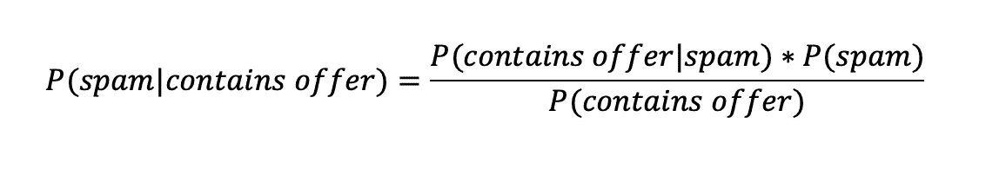
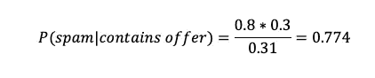
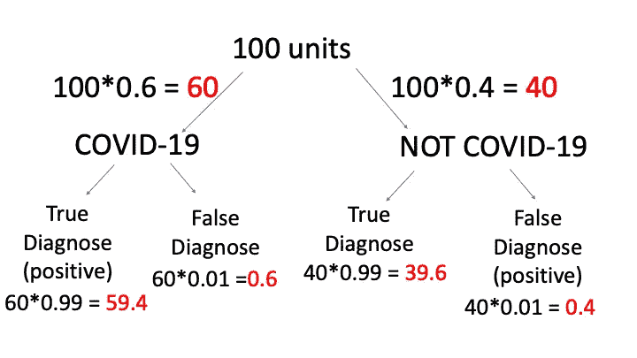
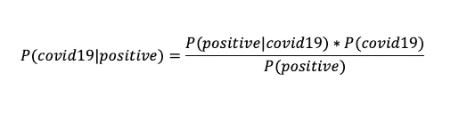
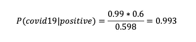

# 贝叶斯定理 101 —示例解决方案

> 原文：<https://towardsdatascience.com/bayes-theorem-101-example-solution-ff54147d6c7f?source=collection_archive---------3----------------------->

## 数据科学的数学

## 举例说明贝叶斯定理的一种简单方法

图片由[皮克斯拜](https://pixabay.com/?utm_source=link-attribution&utm_medium=referral&utm_campaign=image&utm_content=1036469)的 Gerd Altmann 提供

条件概率是数据科学和统计学的必要条件。条件概率和贝叶斯定理有很多有用的解释和例子。在这篇文章中，我将用简单的数学知识举例说明贝叶斯定理的背景。

贝叶斯定理在数学表达式中看起来很简单，比如；

**P(A|B) = P(B|A)P(A)/P(B)**

数据科学中重要的一点不是方程本身，把这个方程应用到语言问题中比记住方程更重要。所以，我将用贝叶斯定理和逻辑来解决一个简单的条件概率问题。

# **问题 1:**

让我们用贝叶斯定理来解决一个简单的 NLP 问题。通过使用 NLP，我可以检测收件箱中的垃圾邮件。假设在我的帐户中，80%的垃圾邮件中都出现了“offer”这个词。另外，让我们假设“要约”出现在我想要的 10%的电子邮件中。如果收到的电子邮件中有 30%被认为是骗局，而我将收到一封包含“offer”的新邮件，那么它是垃圾邮件的概率是多少？

现在，我假设我收到了 100 封电子邮件。垃圾邮件占整个电子邮件的百分比是 30%。所以，我在 100 封邮件中有 30 封垃圾邮件和 70 封想要的邮件。单词“offer”在垃圾邮件中出现的百分比是 80%。这意味着 30 封电子邮件中的 80%会变成 24 封。现在，我知道 100 封邮件中有 30 封是垃圾邮件，其中 24 封包含“offer ”, 6 封不包含“offer”。

单词“offer”在期望的电子邮件中出现的百分比是 10%。这意味着其中 7 封(70 封想要的邮件中的 10%)包含单词“offer ”, 63 封不包含。

现在，我们可以在一个简单的图表中看到这个逻辑。

作者图片

问题是，当邮件中包含单词“offer”时，垃圾邮件的概率是多少:

1.  我们需要找到包含“offer”的邮件总数；

24 +7 = 31 邮件包含“报价”一词

2.如果邮件包含“offer ”,找出垃圾邮件的概率；

在 31 封邮件中，24 封包含“提供”意味着 77.4% = 0.774(概率)

注意:在这个例子中，我选择计算后给出整数的百分比。一般来说，你可以认为我们在开始时有 100 个单元，所以如果结果不是整数，也不会产生问题。因此，我们不能说是 15.3 封电子邮件，但我们可以说是 15.3 个单位。

**贝叶斯方程解:**

A =垃圾邮件

B =包含“要约”一词

作者图片

p(包含 offer|spam) = 0.8(问题中给定)

p(垃圾邮件)= 0.3(问题中给定)

现在我们会发现带有‘offer’这个词的电子邮件的概率。我们可以通过在垃圾邮件和想要的电子邮件中添加“offer”来计算。使得；

p(含报价)= 0.3*0.8 + 0.7*0.1 = 0.31

作者图片

从两方面来看，结果是一样的。在第一部分，我用一个简单的图表解决了同样的问题，在第二部分，我用贝叶斯定理解决了同样的问题。

# 问题二:

我想从新冠肺炎这个热门话题中再解决一个例子。如你所知，新冠肺炎测试现在很普遍，但有些测试结果是不真实的。我们假设:诊断测试有 99%的准确率，60%的人患有新冠肺炎。如果一个病人检测呈阳性，那么他真的患病的可能性有多大？

作者图片

有阳性结果的总单位数= 59.4 + 0.4 = 59.8

59.4 单位(真阳性)是 59.8 单位意味着 99.3% = 0.993 概率

**用贝叶斯；**

作者图片

p(正|covid19) = 0.99

P(covid19) = 0.6

p(正)= 0.6*0.99+0.4*0.01=0.598

作者图片

同样，我们在图表中找到了相同的答案。有很多例子可以学习贝叶斯定理的应用，例如蒙蒂霍尔问题，这是一个小难题，你有三扇门。在门后面，有两只山羊和一辆汽车。要求您选择一个门来查找汽车。选择一扇门后，主人打开一扇没被选择的门，露出山羊。然后，你被要求切换门或坚持你的第一选择。通过运行这个过程一千次并进行模拟，您可以找到获胜的概率，并通过 Monty Hall 问题大致了解贝叶斯定理和贝叶斯统计的思想。

当我们想到机器学习概念中的贝叶斯定理时，它提供了一种通过使用数据和假设之间的关系来基于条件计算假设的概率的方法。此外，这也是理解数据科学分类问题和朴素贝叶斯分类器中的真阳性、假阳性、真阴性和假阴性概念的第一步。

如果你喜欢这篇文章，并想分享你的想法或提出问题，请随时通过 [LinkedIn 与我联系。](https://www.linkedin.com/in/ezgi-gumusbas-6b08a51a0/)

# 其他资源:

如果您想深入了解这些资源:

 [## 贝叶斯定理

### 在概率论和统计学中，贝叶斯定理(或者贝叶斯定理、贝叶斯定律或贝叶斯法则)…

en.wikipedia.org](https://en.wikipedia.org/wiki/Bayes%27_theorem)  [## 1.9.朴素贝叶斯-sci kit-学习 0.23.1 文档

### 朴素贝叶斯方法是一组监督学习算法，基于应用贝叶斯定理和“朴素”学习理论

scikit-learn.org](https://scikit-learn.org/stable/modules/naive_bayes.html)  [## 机器学习的贝叶斯定理简介——机器学习掌握

### 贝叶斯定理提供了一种计算条件概率的原则方法。这是一个看似简单的…

machinelearningmastery.com](https://machinelearningmastery.com/bayes-theorem-for-machine-learning/)  [## 贝叶斯信念网络简介-机器学习掌握

### 概率模型可以定义变量之间的关系，并用于计算概率。比如说…

machinelearningmastery.com](https://machinelearningmastery.com/introduction-to-bayesian-belief-networks/)