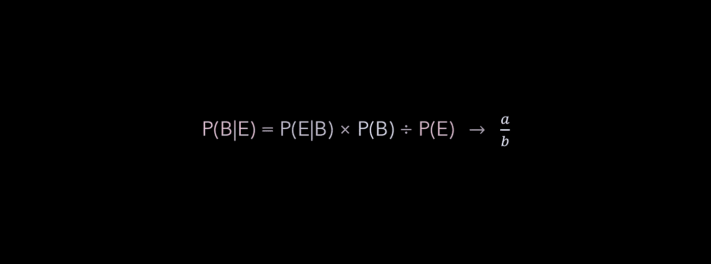
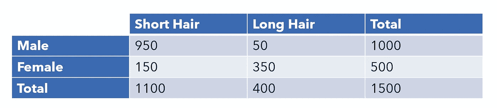
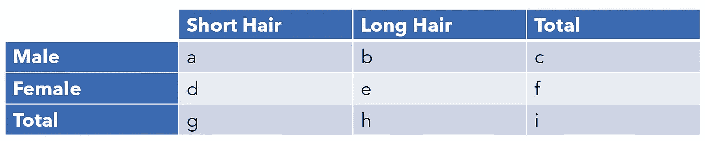

# 贝叶斯定理实际上是一个直观的分数

> 原文：<https://towardsdatascience.com/bayes-theorem-is-actually-an-intuitive-fraction-5f2803998006?source=collection_archive---------26----------------------->



## 不使用术语，把定理拆开

贝叶斯定理是概率领域最著名的定理之一，它经常被用作机器学习的基线模型。然而，它经常被那些并不真正知道`P(B|E) = P(E|B) * P(B) / P(E)`实际上做什么的人背诵和吟诵。这篇短文将剖析贝叶斯定理，并展示它如何简化为我们都常用的直观分数。

首先，一些基本的概率背景。

信念是一种我们想要验证其正确或不正确的陈述，比如“一个人是男性”或“一个人有长头发”。证据是*已知的*关于信念主体的信息。最后，`|`竖线用作单词“给定…”。你会经常看到`(B|E)`是‘给定证据 e，概率信念 B 为真’

让我们看看下面这张假设高中的学生表。



我们想找出一个人是女性的概率(信念)给定长发(证据)。这可以表示为`(female|long hair)`。即使没有这个定理，这也很容易计算，很直观。我们只需要用留长发的女性人数除以留长发的总人数，这就是`350/400=0.875`。

探究一下我们为什么会有这种直觉是值得的。因为我们*知道*这个人有长头发，所以我们在“长头发”一栏中查找，并在该类别中分成两类(男性或女性)。那么，我们的公式就是女性和留长发的人除以所有留长发的人。

因此，我们可以自信地说，如果你有一头长发，你有 87.5%的机会在假设的高中成为女性。

让我们用贝叶斯定理来解决这个问题——你会意识到它只是把这种直觉用严格的数学术语表达出来！

从`a` - `i`的变量名将用于表示不同的量。记得我们直观的公式是`e/h`，或者说是女性留长发的人数除以留长发的总人数。



贝叶斯公式说明如下:

```
P(B|E) = P(E|B)*P(B) / P(E)
```

这在我们的场景中转化为:

```
P(Female|Long Hair) = P(Long Hair|Female)*P(Female)/P(Long Hair)
```

让我们用变量来表示这些。例如，假设某人是女性，那么她留长发的概率是`e/f`，因为`e`代表留长发的女性数量，而`f`代表女性总数。`P(Female)`是`f/i`，因为`f`是女性人数，`i`是总人数(男女)。

```
P(Female|Long Hair) = (e/f)*(f/i) / (h/i) = (e/f)*(f/i)*(i/h)
```

通过一些简单的代数运算，我们认识到`(e/f)*(f/i)`导致`(e/i)`，并且`(e/i)*(i/h)`等于`(e/h)`——我们的直观公式！

所以，贝叶斯定理实际上是一种迂回的方式来表达一个简单的想法。至少在我们的分数操作上下文中，`P(B)`只是作为一座桥梁来抵消倒数。所以，当使用贝叶斯定理计算`P(B|E)`时，你实质上是在计算以下内容:

```
# items that are B and E / total # items that are E
```

如果通过使用其他更容易获得的概率来直接计算这个概率是困难或棘手的，贝叶斯定理对于计算这个概率是有用的。当计算三个独立的概率比计算一个主要概率更便宜时，这可能是有用的。

在更高的层次上，人们可能倾向于说，贝叶斯定理揭示了概率本质中的关系。在一个较低的层次上，也许是更实际的层次上，贝叶斯定理是一种巧妙的方法，可以绕过用其他概率和链乘法直接计算一个概率。

[](/the-most-fundamental-and-controversial-debate-in-statistics-and-data-science-e8dd1bad737a) [## 统计学和数据科学中最基本也是最有争议的争论

### 频繁主义者-贝叶斯之争

towardsdatascience.com](/the-most-fundamental-and-controversial-debate-in-statistics-and-data-science-e8dd1bad737a) 

所有图片由作者创作。