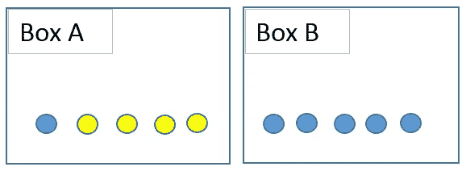
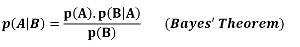

# 贝叶斯定理:朴素贝叶斯算法背后的思想

> 原文：<https://towardsdatascience.com/bayes-theorem-the-idea-behind-naive-bayes-algoritm-f7068834a4d7?source=collection_archive---------63----------------------->

## 你认为今天会下雨吗？

在 [Unsplash](https://unsplash.com/s/photos/rain?utm_source=unsplash&utm_medium=referral&utm_content=creditCopyText) 上由 [Ed Leszczynskl](https://unsplash.com/@ed_leszczynskl?utm_source=unsplash&utm_medium=referral&utm_content=creditCopyText) 拍摄的照片

今天下雨的可能性有多大？在你回答之前，你考虑的事情可能是季节，城市的一般天气情况，以及天空中云的密度。考虑到这些迹象，你可以做出一个有根据的猜测。贝叶斯定理遵循类似的方法。根据贝叶斯定理，事件的概率是根据先验知识或相关的给定条件来描述的。

贝叶斯定理建立在概率和条件概率的基础上。因此，最好先了解一下这些主题。

概率只是指事件发生的可能性，通常取 0 到 1 之间的值(0 和 1 包括在内)。事件 A 的概率被表示为 **p(A)** ，并且被计算为期望结果的数量除以所有结果的数量。例如，当你掷骰子时，得到小于 3 的数字的概率是 2 / 6。期望结果的数量是 2 (1 和 2)；总结果数为 6。

条件概率是在与事件 A 相关的另一事件已经发生的情况下，事件 A 发生的可能性。假设我们有 6 个蓝色球和 4 个黄色球放在两个盒子里，如下图所示。我让你随机选一个球。得到蓝球的概率是 6 / 10 = 0，6。

假设球是从盒子 A 中取出的，选择黄色球的概率是多少？这是一个条件概率，表示为 P(黄色|方框 A)。

在介绍贝叶斯定理之前，还有一个概念需要学习。联合**概率**是两个事件一起发生的概率，表示为 **p(A 和 B)** 。对于**独立的**事件，联合概率可以写成:

**p(A 和 B) = p(A)。p(B)…………(1)**

假设我掷骰子，掷硬币。得到 1 和正面的概率是:

(1 / 6).(1/2) = 1/12 = 0.08

为了使计算正确，事件必须独立于。抛硬币的结果对掷骰子的结果没有任何影响，所以这些事件是独立的。让我们也举一个**依赖**事件的例子。我从一副牌中选了一张，又从同一副牌中选了第二张。在第二次选择中某一特定观察值肯定受第一次选择影响的概率。在非独立事件的情况下，等式 1 无效。应该稍微修改一下，使其适用于任何两个事件:

**p(A 和 B) = p(A)。p(B | A)…………(2)**

等式(1)是等式(2)对于独立事件的特例，因为如果事件 B 和事件 A 独立， **p(B|A) = p(B)。**

# 贝叶斯定理

我们将从任意两个事件的联合概率是可交换的这一事实开始。那就是:

**p(A 和 B) = p(B 和 A)…………(3)**

从等式 2 中，我们知道:

**p(A 和 B) = p(A)。p(B|A)**

**p(B 和 A) = p(B)。p(A|B)**

我们可以将等式 3 改写为:

**p(一)。p(B|A) = p(B)。p(A|B)**

用 p(B)除两边给出了贝叶斯定理:

因此，根据贝叶斯定理，假设事件 B 已经发生，则事件 A 的概率可以使用事件 A 和事件 B 的概率以及假设事件 A 已经发生的事件 B 的概率来计算。

贝叶斯定理是如此的基本和普遍，以至于一个叫做“贝叶斯统计”的领域存在了。在贝叶斯统计中，作为证据的事件或假设的概率开始起作用。因此，先验概率和后验概率因证据而异。

朴素贝叶斯算法是通过结合贝叶斯定理和一些朴素假设而构造的。朴素贝叶斯算法假设特征是相互独立的，并且特征之间没有相关性。然而，现实生活中并非如此。这种特征不相关的天真假设是这种算法被称为“天真”的原因。