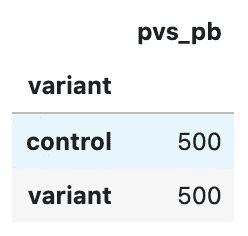
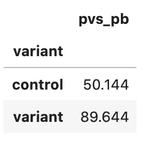
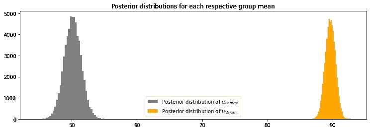
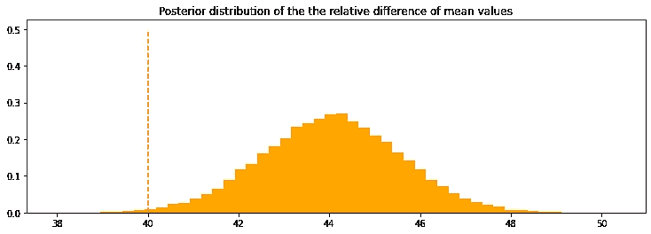

# 使用连续变量的贝叶斯 A/B 测试——包括 Python 代码

> 原文：<https://towardsdatascience.com/bayesian-a-b-testing-with-continuous-variables-including-python-code-133b74c7bd20?source=collection_archive---------23----------------------->

## 本文讨论如何在您的数字实验方法中实现贝叶斯估计，特别关注连续的、非离散的度量的计算


作者创建的数字(弗兰克·霍普金斯，2020)

当你网站上的一个实验被暂停时，有可能你的 MVT 平台没有捕捉到接受或拒绝你的假设所需的所有信息。如果是这种情况，您可能需要对原始实验和用户级数据进行某种形式的事后显著性测试。

如果您正在处理一个连续的指标，即在给定测量的最低点和最高点之间取值范围无限的变量，那么 T 检验可能是您最熟悉的。然而，T 检验和更广义的频率主义方法在实际应用中可能存在缺陷。首先，frequentist 方法依赖于预先确定的功效分析来计算所需的样本量，并随后计算在比较组间差异之前实验应该运行的期望时间长度。这种推理形式的问题是，它无法在动态或特别的环境中工作，如果没有达到样本大小的要求，您可能会得到不重要的发现。如果你在你的站点或平台上实现了相对较大的样本规模，这可能不是一个大问题，但是你仍然会有麻烦，必须将你的发现翻译给利益相关者(和 frequentist 统计，这是有问题的)。值得注意的是，试图向非技术人员解释置信区间和 p 值可能是棘手的，p 值经常(错误地)被解释为实验条件“优于”对照的概率。幸运的是，贝叶斯等价于这种形式的显著性测试为我们提供了这些信息，这在商业环境中非常有用，因为这正是利益相关者想要知道的信息。

本文将讨论一种由 [**Kruschke (2013)**](https://pdfs.semanticscholar.org/dea6/0927efbd1f284b4132eae3461ea7ce0fb62a.pdf) 描述的被称为 BEST 的方法(贝叶斯估计取代 T 检验)，该方法使用预先确定的模型参数结合我们已知的(后验)数据，使用马尔可夫链蒙特卡罗模拟和[**【pymc 3】**](https://docs.pymc.io/)生成可信的后验分布。虽然我建议阅读 Kruschke 的学术论文(链接如上)来温习传统的零假设显著性检验(NHST)和贝叶斯方法(细致入微且不“用户友好”)之间的各种技术细节和差异，但本文将重点关注如何使用 Python 中的几行代码实现最佳方法。将提供有用的计算，这些计算产生的结果容易被利益相关者理解。

# 演练(使用 Python 代码)

首先，您需要导入所有必要的包和模块进行分析:

```
import pandas as pd
import requests
import numpy as np
import pymc3 as pm
import scipy.stats as stats
import matplotlib.pyplot as plt
%matplotlib inline
from IPython.core.pylabtools import figsize
import theano.tensor as tt
from scipy.stats.mstats import mquantiles
```

接下来，您将需要导入您的数据(应该是用户级别的)，但是我随机生成了一些数据，以便强调分析所需的正确数据结构和一些分析的基本概念。我模拟了每个变体的每个浏览器的页面浏览量( *pvs_pb* )指标:

```
rng **=** np.random.default_rng()df_control **=** pd.DataFrame(rng.integers(1, 100, size**=**(500, 1)), columns**=**['pvs_pb'])df_control['variant'] **=** 'control'df_variant **=** pd.DataFrame(rng.integers(60, 120, size**=**(500, 1)), columns**=**['pvs_pb'])df_variant['variant'] **=** 'variant'df **=** df_control.append(df_variant)
```

虽然在贝叶斯推理中，通常不需要具有相同权重的组，但是检查控制和实验条件之间的流量是否均匀分布可能是有用的:

```
df.groupby(['variant']).count()
```



您还可以检查我们的 *pvs_pb* 指标的平均值，在我们执行完推理测试后可以参考这些平均值:

```
df.groupby([‘variant’]).mean()
```



现在，您可以在我们的模型中使用这些关于我们数据的信息来进行模拟。注意，在这个例子和 Kruschke 的方法中，数据都是用一个 [Student-t 分布来描述的。](https://en.wikipedia.org/wiki/Student%27s_t-distribution)虽然这并不总是合适的，但是利用 t 分布可能比正态分布更能提供信息，因为它将数据描述为与尾部相关；这通常是从 web 数据推断出的连续指标的情况(即“超级用户”经常存在)。值得指出的是，如果下面的代码不适用于您的数据，您可能需要调整它。

为了描述 Student-t 分布，您需要均值 **μ** (正态分布)和标准差 **σ** (均匀分布)输入。您还需要指定自由度 **ν，**，它遵循一个移位的指数分布。数据的正态性由 **ν调节。**如果 **ν** = > 30，则计算出的分布接近正态分布；因此，1/29 的值被用作正常阈值。

现在，您可以分别为控件和变体创建两个单独的数据框:

```
control = df[(df['variant'] == 'control')]
variant = df[(df['variant'] == 'variant')]
```

设置集合平均值、标准差和自由度参数:

```
pooled_mean = np.r_[control.pvs_pb, variant.pvs_pb].mean()
pooled_std = np.r_[control.pvs_pb, variant.pvs_pb].std()
variance = 2 * pooled_std with pm.Model() as model_1:
    mu_A = pm.Normal("mu_A", pooled_mean, sd = variance)
    mu_B = pm.Normal("mu_B", pooled_mean, sd = variance)
    std_A = pm.Uniform("std_A", 1/100, 100)
    std_B = pm.Uniform("std_B", 1/100, 100)
    nu_minus_1 = pm.Exponential("nu-1", 1.0/29)
```

将模型拟合到您的数据中，并运行 MCMC 模拟来计算一系列后验分布:

```
with model_1:
    obs_A = pm.StudentT("obs_A", mu = mu_A, lam = 1.0/std_A**2, nu = nu_minus_1+1, observed=control.pvs_pb)
    obs_B = pm.StudentT("obs_B", mu = mu_B, lam = 1.0/std_B**2, nu=nu_minus_1+1, observed=variant.pvs_pb)
    start = pm.find_MAP()
    step = pm.Metropolis(vars =[mu_A, mu_B, std_A, std_B, nu_minus_1])
    trace_1 = pm.sample(25000, step = step)
    burned_trace_1 = trace_1[10000:]
```

现在，您可以看到组均值的后验分布:

```
 control_mean = burned_trace_1[‘mu_A’]
variant_mean = burned_trace_1[‘mu_B’]
plt.hist(control_mean, bins = 40, label=r’Posterior distribution of $\mu_{Control}$’, color = ‘grey’)
plt.hist(variant_mean, bins = 40, label=r’Posterior distribution of $\mu_{Variant}$’, color = ‘orange’)
plt.title(‘Posterior distributions for each respective group mean’)
plt.legend()
plt.show()
```



图一。两组平均值的后验分布。作者创作(弗兰克·霍普金斯，2020 年)

标准偏差:

```
control_std = burned_trace_1[‘mu_A’]
variant_std = burned_trace_1[‘mu_B’]
plt.hist(control_std, bins = 40, label=r’Posterior distribution of $\sigma_{Control}$’, color = ‘grey’)
plt.hist(variant_std, bins = 40, label=r’Posterior distribution of $\sigma_{Variant}$’, color = ‘orange’)
plt.title(‘Posterior distributions of standard derivation derived from PyMC3’)
plt.legend()
plt.show()
```


图二。两组标准差的后验分布。作者创作(弗兰克·霍普金斯，2020 年)

如你所见，两组之间不存在后验分布的重叠。但是，我们现在可以绘制组间差异的后验分布图:

```
difference = variant_mean - control_mean # Difference of the meanshdi = pm.stats.hpd(difference, hdi_prob = 0.95) # The 95% HDI interval of the differencerope = [30,35] #the ROPE regionplt.hist(difference, bins=50, density=True, label='Differene of the mean salaries', color = 'orange')
plt.title('Posterior distribution of the the difference of the means')
plt.vlines(hdi[0], 0,0.6, linestyle='--', color='red', label='HDI')
plt.vlines(hdi[1], 0, 0.6, linestyle='--', color='red')
plt.vlines(rope[0], 0, 0.6, linestyle='--', color='black', label='ROPE')
plt.vlines(rope[1], 0, 0.6, linestyle='--', color='black')
plt.title('Posterior distribution of the the difference of mean for Metric 1')
plt.legend(loc='upper right')
plt.show()
```


图 3。两组平均值的后验分布。作者创作(弗兰克·霍普金斯，2020 年)

**图 3** 为我们提供了一些可用于分析的有用参数。首先，我们用红线表示我们的最高密度区间(HDI ),它包含了具有最大概率密度的点(即比通过参数之外的样本更有可能的样本)。尽管不要与置信区间混淆，这个 95%的区间可以调整到任何给定的范围。第二，我们有我们的实际等效区域(ROPE ),它是实验组之间抽样差异的预定范围。该价值可能由利益相关者和/或分析师事先确定，并且将是我们希望超过的价值。为了实现这一点，我们希望整个绳索范围都落在我们的 95% HDI 之外，因为这是最有可能出现结果的地方。

最后，我们可以绘制实验条件之间相对差异的后验分布:

```
rel_difference = 100 * (variant_mean-control_mean)/variant_mean prob = len(rel_difference[rel_difference > 40])/len(rel_difference)
plt.hist(rel_difference, bins=50, density=True, label=’Relative differene of the mean metric’, color = ‘orange’)
plt.title(‘Posterior distribution of the the relative difference of mean values’)
plt.vlines(40, 0,0.5, linestyle=’ — ‘, color=’red’, label=’HDI’)
print(f”The probability that the variant performed 40% greater than the control is: {round(prob*100,2)}%”)
plt.show()
```



图 4。对照和变异体之间的相对差异。作者创作(弗兰克·霍普金斯，2020 年)

```
The probability that the variant performed 40% greater than the control is: 99.57%
```

从上面的代码和**图 4** 中可以看出，我们还可以确定变体以某个阈值击败对照的概率。可以确定，变异比基线大 40%的概率约为 99.6%。这个门槛可以被改变为对你的涉众/更广泛的团队实际上重要的任何东西，这在商业环境中是无价的，而使用频繁的方法是无法达到的。

值得考虑的是，由于 MCMC 模拟执行的工作量很大，在比本文中显示的数据集更大的数据集上执行这种分析可能计算量很大。因此，不要在你的实验中定期进行这种分析，而是在头脑中有一个时间周期来进行分析。此外，如果您希望定期执行此操作，请考虑使用 *pandas 对数据样本进行分析。*

总之，最佳分析是 T-检验的一个非常有用的贝叶斯替代方法，它提供了一些宝贵的信息和输出，这些信息和输出在进行频率分析时是不容易得到的。使用 PYMC3 这样的软件包，生成可信的后验样本是一个相当简单的过程，前提是您认真选择先前的输入和用于建模的分布。