# 贝叶斯决策理论

> 原文：<https://towardsdatascience.com/bayesian-decision-theory-81103a68978e?source=collection_archive---------3----------------------->


在 [Unsplash](https://unsplash.com/?utm_source=medium&utm_medium=referral) 上由 [Clark Van](https://unsplash.com/@snapsbyclark) 拍摄的照片

> 哦！如果不是模式，我们是什么？

令人惊讶的是，我们如何轻松地完成如此多复杂的任务，却又渴望教机器如何去做。对我们来说，区分苹果和橘子是很简单的事情，但是把这个教给一个只懂“0”和“1”的人是很麻烦的。现在，使用一个非常熟悉的数学公式，看似艰巨的任务可以变得容易(或者至少可行)。但问题是: ***公式直观吗？***

贝叶斯定理就像概率论的 ***E=mc*** 。每个人都看过了，但只有少数人理解它。如果我不得不为它选择一个形容词，那就是革命性的！它改变了我们以前摆弄的许多应用程序的进程。但是在深入算法的细节之前，我们需要先理清我们的基本原理。

附注:为了解释这些概念，为了简单起见，但不失一般性，我举了二进制分类的例子。

## 边际概率、条件概率和联合概率

> 边缘概率

当我们通常谈论事件的概率时，我们关心的是边际概率。换句话说，它是不考虑任何其他因素/事件/环境的事件发生的概率。基本上，你“边缘化”了其他事件，因此得名。用 ***P(A)*** 表示，读作“A 的概率”。

> 条件概率

条件概率是指一个事件的发生完全或部分受到其他事件的影响。换句话说，它是当一个事件 B 已经发生时，另一个事件 A 发生的概率。用 ***P(A|B)*** 表示，读作“给定 B 的概率”。

> 联合概率

当我们对两个不同事件的同时发生感兴趣时，计算联合概率。它也经常被称为两个事件相交的概率。用 ***P(A，B)*** 表示，读作“A 和 B 的概率”。

## 概率和可能性

可能性和概率之间有一个非常微妙的区别，也许这就是为什么人们经常认为它们相似，如果不是相同的话。

要了解它们之间的区别，我们首先需要了解什么是模型，更具体地说，是统计模型。

> 模型可以被看作是理解和描述数据的过程、关系、等式或近似值中的任何一个。

考虑下图:

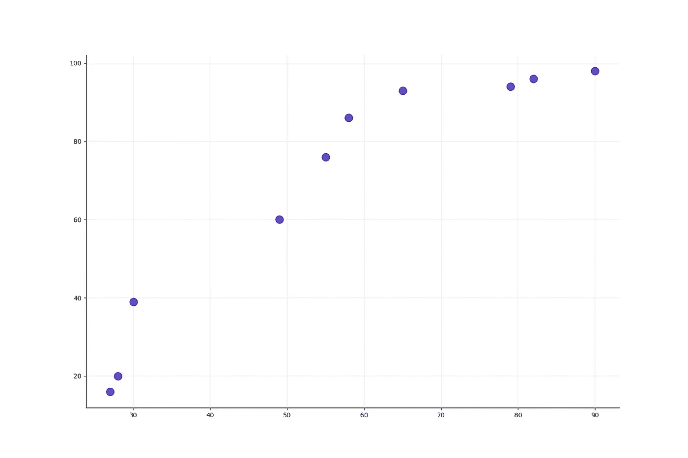

这可能是一个模型，因为它为我们提供了关于我们的数据看起来如何的“描述”。我们可以在上图中看到特征(x 和 y)之间的*关系*，即特征之间的变化。

现在，如果我试图用一个数学公式*来近似*T2，我会得到:

```
y = 1.3055 * x - 5.703
```

绘制时给出:

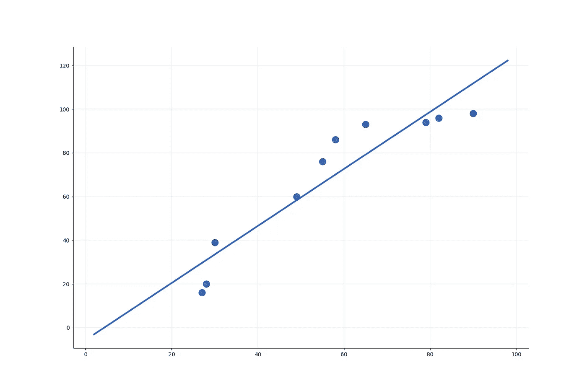

这个等式也是一个模型，因为它给出了数据的更具体的描述(更具体地说是特征之间的关系)。

> 许多统计学致力于确定一个模型是数据的好的还是坏的近似。

既然我们有了统计模型背后的直觉，我们就可以解决可能性和概率之间的差异。

每当我们计算随机过程中某一事件的概率时，它取决于我们用来描述我们的过程的 ***模型*** 的参数。也就是说，**是过程的观察结果， ***θ*** 是描述底层模型的参数。那么我们感兴趣计算的 ***概率*** 用 ***P(O|θ)*** 表示，即“给定用于描述过程的模型的参数，特定结果的概率**”。****

**但是我们很少会事先知道 ***θ*** 的值。我们简单地观察 ***O*** ，然后目标是得出 ***θ*** 的估计，这将是给定观察结果 ***O*** 的一个合理选择。我们对参数的最佳估计是给出发生结果 ***或*** 的最大概率的值。然后我们可以将****函数*** 定义为 ***L(θ|O)*** 即它是 ***θ*** 函数对于**给定的**集合的结果，然后用它来寻找参数 ***的最优值******

**图形解释:**

**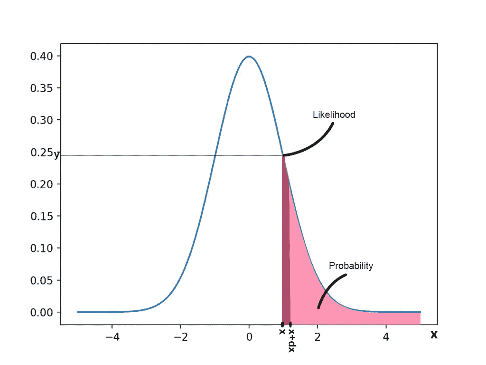**

**考虑如上图所示的高斯分布。设 **X** 为相关过程的随机变量。然后，**

```
**Probability of the random variable equals x given the underlying model is Gaussian:
P(X = x | *N*(μ, σ)) = 0 # For continous random variable, but can be closely approximated to the dark pink areaProbability of the random variable to be greater than x given the underlying model is Gaussian::
P(X > x | *N*(μ, σ)) = (Pink + Dark Pink) areaLikelihood of the random variable at x:
L(*N*(μ, σ) | X = x) = y**
```

> **简单来说，可能性是模型(在这种情况下，高斯分布)的参数(在这种情况下， **μ** 和 **σ** )描述结果的程度(在这种情况下， **X** )。具有最优参数的模型最大化了概率。另一方面，概率是对于所用模型的给定参数，事件或观察的可能性有多大。**

**既然我们已经学习了基本原理，我们终于可以深入到贝叶斯决策理论的工作中了。**

# **贝叶斯决策理论**

**贝叶斯决策理论是解决模式分类问题的基本统计方法。它被认为是理想的模式分类器，并经常被用作其他算法的基准，因为它的决策规则自动最小化其损失函数。现在可能没什么意义，所以等一下，我们会解开的。**

> **它假设决策问题是以概率的形式提出的，并且所有相关的概率值都是已知的。**

## **贝叶斯定理**

**贝叶斯定理的推导；**

```
**We know from the conditional probability:P(A|B) = P(A, B) / P(B)
=> P(A, B) = P(A|B) * P(B) ... (i)Similarly,
P(A, B) = P(B|A) * P(A) ... (ii)From equation (i) and (ii):P(A|B) * P(B) = P(B|A) * P(A)
=> P(A|B) = [P(B|A) * P(A)] / P(B)**
```

**对于分类的情况，假设:**

*   **A ≡ ω(条目的性质或类别的状态)**
*   **b≦**x**(输入特征向量)**

**代入后我们得到:**

```
**P(ω|**x**) = [P(**x**|ω) * P(ω)] / P(**x**)which becomes:P(ω|**x**) = [p(**x**|ω) * P(ω)] / p(**x**)because,* P(ω|**x**) ≡ called the **posterior**, it is the probability of the predicted class to be ω for a given entry of feature (x). Analogous to P(O|*θ*), because the classis the desired outcome to be predicted according to the datadistribution (model). Capital 'P' because **ω** is a discrete random variable.* p(**x**|ω) ≡ class-conditional probability density function for the feature. We call it ***likelihood*** *of* ω with respect to x, a term chosen to indicate that, other things being equal, the category (or class) for which it is large is more "likely" to be the true category. It is a function of parameters within the parameteric space that describes the probability of obtaining the observed data (x). Small 'P' because **x** is a continous random variable. We usually assume it to be following Gaussian Distribution.* P(ω)≡ a **priori** **probability** (or simply prior) of class ω. It is usually pre-determined and depends on the external factors. It means how probable the occurence of class ω out of all the classes.* p(**x**) ≡ called the **evidence**, it is merely a scaling factor that guarantees that the posterior probabilities sum to one. p(x) = sum(p(x|ω)*P(ω)) over all the classes.**
```

**因此，最终我们得到以下等式来构建我们的决策规则:**

**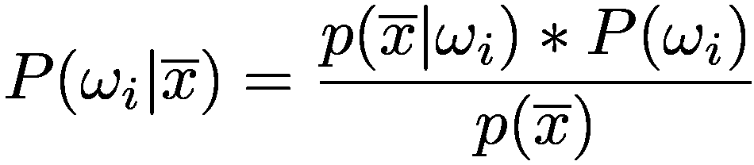**

**贝叶斯分类公式**

## **决策规则**

**上面的等式是我们决策理论的支配公式。规则如下:**

> **对于每个样本输入，它计算其后验概率，并将其分配给与后验概率的最大值对应的类别。**

**数学上它可以写成:**

**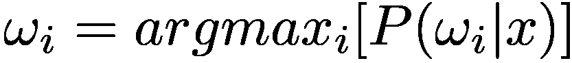**

**贝叶斯决策规则**

**现在你知道贝叶斯规则是什么，它是如何工作的，你可能想知道这里有什么特别的？这个算法非常出色，因为它的优雅和接近理想的结果。贝叶斯决策理论被认为是其他分类算法的基准。**

> **根据贝叶斯定理，没有理论是完美的。相反，它是一项正在进行的工作，总是要接受进一步的完善和测试。**

**让我们试着理解为什么贝叶斯的分类器是最好的分类器！****

****(假设贝叶斯决策理论要求的所有假设都为真)**

## **损失函数**

**设 *{* ***ω*** *1、* ***ω*** *2、****ω****3、…、****ω****c }*为 ***c*** 范畴和 *{通过一个动作，我指的是所有可能决策中的一个特定决策，例如，*一个动作可以是将一个输入特征向量分配给类别(以下称为类别 3)，另一个动作可以是将一个输入分配给类别 7* 。***

*我们可以将损失函数( **λ** )概括如下:*

*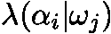*

*可以这样理解:*

> ***λ** 是当其真实类别为 *ω* ***j*** 时，将特征向量分配给类别 *ω* ***i*** 所产生的损失。换句话说，它是在采取行动 **α** 将一个输入分配给类 *ω* ***i*** 时遭受的损失，而该输入本应在类 *ω* ***j*** 中。*

*例如，在二进制分类的情况下，如果我们采取行动将输入特征向量分类到类别 1 中，而它本应在类别 2 中，我们招致以下损失:*

*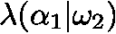*

*如果***I***=***j***，那么我们得到的损失值比备选情况下的小，因为它对应于正确的决策。*

*但是，如果接受这是我们为自己的损失寻求的全部功能，那就太天真了。可以看出，损失是**有条件的**，它取决于在任何特定时间所关注的类。为了更好地理解它，请回答这个问题:*

> *损失是否与输入特征向量的分类概率无关？*

*如果你认为答案是肯定的，让我解释一下为什么答案是否定的！*

```
*Say the posterior probability of class 2 is more than that of class 1 for a given feature vector, i.e.,*
```

*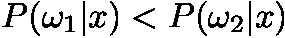*

```
*and let's consider an action of assigning x to class 1.Since **λ** is the loss associated with one particular action (here, assigning x to class 1) we get its two values:*
```

*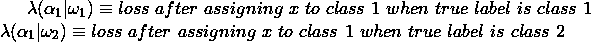*

> *现在这两个损失值相等吗？*

*没有后验概率的知识，你无法回答这个问题。您需要知道一个类成为真实类的可能性有多大，以便计算与之相关的损失。这将我们的损失修改如下:*

*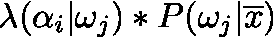*

*贝叶斯分类器的损失函数*

> *这就解释了为什么叫条件损失。*

***λ***可以是任何合适的函数。例如，它可以是*对称*或*零一*函数。**

> *决策的预期损失:*

*现在，我们可以在所有类别中定义特定决策(或行动)的预期损失。也就是说，我在采取特定行动后会招致的损失，以及它将如何受到所有类别而不仅仅是真实类别的“存在”的影响。*

*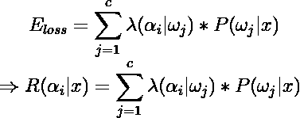*

*条件风险*

*我们可以通过选择最小化条件风险的行动来最小化我们的预期损失。我们现在将展示这个**贝叶斯决策过程实际上提供了最佳性能。***

*我们的问题是找到一个最小化整体风险的决策规则。一个通用的决策规则是一个函数 **α(x)** ，它告诉我们对每一个可能的观察值( **x** )采取哪一个动作。更具体地说，对于每一个 **x** 决策函数 **α(x)** 假设其中一个 ***a*** 值 ***α*** *1、****α****2、****α**3、…，* **因为条件风险与动作 ***α*** *i* 相关联，并且因为决策规则指定了动作，所以总体风险由下式给出:*****

*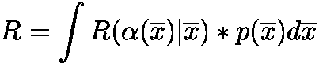*

*所有观察的行动的总体风险*

*如果选择 **α(x)** 使得每个行动的条件风险最小化，那么整体风险也将最小化。这证明了贝叶斯决策规则。*

*也许举个例子会更好…*

```
*Let **λ** be symmetrical or zero-one loss function,*
```

*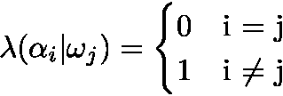*

*零一损失*

*那么条件风险就变成了:*

*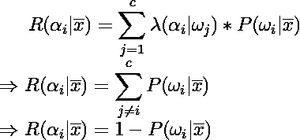*

> *贝叶斯分类器的决策规则自动最小化与动作相关的条件风险。*

*这就是贝叶斯的决策理论！*

*我希望这篇文章能帮助你理解这个算法。请随意在下面留下您的建议和疑问。如果你喜欢，就砸了那个按钮！*

*如果你心中有任何主题，并希望在这里看到它，请在评论区留下它。这将是我的荣幸！*

*一路平安！*

*(除缩略图外，所有图片均由作者创作。)*