# 贝叶斯高斯混合模型(没有数学)使用推断。网

> 原文：<https://towardsdatascience.com/bayesian-gaussian-mixture-models-without-the-math-using-infer-net-7767bb7494a0?source=collection_archive---------20----------------------->

## Infer 中高斯混合模型编码的快速实用指南。网

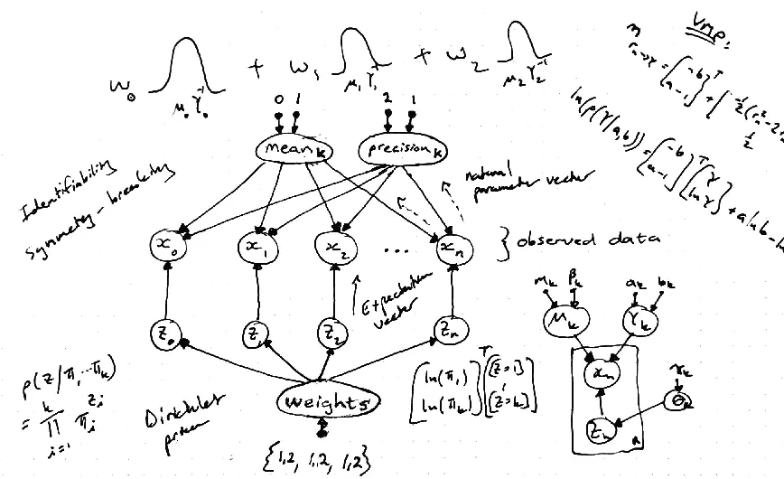

(*图片作者*)

T 他的帖子提供了贝叶斯高斯混合模型的简要介绍，并分享了我在[微软的 Infer.NET](https://dotnet.github.io/infer/default.html)概率图形模型框架中构建这类模型的经验。由于熟悉 k-means 聚类和 Python，我发现学习 c#、inference 和概率推理中使用的一些底层贝叶斯原理很有挑战性。也就是说，Python 程序员有一个集成的方法。NET 组件和服务，我将在后续文章中介绍。我希望这篇文章的内容可以节省你的时间，消除理论可能带来的任何威胁，并展示所谓的基于模型的机器学习方法的一些优势。请遵循[Infer.NET 文档](https://github.com/dotnet/infer) 中提供的指南来设置 Infer.NET 框架。

贝叶斯高斯混合模型构成了一种无监督学习的形式，并且可用于为诸如聚类、数据压缩、离群点检测或生成分类器之类的任务拟合多模态数据。每个高斯分量通常是具有均值向量和协方差矩阵的多元高斯分量，但为了说明起见，我们将考虑一个不太复杂的单变量情况。

我们首先从单变量高斯分布中采样数据，并使用 Python 代码将数据存储在一个. *csv* 文件中:

这是我们数据的样子:

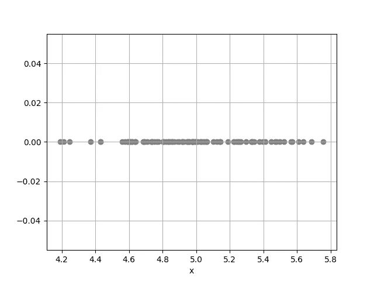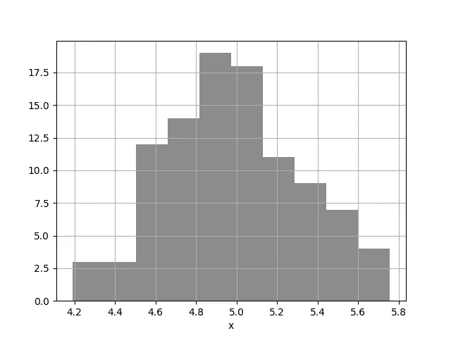

左图:从均值=5、精度=10 的高斯分布中采样的 100 个数据点的图。右图:数据的直方图。(*作者图片*)

让我们暂时假设我们不知道产生我们的数据集的分布。我们将数据可视化，并假设数据由高斯分布生成。换句话说，我们希望高斯分布能够充分描述我们的数据集。然而，我们不知道这个高斯分布的位置或范围。高斯分布可以通过均值和方差参数被参数化。有时使用平均值和精度在数学上更容易，因为精度只是方差的倒数。我们将坚持精度，因为直觉上精度越高，高斯分布的范围就越窄(或更“确定”)。

首先，我们感兴趣的是找到这个高斯分布的均值参数，并将假装我们知道它的精度的值(我们设置精度=1)。换句话说，我们认为我们的数据是高斯分布的，我们不确定它的均值参数是多少，但我们确信它的精度=1。我们能从数据中学习它的平均参数吗？我们需要第二个高斯分布来描述第一个高斯分布的平均值。这被称为[共轭先验](https://en.wikipedia.org/wiki/Conjugate_prior)。以下是学习未知均值的图形表示(使用参数均值=0，精度=1 的高斯先验):

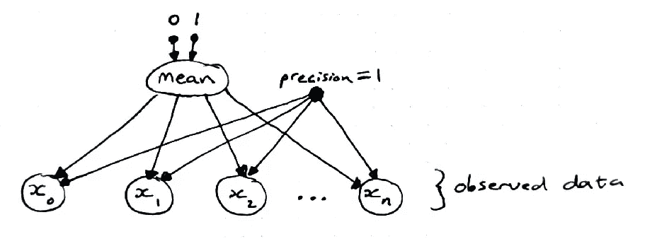

用于学习已知精度的数据均值的贝叶斯网络。(*图片作者*)

请注意图中平均随机变量和已知精度之间的差异。下面是 Infer 中的代码。网络:

后验高斯(高斯均值):高斯(4.928，0.009901)

在只观察了 100 个数据点后，我们现在有了一个后验高斯分布，它描述了我们数据的平均值 ***x*** 。我们从数据中学到了一些有用的东西！但是等等…我们也可以了解一下它的精度，不必假装它固定在 1。怎么会？我们对均值做同样的事情，并在精度上放置一个分布(通过用类似于我们的“不确定性”的东西来代替它，有效地消除了我们“无限确信”它等于 1 的知识)。精度的共轭先验是[伽马分布](https://en.wikipedia.org/wiki/Gamma_distribution)。我们通过在新的精度随机变量上包括伽马分布(先前参数 shape=2，rate=1)来更新模型的图形表示:

学习数据的均值和精度的贝叶斯网络。(*作者图片*)

下面是 Infer 中的代码。网络:

后验高斯(高斯均值):高斯(4.971，0.001281)
后验伽马(高斯精度):伽马(52，0.1499)【均值=7.797】

到目前为止，我们的假设概述如下(参考下图):

1.  数据 ***x*** 呈高斯分布，
2.  我们假装完全知道它的精度(精度=1)并通过使用高斯先验来学习它的平均值，
3.  然后，我们不再假装“知道”精度，而是通过使用伽玛先验来学习精度。请注意下图中的不同之处。由于我们施加的限制，第一个模型无法学习精度(显示为绿色)。
4.  未知平均值和未知精度的参数为高斯-伽马分布。从 100 个数据点中学习后，这些参数的先验分布(以红色显示)更新为后验分布(在右下图中以蓝色显示)。

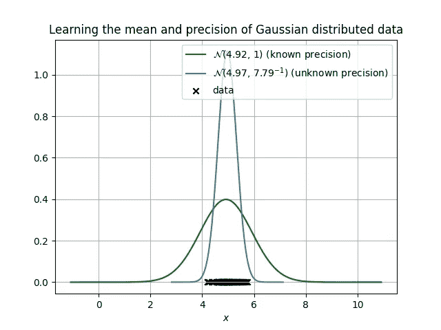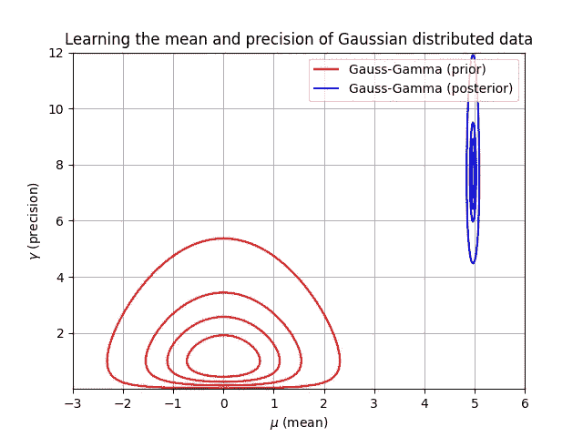

左图:已知精度(绿色)和未知精度(蓝色)的高斯分布。右图:平均值和精度参数的先验高斯-伽马分布(红色)和从 100 个数据点学习后的后验分布(蓝色)。(*作者图片*)

推断。NET 可以在设置 *ShowFactorGraph = true* 时生成我们模型的因子图。因子节点显示在黑色方框中，变量节点显示在白色方框中。这个图显示了我们的数据 ***x*** (底部观察到的变量数组)，它依赖于一个高斯因子。高斯因子取决于一个叫做均值的随机变量和一个叫做精度的随机变量。这些随机变量分别依赖于高斯先验和伽马先验。两个先前分布的参数值显示在图表的顶部。

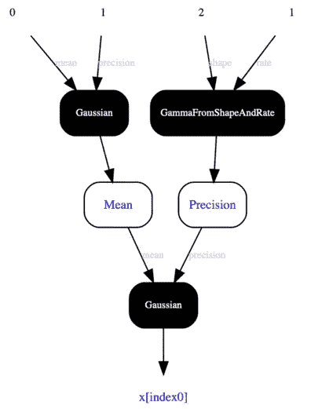

推断。我们模型的净生产因子图。(*图片由作者通过推断生成*。网)

为了了解高斯分布的均值和精度，我们做了一些假设。在 MBML 中，学习和推理本质上是一样的。你可以在这里 阅读更多关于支持的 inference 推理技术及其差异 [**。本文中的例子使用了**](https://dotnet.github.io/infer/userguide/Working%20with%20different%20inference%20algorithms.html)**[变量消息传递](https://en.wikipedia.org/wiki/Variational_message_passing) (VMP)。为了学习更复杂的分布(即，多模态密度)，该模型不够有表现力，应该通过引入更多假设来扩展。准备好混合东西了吗？**

正如生活中的许多事情一样，如果一个高斯是好的，那么更多应该更好，对吧！首先，我们需要一个新的数据集，并使用本文开头介绍的 Python 代码。唯一不同的是我们设置 p=[0.4，0.2，0.4]。这意味着 80%的数据应从第一个和第三个高斯分布中采样，而 20%的数据应从第二个高斯分布中采样。数据可以可视化:

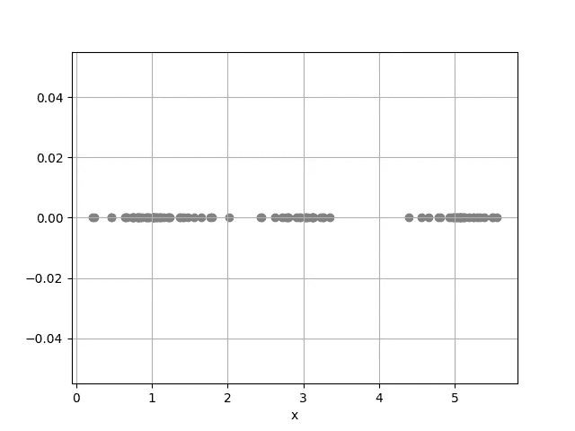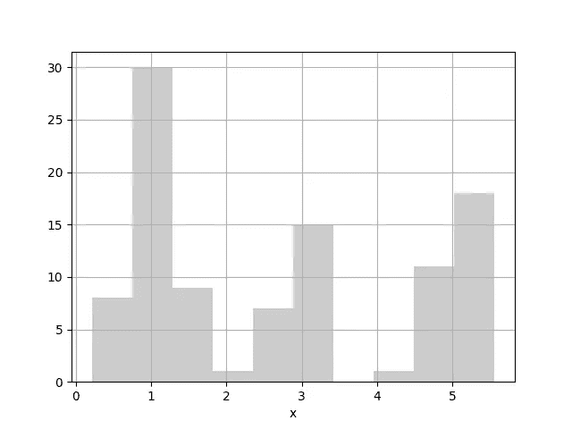

左图:从三个不同的高斯分布中采样的 100 个数据点的图，平均值=[1，3，5]，精度=[10，10，10]。右图:数据的直方图。(*作者图片*)

为了创建模型，我们将使用 ***k*** =3 数量的高斯分布，也称为分量，来拟合我们的数据集。换句话说，我们有三个 ***均值*** 随机变量和三个 ***精度*** 随机变量需要学习，但是我们还需要一个潜在随机变量 ***z*** 。该随机变量具有离散分布，并负责选择最能描述其相关观察值 ***x*** 的分量。例如，如果观察到的*₀最好用高斯分量一来解释，则应该将更多的权重分配给状态一 ***z*** ₀。在本例中，我们将假设知道所有数据点的混合权重，并使用统一分配(w₀=1/3、w₁=1/3、w₂=1/3)，如下图所示。*

*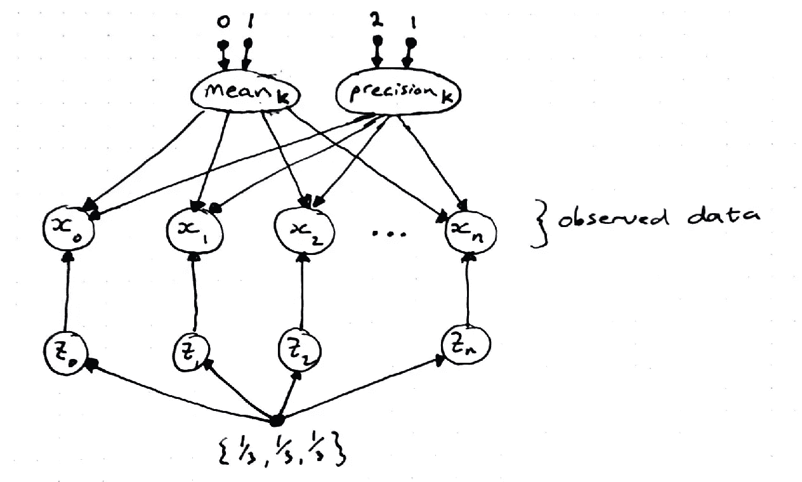*

*学习已知混合权重的混合高斯分布的贝叶斯网络。(*图片作者*)*

*下面是 Infer 中的代码。网络:*

*后验高斯(高斯均值):高斯(1.008，0.003284)
后验伽马(高斯精度):伽马(25.43，0.2547)
后验高斯(高斯均值):高斯(5.045，0.004061)
后验伽马(高斯精度):伽马(17，0.4812)【均值= 8.178】
后验高斯(高斯均值):高斯(2*

*从数据中学习到的三个高斯分布/分量绘制如下:*

*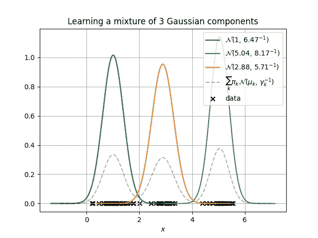*

*已知权重设置为 1/3 的三个学习到的高斯分布及其总和。(*图片作者*)*

*等等…我们声称完全了解组件重量，但如果我们不知道呢？我们也可以从数据中学习权重吗？确实，但是我们需要一个先验！[狄利克雷分布](https://en.wikipedia.org/wiki/Dirichlet_distribution)是离散/分类分布的共轭先验。下图已更新，显示了未知权重的随机变量及其附带的 Dirichlet 先验。*

*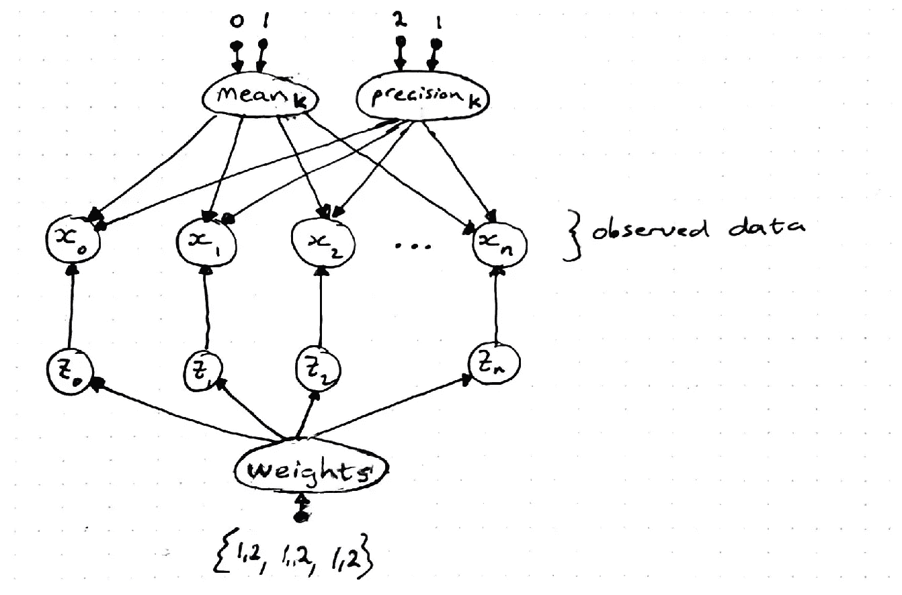*

*学习混合权重未知的混合高斯分布的贝叶斯网络。(*图片作者*)*

*下面是 Infer 中的代码。网络:*

*后验高斯(高斯均值):高斯(0.9955，0.003208)
后验伽马(高斯精度):伽马(25.04，0.2663)【均值= 6.667】
后验高斯(高斯均值):高斯(2.719，0.02028)
后验伽马(高斯精度):伽马(10.1，0.3655)【均值= 3.693】
后验高斯(高斯均值):高斯(4.55*

*从数据中学习到的三个高斯分布/分量及其学习到的权重如下所示:*

**

*三个学习到的高斯分布和未知权重的和= {0.45，0.16，0.37}。(*图片作者*)*

*总之，我们从假设我们的第一个数据集可以用高斯分布充分描述开始了这个旅程。我们能够利用 inference 的观测数据和 VMP 推断来学习高斯分布的均值参数和精度参数。我们的第二个数据集使用了更复杂的生成机制，这需要一个更具表现力的模型。然后，我们引入了一个潜在变量 ***z*** 和狄利克雷先验，这允许我们学习混合高斯分布及其混合权重。所有步骤均使用 Infer.NET 以 c#代码提供，可在此 处 [**访问。**](https://github.com/jacowp357/bayesian-gaussian-mixtures)*

*对于更正式的治疗，推荐以下书籍和链接:*

1.  *[https://dotnet.github.io/infer/InferNet101.pdf](https://dotnet.github.io/infer/InferNet101.pdf)*
2.  *模式识别和机器学习。斯普林格，2006 年。*
3.  *机器学习:一个概率的观点。麻省理工学院出版社，2012 年。*
4.  *[http://mbmlbook.com/index.html](http://mbmlbook.com/index.html)*
5.  *[http://www.jmlr.org/papers/volume6/winn05a/winn05a.pdf](http://www.jmlr.org/papers/volume6/winn05a/winn05a.pdf)*
6.  *[https://en.wikipedia.org/wiki/Exponential_family](https://en.wikipedia.org/wiki/Exponential_family)*

*这篇文章中没有提到的重要概念:*

1.  *适当的先验参数，*
2.  *可识别性，*
3.  *预测分布，*
4.  *打破对称，*
5.  *消息传递(变分消息传递(VMP)和期望传播(EP))，*
6.  *逆协方差矩阵的 Wishart 共轭先验，*
7.  *奥卡姆剃刀和狄利克雷先验。*