# 带 Pyro 的贝叶斯广义线性模型

> 原文：<https://towardsdatascience.com/bayesian-generalized-linear-models-with-pyro-b80bc08d7b75?source=collection_archive---------12----------------------->


照片由[负空间](https://www.pexels.com/@negativespace)从[像素](https://www.pexels.com/)拍摄

## [实践教程](https://towardsdatascience.com/tagged/hands-on-tutorials)

## 使用线性模型和 Pyro 预测房价，实现完全透明的方法

面对预测或分析数据项目时，最常见的“第一攻击线”之一是广义线性模型(GLMs)，最常见的是线性或逻辑回归。

GLMs 试图将响应变量 *y* 建模为特征的线性组合 *X* 的函数。线性组合的原因主要是为了便于解释；我们希望不仅能够很好地预测 *y* ，而且能够解释每个特征对我们反应的影响。

因此，我们通常指定 GLM 作为我们的响应，它是如下特征和系数的组合:

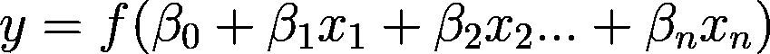

使用[https://www.codecogs.com/latex/eqneditor.php](https://www.codecogs.com/latex/eqneditor.php)制备的配方

其中 *f* 是我们的线性组合的函数，系数用希腊字母 *β* 表示

虽然像`sklearn`这样的库提供了丰富多样的回归模型，但是它们有一个主要的缺点，那就是它们创建了 *β* 的点估计，而没有考虑不确定性。也就是说，虽然我们可以找出该系数最可能的值，但我们不会估计该系数的其他值的可能性有多大。其他软件包如`statsmodels`提供了一些不确定性的度量，但是是在一系列分析师可能无法验证(或了解)的隐含假设下提供的。

在本文中，我们将讨论如何利用 PyTorch 和 Pyro 来生成 GLM 模型，这些模型创建参数和预测的不确定性估计，并通过一组非常明确的假设来实现。

# 采用 Scikit-learn 的线性回归

我们将从探索一个来自`sklearn`的简单线性回归开始，看看它在一个内置数据集上的表现，即加州住房数据集。

我们将从导入所有需要的库开始:

现在，让我们导入住房数据集，并探索其功能:

```
>>> Data shape is (20640, 8)
>>> Target shape is (20640,)
```

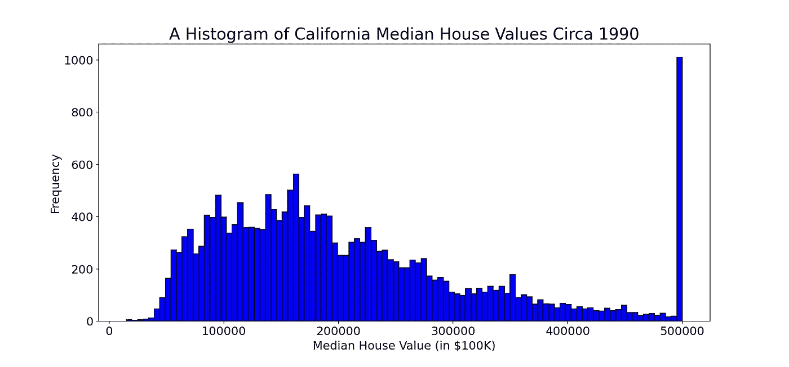

许多库中的基本线性回归模型假设响应正态分布在预测平均值周围。但是，一般来说房价不会呈正态分布。在这个数据集中，价格的分布也是不正常的，它更接近于一个[伽马分布](https://en.wikipedia.org/wiki/Gamma_distribution)(实际上，我们不会总是直接从数据中获得，但可能必须查看残差，但这个简单的替代方案在我们的情况下是有效的)。因此，如果我们能够建立模型，将这一点考虑在内，那就太好了。

首先，让我们探索一下`sklearn`线性回归对这些数据的表现。我们可以将数据分为训练集和测试集，以估计我们的算法将如何工作:

```
>>> (16512, 8) (16512,)
>>> (4128, 8) (4128,)
```

让我们来拟合我们的线性回归:

```
>>> beta_intercept: -3664645.74
>>> beta_MedInc: 44223.44
>>> beta_HouseAge: 944.77
>>> beta_AveRooms: -11532.16
>>> beta_AveBedrms: 66340.59
>>> beta_Population: -0.16
>>> beta_AveOccup: -411.33
>>> beta_Latitude: -41808.42
>>> beta_Longitude: -43108.51
```

让我们定义一个函数来绘制我们的预测和持续测试集的真实值:


我们的数据中有一些观察结果是经过审查的。也就是说，他们的标签似乎是 50 万美元以上的房子。我们可以定义另一个函数，它只画出未被删除的点:

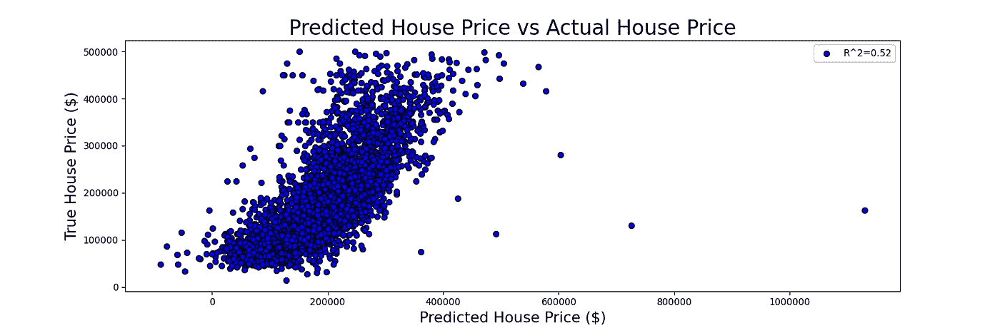

虽然这种方法可以产生令人满意的结果，但它有几个主要缺点:

*   首先，线性模型通常忽略价格来自伽玛分布的事实。它对每个点的期望值的计算是基于来自正态分布的平均值。
*   第二，对于每个系数，我们只能得到其最可能值的点估计。然而，我们可能对考虑不确定性的范围感兴趣。例如，我们可能想知道每增加一间卧室，价格上涨的幅度是多少。

为了解决这些问题，我们可以使用 [Pyro](https://pyro.ai/) 和 [PyTorch](https://pytorch.org/) 来构建我们自己的线性模型，这将解决刚才提到的所有痛点。

# 用 Pyro 重建线性模型

首先，让我们尝试用 Pyro 复制简单线性回归的结果。这将让我们直观地了解不同的火焰元素是如何工作的:

首先，我们将在 Pyro 中定义我们的模型。Pyro 模型被定义为函数(实际上它们被定义为可调用的，但最简单的可调用是函数)。该函数将接受我们的特征𝑋、我们的目标𝑦，以及更容易命名先验的特征名称:

本质上，我们在这里所做的是将我们的线性回归定义为以下参数的线性组合

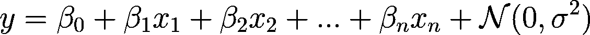

使用[https://www.codecogs.com/latex/eqneditor.php](https://www.codecogs.com/latex/eqneditor.php)制备的配方

然而，与传统的线性回归不同，我们将每个β系数以及误差项定义为一个分布，而不是单个值。也就是说，对于每个系数，我们可以问，在给定我们观察到的数据的情况下，该系数可以假设的可能值的范围是什么。我们给每一个发行版起了一个名字(例如“`beta_intercept`”)，以便以后参考。

我们必须定义每个系数的先验。先验是我们对这一价值的“最佳猜测”。我们选择的优先顺序是:

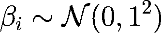

使用[https://www.codecogs.com/latex/eqneditor.php](https://www.codecogs.com/latex/eqneditor.php)准备的配方

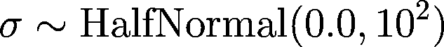

使用[https://www.codecogs.com/latex/eqneditor.php](https://www.codecogs.com/latex/eqneditor.php)制备的配方

这些不是非常有用的先验知识，但它们通常用于回归系数和误差项。

需要注意的重要一点是，在构建模型时，我们必须明确这些选择。也就是说，我们必须清楚什么是系数值、误差项以及预测值周围值的分布的合理先验。

一旦先验被定义，我们可以要求 Pyro 通过 MCMC 采样器的魔力将它们更新为越来越好的猜测:

```
>>> Sample: 100%|██████████| 3100/3100 [22:45,  2.27it/s, step size=7.72e-04, acc. prob=0.955]>>> Inference ran for 22.75 minutes
```

如果您对这里发生的事情感兴趣，我建议您查看我以前的文章，其中探讨了使用 MCMC 方法优化单个参数。

我们可以使用`.summary()`方法研究 MCMC 采样器为每个系数找到的估计值:

```
>>> mean    std   median    5.0%   95.0% n_eff r_hat
 beta_intercept   1.58   0.01    1.58   1.56   1.59   9.48  1.21
    beta_MedInc   1.96   0.02    1.96   1.93   1.98   2.83  2.28
  beta_HouseAge   0.80   0.09    0.80   0.68   0.93   2.41  3.00
  beta_AveRooms  -1.88   0.02   -1.87  -1.90  -1.86   2.56  2.53
 beta_AveBedrms   1.63   0.01    1.64   1.61   1.65   4.59  1.45
beta_Population  81.19  18.19   87.50  71.45  87.91   9.00  1.13
  beta_AveOccup  -0.56   0.01   -0.56  -0.57  -0.55   4.61  1.97
  beta_Latitude  -0.57   0.04   -0.58  -0.63  -0.52   2.39  3.23
 beta_Longitude  -2.37   3.30   -2.12  -7.11   1.80   2.44  2.82
      sigma  15062.73 460.33 14933.00 14908.34  15057.25  12.98 1.09

Number of divergences: 0
```

这些看起来不太对…平均值似乎与`sklearn`回归发现的点估计值非常不同。

让我们从采样器中获取单个样本，并将它们转换成数据帧(它们作为字典返回)。我们可以获取每个分布的平均值作为系数点估计，然后为我们的数据点计算一组预测。然后，我们可以将它们与我们已知的房价值进行比较:

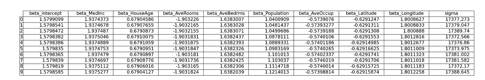

让我们绘制结果并计算我们预测的𝑅值:

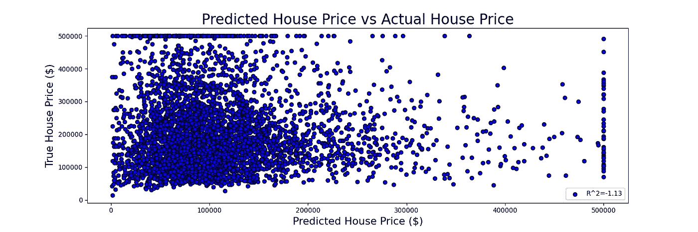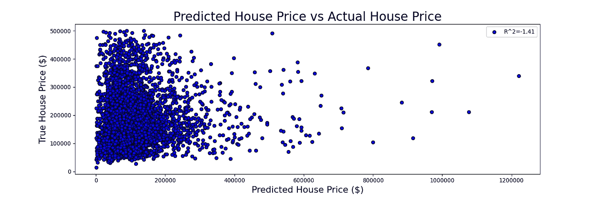

那看起来像一场灾难！发生了什么事？

让我们定义一个函数，当给定一个系数数据帧时，它将为我们画出系数的分布:

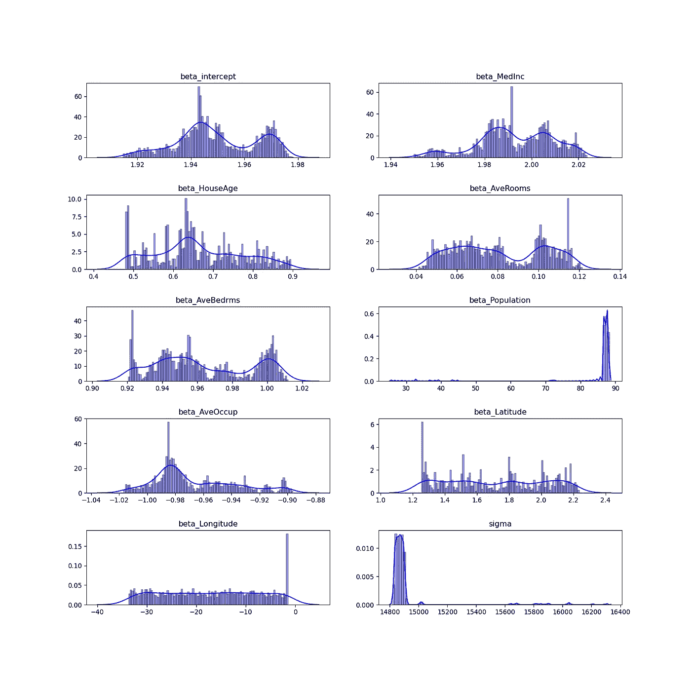

那些情节看起来不像是融合了。

对于这个问题，MCMC 方法很难处理不同尺度的数据。当我们的特征和目标被缩放时，它们工作得更好。让我们通过数据缩放来探索相同方法的性能

# 扩展我们的数据

我们将使用来自`sklearn`的标准缩放器来缩放我们的 X 和 y 数据。标准缩放器将缩放 X 轴上的每个要素，使其平均值为 0.0，标准差为 1.0。为此，它将采用每个变量的平均 x̅和标准差𝑠

这意味着，不是试图在原始数据上找到一组系数

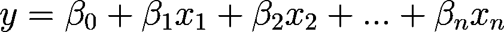

使用 https://www.codecogs.com/latex/eqneditor.php[配制的配方](https://www.codecogs.com/latex/eqneditor.php)

我们将在缩放后的数据上找到一组系数:

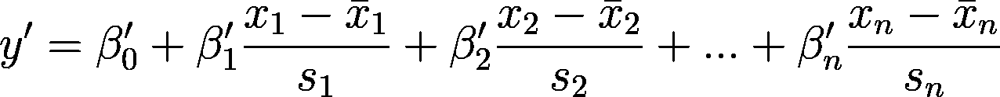

使用 https://www.codecogs.com/latex/eqneditor.php[配制的配方](https://www.codecogs.com/latex/eqneditor.php)

在哪里

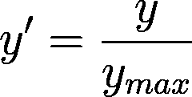

使用[https://www.codecogs.com/latex/eqneditor.php](https://www.codecogs.com/latex/eqneditor.php)制备的配方

也就是说，y 被缩放到 0–1 之间，X 的列已经标准化。

```
>>> Sample: 100%|██████████| 3100/3100 [05:27,  9.46it/s, step size=1.71e-02, acc. prob=0.926]>>> Inference ran for 5.46 minutes
```

我们的算法现在运行得更快了，但如果我们恢复算法找到的系数，这些将是缩放数据的系数。我们希望将它们转换回未缩放的数据，这样我们就可以问这样的问题:“房子里每多一间卧室，对价格会有什么影响？”

幸运的是，我们可以操纵我们的方程来检索未缩放数据的系数。我们从原始方程开始


使用[https://www.codecogs.com/latex/eqneditor.php](https://www.codecogs.com/latex/eqneditor.php)制备的配方

我们展开每一部分:

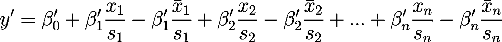

使用[https://www.codecogs.com/latex/eqneditor.php](https://www.codecogs.com/latex/eqneditor.php)制备的配方

然后，我们可以将等式重新排列如下:

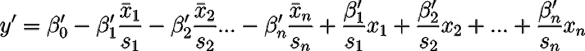

使用[https://www.codecogs.com/latex/eqneditor.php](https://www.codecogs.com/latex/eqneditor.php)制备的配方

忆及


使用[https://www.codecogs.com/latex/eqneditor.php](https://www.codecogs.com/latex/eqneditor.php)制备的配方

我们最终可以将公式改写如下:

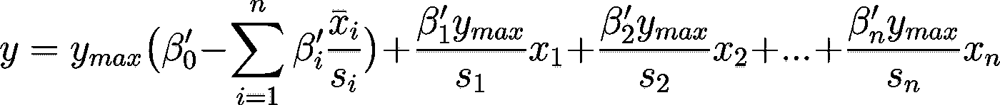

使用[https://www.codecogs.com/latex/eqneditor.php](https://www.codecogs.com/latex/eqneditor.php)制备的配方

我们可以创建一个函数来执行从缩放数据到未缩放数据的系数处理

然后，在我们再次从字典中检索系数之后，我们只对检索到的系数使用该函数:

我们来对比一下预测结果:

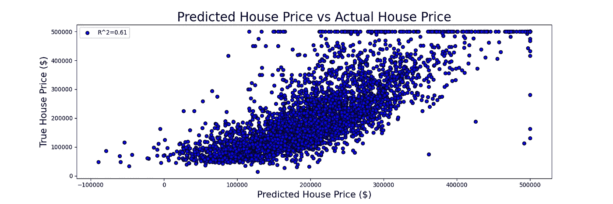

这些值似乎更接近于通过`sklearn`的线性回归得到的值。

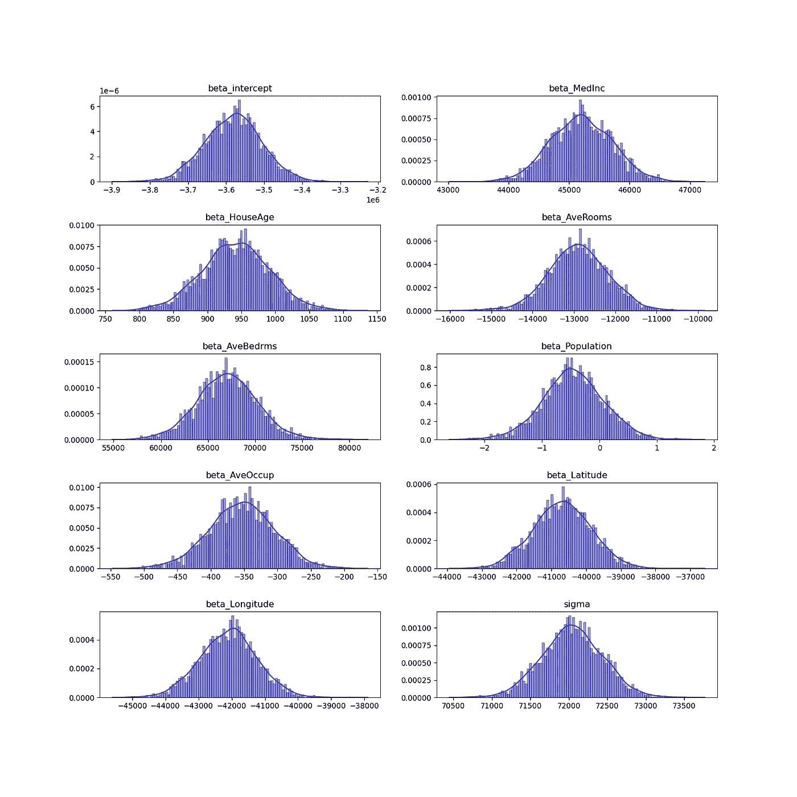

看起来我们的表现不相上下。这些分布看起来接近于我们从 scikit-learn 获得的值。我们还得到了每个系数的概率分布，这样我们就可以看到我们找到的值的置信度。

然而，我们实际上可以使用 Pyro 做得更好！回想一下，我们看到我们的房价不是正态分布，而是遵循伽玛分布。我们可以修改代码以在模型中反映出来。

# 使用伽马分布改进我们的预测

为了更好地反映房屋分布，我们可以对目标值采用伽玛分布。与由其平均值和标准偏差定义的正态分布不同，伽马分布由两个正参数定义，即形状和比率。

当构建非正态分布的模型时，我们需要使用一个**链接函数**，它会将我们参数的线性组合转换为分布的期望值或平均值。我们还想知道平均值和分布参数之间的关系。幸运的是，对于伽马分布，这被定义为:

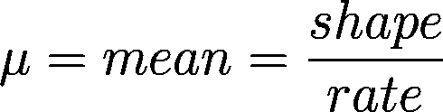

使用[https://www.codecogs.com/latex/eqneditor.php](https://www.codecogs.com/latex/eqneditor.php)制备的配方

然而，如果形状和速率参数都是正的，这意味着平均值也必须是正的。我们需要确保我们的链接函数能够捕捉到这一点。因此，我将对线性方程使用以下链接函数:

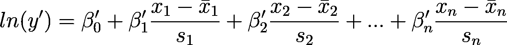

使用[https://www.codecogs.com/latex/eqneditor.php](https://www.codecogs.com/latex/eqneditor.php)制备的配方

或者

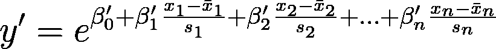

使用[https://www.codecogs.com/latex/eqneditor.php](https://www.codecogs.com/latex/eqneditor.php)制备的配方

熟悉`statsmodels`包的读者会知道它有一个 GLM 模块(关于`statsmodels` GLMs 的更多细节，我推荐[这篇文章](/generalized-linear-models-9cbf848bb8ab))，它可以通过使用`statsmodels.genmod.families.family.Gamma`族和`statsmodels.genmod.families.links.log`链接函数来对这里提出的关系进行建模。然而，出于本文的目的，我想展示在贝叶斯框架中重现这一功能的过程。

有趣的是，为了恢复未缩放数据的系数，除了常数之外，数学计算非常相似。请记住:

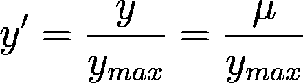

使用[https://www.codecogs.com/latex/eqneditor.php](https://www.codecogs.com/latex/eqneditor.php)制备的配方

而且

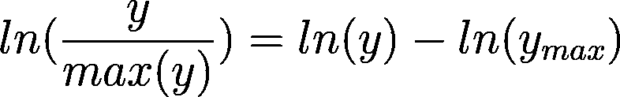

使用[https://www.codecogs.com/latex/eqneditor.php](https://www.codecogs.com/latex/eqneditor.php)制备的配方

我们可以发现我们的方程可以写成:

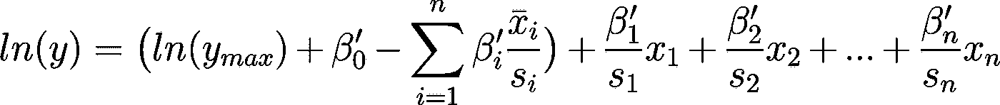

使用[https://www.codecogs.com/latex/eqneditor.php](https://www.codecogs.com/latex/eqneditor.php)制备的配方

或者

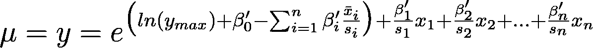

使用[https://www.codecogs.com/latex/eqneditor.php](https://www.codecogs.com/latex/eqneditor.php)制备的配方

让我们定义我们的模型，但是现在使用伽马分布:

你会注意到我们的代码略有不同，但我们仍然在计算我们的 *X* 数据和我们的系数的线性组合，只是现在我们取该组合的`exp`来获得我们的数据点的平均值。我们还对速率参数进行采样，并使用平均值和速率来计算适当的形状参数。

给定我们的形状和速率参数，我们可以定义一个伽马分布，并要求 Pyro 优化我们的系数和速率参数，以便建立一个最有可能基于我们的数据的模型。

让我们优化这个新模型，看看结果:

```
>>> Sample: 100%|██████████| 3100/3100 [11:08,  4.64it/s, step size=1.47e-02, acc. prob=0.930]>>> Inference ran for 11.14 minutes
```

我们也可以从这个采样器中获取系数。但是，这一次我们要稍微区别对待`y_max`的值。

让我们通过计算预测值并将其与观测值进行比较来比较该模型的性能

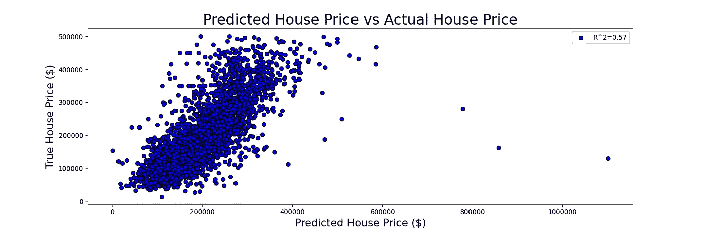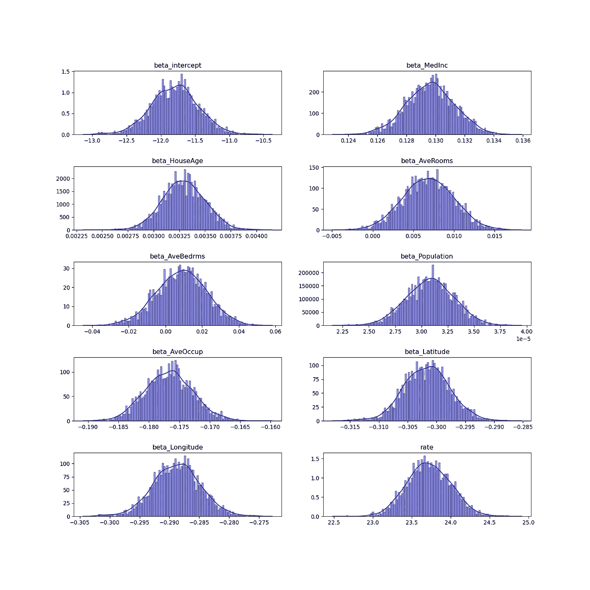

我们如何解释这些系数？

嗯，他们现在用一个系数来修改我们的价格。回想一下，我们的等式现在是:

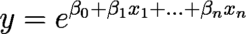

使用[https://www.codecogs.com/latex/eqneditor.php](https://www.codecogs.com/latex/eqneditor.php)制备的配方

这相当于

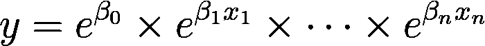

使用[https://www.codecogs.com/latex/eqneditor.php](https://www.codecogs.com/latex/eqneditor.php)制备的配方

所以`x_1`每增加一个单位，房价就会增加`e^{x_1}`倍。

例如，`beta_AvgRooms`的平均值约为 0.007，因此每增加一个房间，房价平均会增加 e^0.007 = 1.007 的系数(因此，如果一栋房子的价格为 250，000 美元，增加一个房间将使其价值为 251，756 美元)。

这两个模型之间的其他参数似乎在定性上一致，但采用伽马分布的模型为我们提供了对未知数据的更好预测。

然而，仍然存在运行时间的问题。一般来说，如果我们想在合理的时间内进行推理，就不得不求助于变分推理的方法。

# 更快的 SVI 运行时间

Pyro 实现了随机变分推理(SVI ),以加快推理速度。在 SVI 方法中，我们不是试图直接从后验分布中取样，而是简单地优化一些预定义分布的参数，以匹配我们的观察数据。

例如，我们可以选择将所有系数和比率表示为正态分布。通过这种方式，SVI 只需找到每个正态分布的适当均值和标准差，使其尽可能与我们的数据一致。

```
>>> iter: 0, normalized loss:5.28
>>> iter: 250, normalized loss:-0.64
>>> iter: 500, normalized loss:-0.68
>>> iter: 750, normalized loss:-0.68
>>> iter: 1000, normalized loss:-0.68
>>> iter: 1250, normalized loss:-0.69
>>> iter: 1500, normalized loss:-0.69
>>> iter: 1750, normalized loss:-0.68
>>> iter: 2000, normalized loss:-0.68
>>> iter: 2250, normalized loss:-0.69
>>> iter: 2500, normalized loss:-0.69
>>> iter: 2750, normalized loss:-0.69
>>> iter: 3000, normalized loss:-0.69
>>> iter: 3250, normalized loss:-0.68
>>> iter: 3500, normalized loss:-0.69
>>> iter: 3750, normalized loss:-0.68
>>> iter: 4000, normalized loss:-0.68
>>> iter: 4250, normalized loss:-0.69
>>> iter: 4500, normalized loss:-0.68
>>> iter: 4750, normalized loss:-0.68>>> Inference ran for 0.74 minutes
```

从 SVI 样本中获取结果比从 MCMC 样本中获取结果要复杂一些，因为样本返回的是一个具有梯度的张量字典，并且它还返回了一个名为`obs`的附加关键字，该关键字与我们的系数分析无关(它是一组对训练数据的估计)。

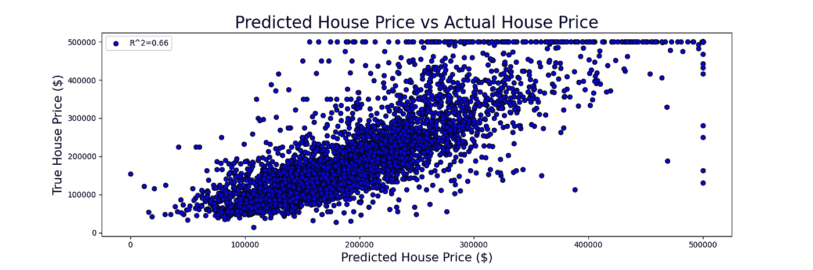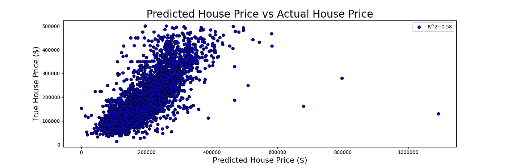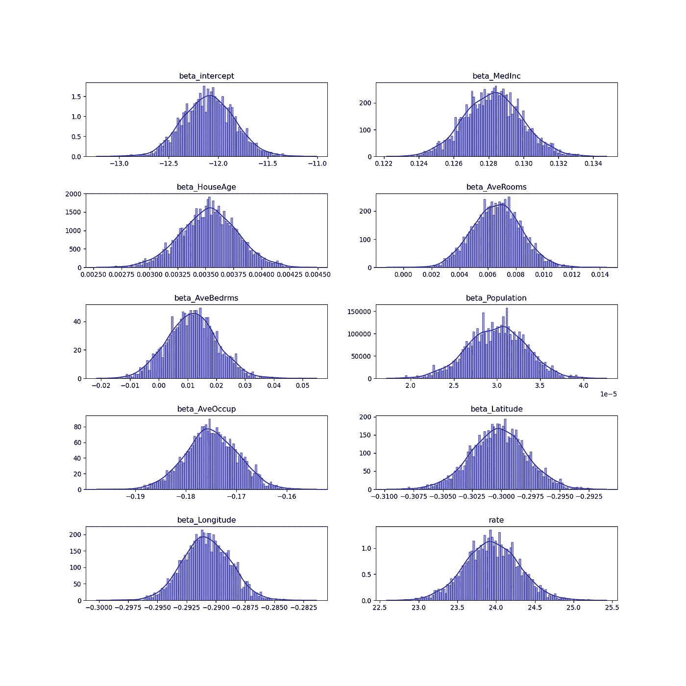

我们开始吧。我们现在可以使用 Pyro 构建定制的 GLMs，使用 MCMC 采样方法或 SVI 优化方法。

Pyro 的一个重要特性是它迫使作者非常明确地说明他们的假设和他们对数据生成过程的理解。这对于在进行任何建模之前促进对数据的深入探索非常有用，有助于更深入地理解所有重要因素。

如需本文的 Colab 笔记本版本，请访问[此链接](https://colab.research.google.com/drive/1MpbGkI_JEVmfzEuh68PRGWgFP5fSEIoe)

# 结果摘要

在完成了这个博客的笔记本版本之后，我开始描绘我观察到的运行时和性能结果。通过运行相同的代码 40 次，每次都有不同的训练/测试分割，我能够对我在本文中展示的结果有信心。

就 R 性能而言，伽玛分布始终优于正态分布模型，如下图所示。

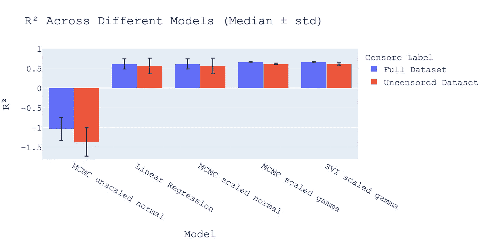

使用 Plotly 准备的图像

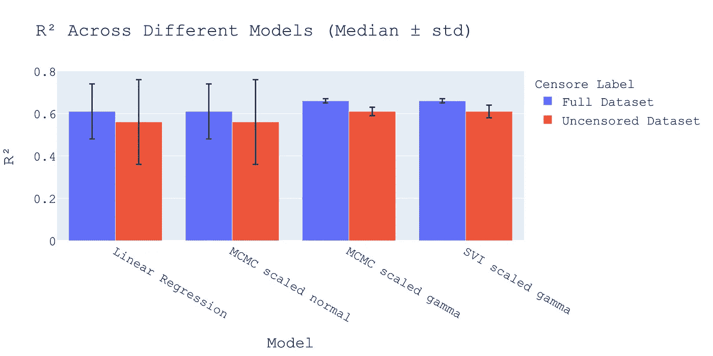

值得注意的是，线性回归模型(`sklearn`的线性回归)的 R 值中明显的高标准偏差，以及在缩放数据并采用 MCMC 方法后产生的模型是单次训练/测试分割的结果，这导致了数据系数的严重错误估计。基于伽马分布的方法更适用于误导性的训练/测试分割。

此外，我还分析了每种方法的运行时间，结果如下图所示:

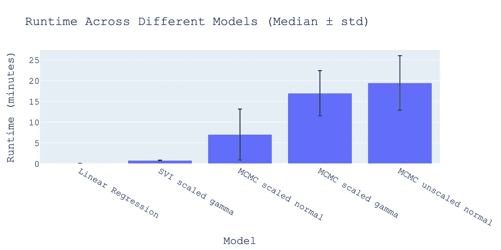

如您所见，虽然`sklearn`的线性回归始终优于所有其他方法，但采用基于 SVI 的方法是一种相对较快的解决方案，它结合了自定义指定 GLM 的灵活性和许多问题所需的快速运行时间。

此外，如果我们愿意，我们也可以编写我们自己的自定义指南，使用系数的正态分布以外的分布。

总的来说，我们可以看到 Pyro 提供了一套丰富的方法来为不同的问题建立线性模型，它结合了概率规划中涉及的明确性和最近成为焦点的可解释性。我希望这篇文章能为希望利用即将到来的概率编程语言的分析师和科学家提供很好的指导。