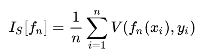
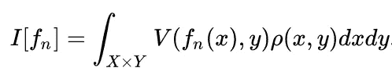
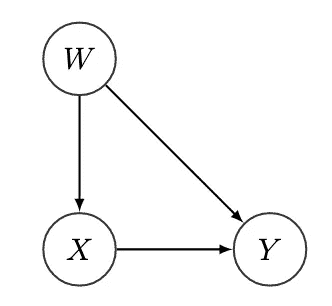
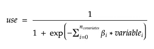
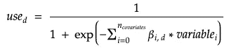
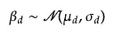
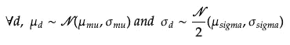
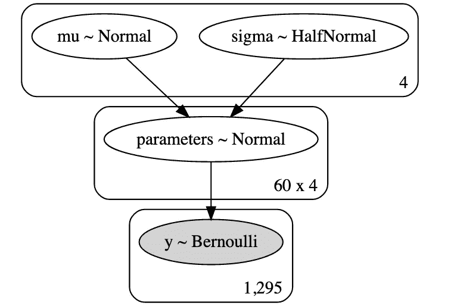
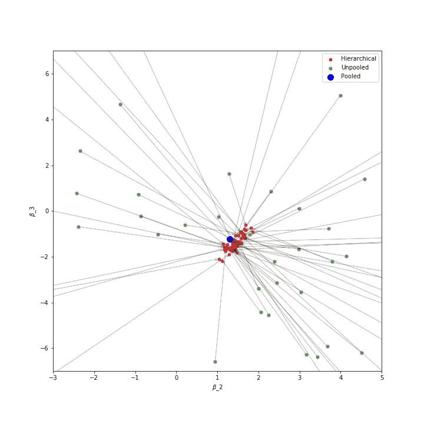
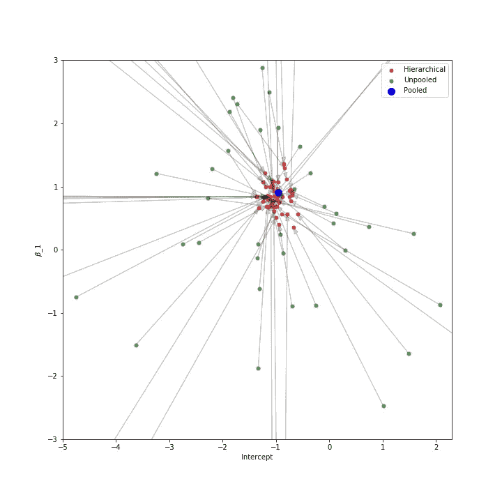

# 贝叶斯分层建模(或者“autoML 还不能取代数据科学家的更多原因”)

> 原文：<https://towardsdatascience.com/bayesian-hierarchical-modeling-or-more-reasons-why-automl-cannot-replace-data-scientists-yet-d01e7d571d3d?source=collection_archive---------8----------------------->

## [从频率主义到贝叶斯主义](https://towardsdatascience.com/tagged/frequentist-to-bayesian)

## 贝叶斯网络允许对变量之间的因果关系进行建模，弥补数据提供的信息的不足。


[阿丽娜·格鲁布尼亚](https://unsplash.com/@alinnnaaaa?utm_source=medium&utm_medium=referral)在 [Unsplash](https://unsplash.com?utm_source=medium&utm_medium=referral) 上的照片

在本文中，我们将使用一个为 python 开发的**概率编程** **库**， **pymc3** 。对贝叶斯方法在基本统计学中的效率和 pymc3 的初步介绍可以在这里的[](/from-frequentism-to-bayesianism-hypothesis-testing-a-simple-illustration-11213232e551)**和那里的[](/from-frequentism-to-bayesianism-going-deeper-part-2-offline-a-b-test-d3324f7a39bb)**中找到。****

****S 自 2018 年初以来，**自动化机器学习**已经成为数据科学中最时尚的话题之一。仅举几个例子，亚马逊的 Sagemaker 或谷歌 AutoML 现在对大多数数据科学家来说都是可访问的，以至于一些人倾向于认为探索和理解数据不再是建立机器学习模型的必要条件。****

****AutoML 的承诺可以这样总结:****

> ****高度自动化允许非专家利用机器学习模型和技术，而不需要首先成为特定领域的专家。****

****推理很简单；不再需要专业知识，只需将数据交给 AutoML 算法，在测试固定数量的预定义模型后，它会返回*最好的*一个。****

****但是这里有一个问题… **AutoML 算法忽略了*最佳*对我们来说意味着什么，而仅仅是试图最小化经验误差**。仍然需要知识和专业技能来理解这个误差真正意味着什么，以及它在多大程度上不同于我们实际上希望最小化的误差。****

# ****我们应该考虑什么样的误差度量？****

## ****1.经验误差****

> ****给定 n 个数据点，经验误差由下式给出****

********

> ****对于特征 xi 和目标 yi 的所有可观测值上的特定函数 fn，其中 V 表示损失函数。****

****它通常通过交叉验证或训练/测试过程来计算。缺少协变量和目标之间的一些联系将产生偏差，常常导致欠拟合/过拟合，并最终导致更高的测试/交叉验证误差。****

****数据科学家(以及 autoML 引擎)常常错误地只考虑这一点。****

## ****2.泛化误差****

> ******泛化误差**(也称为**样本外误差** r)是一种衡量算法能够多准确地预测先前未见过的数据的结果值的方法。其定义如下:****

********

> ****对于特征 x 和目标 y 的所有可能值上的特定函数 fn，其中 V 表示损失函数，ρ(x，y)是 x 和 y 的未知联合概率分布****

****显然，在训练我们的模型时，它通常是我们希望最小化的**。不幸的是，它不能直接从数据中计算出来，不像经验数据那样仅仅是对前者的估计。******

****有了足够多的高质量数据，我们就可以交换这些数据。现在想象一下，在训练时只有部分信息可用，或者根本没有足够的数据，就像机器学习中经常出现的情况一样。然后，我们的模型将在不同的分布 *ρ(x，y)* 上进行训练，该分布不同于稍后运行的分布，因此，经验误差将偏离广义误差。****

*******有偏差的数据导致有偏差的经验误差。*******

****我们已经可以看出这是一个多么大的问题:经验误差不再估计期望的数量，而是我们唯一可以从数据中计算出来的。我们需要确保它在某种程度上仍然是可靠的。这是人类专业知识发挥作用并展示其全部潜力的地方。****

****同样，当变量之间的关系明确时，参数方法比非参数方法更受青睐，来自研究领域的知识通过显式建模一些相关性来弥补数据信息的不足。****

******我们的模型从部分或截断分布中推断得越好，经验和泛化误差就越接近。******

## ****3.混杂误差****

> ****"相关性并不意味着因果关系."****

****所有数据科学家都至少听过这句话一次，但事实证明，在实际建模时，只有少数人真正意识到其中的含义。因果关系的话题实际上大多数时候都被忽略了**，有时是错误的，有时是合理的，但很少是故意的。******

*   *****A* ***混杂因素*** *是与协变量和利益结果都有因果关系的变量。作为一个因果概念，它不能用相关性来描述。*****

********

****因果图:混杂因素 W 影响因变量 Y 和自变量 X****

****由混杂因素产生的误差不能用传统的统计方法完全测量，因为它本身不是统计误差。****

****有人可能会争辩说，当经验误差很低，甚至是泛化误差时；那么我们不应该关心我们的模型是利用了真正的因果关系还是虚假的相关性。在某些情况下这可能是真的，但是除非我们明确知道为什么，否则这种情况不应该被忽视。****

## ****一个令人困惑的例证:辛普森悖论****

********

****By Pace~svwiki —自己的作品，CC BY-SA 4.0，[https://commons.wikimedia.org/w/index.php?curid=62007681](https://commons.wikimedia.org/w/index.php?curid=62007681)****

> ******辛普森悖论**由 Edward Simpson 在 1951 年和 George Udny Yule 在 1903 年描述，是一个悖论，当数据被分割成单独的组时，统计趋势出现，但当组被组合时，趋势发生逆转。****

****当因果关系被忽略时，通常在存在混杂变量(这里用不同的颜色组表示)的情况下观察到。****

****辛普森悖论对机器学习的影响是，当涉及到**决策时，**我们可以选择应该考虑哪些数据来采取行动，是聚合还是分割？****

****不幸的是，答案通常不能从数据本身推断出来。**事实上，根据变量**之间的因果关系，对于完全相似的值，我们可以有不同的答案 **。****真正的误差来源于数据本身之外**，最终测试或交叉验证误差有多低并不重要。除非我们能够首先正确地对环境建模，否则我们无法避免做出完全错误的决策。********

# **空间混杂和贝叶斯分层建模**

***我们现在将通过一个具体的例子来说明在分层依赖的具体情况下如何处理这种情况。***

**通常，数据科学家必须处理地理数据，这些数据的缺点是不容易被经典的机器学习模型利用。位置要素通常具有很高的基数，并且经常是不平衡的。然而，很明显，模型的参数会因地区而异，取决于当地的变量，但仍然密切相关，因为它们对不同地方的相同现象进行建模。**

**通过下面的例子，我们将看到**处理这种空间相关性**的方法，从而**最小化上面**列出的所有类型的误差。**

## **问题陈述**

**我们考虑估计孟加拉国避孕药具使用情况的问题，为此，我们使用了来自 1988 年孟加拉国生育率调查的数据。它包括分组在 60 个区的 1934 名妇女的子样本，变量定义如下:**

*   **地区:每个地区的识别码。**
*   **LC:调查时存活儿童的数量。**
*   **年龄:调查时妇女的年龄。**
*   **城市:居住区域的类型。**

**我们将考虑 3 个具有不同特征的逻辑贝叶斯回归来模拟不同的可能方法。**

## **1:合并测量**

****

**汇集模型**

**在这里，我们简单地通过不使用区域变量来忽略它的作用。结果是只有 4 个参数的简单逻辑回归，包括截距。位置不被看作是一个混杂因素，每个区域被假定为行为相似。**

## **2:非池化回归**

****

**无池模型**

**对于每个地区，我们拟合了不同的逻辑回归，导致总共 60 个模型，每个模型有 4 个参数。即使我们假设不同地区的行为有所不同，我们也没有利用它们之间的相似性。**

**无泡 pymc 模型**

## **3:贝叶斯分层逻辑回归**

> ****贝叶斯分层建模**是一种以多层编写的统计模型，使用贝叶斯方法估计后验分布的参数。子模型组合起来形成分层模型，贝叶斯定理用于将它们与观察到的数据相结合，并考虑所有存在的不确定性。⁴**

**我们假设当 *𝛽* s 对于每个区域是不同的，如在未轮询的情况下，现在系数都共享相似性。我们可以通过假设每个单独的系数来自共同的组分布来对此建模:**

****

**随着**

****

**虽然在分析上很难处理，但概率规划允许我们使用马尔可夫链蒙特卡罗(MCMC)从后验分布中采样来计算所有参数的后验。【pymc3 再次提供了一个非常直观的方法来建模我们的网络和计算后验概率！**

**我们还可以轻松计算贝叶斯网络的图形表示:**

****

**逻辑回归的分层贝叶斯网络**

# **参数估计**

**首先，让我们试着了解一下我们的模型之间的差异。**

**受[https://docs.pymc.io/notebooks/GLM-hierarchical.html,](https://docs.pymc.io/notebooks/GLM-hierarchical.html)的启发，我们可以可视化不同回归中回归参数的演变。**

********

**后验平均收缩率**

**我们显示了每个地区的非等级后验均值、等级后验均值和混合后验均值的系数。区一级可用的少量数据导致非 pool 后验分布很广，因此收缩效应非常重要，**然而，分级模型中平均值之间的差异仍然很大，因为区与区之间的贝塔值在数量级上有所不同。****

## **模型误差**

**我们使用 ROC 曲线 **(AUC)** 下的 [**面积作为我们比较模型的误差度量。它可以被看作是我们的模型对随机选择的正类的评分高于随机选择的负类的概率。我们对此特别感兴趣，因为它的优点是**不需要设置阈值来分配标签。****](https://en.wikipedia.org/wiki/Receiver_operating_characteristic)**

**为了测量性能，我们考虑了两个测试集，一个是按地区分层的测试集，一个是非分层的测试集。非分层测试集的使用更能代表泛化误差与经验模型误差显著不同的情况，因为训练集和测试集之间的区域特征分布会显著不同！**

***为了更好地代表真实性能，针对测试集采样的多个种子对测量值进行了平均。***

# **结果**

```
┌───────────────────┬────────┬──────────┬──────────────┐
│                   │ POOLED │ UNPOOLED │ HIERARCHICAL │
├───────────────────┼────────┼──────────┼──────────────┤
│ Train             │  0.632 │    0.818 │        0.726 │
│ Stratified Test   │  0.623 │    0.618 │        0.668 │
│ Unstratified Test │  0.634 │    0.603 │        0.663 │
└───────────────────┴────────┴──────────┴──────────────┘
```

## **分层集合**

*   **正如训练和测试 AUC 之间的巨大差距所表明的，未规划的模型严重过度拟合。**
*   **另一方面，集合模型有很强的偏向性，并且明显对数据进行了欠拟合。**
*   **最后，通过利用参数地理相似性，我们的层次模型比其他模型表现得更好。**

**收缩效应为我们提供了一个改进的统计能力，也可以被看作是一个聪明的调整方法。**

## **非分层的**

**一些地区只有极少数的个体可以训练，因此，对于未规划的模型，这些地区的非分层测试误差变得更大。**部分汇集考虑了参数**之间的相似性，为低密度区提供来自其他区的信息，同时保持其特殊性。**

**因此，对于非分层测试集，模型之间的差异甚至更加显著，向我们展示了**其泛化能力更大**，因为性能几乎不受分层策略的影响。**

****= >** 当我们有多组我们期望具有相似性的测量时，多级分层贝叶斯模型优于基本方法。**

**将这种贝叶斯方法与其他经典的数据预处理方法(区域变量的不同编码)或算法(梯度推进、随机森林等)进行比较会很有趣。).**

# **结论**

*   **AutoML 还不能取代数据科学家，因为它不能从实际业务目标中区分经验误差度量，也不能正确建模协变量和目标之间的依赖关系。**
*   **专家们仍然需要理解数据并正确地模拟问题。为此，他们可以使用一系列数学和信息工具，包括 **pymc3 库和贝叶斯分层模型**，从而可以在分层结构数据的常见情况下轻松建模和计算分布**

**[1]:维基百科贡献者。“自动化机器学习。”*维基百科，免费百科*。维基百科，免费的百科全书，2020 年 2 月 18 日。网络。2020 年 3 月 1 日。**

**[2，3]:维基百科贡献者。(2020 年 2 月 22 日)。泛化错误。在*维基百科，免费百科*。2020 年 3 月 1 日 16:40 从[https://en.wikipedia.org/w/index.php?检索 title = Generalization _ error&oldid = 942140633](https://en.wikipedia.org/w/index.php?title=Generalization_error&oldid=942140633)**

**[4]:维基百科贡献者。“贝叶斯分层建模。”*维基百科，免费百科*。维基百科，免费百科，2019 年 12 月 12 日。网络。2020 年 3 月 1 日。**

# **参考**

*   ***因果关系:模型、推理和推论*，剑桥大学出版社(2000 年，2009 年第二版)。[国际标准书号](https://en.wikipedia.org/wiki/International_Standard_Book_Number)0–521–77362–8。**
*   **[https://docs.pymc.io/notebooks/GLM-hierarchical.html](https://docs.pymc.io/notebooks/GLM-hierarchical.html)**
*   **n . m . huq 和 j . Cleland，1990 年。1989 年孟加拉国生育率调查(主要报告)。达卡:*国家人口研究和培训研究所***
*   **空间自相关:麻烦还是新范例？生态学。1993;74:1659–1673.**