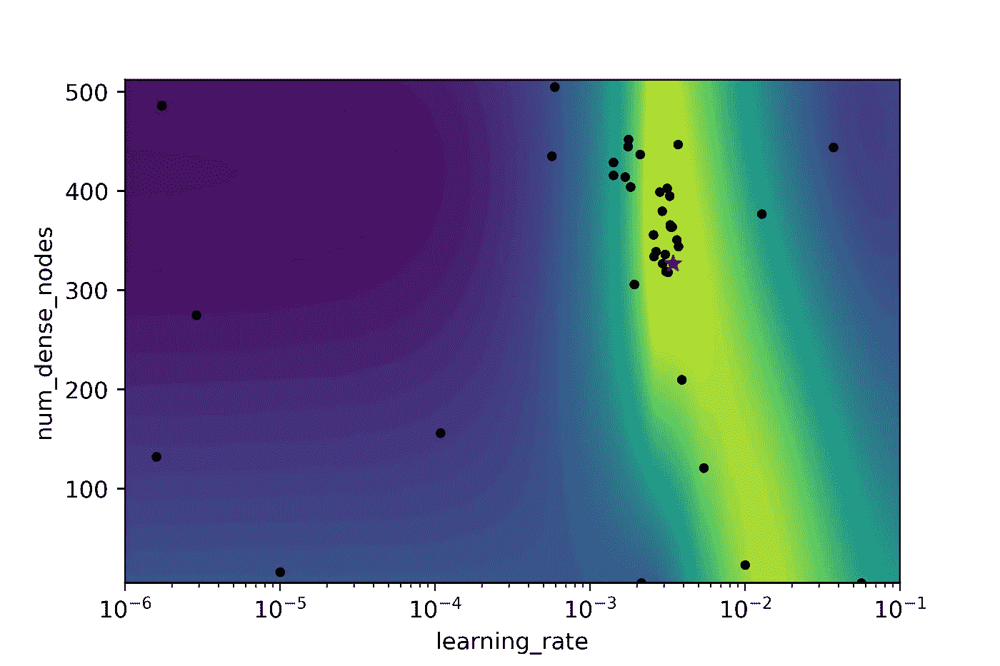

# 贝叶斯超参数优化:神经网络、张量流、相预测示例

> 原文：<https://towardsdatascience.com/bayesian-hyper-parameter-optimization-neural-networks-tensorflow-facies-prediction-example-f9c48d21f795?source=collection_archive---------12----------------------->

## 自动调整神经网络的超参数(学习率、密集层和节点数以及激活函数)


这项工作的目的是优化神经网络模型超参数，以根据测井曲线估计相类。我将在本文中包含一些代码，但对于完整的 jupyter 笔记本文件，您可以访问我的[***【Github】***](https://github.com/mardani72/Hyper-Parameter_optimization)。

注意:如果你是 TensorFlow 的新手，杰夫·希顿会详细介绍它的安装。

在机器学习中，模型参数可以分为两大类:
**1-** **可训练参数**:如训练算法学习到的神经网络中的权值，且用户不干预过程，
**2-** **超参数:**用户可以在训练操作前设置，如学习率或模型中的密集层数。
如果您手动尝试，选择最佳超参数可能是一项繁琐的任务，如果您处理两个以上的参数，几乎不可能找到最佳超参数。
一种方法是将每个参数分成一个有效的均匀范围，然后简单地让计算机循环参数组合并计算结果。这个方法叫做*网格搜索*。虽然是机器做的，但会是一个耗时的过程。假设您有 3 个超参数，每个超参数有 10 个可能的值。在这种方法中，您将运行 10 个神经网络模型(即使有合理的训练数据集大小，这项任务也是巨大的)。
另一种方法是*随机搜索*方法。事实上，它不是使用有组织的参数搜索，而是遍历参数的随机组合，寻找优化的参数。您可能会估计，对于较大的超参数调整，成功的几率会降低到零。

[**Scikit-Optimize**](https://scikit-optimize.github.io/stable/)，skopt，我们将在这里使用它来完成相估计任务，它是一个简单而高效的库，用于最小化昂贵的噪声黑盒函数。贝叶斯优化构建了另一个参数搜索空间模型。高斯过程就是这些模型中的一种。这将生成模型性能如何随超参数变化而变化的估计。


正如我们在图中看到的，真正的目标函数(红色虚线)被噪声(红色阴影)包围。红线显示 scikit optimize 如何对超参数(一维)的搜索空间进行采样。Scikit-optimize 使用高斯过程(绿线)填充样本点之间的区域，并估计真实的真实适合度值。在低样本或缺乏样本的区域(如两个红色样本之间的图片左侧)，存在很大的不确定性(红色和绿色线条之间的巨大差异导致绿色阴影区域的巨大不确定性，如两个标准差的不确定性)。在这个过程中，我们要求一组新的超参数来探索更多的搜索空间。在最初的步骤中，它以稀疏的精度进行，但是在后来的迭代中，它集中在采样点更符合适应度函数和真实目标函数的地方(图中的波谷区域)。
要了解更多信息，您可以参考 Scikit 优化[文档](https://scikit-optimize.github.io/stable/user_guide.html)。

**资料回顾** 康瑟尔格罗夫气藏位于堪萨斯州。从这个碳酸盐储层中，有九口井可用。从每半英尺的岩心样本中研究岩相，并与井位的测井数据相匹配。特征变量包括来自电缆测井测量的五个变量和来自地质知识的两个地质约束变量。更多详情请参考[此处](https://github.com/mardani72/Facies-Classification-Machine-Learning/blob/master/Facies_Classification_Various_ML_Final.ipynb)。对于数据集，您可以从[这里](https://github.com/mardani72/Facies-Classification-Machine-Learning/blob/master/training_data.csv)下载。这七个变量是:

1.  GR :这种电缆测井工具测量伽马辐射
2.  **ILD_log10** :这是电阻率测量
3.  **PE** :光电效应测井
4.  **δφ**:φ是岩石物理学中的孔隙度指标。
5.  **PNHIND** :中子和密度测井的平均值。
6.  **NM_M** :非海相-海相标志
7.  **RELPOS** :相对位置

九个离散相(岩石类别)是:

1.  **(SS)** 陆相砂岩
2.  **(CSiS)** 非海相粗粉砂岩
3.  **(FSiS)** 非海相粉细砂岩
4.  **(SiSH)** 海相粉砂岩和页岩
5.  **(MS)** 泥岩(石灰岩)
6.  **(WS)** 瓦克斯通(石灰岩)
7.  **(D)** 白云石
8.  **(PS)** 细粒砂岩(石灰岩)
9.  **(BS)** 叶状藻障石(石灰岩)

将数据集读入 python 后，我们可以保留一口井的数据作为盲集，以备将来模型性能检查之用。我们还需要将相数转换成数据集中的字符串。参考完整的笔记本。

```
df = pd.read_csv(‘training_data.csv’)

blind = df[df['Well Name'] == 'SHANKLE']
training_data = df[df['Well Name'] != 'SHANKLE']
```

**特征工程** 相类应转换为虚拟变量，以便在神经网络中使用；

```
dummies = pd.get_dummies(training_data[‘FaciesLabels’]) 
Facies_cat = dummies.columns 
labels = dummies.values                   *# target matirx**# select predictors* 
features = training_data.drop(['Facies', 'Formation', 'Well Name',                                 'Depth','FaciesLabels'], axis=1)
```

## 预处理(制作标准)

当我们处理各种各样的数据时，为了使网络有效，让我们将它标准化。

```
**from** **sklearn** **import** preprocessing
scaler = preprocessing.StandardScaler().fit(features)
scaled_features = scaler.transform(features)**#Data split
from** **sklearn.model_selection** **import** train_test_split
X_train, X_test, y_train, y_test = train_test_split(
        scaled_features, labels, test_size=0.2, random_state=42)
```

# 超参数

在这项工作中，我们将使用 Tensorflow 中的深度学习从测井记录中预测相。我们可以为深度学习调整几个超参数。我将尝试找出以下各项的最佳参数:

1.  *学习率*
2.  *密集层数*
3.  *每层节点数*
4.  *哪个激活功能:“relu”或 sigmoid*

为了详细说明这个搜索维度，我们将使用 scikit-optimize(skopt)库。从 skopt 来看，实函数会为学习率定义我们喜欢的范围(下界= 1e-6，上界= 1e-1)，并且会使用对数变换。层数(我们看起来在 1 到 5 之间)和每层的节点数量(在 5 到 512 之间)的搜索维度可以用 skopt 的整数函数来实现。

```
dim_learning_rate = Real(low=1e-6, high=1e-1, prior='log-uniform',
                         name='learning_rate')dim_num_dense_layers = Integer(low=1, high=10, name='num_dense_layers')dim_num_dense_nodes = Integer(low=5, high=512, name='num_dense_nodes')
```

对于激活算法，我们应该使用分类函数进行优化。

```
dim_activation = Categorical(categories=['relu', 'sigmoid'],
                             name='activation')
```

将所有搜索维度放在一个列表中:

```
dimensions = [dim_learning_rate,
              dim_num_dense_layers,
              dim_num_dense_nodes,
              dim_activation]
```

如果你已经为一个特定的项目进行了深度学习，并且手动找到了那个项目的超参数，你就知道优化有多难。您也可以使用自己的猜测(像我一样默认)来比较贝叶斯调优方法的结果。

```
default_parameters = [1e-5, 1, 16, ‘relu’]
```

# 超参数优化

## 创建模型

像 Tneseflow 开发的一些例子一样，我们也需要先定义一个模型函数。在定义了模型的类型(这里是顺序的)之后，我们需要在第一行引入数据维度(数据形状)。层数和激活类型是我们寻求优化的两个超参数。Softmax 激活应用于分类问题。那么另一个超参数是应该在 Adam 函数中定义的学习率。当我们处理分类问题(相预测)时，应考虑损失函数应为“分类 _ 交叉熵”来编译模型。

```
**def** create_model(learning_rate, num_dense_layers,
                 num_dense_nodes, activation):

    model = Sequential()

    model.add(InputLayer(input_shape=(scaled_features.shape[1])))

    **for** i **in** range(num_dense_layers):
        name = 'layer_dense_**{0}**'.format(i+1)

        *# add dense layer*
        model.add(Dense(num_dense_nodes,
                        activation=activation,
                        name=name))

    *# use softmax-activation for classification.*
    model.add(Dense(labels.shape[1], activation='softmax'))

    *# Use the Adam method for training the network.*
    optimizer = Adam(lr=learning_rate)

    *#compile the model so it can be trained.*
    model.compile(optimizer=optimizer,
                  loss='categorical_crossentropy',
                  metrics=['accuracy'])

    **return** model
```

## 训练和评估模型

该功能旨在使用给定的超参数创建和训练网络，然后使用验证数据集评估模型性能。它返回数据集的适应值，即负分类精度。它是负的，因为 skopt 执行最小化而不是最大化。

```
@use_named_args(dimensions=dimensions)
**def** fitness(learning_rate, num_dense_layers,
            num_dense_nodes, activation):
    *"""*
 *Hyper-parameters:*
 *learning_rate:     Learning-rate for the optimizer.*
 *num_dense_layers:  Number of dense layers.*
 *num_dense_nodes:   Number of nodes in each dense layer.*
 *activation:        Activation function for all layers.*
 *"""*

    *# Print the hyper-parameters.*
    print('learning rate: **{0:.1e}**'.format(learning_rate))
    print('num_dense_layers:', num_dense_layers)
    print('num_dense_nodes:', num_dense_nodes)
    print('activation:', activation)
    print()

    *# Create the neural network with these hyper-parameters.*
    model = create_model(learning_rate=learning_rate,
                         num_dense_layers=num_dense_layers,
                         num_dense_nodes=num_dense_nodes,
                         activation=activation)

    *# Dir-name for the TensorBoard log-files.*
    log_dir = log_dir_name(learning_rate, num_dense_layers,
                           num_dense_nodes, activation)

    *# Create a callback-function for Keras which will be*
    *# run after each epoch has ended during training.*
    *# This saves the log-files for TensorBoard.*
    *# Note that there are complications when histogram_freq=1.*
    *# It might give strange errors and it also does not properly*
    *# support Keras data-generators for the validation-set.*
    callback_log = TensorBoard(
        log_dir=log_dir,
        histogram_freq=0,
        write_graph=**True**,
        write_grads=**False**,
        write_images=**False**)

    *# Use Keras to train the model.*
    history = model.fit(x= X_train,
                        y= y_train,
                        epochs=3,
                        batch_size=128,
                        validation_data=validation_data,
                        callbacks=[callback_log])

    *# Get the classification accuracy on the validation-set*
    *# after the last training-epoch.*
    accuracy = history.history['val_accuracy'][-1]

    *# Print the classification accuracy.*
    print()
    print("Accuracy: **{0:.2%}**".format(accuracy))
    print()

    *# Save the model if it improves on the best-found performance.*
    *# We use the global keyword so we update the variable outside*
    *# of this function.*
    **global** best_accuracy

    *# If the classification accuracy of the saved model is improved ...*
    **if** accuracy > best_accuracy:
        *# Save the new model to harddisk.*
        model.save(path_best_model)

        *# Update the classification accuracy.*
        best_accuracy = accuracy

    *# Delete the Keras model with these hyper-parameters from memory.*
    **del** model

    *# Clear the Keras session, otherwise it will keep adding new*
    *# models to the same TensorFlow graph each time we create*
    *# a model with a different set of hyper-parameters.*
    K.clear_session()

    *# NOTE: Scikit-optimize does minimization so it tries to*
    *# find a set of hyper-parameters with the LOWEST fitness-value.*
    *# Because we are interested in the HIGHEST classification*
    *# accuracy, we need to negate this number so it can be minimized.*
    **return** -accuracy
*# This function exactly comes from :Hvass-Labs, TensorFlow-Tutorials*
```

运行这个:

```
fitness(x= default_parameters)
```


# 运行超参数优化

我们已经检查了默认的超参数性能。现在我们可以检查 scikit-optimize 库中的贝叶斯优化。这里，我们使用 40 次运行作为适应度函数，尽管这是一个昂贵的操作，并且需要在数据集上小心使用。

```
search_result = gp_minimize(func=fitness,
                            dimensions=dimensions,
                            acq_func='EI', *# Expected Improvement.*
                            n_calls=40,
                            x0=default_parameters)
```

只是一些最后运行显示如下:


# 进度可视化

使用 skopt 的 plot_convergence 函数，我们可以在 y 轴上看到优化过程和找到的最佳适应值。

```
plot_convergence(search_result) 
*# plt.savefig("Converge.png", dpi=400)*
```


# 最佳超参数

使用 serach_result 函数，我们可以看到贝叶斯优化器生成的最佳超参数。

```
search_result.x
```


优化后的超参数依次为:学习速率、密集层数、每层节点数、最佳激活函数。

我们可以看到 40 次呼叫的所有结果，以及相应的超参数和适合度值。

```
sorted(zip(search_result.func_vals, search_result.x_iters))
```


有趣的一点是‘relu’激活功能几乎占主导地位。

# 情节

首先，让我们看看两个优化参数的 2D 图。在这里，我们为每层中的学习速率和节点数量的估计适应值制作了一个景观图。贝叶斯优化器建立了一个搜索空间的代理模型，并在这个维度而不是真正的搜索空间内搜索，这就是为什么它更快的原因。在图中，黄色区域较好，蓝色区域较差。黑点是优化器的采样位置，红星是找到的最佳参数。

```
**from** **skopt.plots** **import** plot_objective_2D
fig = plot_objective_2D(result=search_result,
                        dimension_identifier1='learning_rate',
                        dimension_identifier2='num_dense_nodes',
                        levels=50)
*# plt.savefig("Lr_numnods.png", dpi=400)*
```



**点点:**

1.  代理模型可能是不准确的，因为它仅从对适应度函数的 40 个调用样本中构建
2.  由于神经网络中的随机噪声和训练过程，每次重新运行优化时，图可能会发生变化
3.  这是 2D 图，而我们优化了 4 个参数，可以想象 4 个维度。

```
*# create a list for plotting*
dim_names = ['learning_rate', 'num_dense_layers', 'num_dense_nodes', 'activation' ]fig, ax = plot_objective(result=search_result, dimensions=dim_names)
plt.savefig("all_dimen.png", dpi=400)
```


在这些图中，我们可以看到优化是如何发生的。贝叶斯方法试图在采样密度较高的点用先验信息拟合模型参数。如果学习率约为 0.003，密集层的数量为 6，每层中的节点数量约为 327，并且激活函数为“relu”，则将所有四个参数收集到 scikit 优化方法中将在本次运行中引入最佳结果。

# 用盲数据优化超参数评估模型

这里也需要同样的数据准备步骤。我们在这里跳过重复。现在我们可以用优化的参数做一个模型来看预测。

```
opt_par = search_result.x
 *# use hyper-parameters from optimization* 
learning_rate = opt_par[0]
num_layers = opt_par[1] 
num_nodes = opt_par[2] 
activation = opt_par[3]
```

创建模型:

```
**import** **numpy** **as** **np**
**import** **tensorflow.keras**
**from** **tensorflow.keras.models** **import** Sequential
**from** **tensorflow.keras.layers** **import** Dense, Activation
**from** **tensorflow.keras.callbacks** **import** EarlyStopping

model = Sequential()
model.add(InputLayer(input_shape=(scaled_features.shape[1])))
model.add(Dense(num_nodes, activation=activation, kernel_initializer='random_normal'))
model.add(Dense(labels.shape[1], activation='softmax', kernel_initializer='random_normal'))

optimizer = Adam(lr=learning_rate)

model.compile(optimizer=optimizer, loss='categorical_crossentropy',  metrics=['accuracy'])

monitor = EarlyStopping(monitor='val_loss', min_delta=1e-3, patience=20, 
                        verbose=1, mode='auto', restore_best_weights=**True**)

histories = model.fit(X_train,y_train, validation_data=(X_test,y_test),
          callbacks=[monitor],verbose=2,epochs=100)
```

让我们看看模型精度的发展:

```
plt.plot(histories.history['accuracy'], 'bo')
plt.plot(histories.history['val_accuracy'],'b' )
plt.title('Training and validation accuracy')
plt.ylabel('accuracy')
plt.xlabel('epoch')
plt.legend(['train', 'test'], loc='upper left')
plt.savefig("accu.png", dpi=400)
plt.show()
```


训练和验证精度图显示，几乎在 80%的精度(迭代 10)之后，模型开始过度拟合，因为我们看不到测试数据预测精度的提高。

让我们用一个尚未见过的数据集(盲井)来评估模型性能。我们总是预测，如果数据集很小或者特征没有大到足以覆盖数据维度的所有复杂性，则机器学习模型使用盲数据进行预测的准确性会低于训练过程。

```
result = model.evaluate(scaled_features_blind, labels_blind)
print("**{0}**: **{1:.2%}**".format(model.metrics_names[1], result[1]))
```


# 预测盲井数据和绘图

```
y_pred = model.predict(scaled_features_blind) *# result is probability array*y_pred_idx = np.argmax(y_pred, axis=1) + 1
*# +1 becuase facies starts from 1 not zero like index*blind['Pred_Facies']= y_pred_idx
```

要绘制的函数:

```
**def** compare_facies_plot(logs, compadre, facies_colors):
    *#make sure logs are sorted by depth*
    logs = logs.sort_values(by='Depth')
    cmap_facies = colors.ListedColormap(
            facies_colors[0:len(facies_colors)], 'indexed')

    ztop=logs.Depth.min(); zbot=logs.Depth.max()

    cluster1 = np.repeat(np.expand_dims(logs['Facies'].values,1), 100, 1)
    cluster2 = np.repeat(np.expand_dims(logs[compadre].values,1), 100, 1)

    f, ax = plt.subplots(nrows=1, ncols=7, figsize=(12, 6))
    ax[0].plot(logs.GR, logs.Depth, '-g', alpha=0.8, lw = 0.9)
    ax[1].plot(logs.ILD_log10, logs.Depth, '-b', alpha=0.8, lw = 0.9)
    ax[2].plot(logs.DeltaPHI, logs.Depth, '-k', alpha=0.8, lw = 0.9)
    ax[3].plot(logs.PHIND, logs.Depth, '-r', alpha=0.8, lw = 0.9)
    ax[4].plot(logs.PE, logs.Depth, '-c',  alpha=0.8, lw = 0.9)
    im1 = ax[5].imshow(cluster1, interpolation='none', aspect='auto',
                    cmap=cmap_facies,vmin=1,vmax=9)
    im2 = ax[6].imshow(cluster2, interpolation='none', aspect='auto',
                    cmap=cmap_facies,vmin=1,vmax=9)

    divider = make_axes_locatable(ax[6])
    cax = divider.append_axes("right", size="20%", pad=0.05)
    cbar=plt.colorbar(im2, cax=cax)
    cbar.set_label((5*' ').join([' SS ', 'CSiS', 'FSiS', 
                                'SiSh', ' MS ', ' WS ', ' D  ', 
                                ' PS ', ' BS ']))
    cbar.set_ticks(range(0,1)); cbar.set_ticklabels('')

    **for** i **in** range(len(ax)-2):
        ax[i].set_ylim(ztop,zbot)
        ax[i].invert_yaxis()
        ax[i].grid()
        ax[i].locator_params(axis='x', nbins=3)

    ax[0].set_xlabel("GR")
    ax[0].set_xlim(logs.GR.min(),logs.GR.max())
    ax[1].set_xlabel("ILD_log10")
    ax[1].set_xlim(logs.ILD_log10.min(),logs.ILD_log10.max())
    ax[2].set_xlabel("DeltaPHI")
    ax[2].set_xlim(logs.DeltaPHI.min(),logs.DeltaPHI.max())
    ax[3].set_xlabel("PHIND")
    ax[3].set_xlim(logs.PHIND.min(),logs.PHIND.max())
    ax[4].set_xlabel("PE")
    ax[4].set_xlim(logs.PE.min(),logs.PE.max())
    ax[5].set_xlabel('Facies')
    ax[6].set_xlabel(compadre)

    ax[1].set_yticklabels([]); ax[2].set_yticklabels([]); ax[3].set_yticklabels([])
    ax[4].set_yticklabels([]); ax[5].set_yticklabels([]); ax[6].set_yticklabels([])
    ax[5].set_xticklabels([])
    ax[6].set_xticklabels([])
    f.suptitle('Well: **%s**'%logs.iloc[0]['Well Name'], fontsize=14,y=0.94)
```

运行:

```
compare_facies_plot(blind, 'Pred_Facies', facies_colors)
plt.savefig("Compo.png", dpi=400)
```


# 结论

在这项工作中，我们使用贝叶斯方法和名为 skopt 的 scikit-learn 库优化了超参数。这种方法优于随机搜索和网格搜索，特别是在复杂的数据集中。使用这种方法，我们可以摆脱手动调整神经网络的超参数，尽管在每次运行中，您将面临新的参数。